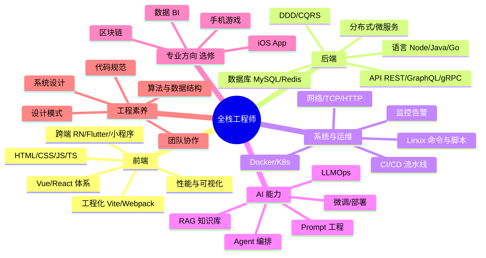
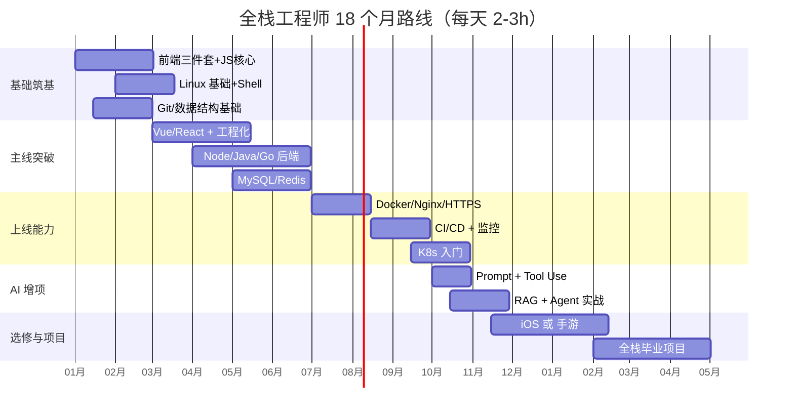
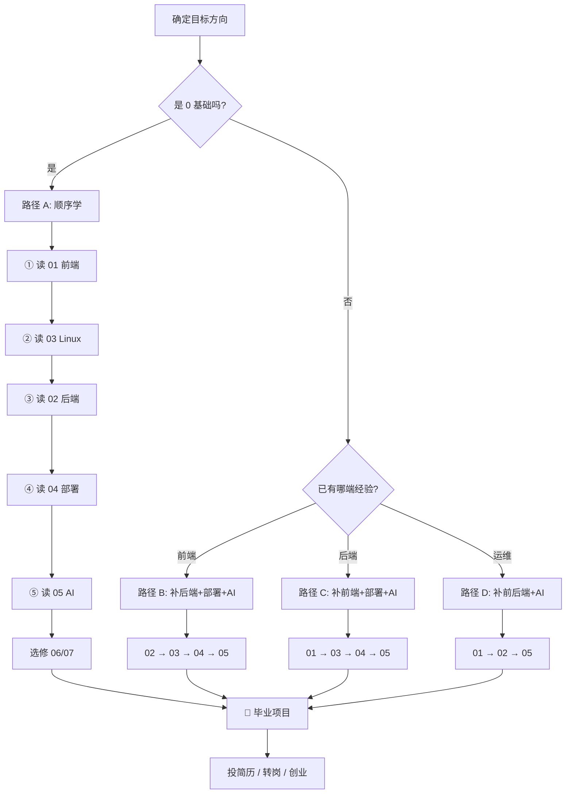

# 00 · 全栈工程师学习总览（Master Index）

> 「写过代码 ≠ 工程师；能上线 ≠ 全栈。」
> 本目录是一套从零到一的全栈工程师成长地图，配套 7 本子文档，预计完整吸收周期 **18~24 个月**（每天 2~3 小时）。
> 文档定位：**手把手教学、图文结合、可直接复制运行**，每本 2000~3300 行 Markdown，全部中文。

---

## 📚 文档清单与阅读顺序

| 序号 | 文档 | 行数 | 主题 | 建议阶段 |
|-----|------|-----:|-----|---------|
| 01 | [前端入门与进阶](./01-前端入门与进阶.md) | 3271 | HTML/CSS/JS/TS/Vue/React/工程化/跨端/可视化/微前端 | 第 1~6 个月 |
| 02 | [后端入门与进阶](./02-后端入门与进阶.md) | 2749 | 网络/数据库/Node/Java/Go/分布式/微服务/DDD/云原生 | 第 4~12 个月 |
| 03 | [Linux 入门与进阶](./03-Linux入门与进阶.md) | 3072 | 命令/Shell/网络/性能/内核/容器/Ansible/安全加固 | 第 3~8 个月 |
| 04 | [项目服务器部署](./04-项目服务器部署.md) | 3236 | Nginx/HTTPS/Docker/K8s/CI-CD/监控/备份/灾备 | 第 8~14 个月 |
| 05 | [AI 行业开发知识](./05-AI行业开发知识.md) | 2814 | LLM/Prompt/RAG/Agent/微调/部署/多模态/LLMOps | 第 10~18 个月 |
| 06 | [iOS 开发](./06-iOS开发.md) | 3271 | Swift/SwiftUI/UIKit/网络/并发/上架/跨端 | 选修，3~5 个月 |
| 07 | [手机游戏开发](./07-手机游戏开发.md) | 2415 | Unity/C#/2D/3D/Shader/同步/服务器/商业化 | 选修，4~6 个月 |

> 💡 **核心 5 本必读**：01 + 02 + 03 + 04 + 05；06、07 按个人方向选修。

---

## 🗺️ 全栈技能全景图

---

## 🎯 18 个月成长路线（建议节奏）

---

## 🧭 怎么用这套文档

### 🔁 三种学习节奏建议

| 节奏 | 适合人群 | 单本耗时 | 配套实操 |
|-----|---------|---------|---------|
| 🐢 慢学 | 在校生 / 转行 | 4~6 周 / 本 | 每章必动手 + 写博客 |
| 🚶 标准 | 在职提升 | 2~3 周 / 本 | 每章动手 1 个 demo |
| 🏃 速通 | 已有经验补盲 | 3~5 天 / 本 | 跳读 + 速记 + 面经核对 |

---

## 🏗️ 全栈毕业项目建议（任选一）

| 项目 | 涉及文档 | 难度 | 周期 |
|-----|---------|-----|-----|
| 个人技术博客 + 全自动部署 | 01/03/04 | ⭐⭐ | 1 月 |
| 电商小程序（前后端 + 支付） | 01/02/03/04 | ⭐⭐⭐ | 2 月 |
| 企业 RAG 知识库（带 Agent） | 01/02/04/05 | ⭐⭐⭐⭐ | 2~3 月 |
| 多人在线小游戏（前端 + 网关） | 01/02/04/07 | ⭐⭐⭐⭐ | 3 月 |
| AI Coding Copilot 插件 | 01/02/05 | ⭐⭐⭐⭐⭐ | 3 月 |

> 🎯 项目大于学习——简历上的项目 = 「上线 URL + GitHub + README + 架构图」。

---

## ✅ 成为「合格全栈」的 30 项自检清单

> 全部能✅，等于 1~3 年中级全栈水平。

**前端 (10)**
- [ ] 能徒手写出 Flex / Grid 双栏 + 顶栏的响应式布局
- [ ] 解释清楚事件循环、宏任务微任务
- [ ] 用 TS 写出泛型工具类型 `DeepPartial<T>`
- [ ] 配置一个 Vite + Vue3 + Pinia 项目并完成路由懒加载
- [ ] 配置一个 Next.js + React Server Component 项目
- [ ] 性能优化：把 Lighthouse 跑到 90+
- [ ] 用 ECharts 或 Three.js 做一个交互可视化
- [ ] 写过 ESLint / Prettier / Husky 工程化配置
- [ ] 能解释 XSS / CSRF / CSP 的原理与防护
- [ ] 能独立调试线上白屏

**后端 (10)**
- [ ] 能用 SQL 写联表查询 + 解释执行计划
- [ ] 会设计 RESTful API 并写出 OpenAPI 文档
- [ ] 用 Redis 实现分布式锁、限流、排行榜
- [ ] 用消息队列实现削峰填谷
- [ ] 解释 CAP / BASE / 一致性 Hash
- [ ] 会用 JWT / OAuth2 做认证
- [ ] 会调优 MySQL 索引 + 慢查询
- [ ] 写过一个 gRPC 服务
- [ ] 会画清楚一个微服务系统的架构图
- [ ] 知道什么时候不该用微服务

**运维与部署 (5)**
- [ ] 在 Linux 上独立部署过一套 Vue + Node + MySQL + Redis
- [ ] 配过 Nginx 反向代理 + HTTPS + Gzip
- [ ] 写过 Dockerfile 并优化镜像大小
- [ ] 配过一条 GitLab CI / GitHub Actions 流水线
- [ ] 接过 Prometheus + Grafana 监控

**AI 与工程 (5)**
- [ ] 能写一个带工具调用的 Agent
- [ ] 会做 RAG 知识库（含 Rerank + 评估）
- [ ] 会用 LoRA 微调一个开源模型
- [ ] 用过 vLLM / Ollama 私有部署模型
- [ ] 知道 Prompt Caching 怎么省钱

---

## ⚠️ 全栈学习常见误区

| 误区 | 真相 | 应对 |
|-----|-----|-----|
| 看 100 小时教程 = 会了 | 不写代码永远不会 | **代码量 > 视频时长** |
| 框架先行，忽略基础 | 框架 3 年一换，基础是底层 | 先扎实 JS/算法/网络/SQL |
| 啥都学，啥都不精 | 全栈 ≠ 全都浅 | 一专多能：1 端深 + 其他能跑通 |
| 不上线就是没做完 | 「能本地跑」=「不存在」 | 每个项目都要部署一个公网 URL |
| 抗拒英文 | 一手资料、源码注释都英文 | 强迫读英文 README + 改 IDE 语言 |
| 不写文档 | 别人不知道你做了啥 | 项目即 README + 架构图 + Demo |

---

## 🎓 进阶里程碑

---

## 📦 配套资源约定

文档中的标记块统一约定：

- 💡 **小贴士**：经验性提示，避免踩坑
- ⚠️ **踩坑**：真实生产事故 / 高频翻车
- 🎯 **实战**：可直接落地的完整示例
- 📌 **重点**：面试 / 工作中必掌握

代码块语言标签：`bash` `js` `ts` `vue` `tsx` `java` `go` `python` `sql` `yaml` `dockerfile` `nginx` `swift` `csharp` `hlsl`，全部带行级注释。

---

## 🚀 现在该做什么

1. 用 5 分钟读完本页，确认自己的目标方向。
2. 选定路径 A / B / C / D 之一，从对应文档开始。
3. 打开第一本文档时 —— **同时打开编辑器** 开始动手写代码。
4. 每读完一章，在仓库里建一个 `learn/01-frontend/ch01` 文件夹放本章笔记 + demo。
5. 三个月后回来更新这份索引上你的「自检清单」勾选状态。

> 「这世界不缺会写代码的人，缺的是把事做完、做漂亮、能交付的人。」
> —— Happy Hacking 🚀

---

**最后更新**：2026-05-26 · **维护者**：liuyanjie
