# 前端入门与进阶 · 全栈前端工程师成长指南

> 作者:资深前端架构师
> 受众:零基础到 3 年经验的开发者
> 目标:成为能独立负责复杂项目的全栈前端工程师
> 风格:图文并茂、代码可跑、内容可落地

---

## 目录

- [第 0 章 学习路线图](#第-0-章-学习路线图)
- [第 1 章 HTML5 与语义化](#第-1-章-html5-与语义化)
- [第 2 章 CSS3 与现代布局](#第-2-章-css3-与现代布局)
- [第 3 章 JavaScript 核心](#第-3-章-javascript-核心)
- [第 4 章 TypeScript 全面进阶](#第-4-章-typescript-全面进阶)
- [第 5 章 浏览器原理](#第-5-章-浏览器原理)
- [第 6 章 Vue 3 体系](#第-6-章-vue-3-体系)
- [第 7 章 React 体系](#第-7-章-react-体系)
- [第 8 章 工程化](#第-8-章-工程化)
- [第 9 章 性能优化](#第-9-章-性能优化)
- [第 10 章 跨端开发](#第-10-章-跨端开发)
- [第 11 章 可视化](#第-11-章-可视化)
- [第 12 章 微前端](#第-12-章-微前端)
- [第 13 章 Node.js 基础](#第-13-章-nodejs-基础)
- [第 14 章 测试](#第-14-章-测试)
- [第 15 章 前沿技术](#第-15-章-前沿技术)
- [附录 A 面试高频题](#附录-a-面试高频题)
- [附录 B 推荐书单](#附录-b-推荐书单)
- [附录 C 社区资源](#附录-c-社区资源)

---

## 第 0 章 学习路线图

### 0.1 全景思维导图

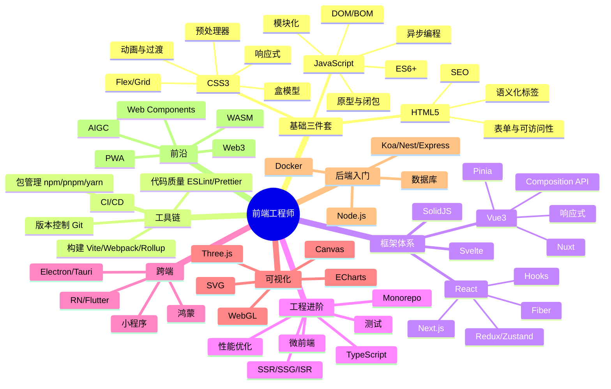

### 0.2 阶段划分与时间预估

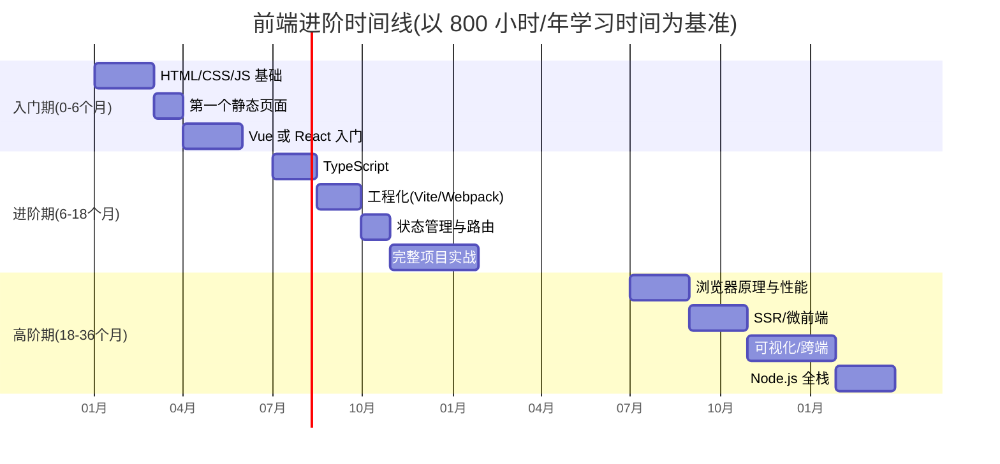

### 0.3 能力矩阵

| 阶段 | 关键能力 | 验收标准 |
|------|---------|---------|
| L1 入门 | HTML/CSS/JS 基础 | 能独立切静态页面、写交互 |
| L2 初级 | 框架 + 工程化 | 能用 Vue/React 完成中型项目 |
| L3 中级 | TS + 性能 + 测试 | 能负责一个业务线 |
| L4 高级 | 架构 + 跨端 + Node | 能设计技术方案、带 3-5 人小组 |
| L5 资深 | 体系建设 + 创新 | 能制定团队规范、布道新技术 |

### 0.4 学习方法论

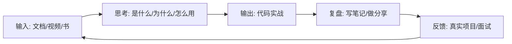

> 💡 **小贴士**:学习编程最忌"收藏即学会"。本文档每个示例都建议你亲手敲一遍,而不是复制粘贴。

---

## 第 1 章 HTML5 与语义化

### 1.1 是什么 · 为什么 · 怎么用

**是什么**:HTML(HyperText Markup Language) 是描述网页结构的标记语言。HTML5 在 HTML4 基础上引入了语义化标签、多媒体、Canvas、Web Storage 等。

**为什么**:
- 浏览器、搜索引擎、辅助阅读器都依赖结构理解内容
- 语义化标签提升 SEO、可访问性 (a11y)、可维护性
- 是所有前端框架的最终输出物

**怎么用**:用标签描述内容,用 CSS 描述样式,用 JS 描述行为。**结构、样式、行为三者分离**是核心原则。

### 1.2 文档基本结构

```html
<!DOCTYPE html>                          <!-- 声明 HTML5 文档 -->
<html lang="zh-CN">                      <!-- 语言声明,有助于翻译和无障碍 -->
<head>
  <meta charset="UTF-8">                 <!-- 字符编码,必须放在前 1024 字节内 -->
  <meta name="viewport"                  <!-- 移动端视口配置 -->
        content="width=device-width, initial-scale=1.0">
  <meta name="description" content="..."><!-- 描述,用于搜索引擎 -->
  <title>页面标题</title>                  <!-- 浏览器标签页显示的标题 -->
  <link rel="icon" href="/favicon.ico">  <!-- 网站图标 -->
  <link rel="stylesheet" href="main.css"><!-- 外部样式表 -->
</head>
<body>
  <!-- 页面内容 -->
  <script src="main.js" defer></script>  <!-- defer:DOM 解析完后执行 -->
</body>
</html>
```

### 1.3 语义化标签全景图

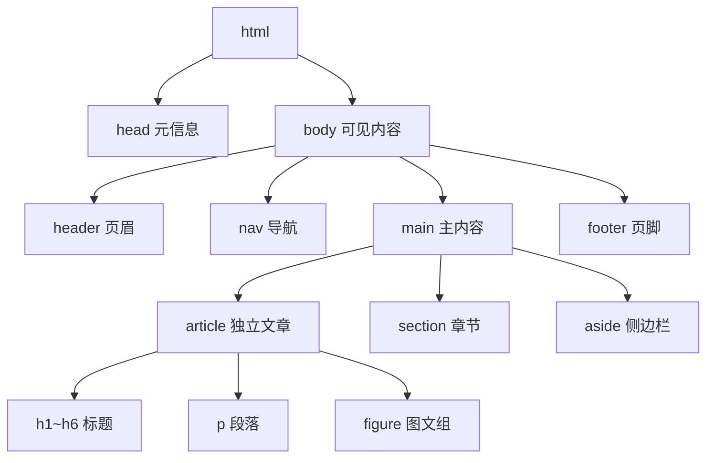

### 1.4 常用语义化标签

| 标签 | 含义 | 使用场景 |
|------|------|---------|
| `<header>` | 页眉 | 网站头部、文章头部 |
| `<nav>` | 导航 | 主导航、面包屑 |
| `<main>` | 主体 | 一个页面只能有一个 |
| `<article>` | 独立内容 | 博文、新闻、卡片 |
| `<section>` | 区块 | 内容分块 |
| `<aside>` | 侧边内容 | 相关推荐、广告 |
| `<footer>` | 页脚 | 版权、备案 |
| `<figure>/<figcaption>` | 图与标题 | 插图配字 |
| `<time>` | 时间 | 配合 `datetime` 属性 |
| `<mark>` | 高亮 | 搜索结果标记 |

### 1.5 完整示例:一个语义化博客页面

```html
<!DOCTYPE html>
<html lang="zh-CN">
<head>
  <meta charset="UTF-8">
  <title>语义化示例</title>
</head>
<body>
  <header>                                <!-- 全站页眉 -->
    <h1>我的博客</h1>
    <nav aria-label="主导航">             <!-- aria-label 增强无障碍 -->
      <ul>
        <li><a href="/">首页</a></li>
        <li><a href="/about">关于</a></li>
      </ul>
    </nav>
  </header>

  <main>                                  <!-- 主内容,全页唯一 -->
    <article>
      <header>
        <h2>HTML 语义化的意义</h2>
        <time datetime="2026-05-26">2026-05-26</time>
      </header>
      <p>语义化让代码更易读、更利于 SEO。</p>
      <figure>
        
        <figcaption>图1:语义化标签全景</figcaption>
      </figure>
    </article>

    <aside>                               <!-- 与主内容相关的辅助信息 -->
      <h3>相关推荐</h3>
      <ul><li><a href="/2">CSS 入门</a></li></ul>
    </aside>
  </main>

  <footer>                                <!-- 全站页脚 -->
    <small>© 2026 我的博客</small>
  </footer>
</body>
</html>
```

### 1.6 表单与可访问性 (a11y)

```html
<form action="/api/login" method="post">
  <!-- label 与 input 通过 for/id 关联,点击 label 会聚焦 input -->
  <label for="username">用户名</label>
  <input
    id="username"
    name="username"
    type="text"
    required                              <!-- 必填 -->
    minlength="3"                         <!-- 最少 3 字符 -->
    autocomplete="username"               <!-- 浏览器自动填充 -->
    aria-describedby="user-hint">         <!-- 关联说明文本 -->
  <small id="user-hint">3-20 个字符</small>

  <label for="pwd">密码</label>
  <input id="pwd" name="password" type="password" required>

  <button type="submit">登录</button>
</form>
```

### 1.7 HTML5 新增 API 一览

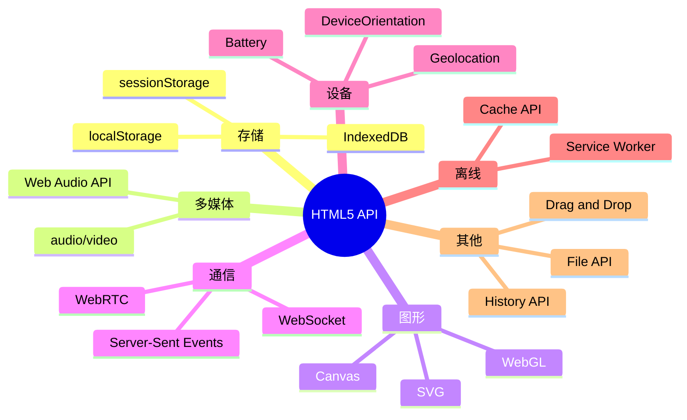

### 1.8 常见踩坑

> ⚠️ **踩坑 1**:`<section>` 不是万能的 `<div>`,应该有独立标题
> ⚠️ **踩坑 2**:`` 必须写 `alt`,否则无障碍工具无法识别
> ⚠️ **踩坑 3**:一个页面只能有一个 `<h1>` 和一个 `<main>`
> ⚠️ **踩坑 4**:`<button type="button">` 不写 type 默认是 submit,会触发表单提交

### 1.9 章节小结

- HTML 是结构,要先写结构,再写样式
- 语义化标签提升 SEO 和可访问性
- 表单要配合 `label`、`required`、`autocomplete` 等属性
- HTML5 提供了大量浏览器原生 API

---

## 第 2 章 CSS3 与现代布局

### 2.1 CSS 是什么

CSS (Cascading Style Sheets) 描述 HTML 元素如何展示。三大核心机制:**层叠 (Cascade)**、**继承 (Inheritance)**、**特异性 (Specificity)**。

### 2.2 选择器与优先级

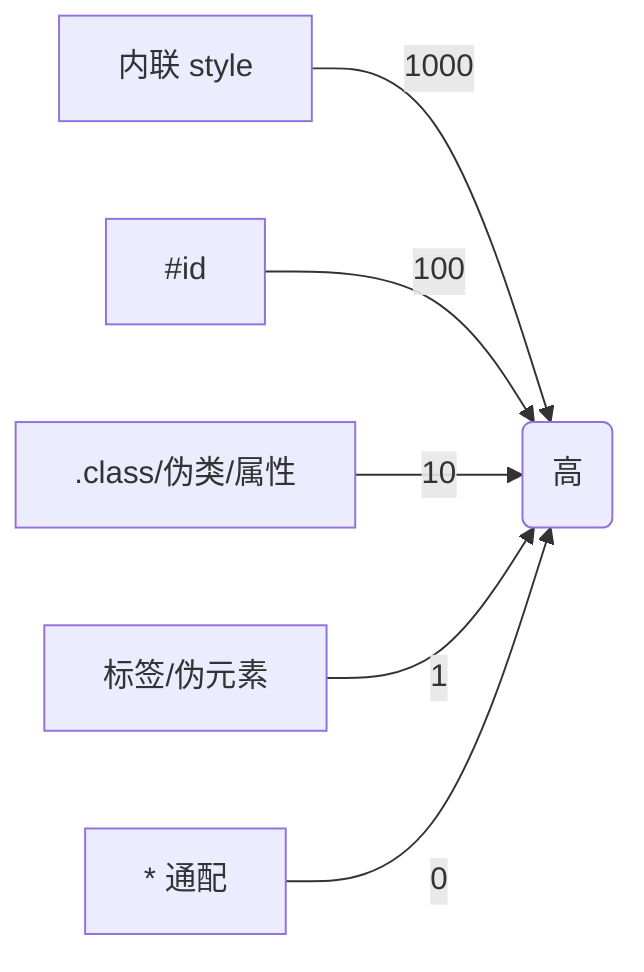

```css
/* 优先级:0,0,1,0 (一个 class) */
.btn { color: red; }

/* 优先级:0,1,0,0 (一个 id) */
#submit { color: blue; }

/* 优先级:0,0,1,1 (一个 class + 一个标签) */
button.btn { color: green; }

/* !important 会突破优先级,但慎用 */
.btn { color: black !important; }
```

### 2.3 盒模型 (Box Model)

```
┌─────────────────────────────────────┐
│             margin                  │
│  ┌───────────────────────────────┐  │
│  │           border              │  │
│  │  ┌─────────────────────────┐  │  │
│  │  │       padding           │  │  │
│  │  │  ┌───────────────────┐  │  │  │
│  │  │  │     content       │  │  │  │
│  │  │  │   width × height  │  │  │  │
│  │  │  └───────────────────┘  │  │  │
│  │  └─────────────────────────┘  │  │
│  └───────────────────────────────┘  │
└─────────────────────────────────────┘
```

```css
.box {
  /* 默认 content-box:width 只算内容区 */
  box-sizing: content-box;
  /* 推荐 border-box:width 包含 padding + border,更直观 */
  box-sizing: border-box;
  width: 200px;
  padding: 20px;
  border: 1px solid #000;
  margin: 10px;
}

/* 全局重置 */
*, *::before, *::after { box-sizing: border-box; }
```

### 2.4 Flex 布局

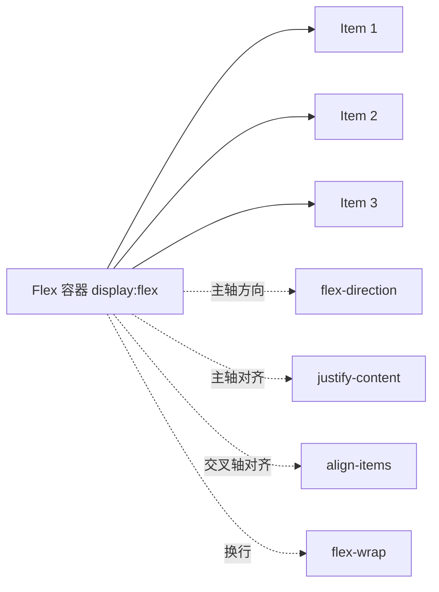

```html
<div class="flex-container">
  <div class="item">1</div>
  <div class="item">2</div>
  <div class="item">3</div>
</div>

<style>
.flex-container {
  display: flex;                          /* 开启 flex 布局 */
  flex-direction: row;                    /* 主轴方向:row/column */
  justify-content: space-between;         /* 主轴对齐 */
  align-items: center;                    /* 交叉轴对齐 */
  flex-wrap: wrap;                        /* 允许换行 */
  gap: 10px;                              /* 项目间距,替代 margin */
}

.item {
  flex: 1 1 200px;                        /* grow shrink basis */
  /* flex-grow: 剩余空间分配比例 */
  /* flex-shrink: 空间不足时收缩比例 */
  /* flex-basis: 初始尺寸 */
}
</style>
```

**Flex 常见布局**:

```css
/* 经典居中 */
.center { display: flex; justify-content: center; align-items: center; }

/* 左右两端,中间自适应 */
.spread { display: flex; justify-content: space-between; }

/* 等分 */
.equal > * { flex: 1; }

/* 圣杯布局 */
.holy { display: flex; }
.holy aside { flex: 0 0 200px; }
.holy main  { flex: 1; }
```

### 2.5 Grid 布局

Grid 是二维布局,Flex 是一维。

```css
.grid {
  display: grid;
  /* 3 列,每列 1fr (剩余空间均分) */
  grid-template-columns: 1fr 1fr 1fr;
  /* 也可以用 repeat */
  grid-template-columns: repeat(3, 1fr);
  /* 响应式:自动放下,每列最少 200px */
  grid-template-columns: repeat(auto-fill, minmax(200px, 1fr));
  gap: 16px;
}

/* 区域命名 */
.layout {
  display: grid;
  grid-template-areas:
    "header header header"
    "sidebar main aside"
    "footer footer footer";
  grid-template-columns: 200px 1fr 200px;
  grid-template-rows: 60px 1fr 40px;
  min-height: 100vh;
}
.layout > header  { grid-area: header; }
.layout > nav     { grid-area: sidebar; }
.layout > main    { grid-area: main; }
.layout > aside   { grid-area: aside; }
.layout > footer  { grid-area: footer; }
```

```
┌──────────────────────────────────┐
│           header                 │
├──────────┬───────────┬───────────┤
│ sidebar  │   main    │   aside   │
├──────────┴───────────┴───────────┤
│           footer                 │
└──────────────────────────────────┘
```

### 2.6 定位 (Position)

| 值 | 行为 |
|----|------|
| `static` | 默认,文档流 |
| `relative` | 相对自身原位置偏移 |
| `absolute` | 相对最近非 static 祖先定位 |
| `fixed` | 相对视口固定 |
| `sticky` | 滚动粘性,滚到阈值变 fixed |

```css
/* sticky 顶部吸附 */
.tab { position: sticky; top: 0; background: #fff; z-index: 10; }

/* 居中绝对定位 */
.modal {
  position: fixed;
  top: 50%; left: 50%;
  transform: translate(-50%, -50%);
}
```

### 2.7 动画与过渡

```css
/* 过渡:状态变化时平滑 */
.btn {
  background: blue;
  transition: background 0.3s ease, transform 0.2s;
}
.btn:hover {
  background: red;
  transform: scale(1.05);
}

/* 关键帧动画 */
@keyframes pulse {
  0%, 100% { transform: scale(1); }
  50%      { transform: scale(1.1); }
}
.heart { animation: pulse 1s ease-in-out infinite; }
```

> 💡 **小贴士**:动画属性优先选 `transform` 和 `opacity`,因为它们不触发重排,GPU 加速。

### 2.8 CSS 变量 (Custom Properties)

```css
:root {
  --primary: #1677ff;
  --radius: 8px;
  --space: 16px;
}

.btn {
  background: var(--primary);
  border-radius: var(--radius);
  padding: var(--space);
}

/* 主题切换 */
[data-theme="dark"] {
  --primary: #4096ff;
  --bg: #1a1a1a;
}
```

```js
// JS 动态修改
document.documentElement.style.setProperty('--primary', '#ff4d4f');
```

### 2.9 响应式与容器查询

```css
/* 媒体查询:基于视口 */
@media (max-width: 768px) {
  .nav { display: none; }
}

/* 容器查询:基于父容器,2023+ */
.card-list { container-type: inline-size; container-name: list; }

@container list (min-width: 600px) {
  .card { flex-direction: row; }
}
```

### 2.10 CSS 预处理器与 CSS-in-JS

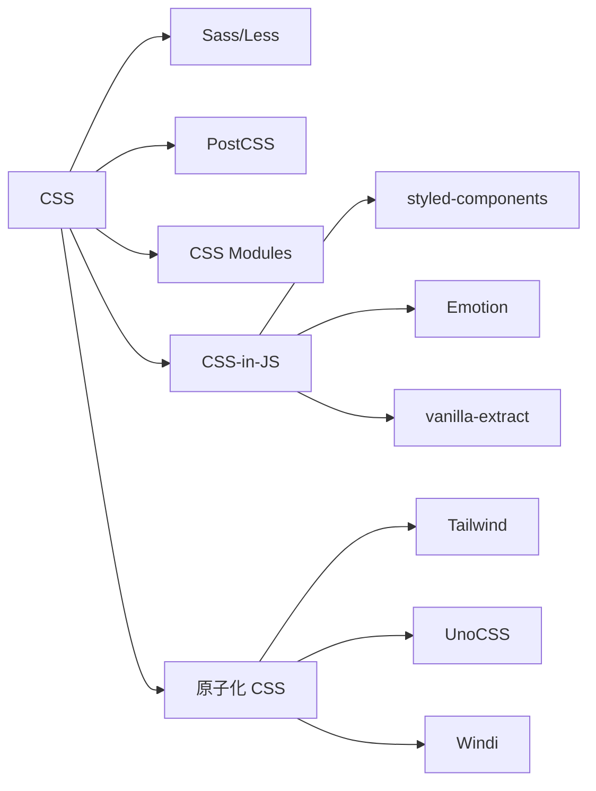

**Tailwind 示例**:

```html
<button class="px-4 py-2 bg-blue-500 hover:bg-blue-600 text-white rounded-lg shadow-md transition">
  按钮
</button>
```

**styled-components 示例**:

```js
import styled from 'styled-components';

const Button = styled.button`
  padding: 8px 16px;
  background: ${props => props.primary ? '#1677ff' : '#fff'};
  color: ${props => props.primary ? '#fff' : '#000'};
  &:hover { opacity: 0.8; }
`;
```

### 2.11 常见踩坑

> ⚠️ **踩坑 1**:margin 重叠 (上下相邻 margin 取最大值)
> ⚠️ **踩坑 2**:z-index 失效:必须配合 position
> ⚠️ **踩坑 3**:浮动会脱离文档流,需要清除浮动 `::after { clear: both }`
> ⚠️ **踩坑 4**:`100vh` 在移动端会被地址栏影响,推荐 `100dvh`

### 2.12 章节小结

- 布局首选 Flex (一维) 和 Grid (二维)
- 优先级:行内 > id > class > 标签
- 动画用 transform/opacity 性能最优
- 现代项目推荐 Tailwind 或 CSS Modules + CSS Variables

---

## 第 3 章 JavaScript 核心

### 3.1 数据类型

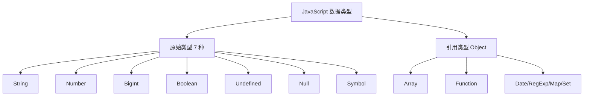

```js
// 类型判断
typeof 1            // 'number'
typeof 'a'          // 'string'
typeof null         // 'object'  ⚠️ 历史遗留 bug
typeof undefined    // 'undefined'
typeof []           // 'object'
Array.isArray([])   // true 推荐

// 通用判断
Object.prototype.toString.call(null)  // '[object Null]'
Object.prototype.toString.call([])    // '[object Array]'
```

### 3.2 变量与作用域

```js
var a = 1;          // 函数作用域,有变量提升,挂载到 window
let b = 2;          // 块级作用域,无提升,不挂 window
const c = 3;        // 块级,常量,声明时必须初始化

// 临时性死区 (TDZ)
console.log(x);     // ReferenceError
let x = 1;

// 作用域链:词法作用域,在定义时确定
function outer() {
  const a = 1;
  function inner() {
    console.log(a); // 沿作用域链找到 outer 的 a
  }
  inner();
}
```

### 3.3 闭包 (Closure)

**定义**:函数和其引用的外部变量构成闭包。

```js
function counter() {
  let count = 0;            // 外部变量被内部函数引用,不会被回收
  return function() {
    return ++count;
  };
}
const c = counter();
c(); // 1
c(); // 2
c(); // 3
```

**应用**:
- 数据私有化
- 函数柯里化
- 模块化

```js
// 柯里化
const curry = (fn) => (a) => (b) => fn(a, b);
const add = curry((a, b) => a + b);
add(1)(2); // 3
```

### 3.4 原型与继承

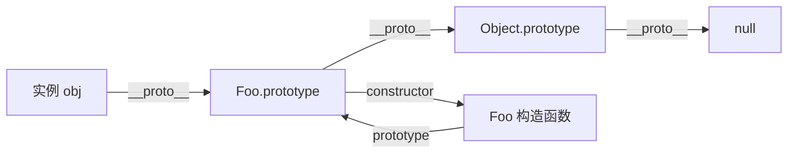

```js
// ES5 构造函数
function Animal(name) {
  this.name = name;
}
Animal.prototype.sayName = function() {
  console.log(this.name);
};

// ES6 class (语法糖)
class Animal {
  constructor(name) {
    this.name = name;
  }
  sayName() {
    console.log(this.name);
  }
}

class Dog extends Animal {
  constructor(name, breed) {
    super(name);
    this.breed = breed;
  }
  bark() {
    console.log(`${this.name} 汪汪`);
  }
}

const d = new Dog('旺财', '柴犬');
d.sayName(); // 旺财
d.bark();    // 旺财 汪汪
```

### 3.5 this 指向

```js
// 1. 普通函数:this 指向调用者
function foo() { console.log(this); }
foo();          // window (非严格) / undefined (严格)
const obj = { foo };
obj.foo();      // obj

// 2. 箭头函数:this 来自定义时所在作用域
const arrow = () => console.log(this);

// 3. 显式绑定
foo.call(obj);
foo.apply(obj);
const bound = foo.bind(obj);

// 4. new:this 指向新创建的对象
function Person(name) { this.name = name; }
const p = new Person('张三');
```

### 3.6 异步编程演进

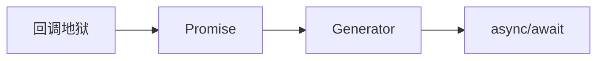

```js
// 1. 回调地狱
fs.readFile('a.txt', (err, a) => {
  fs.readFile('b.txt', (err, b) => {
    fs.readFile('c.txt', (err, c) => {
      console.log(a, b, c);
    });
  });
});

// 2. Promise
fetch('/api/a')
  .then(res => res.json())
  .then(data => fetch(`/api/b?id=${data.id}`))
  .then(res => res.json())
  .catch(err => console.error(err));

// 3. async/await
async function load() {
  try {
    const a = await fetch('/api/a').then(r => r.json());
    const b = await fetch(`/api/b?id=${a.id}`).then(r => r.json());
    return b;
  } catch (e) {
    console.error(e);
  }
}

// Promise 常用方法
await Promise.all([p1, p2, p3]);       // 全部成功才 resolve
await Promise.race([p1, p2]);          // 第一个完成
await Promise.allSettled([p1, p2]);    // 全部完成不管成败
await Promise.any([p1, p2]);           // 第一个 resolve
```

### 3.7 事件循环 (Event Loop)

```mermaid
sequenceDiagram
    participant Stack as 调用栈
    participant Web as Web APIs
    participant MicroQ as 微任务队列
    participant MacroQ as 宏任务队列
    participant Loop as 事件循环

    Note over Stack: 同步代码执行
    Stack->>Web: setTimeout/fetch
    Web->>MacroQ: 回调入队 (宏)
    Web->>MicroQ: Promise.then (微)
    Loop->>Stack: 栈空时检查
    Loop->>MicroQ: 取出所有微任务执行
    Loop->>MacroQ: 取出 1 个宏任务
    Note over Loop: 渲染一帧
    Loop->>Loop: 循环
```

**经典面试题**:

```js
console.log(1);
setTimeout(() => console.log(2), 0);
Promise.resolve().then(() => console.log(3));
console.log(4);
// 输出顺序:1 4 3 2
// 原因:同步先执行(1,4),微任务在宏任务前(3),宏任务最后(2)
```

| 类型 | 例子 |
|------|------|
| 宏任务 | setTimeout、setInterval、I/O、UI 渲染、MessageChannel |
| 微任务 | Promise.then、queueMicrotask、MutationObserver |

### 3.8 模块化

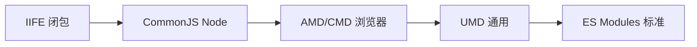

```js
// CommonJS (Node)
const fs = require('fs');
module.exports = { foo };

// ES Modules (现代标准)
import fs from 'fs';
import { foo, bar } from './utils.js';
import * as utils from './utils.js';
import Default, { named } from './mod.js';
export const foo = 1;
export default function() {}

// 动态导入 (返回 Promise)
const mod = await import('./heavy.js');
```

### 3.9 数组与对象常用方法

```js
// 数组遍历
arr.forEach(fn);             // 无返回值
arr.map(fn);                 // 返回新数组
arr.filter(fn);              // 过滤
arr.reduce((acc, cur) => acc + cur, 0); // 累加
arr.find(fn);                // 找第一个
arr.some(fn);                // 任一满足
arr.every(fn);               // 全部满足
arr.flat(2);                 // 扁平化 2 层
arr.flatMap(fn);             // map + flat(1)

// ES2023 新增
arr.at(-1);                  // 倒数第一个
arr.toSorted();              // 不修改原数组的排序
arr.toReversed();
arr.toSpliced(0, 1);

// 对象
Object.keys(obj);
Object.values(obj);
Object.entries(obj);
Object.fromEntries([['a',1]]);
Object.assign({}, a, b);     // 浅拷贝合并
const clone = structuredClone(obj); // 深拷贝 (现代浏览器)
```

### 3.10 解构、扩展、可选链

```js
// 解构
const { name, age = 18 } = user;
const [first, ...rest] = arr;
const { a: { b: { c } = {} } = {} } = obj; // 深解构带默认值

// 扩展
const merged = { ...obj1, ...obj2 };
const newArr = [...arr1, ...arr2];

// 可选链 & 空值合并
user?.profile?.name ?? '未命名';
fn?.(); // 如果 fn 存在才调用
arr?.[0];
```

### 3.11 章节小结

- JS 7 种原始类型 + 1 种引用类型 (Object)
- `let/const` 优于 `var`,块级作用域更安全
- 闭包 = 函数 + 外部变量引用
- 异步首选 `async/await`,事件循环要分清宏微任务

---

## 第 4 章 TypeScript 全面进阶

### 4.1 为什么用 TS

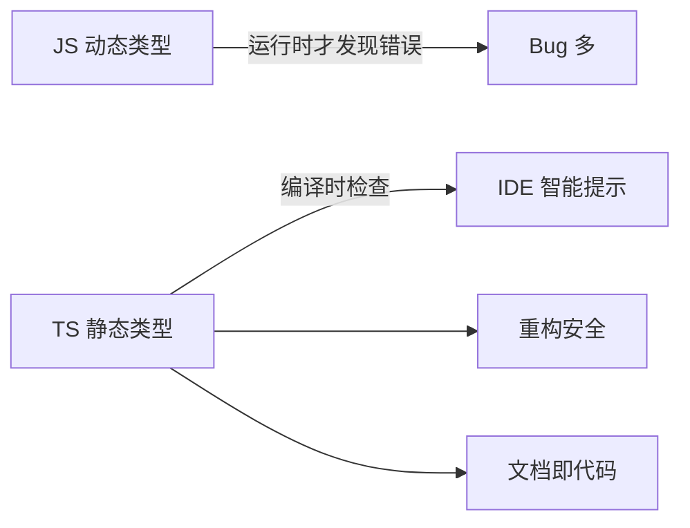

### 4.2 基础类型

```ts
let n: number = 1;
let s: string = 'a';
let b: boolean = true;
let u: undefined = undefined;
let nu: null = null;
let any1: any;              // 关闭检查,慎用
let unknown1: unknown;      // 安全的 any,使用前必须收窄
let never1: never;          // 永不返回 (抛错/死循环)
let void1: void;            // 函数无返回值

// 数组
let arr: number[] = [1, 2, 3];
let arr2: Array<number> = [1, 2, 3];

// 元组
let tuple: [string, number] = ['a', 1];

// 枚举
enum Status { Pending, Active, Done }
const s1: Status = Status.Active; // 1

// 字面量类型
type Direction = 'up' | 'down' | 'left' | 'right';
```

### 4.3 接口与类型别名

```ts
// interface 可继承、可合并声明
interface User {
  id: number;
  name: string;
  age?: number;             // 可选
  readonly email: string;   // 只读
}

interface Admin extends User {
  role: 'admin';
}

// type 更灵活,可联合、交叉
type ID = number | string;
type UserWithRole = User & { role: string };
```

| 对比 | interface | type |
|------|-----------|------|
| 扩展 | extends | & |
| 合并声明 | 可以 | 不可以 |
| 联合类型 | 不支持 | 支持 |
| 推荐 | 对象/类 | 联合/工具类型 |

### 4.4 泛型

```ts
function identity<T>(x: T): T { return x; }
identity<string>('hello');
identity(123); // 类型推断为 number

// 约束
function getLen<T extends { length: number }>(x: T) {
  return x.length;
}

// 多参数
function pair<A, B>(a: A, b: B): [A, B] { return [a, b]; }

// 泛型接口
interface Response<T> {
  code: number;
  data: T;
}
const resp: Response<User> = { code: 0, data: { id: 1, name: 'a', email: '' } };
```

### 4.5 工具类型 (Utility Types)

```ts
// Partial:全部可选
type PartialUser = Partial<User>;

// Required:全部必填
type RequiredUser = Required<User>;

// Readonly
type ReadonlyUser = Readonly<User>;

// Pick:挑选
type UserName = Pick<User, 'id' | 'name'>;

// Omit:排除
type UserNoEmail = Omit<User, 'email'>;

// Record:键值对
type Roles = Record<'admin' | 'user', string>;

// Exclude / Extract
type T1 = Exclude<'a' | 'b' | 'c', 'a'>;  // 'b' | 'c'
type T2 = Extract<'a' | 'b' | 'c', 'a' | 'd'>; // 'a'

// ReturnType / Parameters
function fn(a: number, b: string) { return true; }
type R = ReturnType<typeof fn>;     // boolean
type P = Parameters<typeof fn>;     // [number, string]

// Awaited
type A = Awaited<Promise<number>>;  // number
```

### 4.6 类型体操精选

```ts
// 1. 实现 Pick
type MyPick<T, K extends keyof T> = {
  [P in K]: T[P];
};

// 2. 实现 ReadOnly
type MyReadonly<T> = {
  readonly [P in keyof T]: T[P];
};

// 3. 元组转对象
type TupleToObj<T extends readonly PropertyKey[]> = {
  [K in T[number]]: K;
};

// 4. First of Array
type First<T extends any[]> = T extends [infer F, ...any[]] ? F : never;

// 5. Length
type Len<T extends readonly any[]> = T['length'];

// 6. 深 Partial
type DeepPartial<T> = {
  [K in keyof T]?: T[K] extends object ? DeepPartial<T[K]> : T[K];
};
```

### 4.7 装饰器 (Decorator)

```ts
// 类装饰器
function logger(target: any) {
  console.log(`Class ${target.name} loaded`);
}

@logger
class MyClass {}

// 方法装饰器
function readonly(target: any, key: string, descriptor: PropertyDescriptor) {
  descriptor.writable = false;
}

class Foo {
  @readonly greet() { return 'hi'; }
}
```

### 4.8 配置文件 tsconfig.json

```json
{
  "compilerOptions": {
    "target": "ES2022",
    "module": "ESNext",
    "moduleResolution": "Bundler",
    "strict": true,
    "noImplicitAny": true,
    "strictNullChecks": true,
    "esModuleInterop": true,
    "skipLibCheck": true,
    "jsx": "react-jsx",
    "paths": { "@/*": ["./src/*"] }
  },
  "include": ["src"]
}
```

### 4.9 章节小结

- TS 是 JS 超集,提供静态类型
- interface 用于对象/类,type 用于联合/工具类型
- 泛型让函数和类更复用
- 工具类型组合可解决 90% 的类型问题

---

## 第 5 章 浏览器原理

### 5.1 浏览器架构

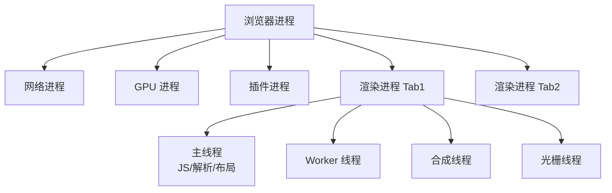

### 5.2 从 URL 输入到页面展示

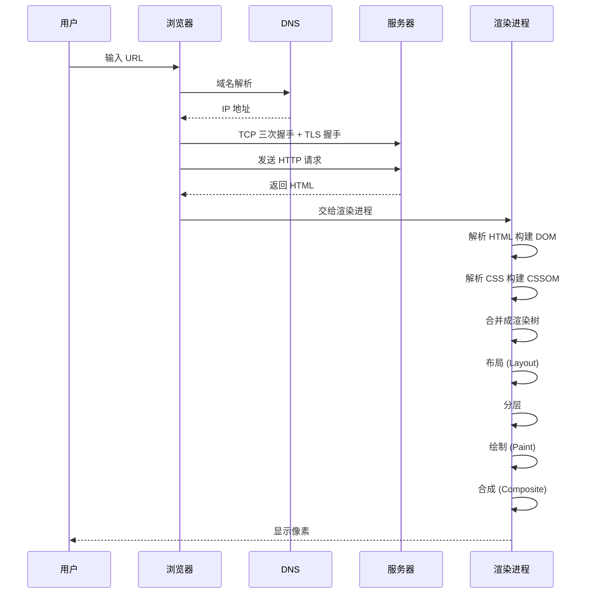

### 5.3 渲染流水线

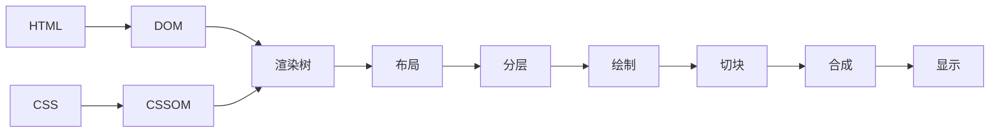

**重排 (Reflow) vs 重绘 (Repaint)**:

| 操作 | 重排 | 重绘 |
|------|------|------|
| 修改尺寸/位置 | ✅ | ✅ |
| 修改颜色 | ❌ | ✅ |
| transform/opacity | ❌ | ❌ (合成层) |

```js
// ❌ 触发多次重排
for (let i = 0; i < 100; i++) {
  list.style.width = list.offsetWidth + 1 + 'px';
}

// ✅ 批量修改
list.style.cssText = 'width: 100px; height: 200px;';

// ✅ 用 transform 而非 left/top
elem.style.transform = 'translateX(100px)';
```

### 5.4 网络协议

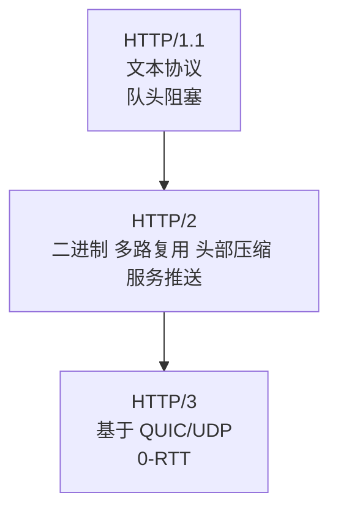

**HTTP 请求结构**:

```
GET /api/user HTTP/1.1          ← 请求行
Host: example.com               ← 请求头
Cookie: token=xxx
Accept: application/json

                                ← 空行
{ "id": 1 }                     ← 请求体
```

**常见状态码**:

| 码 | 含义 |
|----|------|
| 200 | OK |
| 301 | 永久重定向 |
| 302 | 临时重定向 |
| 304 | 协商缓存命中 |
| 400 | 请求错误 |
| 401 | 未认证 |
| 403 | 禁止 |
| 404 | 未找到 |
| 500 | 服务器错误 |
| 502 | 网关错误 |
| 504 | 网关超时 |

### 5.5 浏览器缓存

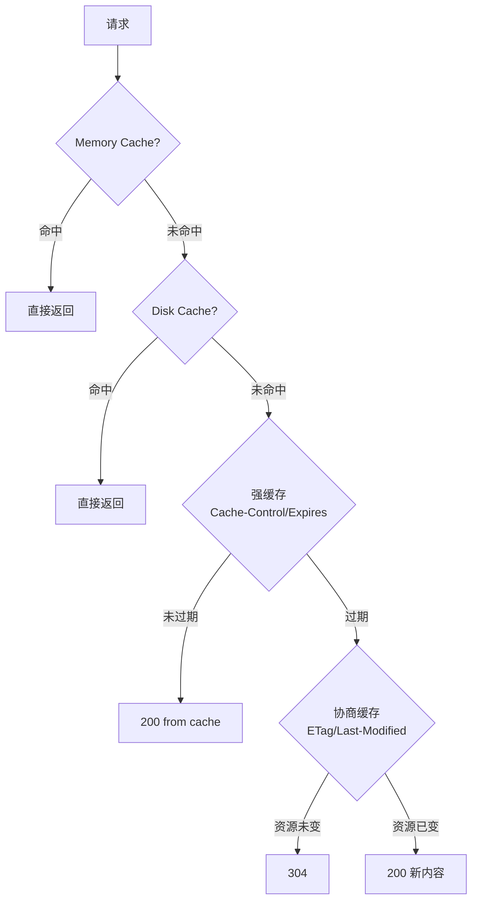

```
# 强缓存
Cache-Control: max-age=31536000, immutable

# 协商缓存
ETag: "abc123"
If-None-Match: "abc123"

Last-Modified: Wed, 26 May 2026 00:00:00 GMT
If-Modified-Since: Wed, 26 May 2026 00:00:00 GMT
```

### 5.6 跨域与 CORS

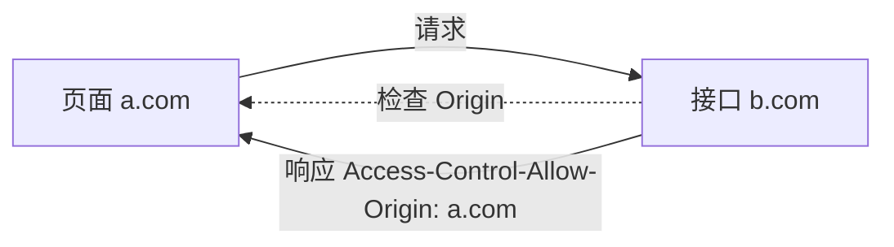

**同源策略**:协议 + 域名 + 端口 相同才同源。

**解决方案**:
1. **CORS** (推荐):服务端设置响应头
2. **JSONP** (老):利用 `<script>` 不受同源限制 (仅 GET)
3. **代理**:Nginx/Vite 开发代理
4. **postMessage**:跨窗口通信

```js
// 简单请求 CORS 响应头
Access-Control-Allow-Origin: https://a.com
Access-Control-Allow-Credentials: true

// 复杂请求 (PUT/DELETE/自定义头) 会先发 OPTIONS 预检
Access-Control-Allow-Methods: GET, POST, PUT
Access-Control-Allow-Headers: Content-Type, Authorization
Access-Control-Max-Age: 86400
```

### 5.7 安全:XSS / CSRF / CSP

```mermaid
graph TB
    Web[Web 安全] --> XSS[XSS 跨站脚本]
    Web --> CSRF[CSRF 跨站请求伪造]
    Web --> CSP[CSP 内容安全策略]
    Web --> Click[点击劫持]
    Web --> SQL[SQL 注入<br/>后端]
    XSS --> Reflect[反射型]
    XSS --> Store[存储型]
    XSS --> DOM[DOM 型]
```

**XSS 防御**:

```js
// ❌ 危险:直接插入 HTML
div.innerHTML = userInput;

// ✅ 安全:textContent 不解析 HTML
div.textContent = userInput;

// ✅ 转义
const escape = (s) => s
  .replace(/&/g, '&amp;')
  .replace(/</g, '&lt;')
  .replace(/>/g, '&gt;')
  .replace(/"/g, '&quot;');
```

**CSRF 防御**:
- Cookie 设置 `SameSite=Strict/Lax`
- 服务端校验 CSRF Token
- 敏感操作二次验证

**CSP 设置**:

```html
<meta http-equiv="Content-Security-Policy"
      content="default-src 'self'; script-src 'self' https://cdn.example.com">
```

### 5.8 存储

| 存储 | 容量 | 生命周期 | 作用域 | 同步 |
|------|------|---------|--------|------|
| Cookie | 4KB | 可设置 | 域+路径 | 每次请求带 |
| localStorage | 5MB | 永久 | 同源 | 同步 |
| sessionStorage | 5MB | 标签页 | 同源 | 同步 |
| IndexedDB | 大 (GB) | 永久 | 同源 | 异步 |
| Cache API | 大 | 永久 | 同源 | 异步 |

```js
// localStorage
localStorage.setItem('user', JSON.stringify({ name: '张三' }));
const user = JSON.parse(localStorage.getItem('user') || '{}');

// IndexedDB (基础)
const req = indexedDB.open('my-db', 1);
req.onupgradeneeded = (e) => {
  const db = e.target.result;
  db.createObjectStore('users', { keyPath: 'id' });
};
```

### 5.9 章节小结

- 浏览器是多进程架构,渲染走流水线
- HTTP 缓存分强缓存和协商缓存
- 跨域用 CORS 解决,开发用代理
- 安全防御:转义输入、设置 CSP、SameSite Cookie

---

## 第 6 章 Vue 3 体系

### 6.1 Vue 3 全景

```mermaid
mindmap
  root((Vue 3))
    核心
      响应式 Proxy
      虚拟 DOM
      模板编译
      Composition API
    生态
      Vue Router
      Pinia
      VueUse
      Vitest
    元框架
      Nuxt 3
      Vitepress
    工具
      Volar
      Vue DevTools
```

### 6.2 响应式原理

```mermaid
graph LR
    Data[原始对象] -->|reactive| Proxy[Proxy 代理]
    Proxy -->|get| Track[依赖收集 track]
    Proxy -->|set| Trigger[触发更新 trigger]
    Track --> Dep[依赖集合 Dep]
    Trigger --> Effect[副作用 effect]
    Effect --> Update[组件重渲染]
```

```js
// 简化版响应式
function reactive(obj) {
  return new Proxy(obj, {
    get(target, key) {
      track(target, key);         // 收集依赖
      return Reflect.get(target, key);
    },
    set(target, key, value) {
      const result = Reflect.set(target, key, value);
      trigger(target, key);       // 触发更新
      return result;
    }
  });
}
```

### 6.3 Composition API

```vue
<script setup lang="ts">
import { ref, reactive, computed, watch, onMounted } from 'vue';

// ref:基本类型的响应式,通过 .value 访问
const count = ref(0);

// reactive:对象响应式,直接访问属性
const state = reactive({ name: '张三', age: 18 });

// computed:计算属性,自动缓存
const double = computed(() => count.value * 2);

// watch:监听变化
watch(count, (newVal, oldVal) => {
  console.log(`从 ${oldVal} 变成 ${newVal}`);
});

// watchEffect:自动收集依赖
watchEffect(() => {
  console.log(count.value, state.name);
});

// 生命周期
onMounted(() => {
  console.log('挂载完成');
});

function increment() {
  count.value++;
}
</script>

<template>
  <button @click="increment">点击 {{ count }} 次</button>
  <p>双倍:{{ double }}</p>
  <p>{{ state.name }} - {{ state.age }}</p>
</template>
```

### 6.4 ref vs reactive

```ts
// ref:适合基本类型
const count = ref(0);
count.value++;

// reactive:适合对象,但解构会丢失响应性
const state = reactive({ count: 0 });
const { count } = state;     // ❌ 失去响应性
const { count } = toRefs(state); // ✅ 用 toRefs

// 推荐:统一用 ref
const user = ref({ name: '张三' });
user.value.name = '李四';
```

### 6.5 组件通信

```mermaid
graph TB
    Parent[父组件] -->|props| Child[子组件]
    Child -->|emit 事件| Parent
    Parent -->|provide| GrandChild[孙组件]
    GrandChild -->|inject| Parent
    A[组件 A] <-->|Pinia 全局| B[组件 B]
    A <-->|EventBus 慎用| B
```

```vue
<!-- 父组件 -->
<script setup>
import Child from './Child.vue';
import { ref } from 'vue';

const msg = ref('hello');
function handleChange(val) { msg.value = val; }
</script>
<template>
  <Child :msg="msg" @change="handleChange" />
</template>

<!-- 子组件 -->
<script setup>
const props = defineProps<{ msg: string }>();
const emit = defineEmits<{ change: [val: string] }>();

function update() {
  emit('change', '新消息');
}
</script>
```

### 6.6 Pinia 状态管理

```ts
// stores/user.ts
import { defineStore } from 'pinia';

export const useUserStore = defineStore('user', () => {
  const name = ref('');
  const isLogin = computed(() => name.value !== '');

  async function login(user: string) {
    name.value = user;
  }

  return { name, isLogin, login };
});

// 使用
const userStore = useUserStore();
userStore.login('张三');
console.log(userStore.isLogin); // true
```

### 6.7 Vue Router

```ts
import { createRouter, createWebHistory } from 'vue-router';

const router = createRouter({
  history: createWebHistory(),
  routes: [
    { path: '/', component: () => import('@/views/Home.vue') },
    {
      path: '/user/:id',
      component: () => import('@/views/User.vue'),
      meta: { requiresAuth: true },
    },
    { path: '/:pathMatch(.*)*', component: NotFound }
  ]
});

// 路由守卫
router.beforeEach((to) => {
  if (to.meta.requiresAuth && !isLogin()) {
    return { path: '/login' };
  }
});
```

### 6.8 Nuxt 3 概览

```mermaid
flowchart LR
    A[文件即路由] --> B[pages/]
    C[自动导入] --> D[components/composables/]
    E[服务端] --> F[server/api/]
    G[渲染模式] --> H[SSR/SSG/SPA/ISR]
```

### 6.9 常见踩坑

> ⚠️ **踩坑 1**:`<script setup>` 中顶层导入的变量才能在模板使用
> ⚠️ **踩坑 2**:`v-for` 必须加 `:key`,且不要用 index
> ⚠️ **踩坑 3**:`reactive` 解构丢失响应性,用 `toRefs`
> ⚠️ **踩坑 4**:`ref` 在 template 中自动 `.value`,在 JS 中要手动写

### 6.10 章节小结

- Vue 3 基于 Proxy 实现响应式
- Composition API 比 Options API 更适合组合复用
- Pinia 替代 Vuex,API 更简洁
- Nuxt 3 提供开箱即用的 SSR

---

## 第 7 章 React 体系

### 7.1 React 全景

```mermaid
mindmap
  root((React))
    核心
      JSX
      虚拟 DOM
      Fiber
      Hooks
      并发模式
    状态管理
      Context
      Redux/RTK
      Zustand
      Jotai
      Recoil
    路由
      React Router
      TanStack Router
    元框架
      Next.js
      Remix
      Gatsby
    UI 库
      Ant Design
      MUI
      Chakra
      shadcn/ui
```

### 7.2 Fiber 架构

```mermaid
graph TB
    A[Stack Reconciler 旧] -->|无法中断,长任务卡顿| B[Fiber 新]
    B --> B1[可中断]
    B --> B2[优先级]
    B --> B3[并发渲染]
    B --> C[Render 阶段<br/>可中断]
    B --> D[Commit 阶段<br/>同步执行]
    C --> C1[构建 Fiber 树]
    C --> C2[diff 标记副作用]
    D --> D1[执行 DOM 更新]
    D --> D2[调用生命周期/Hook]
```

### 7.3 Hooks 核心

```jsx
import { useState, useEffect, useMemo, useCallback, useRef, useReducer } from 'react';

function Counter() {
  // 状态
  const [count, setCount] = useState(0);
  const [user, setUser] = useState({ name: '' });

  // 副作用
  useEffect(() => {
    document.title = `点击 ${count} 次`;
    return () => { /* 清理 */ };
  }, [count]);             // 依赖项变化才执行

  // 记忆化值 (避免重计算)
  const double = useMemo(() => count * 2, [count]);

  // 记忆化函数 (避免子组件重渲染)
  const handleClick = useCallback(() => setCount(c => c + 1), []);

  // ref:不触发渲染的可变值 / DOM 引用
  const inputRef = useRef<HTMLInputElement>(null);

  // reducer:复杂状态
  const [state, dispatch] = useReducer(reducer, initialState);

  return (
    <>
      <input ref={inputRef} />
      <button onClick={handleClick}>{count}</button>
      <p>双倍 {double}</p>
    </>
  );
}
```

### 7.4 自定义 Hook

```ts
// useDebounce.ts
import { useState, useEffect } from 'react';

export function useDebounce<T>(value: T, delay = 300): T {
  const [debounced, setDebounced] = useState(value);
  useEffect(() => {
    const t = setTimeout(() => setDebounced(value), delay);
    return () => clearTimeout(t);
  }, [value, delay]);
  return debounced;
}

// 使用
const search = useDebounce(input, 500);
useEffect(() => { fetchSearch(search); }, [search]);
```

### 7.5 状态管理对比

| 库 | 风格 | 学习曲线 | 包大小 | 推荐场景 |
|----|------|---------|--------|---------|
| useState/Context | 内置 | 低 | 0 | 简单应用 |
| Redux Toolkit | Flux | 中 | 中 | 大型团队 |
| Zustand | 简洁 | 低 | 小 | 中小项目 |
| Jotai | 原子化 | 中 | 小 | 细粒度更新 |
| Recoil | 原子化 | 中 | 中 | 复杂派生状态 |
| MobX | 响应式 | 中 | 中 | OOP 风格 |

**Zustand 示例**:

```ts
import { create } from 'zustand';

interface State {
  count: number;
  inc: () => void;
}

export const useCounter = create<State>((set) => ({
  count: 0,
  inc: () => set((s) => ({ count: s.count + 1 })),
}));

// 组件中
const { count, inc } = useCounter();
```

### 7.6 React Router v6

```jsx
import { createBrowserRouter, RouterProvider } from 'react-router-dom';

const router = createBrowserRouter([
  {
    path: '/',
    element: <Layout />,
    children: [
      { index: true, element: <Home /> },
      { path: 'user/:id', element: <User />, loader: userLoader },
    ],
  },
]);

<RouterProvider router={router} />
```

### 7.7 Next.js 与 RSC

```mermaid
graph TB
    Next[Next.js App Router] --> RSC[React Server Components]
    RSC --> Server[服务端组件<br/>不发送 JS]
    RSC --> Client[客户端组件<br/>use client]
    Next --> Render[渲染策略]
    Render --> SSR[SSR 服务端渲染]
    Render --> SSG[SSG 构建时生成]
    Render --> ISR[ISR 增量再生]
    Render --> Streaming[流式渲染]
```

```tsx
// app/page.tsx (服务端组件,默认)
async function Page() {
  const data = await fetch('https://api...').then(r => r.json());
  return <div>{data.title}</div>;
}

// app/Counter.tsx (客户端组件)
'use client';
import { useState } from 'react';
export default function Counter() {
  const [n, setN] = useState(0);
  return <button onClick={() => setN(n + 1)}>{n}</button>;
}
```

### 7.8 性能优化

```jsx
// 1. memo 避免子组件重渲染
const Child = React.memo(function Child({ data }) {
  return <div>{data.name}</div>;
});

// 2. useMemo 缓存计算
const sorted = useMemo(() => list.sort(), [list]);

// 3. useCallback 缓存函数
const handle = useCallback(() => {}, []);

// 4. 代码分割
const Heavy = React.lazy(() => import('./Heavy'));
<Suspense fallback={<Loading />}>
  <Heavy />
</Suspense>

// 5. 虚拟列表
import { useVirtualizer } from '@tanstack/react-virtual';
```

### 7.9 常见踩坑

> ⚠️ **踩坑 1**:useEffect 依赖项遗漏,导致闭包陷阱
> ⚠️ **踩坑 2**:列表 key 用 index,顺序变化时复用错位
> ⚠️ **踩坑 3**:状态更新是异步的,连续 setCount 用回调形式
> ⚠️ **踩坑 4**:useState 初始值若是计算昂贵,用函数 `useState(() => compute())`

### 7.10 章节小结

- Fiber 让 React 支持可中断渲染和并发模式
- Hooks 是函数组件的基石,要理解依赖项
- Next.js + RSC 是现代 React 推荐架构
- 性能优化三板斧:memo、useMemo、useCallback

---

## 第 8 章 工程化

### 8.1 工程化全景

```mermaid
mindmap
  root((工程化))
    包管理
      npm
      yarn
      pnpm
    构建
      Webpack
      Vite
      Rollup
      esbuild
      Turbopack
      Rspack
    代码规范
      ESLint
      Prettier
      Stylelint
      EditorConfig
    Git
      Husky
      lint-staged
      commitlint
    CI/CD
      GitHub Actions
      GitLab CI
      Jenkins
    Monorepo
      pnpm workspace
      Turborepo
      Nx
      Lerna
```

### 8.2 包管理器对比

| 工具 | 特点 | 速度 | 磁盘 |
|------|------|------|------|
| npm | 官方,扁平 node_modules | 慢 | 大 |
| yarn (v1) | 锁文件,快 | 中 | 大 |
| yarn (berry/v3+) | PnP, 零安装 | 快 | 小 |
| pnpm | 硬链接,严格 | 最快 | 最小 |

```bash
# pnpm 常用命令
pnpm install              # 安装依赖
pnpm add lodash           # 添加
pnpm add -D vite          # 开发依赖
pnpm add -g typescript    # 全局
pnpm remove lodash        # 移除
pnpm run dev              # 运行脚本
pnpm dlx create-vite      # 临时执行包(类似 npx)
```

### 8.3 Vite vs Webpack

```mermaid
graph LR
    subgraph Webpack
      A1[入口] --> B1[打包所有模块]
      B1 --> C1[生成 bundle]
      C1 --> D1[启动 dev server]
    end
    subgraph Vite
      A2[启动 dev server] --> B2[浏览器请求]
      B2 --> C2[按需编译]
      C2 --> D2[ESM 直接返回]
    end
```

| 维度 | Webpack | Vite |
|------|---------|------|
| 开发启动 | 慢 (需打包) | 快 (按需) |
| 热更新 | 中 | 极快 |
| 生产打包 | Webpack | Rollup |
| 生态 | 老牌完善 | 现代化 |
| 配置 | 复杂 | 简洁 |
| 适合 | 老项目/复杂定制 | 新项目/Vue/React |

**Vite 最小配置**:

```ts
// vite.config.ts
import { defineConfig } from 'vite';
import vue from '@vitejs/plugin-vue';
import path from 'path';

export default defineConfig({
  plugins: [vue()],
  resolve: {
    alias: { '@': path.resolve(__dirname, 'src') }
  },
  server: {
    port: 5173,
    proxy: {
      '/api': {
        target: 'http://localhost:3000',
        changeOrigin: true,
        rewrite: (p) => p.replace(/^\/api/, '')
      }
    }
  },
  build: {
    target: 'es2020',
    rollupOptions: {
      output: {
        manualChunks: {
          vendor: ['vue', 'vue-router']
        }
      }
    }
  }
});
```

### 8.4 ESLint + Prettier 配置

```js
// eslint.config.js (Flat Config)
import js from '@eslint/js';
import ts from 'typescript-eslint';
import vue from 'eslint-plugin-vue';
import prettier from 'eslint-config-prettier';

export default [
  js.configs.recommended,
  ...ts.configs.recommended,
  ...vue.configs['flat/recommended'],
  prettier,
  {
    rules: {
      'no-console': 'warn',
      '@typescript-eslint/no-unused-vars': 'error'
    }
  }
];
```

```json
// .prettierrc
{
  "semi": true,
  "singleQuote": true,
  "trailingComma": "es5",
  "printWidth": 100,
  "tabWidth": 2
}
```

### 8.5 Git Hooks

```bash
pnpm add -D husky lint-staged
npx husky init
```

```json
// package.json
{
  "lint-staged": {
    "*.{js,ts,vue}": ["eslint --fix", "prettier --write"],
    "*.{css,scss}": ["stylelint --fix"]
  }
}
```

```bash
# .husky/pre-commit
npx lint-staged
```

### 8.6 Monorepo 实践

```mermaid
graph TB
    Root[monorepo-root] --> Apps[apps/]
    Root --> Pkgs[packages/]
    Root --> Docs[docs/]
    Apps --> Web[web]
    Apps --> Admin[admin]
    Apps --> Mobile[mobile]
    Pkgs --> UI[ui]
    Pkgs --> Utils[utils]
    Pkgs --> ESConfig[eslint-config]
```

```yaml
# pnpm-workspace.yaml
packages:
  - 'apps/*'
  - 'packages/*'
```

```json
// turbo.json
{
  "pipeline": {
    "build": { "dependsOn": ["^build"], "outputs": ["dist/**"] },
    "dev":   { "cache": false, "persistent": true },
    "test":  { "dependsOn": ["build"] }
  }
}
```

### 8.7 CI/CD 示例

```yaml
# .github/workflows/ci.yml
name: CI
on: [push, pull_request]
jobs:
  build:
    runs-on: ubuntu-latest
    steps:
      - uses: actions/checkout@v4
      - uses: pnpm/action-setup@v3
        with: { version: 9 }
      - uses: actions/setup-node@v4
        with:
          node-version: 20
          cache: 'pnpm'
      - run: pnpm install --frozen-lockfile
      - run: pnpm lint
      - run: pnpm test
      - run: pnpm build
      - uses: actions/upload-artifact@v4
        with: { name: dist, path: dist }
```

### 8.8 章节小结

- 包管理首选 pnpm
- 新项目用 Vite,老项目维护 Webpack
- ESLint + Prettier + Husky 三件套必备
- Monorepo 用 pnpm workspace + Turborepo

---

## 第 9 章 性能优化

### 9.1 性能指标

```mermaid
graph LR
    A[Core Web Vitals] --> B[LCP<br/>最大内容绘制<br/>≤ 2.5s]
    A --> C[INP<br/>交互到下一次绘制<br/>≤ 200ms]
    A --> D[CLS<br/>累积布局偏移<br/>≤ 0.1]
    E[其他指标] --> F[FCP 首次内容绘制]
    E --> G[TTFB 首字节时间]
    E --> H[TBT 总阻塞时间]
```

> 💡 **小贴士**:Google 在 2024 年用 INP 替代了 FID,衡量整个交互过程的响应性。

### 9.2 性能优化全景

```mermaid
mindmap
  root((性能优化))
    网络
      HTTP2/3
      CDN
      缓存策略
      预加载 preload/prefetch
      DNS prefetch
    资源
      代码分割
      Tree Shaking
      图片优化 webp/avif
      字体子集化
      Gzip/Brotli
    渲染
      关键 CSS 内联
      减少重排重绘
      避免大长任务
      虚拟列表
      Web Worker
    框架层
      路由懒加载
      组件懒加载
      memo
      SSR/SSG
```

### 9.3 资源加载优化

```html
<!-- DNS 预解析 -->
<link rel="dns-prefetch" href="//cdn.example.com">

<!-- 预连接 (DNS + TCP + TLS) -->
<link rel="preconnect" href="//cdn.example.com" crossorigin>

<!-- 预加载 (高优先级) -->
<link rel="preload" href="/font.woff2" as="font" crossorigin>

<!-- 预获取 (低优先级,空闲时下载) -->
<link rel="prefetch" href="/next-page.js">

<!-- 模块预加载 -->
<link rel="modulepreload" href="/main.js">

<!-- 图片懒加载 (浏览器原生) -->

```

### 9.4 代码分割

```js
// Vite/Webpack 动态 import 自动分包
const Heavy = () => import('./Heavy.vue');

// 路由级
const routes = [
  { path: '/user', component: () => import('@/views/User.vue') }
];

// 第三方库分包
build: {
  rollupOptions: {
    output: {
      manualChunks(id) {
        if (id.includes('node_modules')) {
          if (id.includes('echarts')) return 'echarts';
          if (id.includes('lodash'))  return 'lodash';
          return 'vendor';
        }
      }
    }
  }
}
```

### 9.5 图片优化

| 格式 | 体积 | 浏览器支持 | 适合 |
|------|------|-----------|------|
| JPEG | 中 | 全 | 照片 |
| PNG | 大 | 全 | 需透明 |
| WebP | 小 30% | 现代 | 通用 |
| AVIF | 小 50% | 较新 | 高质量 |
| SVG | 极小 | 全 | 图标 |

```html
<picture>
  <source srcset="hero.avif" type="image/avif">
  <source srcset="hero.webp" type="image/webp">
  
</picture>
```

### 9.6 大长任务拆分

```js
// ❌ 阻塞主线程
function processBigList(items) {
  items.forEach(item => heavyWork(item));
}

// ✅ 用 requestIdleCallback 拆分
function processInChunks(items) {
  let i = 0;
  function chunk(deadline) {
    while (i < items.length && deadline.timeRemaining() > 0) {
      heavyWork(items[i++]);
    }
    if (i < items.length) requestIdleCallback(chunk);
  }
  requestIdleCallback(chunk);
}

// ✅ 用 Web Worker 转移到子线程
const worker = new Worker('worker.js');
worker.postMessage(items);
worker.onmessage = (e) => console.log(e.data);
```

### 9.7 Lighthouse 实战

```bash
# CLI 使用
npx lighthouse https://example.com --view

# 持续监控
npx @lhci/cli@latest autorun
```

```yaml
# lighthouserc.yml
ci:
  collect:
    url:
      - https://example.com
    numberOfRuns: 3
  assert:
    assertions:
      'first-contentful-paint': ['warn', { maxNumericValue: 2000 }]
      'largest-contentful-paint': ['error', { maxNumericValue: 2500 }]
      'cumulative-layout-shift': ['error', { maxNumericValue: 0.1 }]
```

### 9.8 章节小结

- 三大指标:LCP / INP / CLS
- 优化分网络、资源、渲染、框架四层
- 工具:Lighthouse、WebPageTest、Chrome DevTools Performance

---

## 第 10 章 跨端开发

### 10.1 跨端方案全景

```mermaid
graph TB
    跨端 --> Web[Web/H5]
    跨端 --> 小程序[小程序<br/>微信/支付宝/抖音]
    跨端 --> 桌面[桌面端]
    跨端 --> 移动[移动 App]
    跨端 --> 鸿蒙[HarmonyOS]
    小程序 --> Taro
    小程序 --> Uniapp
    小程序 --> 原生
    桌面 --> Electron[Electron<br/>Chromium+Node]
    桌面 --> Tauri[Tauri<br/>Rust+系统 WebView]
    桌面 --> NW[NW.js]
    移动 --> RN[React Native]
    移动 --> Flutter[Flutter Dart]
    移动 --> 原生2[Native iOS/Android]
    鸿蒙 --> ArkTS[ArkTS]
```

### 10.2 小程序与 Uniapp/Taro

```vue
<!-- Uniapp 写一次 -->
<template>
  <view class="container">
    <text>Hello {{ name }}</text>
    <button @tap="handleClick">点我</button>
  </view>
</template>

<script setup>
import { ref } from 'vue';
const name = ref('Uni');
function handleClick() {
  uni.showToast({ title: '点击了' });
}
</script>
```

```bash
# 编译到不同平台
pnpm dev:mp-weixin
pnpm dev:h5
pnpm dev:app
```

### 10.3 Electron vs Tauri

| 维度 | Electron | Tauri |
|------|---------|-------|
| 语言 | JS + Node | Rust + JS |
| 包体积 | 100MB+ | 5MB+ |
| 内存占用 | 高 | 低 |
| 系统 API | Node 原生 | Rust 绑定 |
| 安全性 | 中 | 高 (默认沙箱) |
| 渲染 | 内置 Chromium | 系统 WebView |
| 生态 | 成熟 | 增长中 |

```js
// Electron 主进程
const { app, BrowserWindow, ipcMain } = require('electron');

app.whenReady().then(() => {
  const win = new BrowserWindow({
    width: 800, height: 600,
    webPreferences: { preload: __dirname + '/preload.js' }
  });
  win.loadURL('http://localhost:5173');
});

ipcMain.handle('read-file', async (e, path) => {
  return require('fs').promises.readFile(path, 'utf-8');
});
```

```rust
// Tauri 主进程 (Rust)
#[tauri::command]
fn greet(name: &str) -> String {
    format!("Hello, {}!", name)
}

fn main() {
    tauri::Builder::default()
        .invoke_handler(tauri::generate_handler![greet])
        .run(tauri::generate_context!())
        .expect("error running tauri");
}
```

### 10.4 React Native 与 Flutter

```jsx
// React Native
import { View, Text, Button } from 'react-native';

export default function App() {
  return (
    <View>
      <Text>Hello RN</Text>
      <Button title="点我" onPress={() => alert('clicked')} />
    </View>
  );
}
```

```dart
// Flutter
import 'package:flutter/material.dart';
void main() => runApp(MaterialApp(home: Scaffold(
  body: Center(child: Text('Hello Flutter')),
)));
```

### 10.5 鸿蒙 ArkTS

```ts
// HarmonyOS ArkUI (类 TS)
@Entry
@Component
struct Index {
  @State message: string = 'Hello HarmonyOS';

  build() {
    Column() {
      Text(this.message).fontSize(24)
      Button('点击')
        .onClick(() => { this.message = '已点击'; })
    }
  }
}
```

### 10.6 章节小结

- 小程序首选 Uniapp/Taro 一码多端
- 桌面端轻量优先 Tauri,生态依赖优先 Electron
- 移动 App 跨端用 RN/Flutter,极致体验用原生
- 鸿蒙 Next 是国产新机会

---

## 第 11 章 可视化

### 11.1 可视化技术栈

```mermaid
mindmap
  root((Web 可视化))
    2D
      Canvas
      SVG
      ECharts
      Chart.js
      D3.js
      AntV G2/L7
    3D
      WebGL
      Three.js
      Babylon.js
      WebGPU
    地理
      Mapbox
      Leaflet
      AntV L7
      Cesium
    专业
      G6 图分析
      X6 流程图
      vis.js
```

### 11.2 Canvas 基础

```html
<canvas id="cv" width="400" height="300"></canvas>
<script>
const ctx = document.getElementById('cv').getContext('2d');

// 矩形
ctx.fillStyle = '#1677ff';
ctx.fillRect(10, 10, 100, 80);

// 路径
ctx.beginPath();
ctx.arc(200, 100, 50, 0, Math.PI * 2);
ctx.strokeStyle = 'red';
ctx.lineWidth = 2;
ctx.stroke();

// 文字
ctx.font = '20px sans-serif';
ctx.fillText('Hello Canvas', 100, 200);

// 动画
function loop() {
  ctx.clearRect(0, 0, 400, 300);
  // 绘制
  requestAnimationFrame(loop);
}
loop();
</script>
```

### 11.3 SVG

```html
<svg width="200" height="200" viewBox="0 0 200 200">
  <circle cx="100" cy="100" r="80" fill="#1677ff" />
  <text x="100" y="105" text-anchor="middle" fill="#fff">SVG</text>
</svg>
```

**Canvas vs SVG**:

| 维度 | Canvas | SVG |
|------|--------|-----|
| 渲染方式 | 位图 | 矢量 |
| 性能 | 适合多元素 | 适合少而精 |
| 交互 | 需手写命中检测 | DOM 事件天然 |
| 缩放 | 失真 | 不失真 |
| 适合 | 游戏/图表/粒子 | 图标/简单图形 |

### 11.4 ECharts 实战

```js
import * as echarts from 'echarts';

const chart = echarts.init(document.getElementById('chart'));
chart.setOption({
  title: { text: '销售额' },
  tooltip: { trigger: 'axis' },
  legend: { data: ['销售', '利润'] },
  xAxis: { type: 'category', data: ['1月','2月','3月','4月'] },
  yAxis: { type: 'value' },
  series: [
    { name: '销售', type: 'line', smooth: true, data: [120,200,150,300] },
    { name: '利润', type: 'bar', data: [20,60,40,90] }
  ]
});

window.addEventListener('resize', () => chart.resize());
```

### 11.5 Three.js 入门

```js
import * as THREE from 'three';

// 场景、相机、渲染器
const scene    = new THREE.Scene();
const camera   = new THREE.PerspectiveCamera(75, innerWidth/innerHeight, 0.1, 1000);
const renderer = new THREE.WebGLRenderer({ antialias: true });
renderer.setSize(innerWidth, innerHeight);
document.body.appendChild(renderer.domElement);

// 一个会转的方块
const geo  = new THREE.BoxGeometry(1, 1, 1);
const mat  = new THREE.MeshStandardMaterial({ color: 0x1677ff });
const cube = new THREE.Mesh(geo, mat);
scene.add(cube);

// 光源
scene.add(new THREE.AmbientLight(0xffffff, 0.5));
const dir = new THREE.DirectionalLight(0xffffff, 1);
dir.position.set(5, 5, 5);
scene.add(dir);

camera.position.z = 3;

function animate() {
  requestAnimationFrame(animate);
  cube.rotation.x += 0.01;
  cube.rotation.y += 0.01;
  renderer.render(scene, camera);
}
animate();
```

### 11.6 D3.js 与数据驱动

```js
import * as d3 from 'd3';

const data = [10, 20, 30, 40, 50];
const svg = d3.select('#chart').append('svg').attr('width', 400).attr('height', 200);

svg.selectAll('rect')
   .data(data)
   .enter()
   .append('rect')
   .attr('x', (d, i) => i * 80)
   .attr('y', d => 200 - d * 3)
   .attr('width', 70)
   .attr('height', d => d * 3)
   .attr('fill', '#1677ff');
```

### 11.7 章节小结

- 简单图表选 ECharts,定制选 D3
- 3D 入门 Three.js,工业级用 Babylon
- Canvas 适合大量元素,SVG 适合可交互图形

---

## 第 12 章 微前端

### 12.1 微前端解决什么问题

```mermaid
flowchart LR
    A[巨石应用问题] --> A1[团队耦合]
    A --> A2[技术栈锁死]
    A --> A3[发布慢]
    A --> A4[构建慢]
    B[微前端方案] --> B1[独立开发]
    B --> B2[独立部署]
    B --> B3[技术栈无关]
    B --> B4[渐进升级]
```

### 12.2 主流方案对比

| 方案 | 原理 | 代表 |
|------|------|------|
| iframe | 浏览器原生隔离 | 简单粗暴 |
| Single-SPA | 注册子应用路由 | 老牌 |
| qiankun | 基于 single-spa,沙箱+样式隔离 | 国内主流 |
| Module Federation | Webpack5 模块联邦 | 现代化 |
| Wujie | Web Components + iframe | 阿里新方案 |
| Micro-app | Web Components | 京东 |

### 12.3 qiankun 架构

```mermaid
graph TB
    Main[主应用<br/>路由/菜单/壳] --> Load[加载子应用]
    Load --> Sub1[子应用 A<br/>Vue]
    Load --> Sub2[子应用 B<br/>React]
    Load --> Sub3[子应用 C<br/>Angular]
    Main -.沙箱.-> Sub1
    Main -.样式隔离.-> Sub2
    Main -.通信 Actions.-> Sub3
```

```js
// 主应用
import { registerMicroApps, start } from 'qiankun';

registerMicroApps([
  {
    name: 'react-app',
    entry: '//localhost:3001',
    container: '#sub-container',
    activeRule: '/react',
  },
  {
    name: 'vue-app',
    entry: '//localhost:3002',
    container: '#sub-container',
    activeRule: '/vue',
  },
]);

start();

// 子应用 (Vue)
export async function bootstrap() {}
export async function mount(props) {
  app.mount(props.container ? props.container.querySelector('#app') : '#app');
}
export async function unmount() { app.unmount(); }
```

### 12.4 Module Federation

```js
// webpack.config.js 主应用
const { ModuleFederationPlugin } = require('webpack').container;

module.exports = {
  plugins: [
    new ModuleFederationPlugin({
      name: 'host',
      remotes: {
        app1: 'app1@http://localhost:3001/remoteEntry.js',
      },
      shared: { react: { singleton: true }, 'react-dom': { singleton: true } },
    }),
  ],
};

// 子应用
new ModuleFederationPlugin({
  name: 'app1',
  filename: 'remoteEntry.js',
  exposes: { './Button': './src/Button' },
  shared: { react: { singleton: true } },
});

// 主应用使用
const Button = React.lazy(() => import('app1/Button'));
```

### 12.5 章节小结

- 小团队 / 简单场景:iframe 够用
- 多技术栈共存:qiankun / wujie
- 大型组织 + Webpack:Module Federation
- 关键点:JS 沙箱、样式隔离、通信、路由协同

---

## 第 13 章 Node.js 基础

### 13.1 为什么前端要学 Node

```mermaid
flowchart LR
    Node --> A[构建工具底层<br/>Vite/Webpack]
    Node --> B[CLI 工具开发]
    Node --> C[BFF 中间层]
    Node --> D[SSR 服务]
    Node --> E[全栈能力]
```

### 13.2 核心模块

```js
// fs 文件
import fs from 'fs/promises';
const content = await fs.readFile('./a.txt', 'utf-8');
await fs.writeFile('./b.txt', 'hello');

// path 路径
import path from 'path';
path.join(__dirname, 'src', 'index.js');
path.resolve('./a/../b'); // 绝对路径
path.extname('a.txt');    // '.txt'

// http
import http from 'http';
http.createServer((req, res) => {
  res.writeHead(200, { 'Content-Type': 'application/json' });
  res.end(JSON.stringify({ ok: true }));
}).listen(3000);

// events 事件
import { EventEmitter } from 'events';
const bus = new EventEmitter();
bus.on('msg', (data) => console.log(data));
bus.emit('msg', 'hello');

// stream 流
import { createReadStream, createWriteStream } from 'fs';
createReadStream('big.txt').pipe(createWriteStream('copy.txt'));
```

### 13.3 Express 与 Koa

```js
// Express
import express from 'express';
const app = express();

app.use(express.json());

app.get('/users/:id', (req, res) => {
  res.json({ id: req.params.id });
});

app.post('/users', (req, res) => {
  res.status(201).json(req.body);
});

app.listen(3000);
```

```js
// Koa (中间件洋葱模型)
import Koa from 'koa';
const app = new Koa();

app.use(async (ctx, next) => {
  const start = Date.now();
  await next();                  // 等下游执行完
  console.log(`${ctx.url} ${Date.now() - start}ms`);
});

app.use(async (ctx) => {
  ctx.body = { hello: 'koa' };
});

app.listen(3000);
```

```mermaid
graph LR
    Req[请求] --> M1[中间件1 前]
    M1 --> M2[中间件2 前]
    M2 --> M3[中间件3]
    M3 --> M2B[中间件2 后]
    M2B --> M1B[中间件1 后]
    M1B --> Res[响应]
```

### 13.4 NestJS 一瞥

```ts
import { Controller, Get, Module } from '@nestjs/common';

@Controller('users')
class UserController {
  @Get(':id')
  findOne() { return { id: 1, name: '张三' }; }
}

@Module({ controllers: [UserController] })
class AppModule {}
```

### 13.5 数据库

```ts
// Prisma ORM
// schema.prisma
model User {
  id    Int     @id @default(autoincrement())
  name  String
  email String  @unique
}

// 使用
import { PrismaClient } from '@prisma/client';
const prisma = new PrismaClient();

const user = await prisma.user.create({
  data: { name: '张三', email: 'a@b.com' }
});

const all = await prisma.user.findMany({ where: { name: { contains: '张' } } });
```

### 13.6 章节小结

- Node.js 是前端通往全栈的桥梁
- 老项目用 Express,新项目用 Koa/Fastify/Nest
- Prisma 是现代 ORM 首选
- 学 Node 重点是异步、事件循环、流

---

## 第 14 章 测试

### 14.1 测试金字塔

```mermaid
graph TB
    E2E[E2E 端到端<br/>少而精] --> Int[集成测试<br/>中等]
    Int --> Unit[单元测试<br/>大量]
    style E2E fill:#ff7875
    style Int fill:#ffc069
    style Unit fill:#95de64
```

| 层级 | 工具 | 关注 |
|------|------|------|
| 单元 | Vitest, Jest | 单个函数/组件 |
| 集成 | Vitest + Testing Library | 多模块协作 |
| 组件 | Vue Test Utils, RTL | UI 渲染与交互 |
| E2E | Playwright, Cypress | 真实浏览器全流程 |

### 14.2 Vitest 单元测试

```ts
// sum.ts
export const sum = (a: number, b: number) => a + b;

// sum.test.ts
import { describe, it, expect } from 'vitest';
import { sum } from './sum';

describe('sum', () => {
  it('1 + 2 = 3', () => {
    expect(sum(1, 2)).toBe(3);
  });

  it('快照', () => {
    expect({ a: 1, b: 2 }).toMatchSnapshot();
  });
});
```

```bash
pnpm vitest         # 监听模式
pnpm vitest run     # 单次
pnpm vitest --coverage  # 覆盖率
```

### 14.3 React Testing Library

```tsx
import { render, screen, fireEvent } from '@testing-library/react';
import Counter from './Counter';

test('点击按钮计数加 1', () => {
  render(<Counter />);
  const btn = screen.getByRole('button', { name: /点击/ });
  fireEvent.click(btn);
  expect(screen.getByText('1')).toBeInTheDocument();
});
```

### 14.4 Playwright E2E

```ts
import { test, expect } from '@playwright/test';

test('登录流程', async ({ page }) => {
  await page.goto('https://example.com/login');
  await page.fill('input[name="username"]', 'admin');
  await page.fill('input[name="password"]', '123');
  await page.click('button[type="submit"]');
  await expect(page).toHaveURL(/dashboard/);
  await expect(page.locator('h1')).toContainText('欢迎');
});
```

### 14.5 章节小结

- 测试金字塔:多写单元、适量集成、少量 E2E
- 单元/组件用 Vitest + Testing Library
- E2E 选 Playwright (官方支持多浏览器)

---

## 第 15 章 前沿技术

### 15.1 Web Components

浏览器原生组件标准,框架无关。

```js
class MyButton extends HTMLElement {
  constructor() {
    super();
    const shadow = this.attachShadow({ mode: 'open' });
    shadow.innerHTML = `
      <style>
        button { background: #1677ff; color: white; padding: 8px 16px; }
      </style>
      <button><slot></slot></button>
    `;
  }
}
customElements.define('my-button', MyButton);
```

```html
<my-button>点我</my-button>
```

### 15.2 PWA

```mermaid
flowchart LR
    PWA --> SW[Service Worker<br/>离线缓存]
    PWA --> Manifest[Web App Manifest<br/>安装到桌面]
    PWA --> Push[Push API<br/>推送通知]
    PWA --> Bg[Background Sync]
```

```json
// manifest.json
{
  "name": "My App",
  "short_name": "App",
  "start_url": "/",
  "display": "standalone",
  "theme_color": "#1677ff",
  "icons": [{ "src": "/icon-512.png", "sizes": "512x512", "type": "image/png" }]
}
```

```js
// sw.js
self.addEventListener('install', e => {
  e.waitUntil(caches.open('v1').then(c => c.addAll(['/', '/main.js'])));
});

self.addEventListener('fetch', e => {
  e.respondWith(caches.match(e.request).then(r => r || fetch(e.request)));
});
```

### 15.3 WASM

WebAssembly:接近原生速度的二进制格式,可由 C/C++/Rust/Go 编译产出。

```js
// 加载 Rust 编译的 wasm
import init, { fib } from './pkg/my_lib.js';

await init();
console.log(fib(40)); // 接近原生速度
```

适合:图像处理、视频解码、CAD、密码学、游戏引擎。

### 15.4 Web3 前端

```mermaid
graph LR
    Wallet[钱包 MetaMask] --> Web3JS[web3.js / ethers.js / viem]
    Web3JS --> Chain[区块链节点]
    DApp[DApp 前端] --> Wallet
    DApp --> Contract[智能合约]
    Contract --> Chain
```

```ts
import { ethers } from 'ethers';

const provider = new ethers.BrowserProvider(window.ethereum);
const signer = await provider.getSigner();
const address = await signer.getAddress();

const balance = await provider.getBalance(address);
console.log(ethers.formatEther(balance), 'ETH');

// 合约调用
const abi = ['function balanceOf(address) view returns (uint256)'];
const contract = new ethers.Contract('0x...', abi, signer);
const bal = await contract.balanceOf(address);
```

### 15.5 AIGC 前端

```mermaid
graph TB
    User[用户输入] --> UI[前端界面]
    UI --> Stream[流式响应 SSE/WebSocket]
    Stream --> LLM[大模型 API<br/>Claude/GPT/Gemini]
    LLM --> Tool[工具调用]
    Tool --> Result[结果展示]
    UI --> Embed[向量检索]
    Embed --> KB[知识库]
```

```ts
// 流式响应
const res = await fetch('/api/chat', {
  method: 'POST',
  body: JSON.stringify({ prompt }),
});
const reader = res.body!.getReader();
const decoder = new TextDecoder();

while (true) {
  const { done, value } = await reader.read();
  if (done) break;
  const chunk = decoder.decode(value);
  output.value += chunk;
}
```

> 🎯 **实战方向**:
> - AI 聊天界面 (类 ChatGPT)
> - 代码补全 IDE 插件
> - 智能搜索 / RAG 知识库
> - 文档自动生成

### 15.6 其他值得关注的方向

- **WebGPU**:下一代图形 API,替代 WebGL,2024+ 普及
- **Container Queries**:容器查询正式可用
- **View Transitions**:页面切换动画原生 API
- **Speculation Rules**:预渲染下一页
- **CSS Houdini**:CSS 可编程
- **Temporal API**:替代 Date 的新日期 API
- **Compiler 风格框架**:Svelte / Solid / Vue Vapor / React Compiler

### 15.7 章节小结

- Web Components 是跨框架的基石
- PWA 让 Web 接近 Native 体验
- WASM 解锁高性能计算
- AIGC + 前端是当下最大风口

---

## 附录 A 面试高频题

### A.1 JavaScript

1. `let / const / var` 区别?
2. 闭包是什么?有什么应用和坑?
3. 原型链是什么?画出 `new` 的过程
4. `this` 在不同场景下的指向
5. 手写 `Promise.all` / `Promise.race`
6. 手写 `debounce` / `throttle`
7. 手写深拷贝
8. 事件循环、宏任务、微任务执行顺序
9. ES6 模块和 CommonJS 区别
10. `async/await` 的本质

**手写 Promise.all**:

```js
function promiseAll(promises) {
  return new Promise((resolve, reject) => {
    const result = [];
    let count = 0;
    promises.forEach((p, i) => {
      Promise.resolve(p).then(
        v => {
          result[i] = v;
          if (++count === promises.length) resolve(result);
        },
        reject
      );
    });
  });
}
```

**手写 debounce**:

```js
function debounce(fn, delay) {
  let timer;
  return function(...args) {
    clearTimeout(timer);
    timer = setTimeout(() => fn.apply(this, args), delay);
  };
}
```

**手写深拷贝**:

```js
function deepClone(obj, hash = new WeakMap()) {
  if (obj === null || typeof obj !== 'object') return obj;
  if (obj instanceof Date) return new Date(obj);
  if (obj instanceof RegExp) return new RegExp(obj);
  if (hash.has(obj)) return hash.get(obj);

  const clone = Array.isArray(obj) ? [] : {};
  hash.set(obj, clone);

  for (const key of Reflect.ownKeys(obj)) {
    clone[key] = deepClone(obj[key], hash);
  }
  return clone;
}
```

### A.2 CSS

1. 盒模型、`box-sizing` 区别
2. 选择器优先级如何计算
3. Flex 项目 `flex: 1` 等价于什么?
4. BFC 是什么,如何触发,有什么用
5. 三栏布局有几种实现?
6. `position: sticky` 何时失效
7. 1px 边框问题如何解决
8. CSS 动画与 JS 动画对比

### A.3 浏览器

1. URL 输入到页面渲染全过程
2. 重排与重绘的触发条件
3. 强缓存与协商缓存区别
4. 跨域几种解决方案
5. XSS / CSRF 区别与防御
6. Cookie 与 localStorage 区别
7. Service Worker 生命周期
8. 浏览器多进程架构

### A.4 框架

**Vue**:
1. `ref` 和 `reactive` 区别
2. Vue 2 与 Vue 3 响应式差异
3. `nextTick` 原理
4. `keep-alive` 实现
5. 自定义指令使用场景

**React**:
1. 类组件 vs 函数组件
2. Hooks 的使用规则与原理
3. Fiber 解决了什么
4. `useEffect` 与 `useLayoutEffect` 区别
5. 受控组件 vs 非受控组件
6. `key` 的作用与 diff 算法

### A.5 性能与工程化

1. 首屏优化怎么做
2. 大列表渲染优化
3. Tree Shaking 原理
4. Vite 为什么比 Webpack 快
5. CI/CD 流程设计
6. 项目如何拆包

---

## 附录 B 推荐书单

### B.1 入门

- 《JavaScript 高级程序设计 (红宝书)》
- 《CSS 揭秘》
- 《HTML5 权威指南》

### B.2 进阶

- 《你不知道的 JavaScript (上中下)》
- 《JavaScript 语言精粹》
- 《深入浅出 Node.js》(朴灵)
- 《现代 JavaScript 教程》(javascript.info)

### B.3 高阶

- 《How JavaScript Works》
- 《Web 性能权威指南》
- 《浏览器工作原理与实践》(李兵 / 极客时间)
- 《代码大全》《重构》《设计模式》

### B.4 TypeScript / 框架

- 《TypeScript 编程》
- 《Vue.js 设计与实现》(霍春阳)
- 《深入 React 技术栈》

---

## 附录 C 社区资源

### C.1 文档

- [MDN Web Docs](https://developer.mozilla.org/zh-CN/) - 最权威的 Web 文档
- [web.dev](https://web.dev/) - Google 的最佳实践
- [Can I Use](https://caniuse.com/) - 浏览器兼容性查询
- [State of JS / CSS / HTML](https://stateofjs.com/) - 年度调研报告

### C.2 中文社区

- 掘金 / 思否 / 知乎
- ECharts / AntV / Element / Naive UI 等中文官网
- 张鑫旭、阮一峰、蚂蚁/字节技术博客

### C.3 英文社区

- Dev.to / Hacker News / Reddit r/javascript
- CSS-Tricks / Smashing Magazine
- Twitter/X 关注:Dan Abramov、Evan You、Rich Harris、Addy Osmani

### C.4 工具

- [Bundlephobia](https://bundlephobia.com/) - 查包体积
- [npm trends](https://npmtrends.com/) - 下载量对比
- [Astro Docs](https://astro.build/) - 现代静态站点
- [TypeScript Playground](https://www.typescriptlang.org/play)

### C.5 实战项目灵感

- GitHub Trending
- frontendmentor.io - 真实设计稿练习
- LeetCode + 算法
- 复刻知名网站 (Twitter / Instagram / Bilibili)

---

## 结语

> 📌 **重点**:技术栈在变,但**计算机基础、工程思维、解决问题的方法**不会过时。

前端的边界越来越宽:从静态页面到 SSR、SSG、ISR;从浏览器到桌面、移动、嵌入式;从展示到 3D、AI、Web3。**保持好奇心,保持手感,在真实项目里学习**,是成为优秀前端工程师最快的路径。

愿你写的每一行代码,都是在搭建未来。

---

*本文档持续更新。如需补充示例代码、补充章节,可在仓库提 Issue。*
