# 后端入门与进阶 · 全栈后端工程师成长指南

> 作者: 资深后端架构师 · 适用读者: 0 - 3 年经验开发者
> 目标: 帮你建立完整的后端知识体系, 覆盖 Node / Java / Go / Python 主流生态, 直达高并发、分布式、云原生层面。

---

## 目录

- [第 0 章 后端学习路线图](#第-0-章-后端学习路线图)
- [第 1 章 编程语言选型](#第-1-章-编程语言选型)
- [第 2 章 数据结构与算法](#第-2-章-数据结构与算法)
- [第 3 章 计算机网络](#第-3-章-计算机网络)
- [第 4 章 操作系统基础](#第-4-章-操作系统基础)
- [第 5 章 关系型数据库](#第-5-章-关系型数据库)
- [第 6 章 NoSQL 数据库](#第-6-章-nosql-数据库)
- [第 7 章 Node.js 后端体系](#第-7-章-nodejs-后端体系)
- [第 8 章 Java 后端体系](#第-8-章-java-后端体系)
- [第 9 章 Go 后端体系](#第-9-章-go-后端体系)
- [第 10 章 API 设计](#第-10-章-api-设计)
- [第 11 章 认证与授权](#第-11-章-认证与授权)
- [第 12 章 消息中间件](#第-12-章-消息中间件)
- [第 13 章 分布式基础](#第-13-章-分布式基础)
- [第 14 章 微服务架构](#第-14-章-微服务架构)
- [第 15 章 高并发与性能](#第-15-章-高并发与性能)
- [第 16 章 DDD 与领域建模](#第-16-章-ddd-与领域建模)
- [第 17 章 云原生](#第-17-章-云原生)
- [第 18 章 可观测性](#第-18-章-可观测性)
- [附录 · 面试题与书单](#附录--面试题与书单)

---

## 第 0 章 后端学习路线图

### 0.1 全景脑图

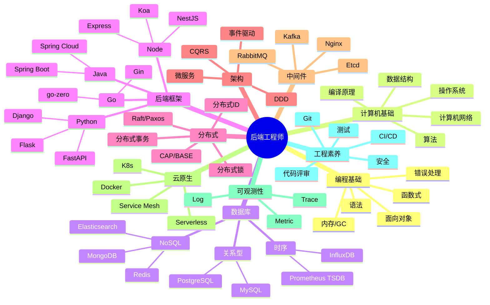
```mermaid
mindmap
  root((后端工程师))
    编程基础
      语法
      面向对象
      函数式
      错误处理
      内存/GC
    计算机基础
      数据结构
      算法
      操作系统
      计算机网络
      编译原理
    数据库
      关系型
        MySQL
        PostgreSQL
      NoSQL
        Redis
        MongoDB
        Elasticsearch
      时序
        InfluxDB
        Prometheus TSDB
    后端框架
      Node
        Express
        Koa
        NestJS
      Java
        Spring Boot
        Spring Cloud
      Go
        Gin
        go-zero
      Python
        Flask
        FastAPI
        Django
    分布式
      CAP/BASE
      Raft/Paxos
      分布式锁
      分布式事务
      分布式ID
    架构
      微服务
      DDD
      事件驱动
      CQRS
    中间件
      Kafka
      RabbitMQ
      Nginx
      Etcd
    云原生
      Docker
      K8s
      Service Mesh
      Serverless
    可观测性
      Log
      Metric
      Trace
    工程素养
      Git
      CI/CD
      测试
      代码评审
      安全
```

### 0.2 阶段划分 (12 个月计划)

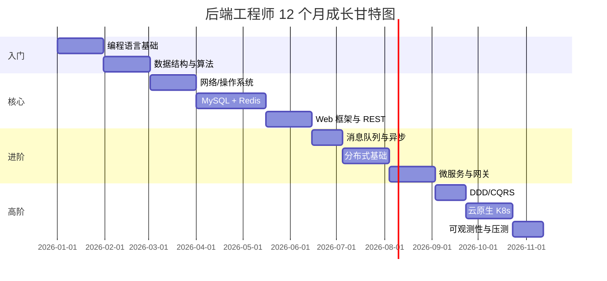
```mermaid
gantt
  title 后端工程师 12 个月成长甘特图
  dateFormat  YYYY-MM-DD
  section 入门
  编程语言基础         :a1, 2026-01-01, 30d
  数据结构与算法       :a2, after a1, 30d
  section 核心
  网络/操作系统        :b1, after a2, 30d
  MySQL + Redis        :b2, after b1, 45d
  Web 框架与 REST      :b3, after b2, 30d
  section 进阶
  消息队列与异步       :c1, after b3, 20d
  分布式基础           :c2, after c1, 30d
  微服务与网关         :c3, after c2, 30d
  section 高阶
  DDD/CQRS             :d1, after c3, 20d
  云原生 K8s           :d2, after d1, 30d
  可观测性与压测       :d3, after d2, 20d
```

### 0.3 能力等级

| 等级 | 称谓 | 关键能力 | 典型公司职级 |
|------|------|----------|---------------|
| L1 | 初级 | 能独立完成 CRUD 业务接口 | 阿里 P4, 腾讯 1.1, 字节 1-1 |
| L2 | 中级 | 能设计中等规模模块, 写出 SQL 与缓存策略 | P5, 1.2, 1-2 |
| L3 | 高级 | 能主导子系统设计, 排查线上故障 | P6, 2.1, 2-1 |
| L4 | 资深/专家 | 能架构 100w QPS 系统, 制定团队规范 | P7, 2.2, 2-2 |
| L5 | 架构师 | 能跨域业务建模、负责整条业务线 | P8+ |

### 0.4 学习方法论

📌 **重点**: 后端学习禁忌"只看不练"。

- **20% 看书** + **30% 写代码** + **30% 复盘** + **20% 教别人** = 真正掌握
- 每学一个知识点, 立即在本地搭一个最小复现 demo
- 用 README 记录学习笔记, 倒逼自己输出
- 多看官方文档, 少看二手中文博客

💡 **小贴士**: 给自己建一个 `learning-lab` Git 仓库, 每周一个分支练习。

---

## 第 1 章 编程语言选型

### 1.1 主流后端语言全景

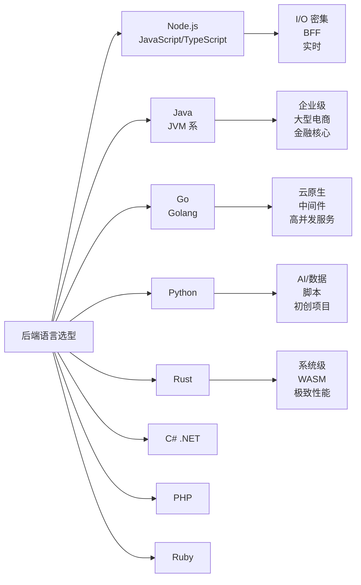
```mermaid
flowchart LR
  A[后端语言选型] --> B[Node.js<br/>JavaScript/TypeScript]
  A --> C[Java<br/>JVM 系]
  A --> D[Go<br/>Golang]
  A --> E[Python]
  A --> F[Rust]
  A --> G[C# .NET]
  A --> H[PHP]
  A --> I[Ruby]

  B --> B1[I/O 密集<br/>BFF<br/>实时]
  C --> C1[企业级<br/>大型电商<br/>金融核心]
  D --> D1[云原生<br/>中间件<br/>高并发服务]
  E --> E1[AI/数据<br/>脚本<br/>初创项目]
  F --> F1[系统级<br/>WASM<br/>极致性能]
```

### 1.2 横向对比矩阵

| 维度 | Node.js | Java | Go | Python | Rust |
|------|---------|------|----|--------|------|
| 类型系统 | 动态(TS 可静态) | 强静态 | 强静态 | 动态 | 强静态 |
| 并发模型 | 单线程事件循环 | 线程池 / 虚拟线程 | Goroutine + Channel | GIL 限制 / asyncio | async + 所有权 |
| 启动速度 | 快 (~50ms) | 慢 (~3s, GraalVM 可秒级) | 极快 (~10ms) | 快 (~100ms) | 极快 |
| 运行性能 | 中 | 高 | 高 | 低 | 极高 |
| 生态成熟度 | 高 (npm) | 极高 (Maven 中央) | 高 (持续增长) | 极高 (PyPI) | 中等 (持续增长) |
| 学习曲线 | 平 (前端友好) | 中 | 平 | 平 | 陡 |
| 适合场景 | BFF、实时通信、CLI | 企业系统、金融、电商核心 | 微服务、CLI、云组件 | 数据分析、AI、脚本 | 嵌入式、底层、安全敏感 |
| 知名项目 | Slack 后端、Netflix 边缘 | 阿里电商、Spotify | Docker、K8s、TiDB | YouTube、Instagram | Discord 部分服务 |
| 部署体积 | 中 (含 node_modules) | 大 (JVM) | 极小 (单二进制) | 中 | 极小 |
| 一句话总结 | 写得快, 适合 I/O 密集 | 工业级标杆 | 云原生首选 | 最快进入业务 | 性能与安全并重 |

### 1.3 Hello World 横向对照

**Node.js (Express)**:

```javascript
// app.js - Node.js 最简 HTTP 服务
const express = require('express');         // 引入 Express 框架
const app = express();                       // 创建应用实例
app.get('/hello', (req, res) => {            // 注册 GET 路由
  res.json({ message: 'Hello Node!' });      // 返回 JSON 响应
});
app.listen(3000, () => console.log('listening on :3000'));
```

**Java (Spring Boot)**:

```java
// HelloController.java
@RestController                              // 标记为 REST 控制器
public class HelloController {
    @GetMapping("/hello")                    // 映射 GET /hello
    public Map<String, String> hello() {
        return Map.of("message", "Hello Java!"); // 返回 JSON
    }
}
// HelloApp.java
@SpringBootApplication
public class HelloApp {
    public static void main(String[] args) {
        SpringApplication.run(HelloApp.class, args);
    }
}
```

**Go (Gin)**:

```go
// main.go
package main

import "github.com/gin-gonic/gin"            // 引入 Gin 框架

func main() {
    r := gin.Default()                       // 默认引擎(带 Logger 与 Recovery)
    r.GET("/hello", func(c *gin.Context) {   // 注册路由
        c.JSON(200, gin.H{"message": "Hello Go!"})
    })
    r.Run(":3000")                           // 监听 3000 端口
}
```

**Python (FastAPI)**:

```python
# main.py
from fastapi import FastAPI                  # 导入 FastAPI
app = FastAPI()                              # 创建应用

@app.get("/hello")                           # 注册路由
def hello():
    return {"message": "Hello Python!"}

# 启动: uvicorn main:app --port 3000
```

### 1.4 如何选语言?

🎯 **实战决策树**:

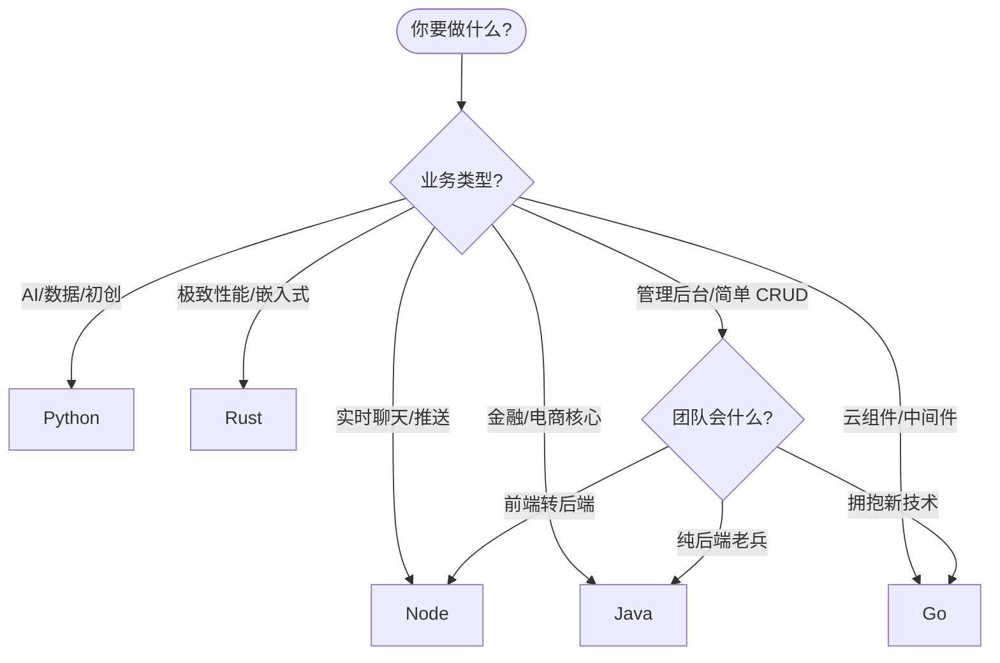
```mermaid
flowchart TD
  Start([你要做什么?]) --> Q1{业务类型?}
  Q1 -->|实时聊天/推送| Node
  Q1 -->|金融/电商核心| Java
  Q1 -->|云组件/中间件| Go
  Q1 -->|AI/数据/初创| Python
  Q1 -->|极致性能/嵌入式| Rust
  Q1 -->|管理后台/简单 CRUD| Q2{团队会什么?}
  Q2 -->|前端转后端| Node
  Q2 -->|纯后端老兵| Java
  Q2 -->|拥抱新技术| Go
```

⚠️ **踩坑**:

- 不要为了"赶时髦"选 Rust 写业务系统, 招聘成本高
- 初创公司不要直接上 Java 全家桶, 太重
- 团队 5 人以下慎用多语言混合栈

### 1.5 章节小结

- 主流后端 = Node / Java / Go / Python 四大金刚 + Rust 新势力
- 选型公式: **场景 + 团队 + 生态** 三角形
- 第一门语言建议深耕一门, 后面"语法切换"是肌肉记忆

---

## 第 2 章 数据结构与算法

### 2.1 必备数据结构

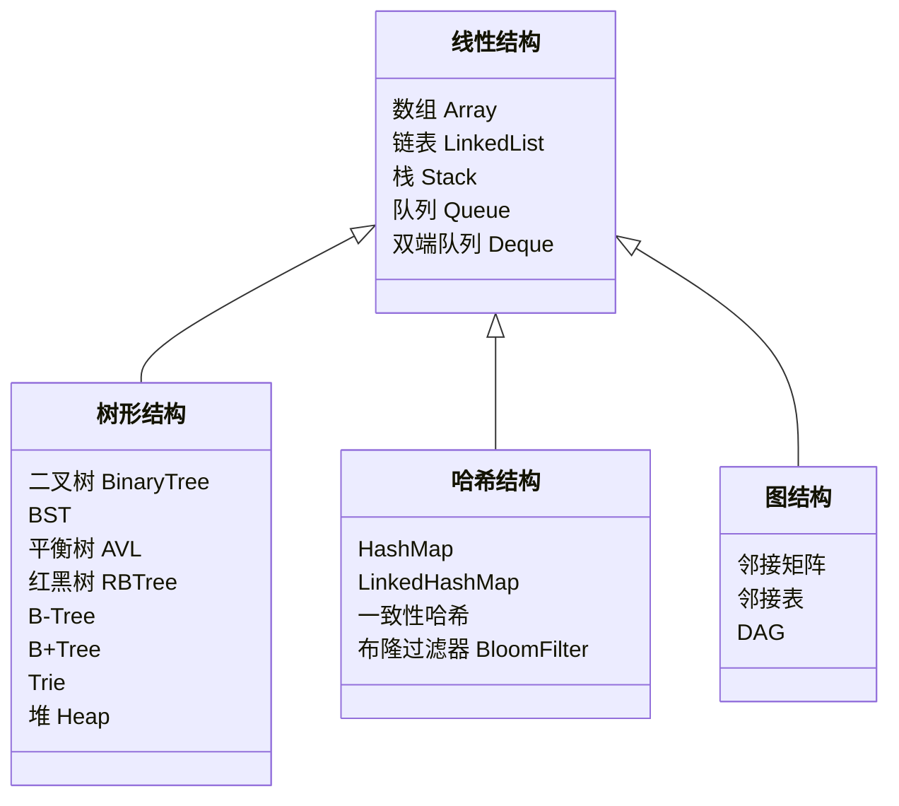
```mermaid
classDiagram
  class 线性结构 {
    数组 Array
    链表 LinkedList
    栈 Stack
    队列 Queue
    双端队列 Deque
  }
  class 树形结构 {
    二叉树 BinaryTree
    BST
    平衡树 AVL
    红黑树 RBTree
    B-Tree
    B+Tree
    Trie
    堆 Heap
  }
  class 哈希结构 {
    HashMap
    LinkedHashMap
    一致性哈希
    布隆过滤器 BloomFilter
  }
  class 图结构 {
    邻接矩阵
    邻接表
    DAG
  }
  线性结构 <|-- 树形结构
  线性结构 <|-- 哈希结构
  线性结构 <|-- 图结构
```

### 2.2 复杂度速查

| 操作 | 数组 | 链表 | HashMap | BST 平均 | BST 最坏 | 红黑树 | 堆 |
|------|------|------|---------|----------|----------|--------|----|
| 查找 | O(n) | O(n) | O(1) | O(log n) | O(n) | O(log n) | O(n) |
| 插入 | O(n) | O(1) | O(1) | O(log n) | O(n) | O(log n) | O(log n) |
| 删除 | O(n) | O(1) | O(1) | O(log n) | O(n) | O(log n) | O(log n) |
| 按下标 | O(1) | O(n) | - | - | - | - | - |

### 2.3 后端必懂的几种结构

**(1) 哈希表 - 万能加速器**

```javascript
// Node.js: 用 Map 缓存用户信息
const userCache = new Map();                 // 内置 Map
function getUser(id) {
  if (userCache.has(id)) return userCache.get(id);  // 命中缓存
  const u = db.queryUser(id);                       // 回源数据库
  userCache.set(id, u);                             // 写入缓存
  return u;
}
```

**(2) 跳表 - Redis 有序集合的底层**

```
Level 3:  1 ------------------> 9
Level 2:  1 ------> 4 --------> 9
Level 1:  1 -> 3 -> 4 -> 6 ---> 9
Level 0:  1 -> 3 -> 4 -> 6 -> 8 -> 9
```

跳表在期望 O(log n) 下完成有序操作, 实现比红黑树简单, 是 Redis ZSet 的核心。

**(3) B+ 树 - MySQL InnoDB 索引基石**

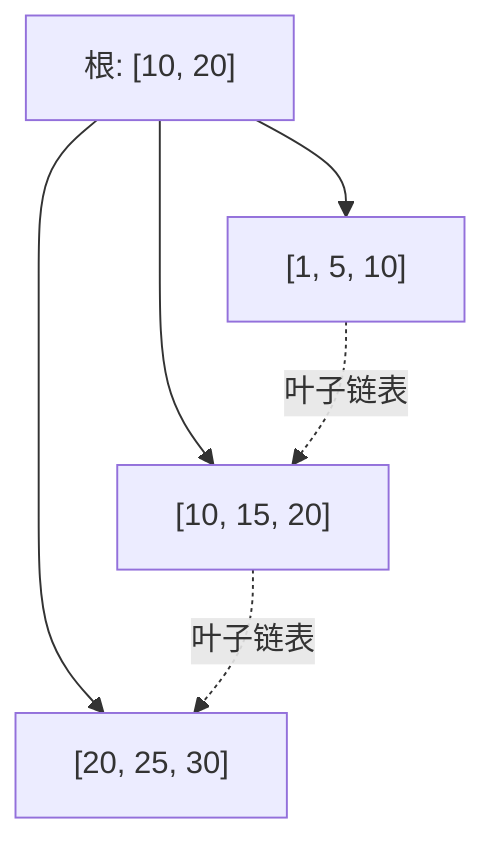
```mermaid
flowchart TD
  Root["根: [10, 20]"] --> L1["[1, 5, 10]"]
  Root --> L2["[10, 15, 20]"]
  Root --> L3["[20, 25, 30]"]
  L1 -.叶子链表.-> L2
  L2 -.叶子链表.-> L3
```

B+ 树特点:
- 非叶子节点只存索引, 叶子节点存数据
- 叶子节点形成有序链表, 范围查询超快
- 一般 3-4 层即可索引千万行数据

**(4) 布隆过滤器 - 防缓存穿透**

```python
# Python 布隆过滤器示例
from pybloom_live import BloomFilter

bf = BloomFilter(capacity=1000000, error_rate=0.001)
for uid in user_ids:
    bf.add(uid)                              # 加入

def maybe_exists(uid):
    return uid in bf                         # True = 可能存在, False = 一定不存在
```

### 2.4 算法面试 30 题分布

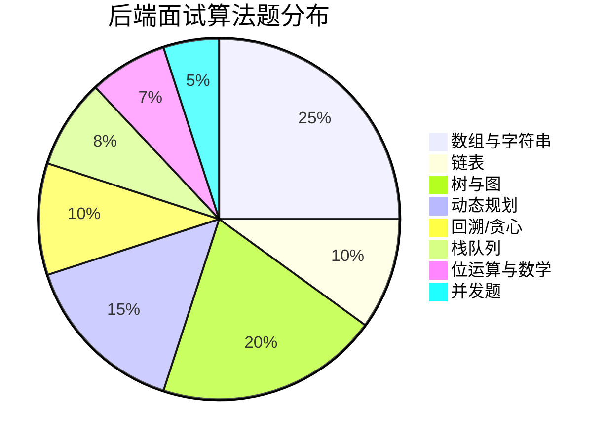
```mermaid
pie title 后端面试算法题分布
  "数组与字符串" : 25
  "链表" : 10
  "树与图" : 20
  "动态规划" : 15
  "回溯/贪心" : 10
  "栈队列" : 8
  "位运算与数学" : 7
  "并发题" : 5
```

### 2.5 经典题目演练

**Leetcode 1 · 两数之和 - 哈希一遍过**

```go
// Go 实现, 时间复杂度 O(n)
func twoSum(nums []int, target int) []int {
    m := make(map[int]int)                   // value -> index
    for i, n := range nums {
        if j, ok := m[target-n]; ok {        // 找到配对
            return []int{j, i}
        }
        m[n] = i
    }
    return nil
}
```

**Leetcode 146 · LRU 缓存 (高频)**

```java
// Java: 哈希 + 双向链表, 经典手撕题
class LRUCache {
    class Node { int k, v; Node prev, next; }
    private final int cap;
    private final Map<Integer, Node> map = new HashMap<>();
    private final Node head = new Node(), tail = new Node();

    public LRUCache(int capacity) {
        this.cap = capacity;
        head.next = tail; tail.prev = head;   // 哨兵节点
    }
    public int get(int key) {
        if (!map.containsKey(key)) return -1;
        Node n = map.get(key);
        moveToHead(n);
        return n.v;
    }
    public void put(int key, int value) {
        if (map.containsKey(key)) {
            Node n = map.get(key);
            n.v = value;
            moveToHead(n);
            return;
        }
        Node n = new Node();
        n.k = key; n.v = value;
        addToHead(n);
        map.put(key, n);
        if (map.size() > cap) {
            Node last = tail.prev;
            removeNode(last);
            map.remove(last.k);
        }
    }
    private void addToHead(Node n) {
        n.prev = head; n.next = head.next;
        head.next.prev = n; head.next = n;
    }
    private void removeNode(Node n) {
        n.prev.next = n.next; n.next.prev = n.prev;
    }
    private void moveToHead(Node n) { removeNode(n); addToHead(n); }
}
```

### 2.6 章节小结 + 面试高频

📌 **重点**:
- 必背: 数组、链表、HashMap、堆、栈、队列、二叉树遍历
- 进阶: B+ 树、跳表、Trie、并查集、布隆过滤器
- 高频面试: LRU、TopK、最长子串、字符串匹配 KMP

🎯 **每天 1 题 LeetCode 坚持 3 个月**, 笔试通过率提升 50%+。

---

## 第 3 章 计算机网络

### 3.1 OSI 七层 vs TCP/IP 四层

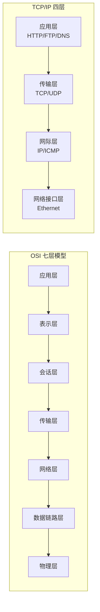
```mermaid
flowchart LR
  subgraph OSI[OSI 七层模型]
    direction TB
    A1[应用层] --> A2[表示层] --> A3[会话层]
    A3 --> A4[传输层] --> A5[网络层] --> A6[数据链路层] --> A7[物理层]
  end
  subgraph TCP[TCP/IP 四层]
    direction TB
    B1[应用层<br/>HTTP/FTP/DNS] --> B2[传输层<br/>TCP/UDP]
    B2 --> B3[网际层<br/>IP/ICMP]
    B3 --> B4[网络接口层<br/>Ethernet]
  end
```

| OSI 层 | 协议示例 | 设备 | 数据单位 |
|--------|----------|------|----------|
| 应用层 | HTTP, FTP, SMTP, DNS | - | Message |
| 传输层 | TCP, UDP, QUIC | 网关 | Segment |
| 网络层 | IP, ICMP, ARP | 路由器 | Packet |
| 数据链路层 | Ethernet, PPP | 交换机 | Frame |
| 物理层 | 光纤, 双绞线 | 集线器 | Bit |

### 3.2 TCP 三次握手与四次挥手

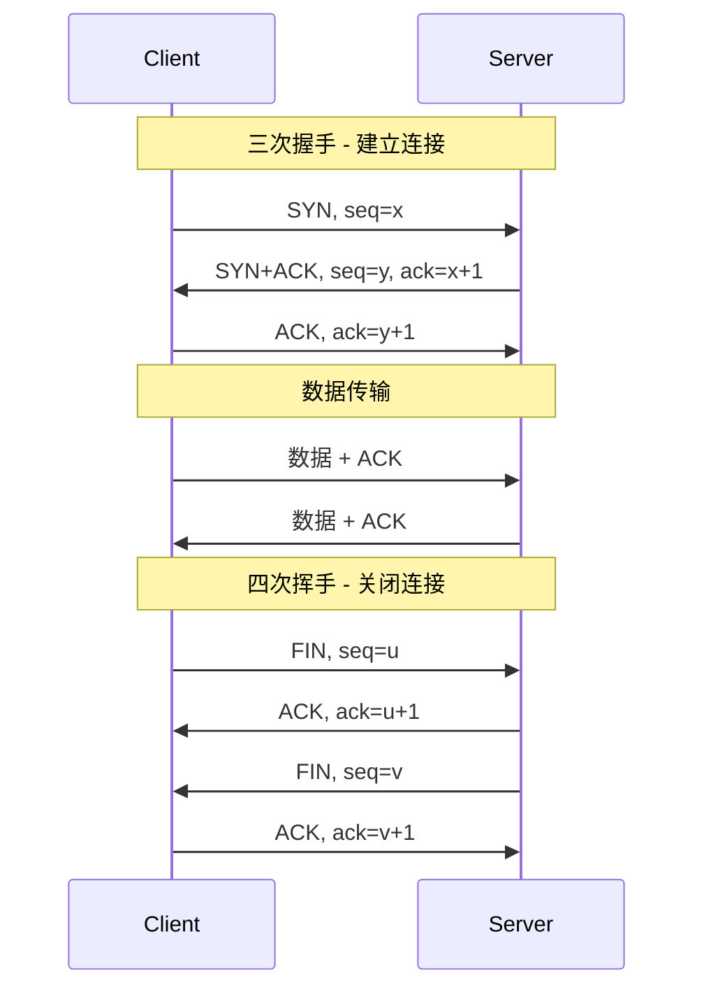
```mermaid
sequenceDiagram
  participant C as Client
  participant S as Server
  Note over C,S: 三次握手 - 建立连接
  C->>S: SYN, seq=x
  S->>C: SYN+ACK, seq=y, ack=x+1
  C->>S: ACK, ack=y+1
  Note over C,S: 数据传输
  C->>S: 数据 + ACK
  S->>C: 数据 + ACK
  Note over C,S: 四次挥手 - 关闭连接
  C->>S: FIN, seq=u
  S->>C: ACK, ack=u+1
  S->>C: FIN, seq=v
  C->>S: ACK, ack=v+1
```

⚠️ **踩坑**:
- 为什么三次握手? 防止历史连接重复初始化, 同步序号
- 为什么四次挥手? 服务端可能还有数据要发, 需分两次关闭
- **TIME_WAIT** 状态持续 2MSL, 高并发场景需调内核参数

### 3.3 HTTP 协议演进

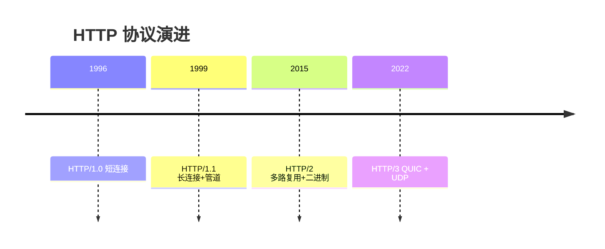
```mermaid
timeline
  title HTTP 协议演进
  1996 : HTTP/1.0 短连接
  1999 : HTTP/1.1 长连接+管道
  2015 : HTTP/2 多路复用+二进制
  2022 : HTTP/3 QUIC + UDP
```

| 维度 | HTTP/1.1 | HTTP/2 | HTTP/3 |
|------|----------|--------|--------|
| 底层 | TCP | TCP | QUIC over UDP |
| 多路复用 | 否(队头阻塞) | 是 | 是 |
| 头部压缩 | 无 | HPACK | QPACK |
| 加密 | 可选(TLS) | 实际强制 | 强制(内置 TLS 1.3) |
| 0-RTT | 否 | 否 | 是 |
| 队头阻塞 | 严重 | 应用层解决, TCP 层仍有 | 彻底解决 |

### 3.4 HTTP 报文结构

```
请求行   GET /api/users?id=1 HTTP/1.1
请求头   Host: api.example.com
         User-Agent: curl/7.85
         Accept: application/json
         Authorization: Bearer xxx
空行
请求体   {"name": "alice"}
```

### 3.5 HTTPS 握手

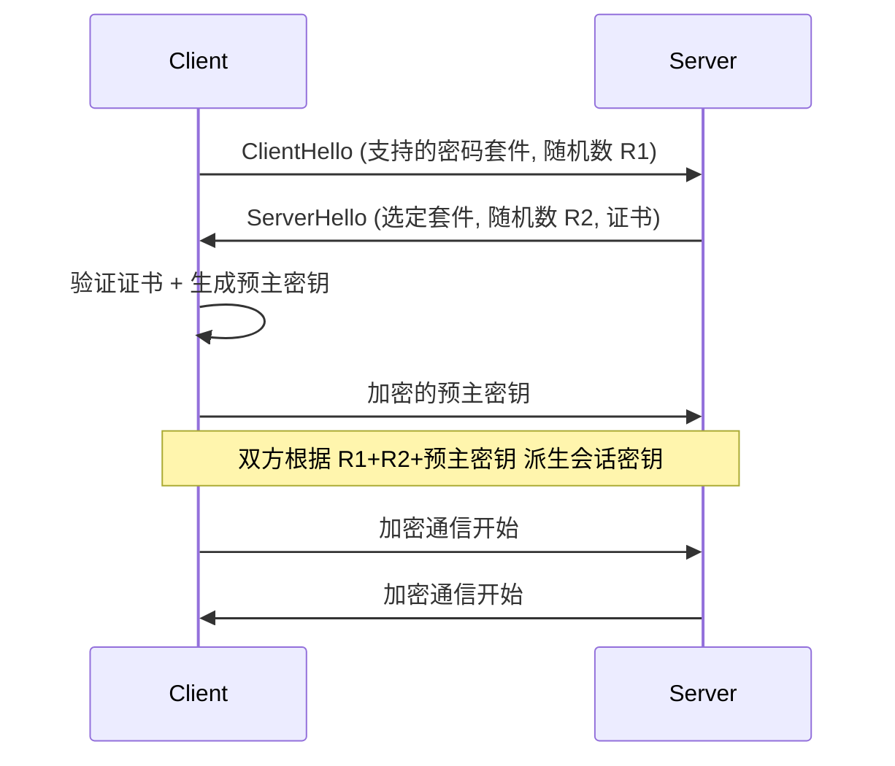
```mermaid
sequenceDiagram
  participant C as Client
  participant S as Server
  C->>S: ClientHello (支持的密码套件, 随机数 R1)
  S->>C: ServerHello (选定套件, 随机数 R2, 证书)
  C->>C: 验证证书 + 生成预主密钥
  C->>S: 加密的预主密钥
  Note over C,S: 双方根据 R1+R2+预主密钥 派生会话密钥
  C->>S: 加密通信开始
  S->>C: 加密通信开始
```

💡 **小贴士**: TLS 1.3 把握手简化到 1-RTT, 还支持 0-RTT 会话恢复。

### 3.6 WebSocket

```javascript
// Node.js: WebSocket 服务端
const WebSocket = require('ws');
const wss = new WebSocket.Server({ port: 8080 });

wss.on('connection', (ws) => {
  console.log('client connected');
  ws.on('message', (data) => {
    ws.send(`echo: ${data}`);                // 回声
  });
  ws.send('welcome');
});
```

```javascript
// 浏览器客户端
const ws = new WebSocket('ws://localhost:8080');
ws.onmessage = (e) => console.log('got:', e.data);
ws.onopen = () => ws.send('hello');
```

WebSocket 适用: 聊天室、协同编辑、实时报价、游戏。

### 3.7 gRPC

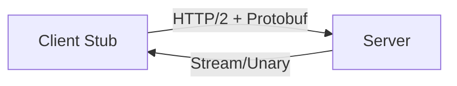
```mermaid
flowchart LR
  Client[Client Stub] -- HTTP/2 + Protobuf --> Server[Server]
  Server -- Stream/Unary --> Client
```

四种调用方式: **Unary**, **Server Streaming**, **Client Streaming**, **Bidirectional Streaming**。

```protobuf
// user.proto
syntax = "proto3";
service UserService {
  rpc GetUser (UserReq) returns (UserResp);            // 单向
  rpc StreamUsers (UserReq) returns (stream UserResp); // 服务端流
}
message UserReq { int64 id = 1; }
message UserResp { string name = 1; int32 age = 2; }
```

### 3.8 网络故障排查工具

| 工具 | 作用 |
|------|------|
| ping | 测试连通性, ICMP |
| traceroute / mtr | 链路追踪 |
| dig / nslookup | DNS 解析 |
| tcpdump / wireshark | 抓包分析 |
| netstat / ss | 查看连接状态 |
| curl -v | 调试 HTTP |
| telnet / nc | 测试端口 |

### 3.9 章节小结

- TCP 握手挥手、HTTP/2 多路复用、TLS 握手是必背三件套
- 实战必会: tcpdump 抓包, wireshark 看 TCP 重传
- 面试高频: TIME_WAIT, CLOSE_WAIT, 拥塞控制 (慢启动/拥塞避免/快重传/快恢复)

---

## 第 4 章 操作系统基础

### 4.1 进程 vs 线程 vs 协程

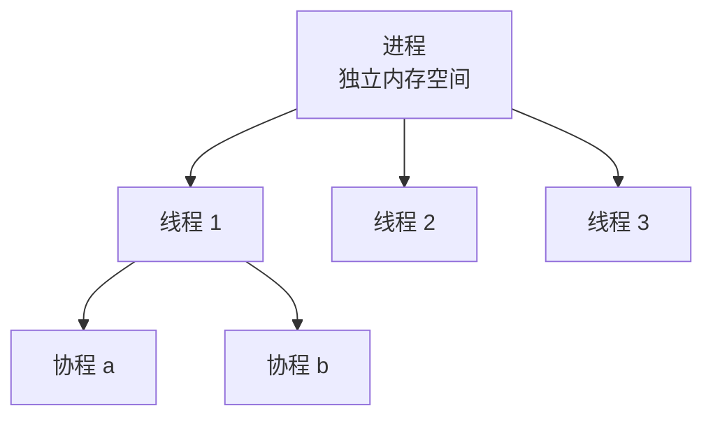
```mermaid
flowchart TD
  P[进程<br/>独立内存空间] --> T1[线程 1]
  P --> T2[线程 2]
  P --> T3[线程 3]
  T1 --> G1[协程 a]
  T1 --> G2[协程 b]
```

| 维度 | 进程 | 线程 | 协程 |
|------|------|------|------|
| 切换成本 | 大 (页表/上下文) | 中 (寄存器/栈) | 极小 (用户态) |
| 资源隔离 | 强 | 弱(共享进程内存) | 弱(共享线程栈或独立小栈) |
| 调度 | 内核 | 内核 | 用户态调度器 |
| 数量级 | 几千 | 几万 | 几十万 - 百万 |
| 通信 | IPC (管道/socket/共享内存) | 共享变量+锁 | channel / future |

### 4.2 I/O 模型对比 (网络编程基石)

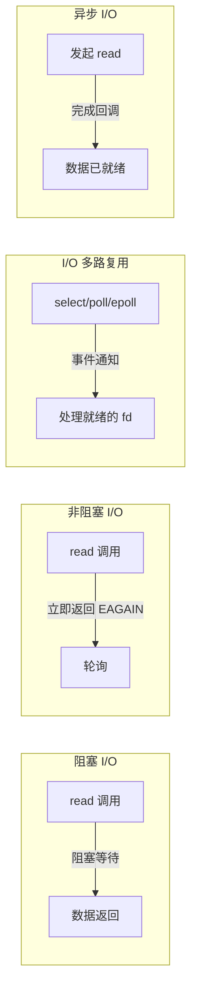
```mermaid
flowchart LR
  subgraph BIO[阻塞 I/O]
    A1[read 调用] -->|阻塞等待| A2[数据返回]
  end
  subgraph NIO[非阻塞 I/O]
    B1[read 调用] -->|立即返回 EAGAIN| B2[轮询]
  end
  subgraph IO_MUX[I/O 多路复用]
    C1[select/poll/epoll] -->|事件通知| C2[处理就绪的 fd]
  end
  subgraph AIO[异步 I/O]
    D1[发起 read] -->|完成回调| D2[数据已就绪]
  end
```

| 模型 | 同步/异步 | 阻塞/非阻塞 | 代表 |
|------|----------|-------------|------|
| BIO | 同步 | 阻塞 | Java Socket |
| NIO | 同步 | 非阻塞 | Java NIO, epoll level-triggered |
| IO 多路复用 | 同步 | 非阻塞 | epoll, kqueue |
| AIO | 异步 | 非阻塞 | io_uring, Windows IOCP |

### 4.3 select / poll / epoll 对比

| 维度 | select | poll | epoll |
|------|--------|------|-------|
| fd 数量上限 | 1024 (FD_SETSIZE) | 无上限 | 无上限 |
| 时间复杂度 | O(n) 轮询 | O(n) 轮询 | O(1) 就绪通知 |
| 内核态拷贝 | 每次都拷贝 fd 集 | 同左 | 仅注册一次 |
| 触发模式 | LT | LT | LT + ET |
| 适用场景 | 跨平台兼容 | 兼容 | 高并发 (Linux) |

```c
// epoll 三件套伪代码
int epfd = epoll_create1(0);
epoll_ctl(epfd, EPOLL_CTL_ADD, fd, &ev);     // 注册感兴趣的 fd
int n = epoll_wait(epfd, events, MAX, -1);   // 等待事件
for (int i = 0; i < n; i++) handle(events[i]);
```

📌 **重点**: Nginx、Redis、Netty 高性能的核心都是 epoll + 事件驱动。

### 4.4 内存管理

```
+------------------+ 高地址
|     内核空间      |
+------------------+
|       栈         | <- 函数局部变量, 向下增长
|        ↓         |
|                  |
|        ↑         |
|       堆         | <- malloc/new, 向上增长
+------------------+
|    BSS 段        | <- 未初始化全局
|    Data 段       | <- 已初始化全局
|    Text 代码段   |
+------------------+ 低地址
```

🎯 **后端关注的内存问题**:
- 内存泄漏: Node 闭包持有大对象、Java 静态 Map 越长越大
- 内存溢出: JVM OOM 时看 dump
- 内存碎片: Redis 长期运行碎片率 (mem_fragmentation_ratio)

### 4.5 进程间通信 IPC

| 方式 | 速度 | 跨主机 | 典型用途 |
|------|------|--------|----------|
| 管道 Pipe | 快 | 否 | Shell 命令 |
| 命名管道 FIFO | 快 | 否 | 同机进程通信 |
| 消息队列 | 中 | 否 | POSIX MQ |
| 共享内存 + 信号量 | 极快 | 否 | 高性能 IPC |
| Unix Socket | 中 | 否 | Docker / Nginx FCGI |
| TCP/UDP Socket | 中 | 是 | 分布式 |

### 4.6 章节小结

- 后端性能 = I/O 模型 + 多路复用 + 线程/协程调度
- 必懂: epoll 工作原理, Linux 虚拟内存机制
- 实战: 用 `top`, `vmstat`, `iostat`, `pidstat` 看系统负载

---

## 第 5 章 关系型数据库

### 5.1 MySQL 体系结构

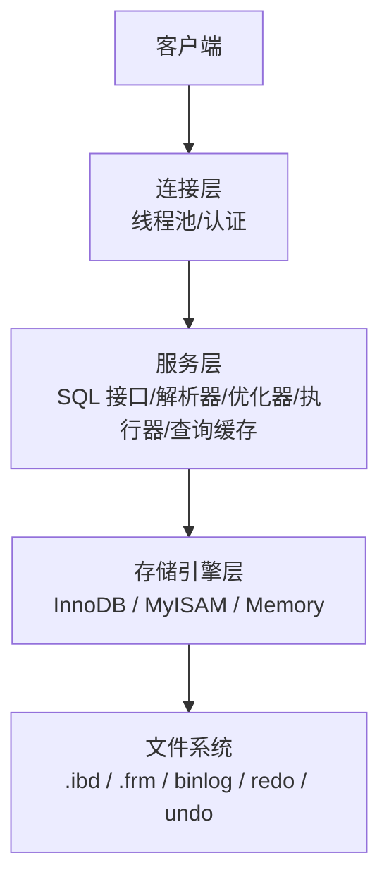
```mermaid
flowchart TD
  Client[客户端] --> Conn[连接层<br/>线程池/认证]
  Conn --> Service[服务层<br/>SQL 接口/解析器/优化器/执行器/查询缓存]
  Service --> Engine[存储引擎层<br/>InnoDB / MyISAM / Memory]
  Engine --> File[文件系统<br/>.ibd / .frm / binlog / redo / undo]
```

### 5.2 事务 ACID

| 特性 | 含义 | 实现机制 |
|------|------|----------|
| 原子性 Atomicity | 全部成功或全部失败 | undo log 回滚 |
| 一致性 Consistency | 数据从一个合法态到另一合法态 | 业务+约束 |
| 隔离性 Isolation | 并发事务互不干扰 | 锁 + MVCC |
| 持久性 Durability | 一旦提交永久保存 | redo log + 刷盘 |

### 5.3 隔离级别

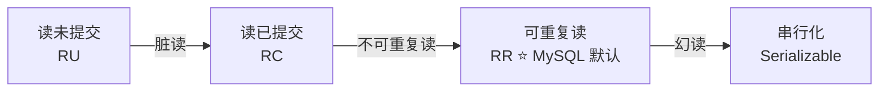
```mermaid
flowchart LR
  RU[读未提交<br/>RU] -->|脏读| RC[读已提交<br/>RC]
  RC -->|不可重复读| RR[可重复读<br/>RR ⭐ MySQL 默认]
  RR -->|幻读| SE[串行化<br/>Serializable]
```

| 隔离级别 | 脏读 | 不可重复读 | 幻读 |
|----------|------|-------------|------|
| 读未提交 | ✓ | ✓ | ✓ |
| 读已提交 | ✗ | ✓ | ✓ |
| 可重复读 | ✗ | ✗ | ✓(MySQL 通过 Next-Key Lock 解决) |
| 串行化 | ✗ | ✗ | ✗ |

### 5.4 索引原理 (B+ 树)

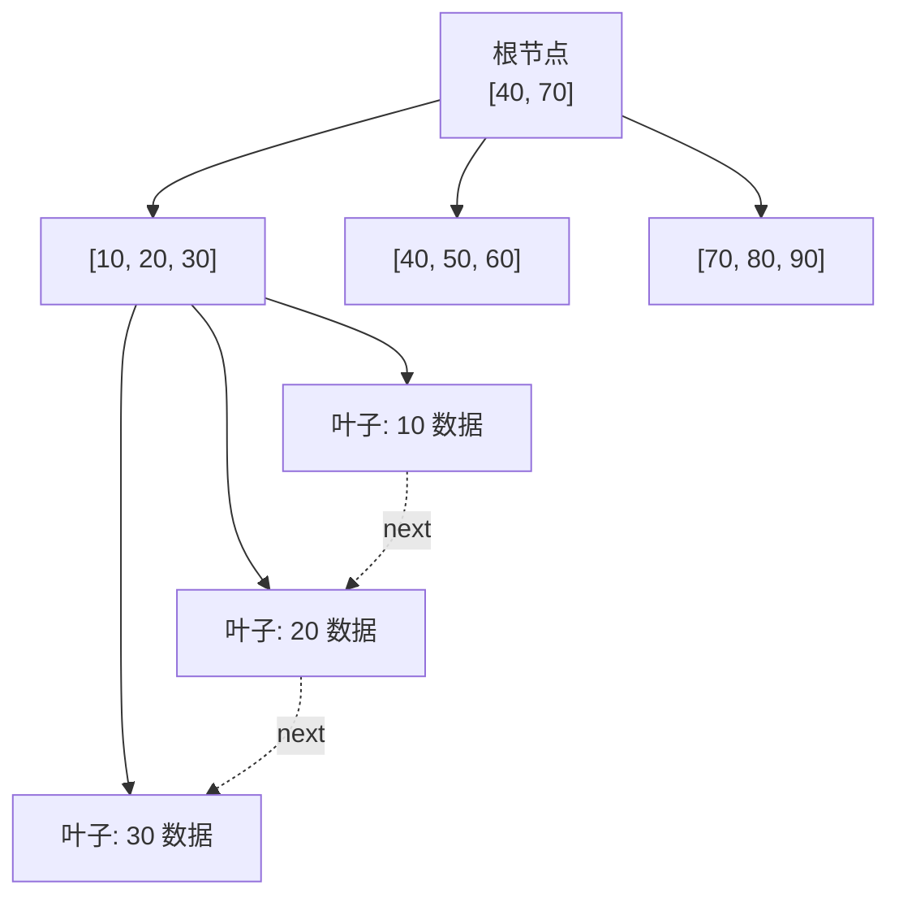
```mermaid
flowchart TD
  R["根节点<br/>[40, 70]"]
  R --> N1["[10, 20, 30]"]
  R --> N2["[40, 50, 60]"]
  R --> N3["[70, 80, 90]"]
  N1 --> L1["叶子: 10 数据"]
  N1 --> L2["叶子: 20 数据"]
  N1 --> L3["叶子: 30 数据"]
  L1 -.next.-> L2 -.next.-> L3
```

- **聚簇索引 (Clustered Index)**: 叶子节点存完整行数据, 一张表只能有一个 (主键)
- **二级索引 (Secondary Index)**: 叶子节点存主键, 回表两次

⚠️ **踩坑**:
- 频繁更新的字段不要建索引
- 联合索引遵循"最左前缀"原则
- `LIKE '%abc'` 索引失效, `LIKE 'abc%'` 可用
- `OR` 条件如果有一边没索引, 全索引失效
- 类型隐式转换会让索引失效 (`WHERE phone = 13800000000` 而字段是 VARCHAR)

### 5.5 SQL 优化套路

📌 **EXPLAIN 关键字段**:

| 字段 | 含义 | 期望值 |
|------|------|--------|
| type | 访问类型 | const > eq_ref > ref > range > index > ALL |
| key | 实际使用的索引 | 非 NULL |
| rows | 扫描行数 | 越小越好 |
| Extra | 额外信息 | 避免 Using filesort / Using temporary |

```sql
-- 反例: 全表扫描
SELECT * FROM orders WHERE YEAR(create_time) = 2025;
-- 正例: 范围查询使索引可用
SELECT * FROM orders WHERE create_time >= '2025-01-01' AND create_time < '2026-01-01';

-- 反例: SELECT *
SELECT * FROM users WHERE id = 1;
-- 正例: 按需取列, 利用覆盖索引
SELECT id, name FROM users WHERE id = 1;
```

### 5.6 主从复制

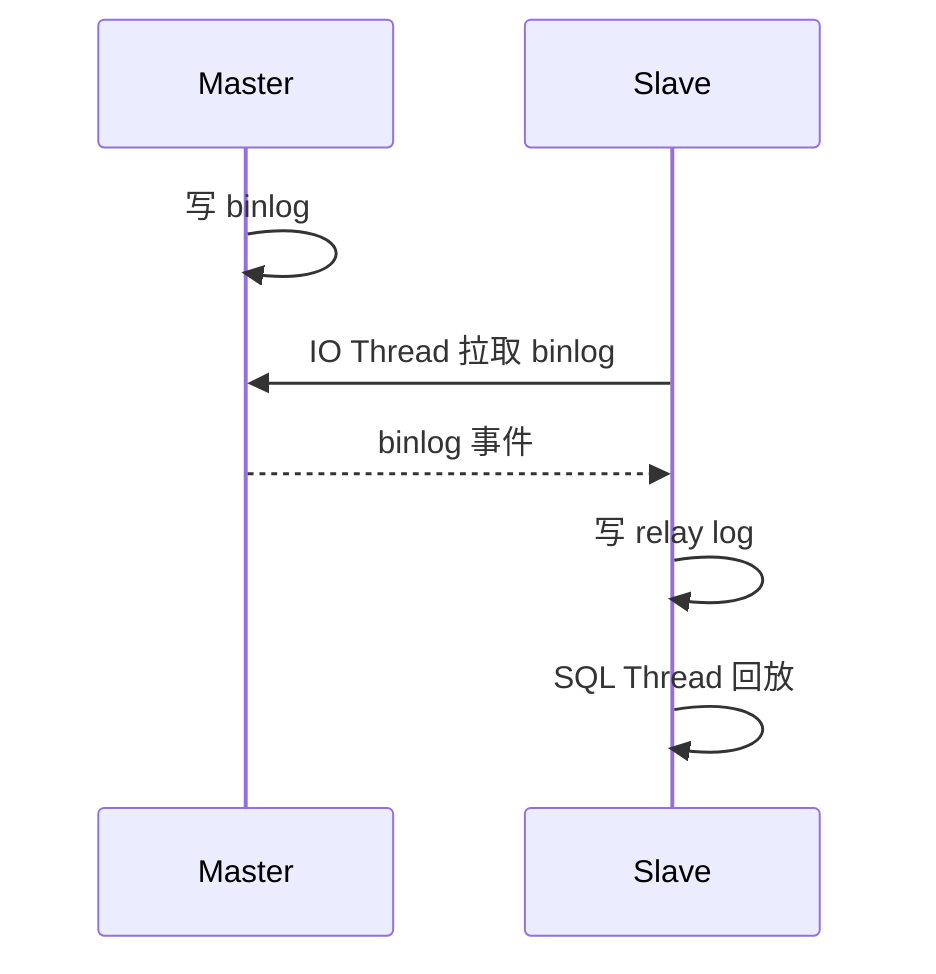
```mermaid
sequenceDiagram
  participant M as Master
  participant S as Slave
  M->>M: 写 binlog
  S->>M: IO Thread 拉取 binlog
  M-->>S: binlog 事件
  S->>S: 写 relay log
  S->>S: SQL Thread 回放
```

复制模式:
- **异步复制**: 默认, 主库不等从库
- **半同步复制**: 至少一个从库写完 relay log
- **组复制 MGR**: Paxos 协议, 多写

### 5.7 分库分表

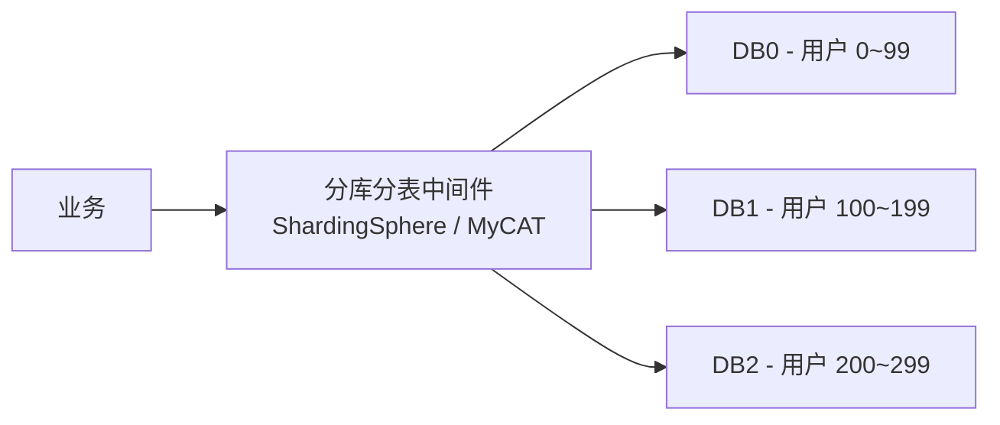
```mermaid
flowchart LR
  Biz[业务] --> Mid[分库分表中间件<br/>ShardingSphere / MyCAT]
  Mid --> DB1[DB0 - 用户 0~99]
  Mid --> DB2[DB1 - 用户 100~199]
  Mid --> DB3[DB2 - 用户 200~299]
```

| 策略 | 优点 | 缺点 |
|------|------|------|
| 范围分片 | 易扩容 | 数据热点 |
| 哈希分片 | 均匀 | 扩容数据迁移 |
| 一致性哈希 | 扩容影响小 | 实现复杂 |
| 按业务垂直 | 解耦清晰 | 跨库 JOIN 难 |

⚠️ **分表后的痛点**:
- 跨库事务 (需要 XA 或最终一致性)
- 跨库分页 (深分页大忌)
- 全局唯一 ID (雪花、号段)

### 5.8 PostgreSQL 与 MySQL 对比

| 维度 | MySQL | PostgreSQL |
|------|-------|------------|
| 开源协议 | GPL | BSD-like (更友好) |
| ACID | InnoDB 支持 | 全引擎 |
| JSON 支持 | 5.7+ | 9.4+ JSONB 强大 |
| 复杂查询 | 一般 | 优秀 (窗口函数、CTE) |
| 扩展性 | 一般 | 极强 (PostGIS, TimescaleDB) |
| 适用 | OLTP | OLTP + 复杂分析 |

### 5.9 章节小结

📌 **后端 SQL 5 大基本功**:
1. EXPLAIN 看执行计划
2. 联合索引最左前缀
3. 事务隔离级别 + MVCC 原理
4. binlog / redo / undo 用途
5. 主从延迟排查

🎯 面试高频: 索引失效场景、事务隔离级别、Buffer Pool 工作原理、MVCC 实现。

---

## 第 6 章 NoSQL 数据库

### 6.1 NoSQL 全景

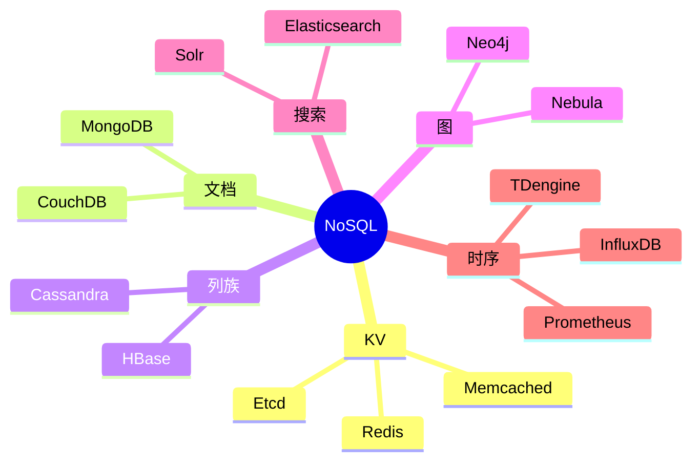
```mermaid
mindmap
  root((NoSQL))
    KV
      Redis
      Memcached
      Etcd
    文档
      MongoDB
      CouchDB
    列族
      HBase
      Cassandra
    图
      Neo4j
      Nebula
    搜索
      Elasticsearch
      Solr
    时序
      InfluxDB
      TDengine
      Prometheus
```

### 6.2 Redis 核心数据结构

| 类型 | 底层 | 典型用途 |
|------|------|----------|
| String | SDS | 计数器, 缓存对象 |
| List | quicklist | 消息队列, 时间线 |
| Hash | ziplist / hashtable | 对象存储 |
| Set | intset / hashtable | 标签, 去重 |
| ZSet | ziplist / skiplist | 排行榜 |
| Bitmap | String | 签到, 在线状态 |
| HyperLogLog | - | UV 估算 (12KB 误差 0.81%) |
| Stream | - | 消息队列 (Redis 5.0+) |
| Geo | ZSet | LBS 附近的人 |

### 6.3 缓存三大问题

```mermaid
flowchart TD
  Q1[缓存穿透] --> S1[布隆过滤器 + 缓存空值]
  Q2[缓存击穿] --> S2[互斥锁 + 永不过期]
  Q3[缓存雪崩] --> S3[过期时间随机化 + 多级缓存 + 熔断]
```

```java
// Java 缓存击穿解决: 互斥锁
public Product getProduct(Long id) {
    String key = "product:" + id;
    Product p = redis.get(key);
    if (p != null) return p;

    String lockKey = "lock:" + key;
    if (redis.setnx(lockKey, "1", 10, TimeUnit.SECONDS)) {
        try {
            p = db.findById(id);
            redis.set(key, p, 60, TimeUnit.SECONDS);
            return p;
        } finally {
            redis.del(lockKey);
        }
    } else {
        Thread.sleep(50);
        return getProduct(id);                // 重试
    }
}
```

### 6.4 Redis 持久化

| 模式 | 原理 | 优点 | 缺点 |
|------|------|------|------|
| RDB | 定时快照 | 文件小, 恢复快 | 可能丢失最近数据 |
| AOF | 追加每条命令 | 数据更安全 | 文件大, 恢复慢 |
| 混合 (Redis 4.0+) | RDB 全量 + AOF 增量 | 兼顾 | 推荐 |

### 6.5 Redis 高可用

```mermaid
flowchart LR
  subgraph 主从
    M[Master] --> S1[Slave 1]
    M --> S2[Slave 2]
  end
  subgraph 哨兵
    SEN[Sentinel 集群] --监控--> M
    SEN -.故障转移.-> S1
  end
  subgraph Cluster
    C1[Slot 0-5460] --- C2[Slot 5461-10922] --- C3[Slot 10923-16383]
  end
```

Redis Cluster: 16384 个槽位, 客户端按 `CRC16(key) % 16384` 路由。

### 6.6 MongoDB

```javascript
// MongoDB 文档示例
db.users.insertOne({
  _id: ObjectId(),
  name: "alice",
  age: 28,
  address: { city: "Shanghai", zip: "200000" },
  tags: ["vip", "active"]
});

// 查询
db.users.find({ age: { $gte: 18 }, tags: "vip" });

// 聚合
db.orders.aggregate([
  { $match: { status: "paid" } },
  { $group: { _id: "$userId", total: { $sum: "$amount" } } },
  { $sort: { total: -1 } },
  { $limit: 10 }
]);
```

MongoDB 适合: 灵活 schema, 嵌套结构, 中等规模 (TB 级别)。

### 6.7 Elasticsearch

```mermaid
flowchart LR
  Doc[原文档] --> Tokenizer[分词器]
  Tokenizer --> Tokens[Token 流]
  Tokens --> Inverted[倒排索引]
  Inverted --> Search[全文检索]
```

```bash
# 创建索引
PUT /articles
{
  "mappings": {
    "properties": {
      "title": { "type": "text", "analyzer": "ik_max_word" },
      "content": { "type": "text" },
      "publish_date": { "type": "date" }
    }
  }
}

# 检索
GET /articles/_search
{
  "query": {
    "multi_match": {
      "query": "分布式系统",
      "fields": ["title^3", "content"]
    }
  }
}
```

### 6.8 时序数据库

- **指标场景**: Prometheus + VictoriaMetrics
- **业务时序**: InfluxDB, TDengine, TimescaleDB
- 特点: 写多读少, 按时间分片, 高压缩比

### 6.9 章节小结

- Redis 是后端必备工具, 缓存 + 分布式锁 + 限流 + 消息队列都能干
- MongoDB 灵活但慎用于强事务场景
- ES 是搜索/日志分析的标配
- 选型: KV 用 Redis, 文档用 Mongo, 搜索用 ES, 指标用 Prometheus

---

## 第 7 章 Node.js 后端体系

### 7.1 事件循环

```mermaid
flowchart TD
  T[Timers<br/>setTimeout/setInterval] --> P[Pending Callbacks]
  P --> I[Idle/Prepare]
  I --> Poll[Poll<br/>I/O 回调]
  Poll --> C[Check<br/>setImmediate]
  C --> Close[Close Callbacks]
  Close --> T
  Note1[Microtasks: Promise.then / process.nextTick<br/>每阶段结束都会清空] -.-> T
```

```javascript
// 经典面试题
console.log('1');
setTimeout(() => console.log('2'), 0);
Promise.resolve().then(() => console.log('3'));
process.nextTick(() => console.log('4'));
console.log('5');
// 输出: 1 5 4 3 2
```

### 7.2 主流框架对比

| 框架 | 风格 | 学习成本 | 适用 |
|------|------|----------|------|
| Express | 中间件函数, 自由 | 低 | 小项目, 原型 |
| Koa | async/await 中间件, 洋葱模型 | 中 | 现代化 API |
| Fastify | 高性能, Schema | 中 | 高 QPS 服务 |
| NestJS | 装饰器 + DI, Angular 风 | 高 | 企业级大项目 |
| Hono | 边缘运行时友好 | 低 | Cloudflare Workers / Bun |

### 7.3 NestJS 工程结构

```
src/
  app.module.ts          # 根模块
  app.controller.ts      # 控制器
  app.service.ts         # 服务
  user/
    user.module.ts
    user.controller.ts
    user.service.ts
    dto/
      create-user.dto.ts
    entities/
      user.entity.ts
```

```typescript
// user.controller.ts - NestJS 控制器
import { Controller, Get, Post, Body, Param } from '@nestjs/common';
import { UserService } from './user.service';
import { CreateUserDto } from './dto/create-user.dto';

@Controller('users')                                  // 路由前缀
export class UserController {
  constructor(private readonly userService: UserService) {} // DI

  @Get(':id')
  async findOne(@Param('id') id: string) {
    return this.userService.findOne(+id);
  }

  @Post()
  async create(@Body() dto: CreateUserDto) {
    return this.userService.create(dto);
  }
}
```

### 7.4 Stream 流式处理

```javascript
// 大文件复制, 内存占用恒定
const fs = require('fs');
fs.createReadStream('big.iso')
  .pipe(fs.createWriteStream('copy.iso'))   // 背压由 pipe 自动处理
  .on('finish', () => console.log('done'));
```

⚠️ **踩坑**: 用 `fs.readFile` 读 2GB 文件会 OOM, 必须用 Stream。

### 7.5 Cluster 多核利用

```javascript
const cluster = require('cluster');
const os = require('os');
const http = require('http');

if (cluster.isPrimary) {
  for (let i = 0; i < os.cpus().length; i++) {
    cluster.fork();                          // fork 子进程
  }
  cluster.on('exit', (worker) => {
    console.log(`worker ${worker.process.pid} died, respawning`);
    cluster.fork();
  });
} else {
  http.createServer((req, res) => {
    res.end('hello from ' + process.pid);
  }).listen(3000);
}
```

更推荐: 用 PM2 进程管理。

### 7.6 章节小结

- Node 强在 I/O 密集场景, 不擅长 CPU 密集 (用 worker_threads 或异构语言)
- NestJS 是大型项目首选
- 必懂: 事件循环 6 个阶段, Promise/微任务时序

---

## 第 8 章 Java 后端体系

### 8.1 JVM 架构

```mermaid
flowchart TB
  subgraph 类加载子系统
    CL[Class Loader<br/>Bootstrap/Ext/App/自定义]
  end
  subgraph 运行时数据区
    Heap[堆 Heap<br/>新生代 Eden+S0+S1<br/>老年代 Old]
    Meta[元空间 Metaspace]
    Stack[虚拟机栈<br/>线程私有]
    PC[程序计数器]
    Native[本地方法栈]
  end
  subgraph 执行引擎
    Inter[解释器]
    JIT[JIT 编译器<br/>C1/C2/Graal]
    GC[GC 子系统<br/>G1/ZGC/Shenandoah]
  end
  CL --> Meta
  CL --> Heap
  Inter --> Heap
  JIT --> Heap
  GC --> Heap
```

### 8.2 GC 算法

| GC | 适用堆 | 停顿目标 | 特点 |
|----|--------|----------|------|
| Serial | <100MB | 普通 | 单线程, 客户端 |
| Parallel | <数 GB | 吞吐优先 | 多线程 |
| CMS (已废弃) | <几 GB | <100ms | 并发标记清除 |
| G1 | 数 GB ~ 几十 GB | <200ms | 分区收集, 默认 (JDK9+) |
| ZGC | 数 GB ~ TB | <10ms | 染色指针, 几乎无停顿 |
| Shenandoah | 数 GB ~ TB | <10ms | RedHat 主导 |

### 8.3 Spring 全家桶

```mermaid
flowchart LR
  Core[Spring Core<br/>IoC/AOP] --> Boot[Spring Boot<br/>自动装配]
  Boot --> Web[Spring MVC / WebFlux]
  Boot --> Data[Spring Data<br/>JPA/JDBC/Redis]
  Boot --> Security[Spring Security]
  Boot --> Cloud[Spring Cloud<br/>微服务套件]
  Cloud --> Gateway[Spring Cloud Gateway]
  Cloud --> Nacos[Nacos/Eureka]
  Cloud --> OpenFeign
  Cloud --> Sentinel
```

### 8.4 Spring Boot 工程示例

```java
// pom.xml 依赖 (略)
// UserController.java
@RestController
@RequestMapping("/api/users")
@RequiredArgsConstructor                              // Lombok 自动构造
public class UserController {
    private final UserService userService;            // 构造注入 (推荐)

    @GetMapping("/{id}")
    public ResponseEntity<UserVO> getUser(@PathVariable Long id) {
        return ResponseEntity.ok(userService.findById(id));
    }

    @PostMapping
    public ResponseEntity<Long> create(@Validated @RequestBody UserDTO dto) {
        Long id = userService.create(dto);
        return ResponseEntity.created(URI.create("/api/users/" + id)).build();
    }
}

// UserService.java
@Service
@Transactional(readOnly = true)
public class UserService {
    @Resource private UserMapper userMapper;

    public UserVO findById(Long id) {
        User u = userMapper.selectById(id);
        if (u == null) throw new BizException("用户不存在");
        return UserVO.from(u);
    }

    @Transactional(rollbackFor = Exception.class)
    public Long create(UserDTO dto) {
        User u = new User();
        BeanUtils.copyProperties(dto, u);
        userMapper.insert(u);
        return u.getId();
    }
}
```

### 8.5 Spring IoC 与 AOP 原理

```mermaid
sequenceDiagram
  participant App as 应用启动
  participant CTX as ApplicationContext
  participant BF as BeanFactory
  participant Bean as Bean 实例
  App->>CTX: refresh()
  CTX->>BF: 加载 BeanDefinition
  BF->>Bean: 实例化 (反射)
  BF->>Bean: 属性注入 (DI)
  BF->>Bean: 调用 InitMethod
  BF->>Bean: 注册 (Singleton 缓存)
  Bean-->>App: 准备就绪
```

AOP: 动态代理 (JDK Proxy 或 CGLIB), 织入 `@Before/@After/@Around`。

### 8.6 Spring Cloud 微服务

```mermaid
flowchart LR
  Client[客户端] --> GW[Spring Cloud Gateway<br/>路由/限流/鉴权]
  GW --> S1[订单服务]
  GW --> S2[商品服务]
  GW --> S3[用户服务]
  S1 -. Feign .-> S2
  S1 -. Feign .-> S3
  S1 --> Nacos[Nacos 注册中心]
  S2 --> Nacos
  S3 --> Nacos
  S1 --> Sentinel[Sentinel 熔断]
  S1 --> Sleuth[Sleuth + Zipkin 链路]
```

### 8.7 章节小结

- Java 是企业级标配, 生态最完整
- JVM 调优、GC 算法必会
- Spring Boot + Cloud 是事实标准微服务方案

🎯 面试高频: HashMap 原理、ConcurrentHashMap、AQS、线程池参数、Spring 循环依赖。

---

## 第 9 章 Go 后端体系

### 9.1 GMP 调度模型

```mermaid
flowchart TB
  subgraph M["OS Thread (M)"]
    P["Processor (P)<br/>本地队列"]
    P --> G1[G goroutine]
    P --> G2[G goroutine]
  end
  GQ[全局队列] -. 偷取 .-> P
  Other[其他 P] -. work-stealing .-> P
```

- **G**: goroutine, 用户态轻量协程, 栈 2KB 起步
- **M**: OS 线程
- **P**: 处理器, 一般等于 GOMAXPROCS, 持有本地 runq

### 9.2 Goroutine + Channel

```go
package main

import (
    "fmt"
    "sync"
    "time"
)

// 生产者-消费者
func main() {
    ch := make(chan int, 10)                 // 带缓冲 channel
    var wg sync.WaitGroup

    // 启动 3 个消费者
    for i := 0; i < 3; i++ {
        wg.Add(1)
        go func(id int) {
            defer wg.Done()
            for v := range ch {              // channel 关闭后退出
                fmt.Printf("consumer %d got %d\n", id, v)
                time.Sleep(100 * time.Millisecond)
            }
        }(i)
    }

    // 生产
    for i := 0; i < 20; i++ {
        ch <- i
    }
    close(ch)                                // 关闭 channel
    wg.Wait()
}
```

⚠️ **踩坑**:
- 关闭 channel 是生产者的责任, 不要在消费端关
- 向已关闭 channel 发送会 panic
- nil channel 读写永久阻塞 (可用于 select 屏蔽分支)

### 9.3 Gin 框架

```go
package main

import (
    "github.com/gin-gonic/gin"
    "net/http"
)

type CreateUserReq struct {
    Name string `json:"name" binding:"required,min=2"`
    Age  int    `json:"age" binding:"required,gte=0,lte=150"`
}

func main() {
    r := gin.Default()
    v1 := r.Group("/api/v1")
    {
        v1.GET("/users/:id", getUser)
        v1.POST("/users", createUser)
    }
    r.Run(":8080")
}

func getUser(c *gin.Context) {
    id := c.Param("id")
    c.JSON(http.StatusOK, gin.H{"id": id, "name": "alice"})
}

func createUser(c *gin.Context) {
    var req CreateUserReq
    if err := c.ShouldBindJSON(&req); err != nil {
        c.JSON(http.StatusBadRequest, gin.H{"error": err.Error()})
        return
    }
    c.JSON(http.StatusCreated, gin.H{"id": 1, "name": req.Name})
}
```

### 9.4 go-zero 微服务框架

go-zero 是国产顶级 Go 微服务框架, 自带:
- **goctl** 代码生成
- 内置熔断、限流、自适应负载均衡
- API gateway + RPC service 一体化

```bash
# 生成 API 服务
goctl api new user
# 生成 RPC 服务
goctl rpc new userrpc
```

### 9.5 性能调优三件套

```bash
# CPU profile
go tool pprof http://localhost:6060/debug/pprof/profile?seconds=30

# 内存 profile
go tool pprof http://localhost:6060/debug/pprof/heap

# trace
go tool trace trace.out
```

### 9.6 章节小结

- Go 是云原生时代的 C, Docker / K8s / etcd 都用它
- 上手 1 周, 精通 3 月, 重点是 channel 与 context
- 必看: Effective Go, Go 内存模型, sync 包源码

---

## 第 10 章 API 设计

### 10.1 REST vs GraphQL vs gRPC

| 维度 | REST | GraphQL | gRPC |
|------|------|---------|------|
| 传输 | HTTP/1.1 | HTTP/1.1 | HTTP/2 |
| 数据格式 | JSON | JSON | Protobuf (二进制) |
| 接口风格 | 多端点 | 单端点 + query | RPC |
| 客户端控制返回字段 | 否 | 是 | 否 |
| 强类型 | 弱 | 是 (Schema) | 是 (proto) |
| 流式 | SSE | Subscription | 双向流 |
| 适合场景 | 公开 API | BFF, 复杂前端 | 内部服务间 |

### 10.2 RESTful 设计规范

📌 **资源命名**:

```
GET    /api/v1/users           # 列表
POST   /api/v1/users           # 创建
GET    /api/v1/users/{id}      # 详情
PUT    /api/v1/users/{id}      # 全量更新
PATCH  /api/v1/users/{id}      # 部分更新
DELETE /api/v1/users/{id}      # 删除
GET    /api/v1/users/{id}/orders  # 嵌套资源
```

**HTTP 状态码语义**:

| 范围 | 含义 | 常用 |
|------|------|------|
| 2xx | 成功 | 200, 201, 204 |
| 3xx | 重定向 | 301, 304 |
| 4xx | 客户端错 | 400, 401, 403, 404, 409, 422, 429 |
| 5xx | 服务端错 | 500, 502, 503, 504 |

### 10.3 版本管理策略

| 方式 | 示例 | 优缺点 |
|------|------|--------|
| URL 路径 | `/api/v1/users` | 直观, 推荐 |
| Query | `/api/users?v=1` | 不友好 |
| Header | `Accept: application/vnd.app.v1+json` | 优雅但调试难 |
| 域名 | `v1.api.example.com` | 适合大版本切换 |

### 10.4 OpenAPI 文档化

```yaml
openapi: 3.0.3
info:
  title: User API
  version: 1.0.0
paths:
  /users/{id}:
    get:
      summary: 获取用户
      parameters:
        - name: id
          in: path
          required: true
          schema: { type: integer }
      responses:
        '200':
          description: OK
          content:
            application/json:
              schema: { $ref: '#/components/schemas/User' }
components:
  schemas:
    User:
      type: object
      properties:
        id: { type: integer }
        name: { type: string }
```

工具: Swagger UI, Redoc, Postman Import。

### 10.5 GraphQL 示例

```graphql
type User {
  id: ID!
  name: String!
  orders: [Order!]!
}

type Order {
  id: ID!
  amount: Float!
  user: User!
}

type Query {
  user(id: ID!): User
  users(limit: Int = 10): [User!]!
}

type Mutation {
  createUser(name: String!): User!
}
```

客户端按需查询:

```graphql
query {
  user(id: 1) {
    name
    orders { id amount }
  }
}
```

### 10.6 章节小结

- 对外公开 API: REST + OpenAPI
- 前端定制返回: GraphQL + BFF
- 内部高性能服务间: gRPC + protobuf
- 不要硬上 GraphQL, 它的复杂度成本不低

---

## 第 11 章 认证与授权

### 11.1 概念区分

- **认证 Authentication**: 你是谁?
- **授权 Authorization**: 你能做什么?
- **会话 Session**: 你在多长时间内保持已登录

### 11.2 主流方案对比

| 方案 | 状态 | 适用 |
|------|------|------|
| Session + Cookie | 有状态 | 单体应用, 小流量 |
| JWT | 无状态 | 分布式, 跨域 |
| OAuth2 | 协议 | 第三方登录, 开放平台 |
| OIDC | 协议 (基于 OAuth2) | SSO, 联邦登录 |
| SAML | 协议 (XML) | 企业 SSO |

### 11.3 JWT 结构

```
header.payload.signature

header   eyJhbGciOiJIUzI1NiIsInR5cCI6IkpXVCJ9
payload  eyJzdWIiOiIxIiwibmFtZSI6ImFsaWNlIiwiZXhwIjoxNzMwMDAwMDAwfQ
sig      <HMAC-SHA256(header + "." + payload, secret)>
```

```javascript
// Node 签发 JWT
const jwt = require('jsonwebtoken');
const token = jwt.sign(
  { sub: 1, name: 'alice', role: 'admin' },
  process.env.JWT_SECRET,
  { expiresIn: '2h', issuer: 'my-app' }
);

// 验证
try {
  const payload = jwt.verify(token, process.env.JWT_SECRET);
  console.log(payload);
} catch (e) {
  console.error('invalid token', e.message);
}
```

⚠️ **JWT 踩坑**:
- 不要把敏感信息放 payload (Base64 可解码, 非加密)
- 想"主动退出"必须配合服务端黑名单
- 使用 HTTPS, 防中间人嗅探
- 不要使用 `alg: none`, 不要把签名算法写在 header 让攻击者控制

### 11.4 OAuth2 授权码流程

```mermaid
sequenceDiagram
  participant U as User
  participant C as Client (App)
  participant AS as Auth Server
  participant RS as Resource Server
  U->>C: 点击"用 Google 登录"
  C->>AS: 重定向, response_type=code & client_id & redirect_uri & scope & state
  AS->>U: 显示授权页
  U->>AS: 同意授权
  AS->>C: 重定向回 redirect_uri?code=xxx&state=xxx
  C->>AS: POST /token, code + client_secret
  AS->>C: access_token + refresh_token
  C->>RS: GET /user (Authorization: Bearer access_token)
  RS->>C: 用户资源
```

OAuth2 四种授权模式:
1. **授权码模式 (Authorization Code)** - 最常用, Web 应用
2. **简化模式 (Implicit)** - 已不推荐
3. **密码模式 (ROPC)** - 内部信任应用
4. **客户端模式 (Client Credentials)** - 服务间调用

### 11.5 RBAC vs ABAC

```mermaid
erDiagram
  USER ||--o{ USER_ROLE : has
  ROLE ||--o{ USER_ROLE : assigned
  ROLE ||--o{ ROLE_PERMISSION : has
  PERMISSION ||--o{ ROLE_PERMISSION : has
  USER { int id string name }
  ROLE { int id string name }
  PERMISSION { int id string code string desc }
```

| 模型 | 描述 | 适用 |
|------|------|------|
| RBAC0 | 用户-角色-权限 | 通用 |
| RBAC1 | 角色继承 | 大型组织 |
| RBAC2 | 责任分离约束 | 财务/审批 |
| ABAC | 基于属性策略 | 复杂场景 (位置+时间+敏感等级) |

### 11.6 SSO 单点登录

CAS 协议流程: 一次登录, 多系统共享认证态。常见实现: Keycloak, Authing, Casdoor。

### 11.7 章节小结

- 单体先用 Session, 分布式用 JWT/OAuth2
- 写 API 永远校验权限, "前端按钮控制" 不是安全
- 敏感操作必须二次验证 (短信/邮箱/2FA)

---

## 第 12 章 消息中间件

### 12.1 为什么需要 MQ?

```mermaid
flowchart LR
  A[订单服务] -- 同步 --> B[库存]
  A -- 同步 --> C[积分]
  A -- 同步 --> D[短信]
  E[订单服务] -- 异步发消息 --> MQ[(MQ)]
  MQ --> F[库存]
  MQ --> G[积分]
  MQ --> H[短信]
```

价值: **解耦 / 异步 / 削峰 / 广播**。

### 12.2 主流 MQ 对比

| 维度 | Kafka | RabbitMQ | RocketMQ | Pulsar |
|------|-------|----------|----------|--------|
| 语言 | Scala/Java | Erlang | Java | Java |
| 吞吐 | 极高 (百万级) | 中 (万级) | 高 (十万级) | 极高 |
| 延迟 | 低 (毫秒) | 微秒 | 毫秒 | 毫秒 |
| 顺序性 | 分区内有序 | 弱 | 队列有序 | 分区有序 |
| 事务消息 | 是 (0.11+) | 否 | 是 | 是 |
| 延时消息 | 否 (需 KStream) | 插件 | 原生支持 | 原生 |
| 适用 | 日志/大数据/流处理 | 业务消息 | 电商/金融 | 多租户/云原生 |

### 12.3 Kafka 架构

```mermaid
flowchart LR
  P1[Producer 1] --> Broker1
  P2[Producer 2] --> Broker2
  subgraph Cluster
    Broker1[Broker 1<br/>Topic-A 分区 0 Leader]
    Broker2[Broker 2<br/>Topic-A 分区 0 Follower]
    Broker3[Broker 3<br/>Topic-A 分区 1 Leader]
  end
  Broker1 --> CG1[Consumer Group A]
  Broker3 --> CG1
  Broker1 --> CG2[Consumer Group B]
```

核心概念:
- **Topic**: 消息分类
- **Partition**: 分区, 顺序保证的最小单位
- **Replica**: 副本, ISR (同步副本集)
- **Consumer Group**: 一个分区只能被组内一个消费者消费
- **Offset**: 消费位移

### 12.4 RabbitMQ Exchange 类型

```mermaid
flowchart LR
  P[Producer] --> EX{Exchange}
  EX -- direct: routing_key 精确匹配 --> Q1[Queue]
  EX -- fanout: 广播 --> Q2[Queue]
  EX -- topic: routing_key 通配匹配 --> Q3[Queue]
  EX -- headers: 按 header --> Q4[Queue]
```

### 12.5 消息可靠性"三件事"

```mermaid
flowchart TD
  P[生产者] -- 1. 不丢: confirm + 重试 --> MQ[(MQ)]
  MQ -- 2. 不丢: 持久化 + 副本 --> MQ
  MQ -- 3. 不丢: 手动 ack + 幂等 --> C[消费者]
```

**幂等性方案**:
- 业务唯一键 + 数据库唯一索引
- Redis SETNX 去重
- 状态机校验

```java
// 消费幂等示例
@RabbitListener(queues = "order.create")
public void handle(OrderMessage msg, Channel ch, @Header(AmqpHeaders.DELIVERY_TAG) long tag) throws IOException {
    try {
        if (redis.setIfAbsent("msg:" + msg.getMsgId(), "1", 24, TimeUnit.HOURS)) {
            orderService.process(msg);            // 真正业务
        }
        ch.basicAck(tag, false);                  // 手动 ack
    } catch (Exception e) {
        ch.basicNack(tag, false, true);           // 重试
    }
}
```

### 12.6 章节小结

- 业务消息选 RocketMQ / RabbitMQ
- 日志/大数据选 Kafka
- 必懂: 消息丢失三个环节、幂等设计、顺序消息

---

## 第 13 章 分布式基础

### 13.1 CAP 定理

```mermaid
flowchart TD
  C[Consistency 一致性] --- A[Availability 可用性]
  A --- P[Partition Tolerance 分区容错]
  P --- C
  Note[网络分区必然发生 → P 必选<br/>剩下在 C 与 A 中二选一]
```

| 偏向 | 代表 | 场景 |
|------|------|------|
| CP | ZooKeeper, Etcd, HBase | 强一致, 容忍不可用 |
| AP | Eureka, Cassandra, DynamoDB | 高可用, 容忍最终一致 |

### 13.2 BASE 理论

- **B**asically Available 基本可用
- **S**oft state 软状态
- **E**ventually consistent 最终一致

### 13.3 一致性算法

**Raft 简介**:

```mermaid
stateDiagram-v2
  [*] --> Follower
  Follower --> Candidate: 选举超时
  Candidate --> Leader: 获多数票
  Candidate --> Follower: 发现更高 term
  Leader --> Follower: 发现更高 term
```

Raft 核心:
1. **Leader 选举**: 任期 term 递增, 随机超时
2. **日志复制**: Leader 把命令复制到多数节点才 commit
3. **安全性**: 已 commit 的日志不会被覆盖

经典实现: etcd, Consul, TiKV, RocketMQ 5.0。

**Paxos** 是 Raft 的"祖先", 更通用但更难理解。

### 13.4 分布式 ID

| 方案 | 优点 | 缺点 |
|------|------|------|
| UUID | 简单, 无中心 | 无序, 占空间 36 字节 |
| 数据库自增 | 简单 | 单点瓶颈 |
| Redis INCR | 高性能 | 需高可用 |
| 雪花 Snowflake | 趋势递增, 64bit | 时钟回拨需处理 |
| 美团 Leaf | 双 buffer 段 | 部署 |
| 百度 UidGenerator | RingBuffer | 复杂 |

Snowflake 64 位:

```
| 1 bit unused | 41 bit timestamp | 10 bit machine | 12 bit seq |
```

```go
// Go 简化版 Snowflake
type Snowflake struct {
    mu        sync.Mutex
    timestamp int64
    machineId int64
    sequence  int64
}

const (
    machineBits = 10
    seqBits     = 12
    seqMask     = -1 ^ (-1 << seqBits)
    twepoch     = int64(1577836800000) // 2020-01-01
)

func (s *Snowflake) NextID() int64 {
    s.mu.Lock()
    defer s.mu.Unlock()
    now := time.Now().UnixMilli()
    if now == s.timestamp {
        s.sequence = (s.sequence + 1) & seqMask
        if s.sequence == 0 {
            for now <= s.timestamp { now = time.Now().UnixMilli() }
        }
    } else {
        s.sequence = 0
    }
    s.timestamp = now
    return ((now - twepoch) << (machineBits + seqBits)) |
        (s.machineId << seqBits) | s.sequence
}
```

### 13.5 分布式锁

| 实现 | 难点 |
|------|------|
| 数据库唯一索引 | 性能差 |
| Redis SETNX + EX | 续期问题 (Redisson Watchdog) |
| Redis Redlock | 争议大 |
| ZooKeeper 临时顺序节点 | 性能不如 Redis, 但更可靠 |
| Etcd Lease + Watch | 云原生选项 |

```java
// Redisson 分布式锁 (Java)
RLock lock = redisson.getLock("order:" + orderId);
try {
    if (lock.tryLock(5, 30, TimeUnit.SECONDS)) {
        // 业务
    }
} finally {
    if (lock.isHeldByCurrentThread()) lock.unlock();
}
```

### 13.6 分布式事务

```mermaid
flowchart TD
  X[分布式事务方案] --> A[2PC 两阶段提交]
  X --> B[3PC]
  X --> C[TCC Try-Confirm-Cancel]
  X --> D[Saga]
  X --> E[本地消息表]
  X --> F[最大努力通知]
  X --> G[Seata AT 模式]
```

**2PC 流程**:

```mermaid
sequenceDiagram
  participant TM as 事务管理器
  participant R1 as 资源 1
  participant R2 as 资源 2
  TM->>R1: prepare
  TM->>R2: prepare
  R1-->>TM: yes
  R2-->>TM: yes
  TM->>R1: commit
  TM->>R2: commit
```

| 方案 | 一致性 | 性能 | 复杂度 | 场景 |
|------|--------|------|--------|------|
| 2PC | 强 | 低 | 中 | 银行核心 |
| TCC | 强 | 中 | 高 | 资金交易 |
| Saga | 最终 | 高 | 中 | 长流程订单 |
| 本地消息表 | 最终 | 高 | 低 | 通用业务 |

### 13.7 章节小结

- CAP 是分布式系统的"宪法"
- Raft 必懂, 是现代分布式系统的标准
- 分布式 ID/锁/事务三件套是面试必考

---

## 第 14 章 微服务架构

### 14.1 单体 vs 微服务

```mermaid
flowchart LR
  subgraph Mono[单体]
    M1[订单+用户+商品+支付<br/>同一进程同库]
  end
  subgraph Micro[微服务]
    S1[订单服务+订单库]
    S2[用户服务+用户库]
    S3[商品服务+商品库]
    S4[支付服务+支付库]
    S1 -. RPC .-> S2
    S1 -. RPC .-> S3
    S1 -. RPC .-> S4
  end
```

| 维度 | 单体 | 微服务 |
|------|------|--------|
| 部署 | 简单, 一份 | 多服务独立 |
| 扩容 | 整体 | 按服务 |
| 团队 | 紧耦合 | 解耦, 康威定律 |
| 故障 | 牵一发动全身 | 故障隔离 |
| 复杂度 | 低 | 高 (运维/分布式) |
| 一致性 | 易 (本地事务) | 难 (分布式事务) |

### 14.2 服务注册与发现

```mermaid
sequenceDiagram
  participant S as Service
  participant R as Registry (Nacos/Eureka/Consul)
  participant C as Caller
  S->>R: 启动注册 + 心跳
  C->>R: 拉取服务列表
  R-->>C: [ip1, ip2, ip3]
  C->>S: 直连调用 (经客户端负载均衡)
```

常见注册中心:

| 注册中心 | CAP | 协议 | 健康检查 |
|----------|-----|------|----------|
| Eureka | AP | HTTP | 心跳 |
| ZooKeeper | CP | TCP 长连接 | session |
| Consul | CP/AP 可选 | gossip + Raft | TCP/HTTP/Script |
| Nacos | AP/CP 双模 | HTTP/gRPC | 心跳 |
| Etcd | CP | gRPC | lease |

### 14.3 API 网关职责

```mermaid
flowchart LR
  Client[客户端] --> GW[API Gateway]
  GW -->|路由| S1[服务 A]
  GW -->|路由| S2[服务 B]
  GW -. 协议转换 .-> GRPC[gRPC 服务]
  GW --> Auth[鉴权]
  GW --> Limit[限流]
  GW --> Log[日志]
  GW --> Cache[缓存]
```

主流实现: **Spring Cloud Gateway**, **Kong**, **APISIX**, **Envoy**, **Higress**。

### 14.4 熔断、限流、降级

```mermaid
stateDiagram-v2
  [*] --> Closed
  Closed --> Open: 错误率超阈值
  Open --> HalfOpen: 等待 cooldown 后探测
  HalfOpen --> Closed: 探测成功
  HalfOpen --> Open: 探测失败
```

**限流算法**:

| 算法 | 特点 |
|------|------|
| 固定窗口 | 实现简单, 边界突刺 |
| 滑动窗口 | 更平滑 |
| 漏桶 | 出口速率稳定 |
| 令牌桶 | 允许突发 (推荐, Guava RateLimiter) |

```go
// Go 令牌桶限流
import "golang.org/x/time/rate"

limiter := rate.NewLimiter(100, 200)         // 100 QPS, 突发 200
if !limiter.Allow() {
    return errors.New("rate limited")
}
```

### 14.5 链路追踪

```mermaid
flowchart LR
  C[Client] -- traceId: abc<br/>spanId: 1 --> G[Gateway]
  G -- traceId: abc<br/>spanId: 2, parent: 1 --> A[Service A]
  A -- traceId: abc<br/>spanId: 3, parent: 2 --> B[Service B]
  A -- traceId: abc<br/>spanId: 4, parent: 2 --> C2[Cache]
```

实现: OpenTelemetry (统一标准) + Jaeger / Zipkin / SkyWalking。

### 14.6 服务网格 Service Mesh

```mermaid
flowchart TB
  subgraph Pod1[Pod A]
    AppA[Business App] <--> SidecarA[Envoy Sidecar]
  end
  subgraph Pod2[Pod B]
    AppB[Business App] <--> SidecarB[Envoy Sidecar]
  end
  SidecarA <-->|mTLS+流量治理| SidecarB
  CP[Istio Control Plane<br/>Pilot/Citadel/Galley] -. 配置下发 .-> SidecarA
  CP -. 配置下发 .-> SidecarB
```

价值: 把熔断/限流/重试/加密从业务代码 **下沉到 Sidecar**, 业务零侵入。

### 14.7 章节小结

- 微服务不是银弹, 是规模到一定程度的必然选择
- 配套设施: 注册中心 + 网关 + 配置中心 + 链路追踪 + 日志聚合 + 监控
- 学习路径: Spring Cloud → Dubbo → Istio

---

## 第 15 章 高并发与性能

### 15.1 高并发应对四把刀

```mermaid
flowchart TD
  HC[高并发挑战] --> S[Stateless 无状态] --> SC[水平扩展]
  HC --> CDN[CDN/边缘缓存] --> Reduce[减少回源]
  HC --> Cache[多级缓存] --> Hit[提升命中率]
  HC --> Async[异步化/削峰] --> Smooth[平滑负载]
```

### 15.2 多级缓存

```mermaid
flowchart LR
  User --> CDN[CDN] --> LB[LB]
  LB --> Nginx[Nginx 本地缓存]
  Nginx --> App[应用层<br/>JVM 本地缓存 Caffeine]
  App --> Redis[分布式缓存 Redis]
  Redis --> DB[(MySQL)]
```

### 15.3 削峰填谷 - 秒杀场景

```mermaid
sequenceDiagram
  participant U as 用户
  participant GW as 网关 + 限流
  participant Cache as Redis 库存
  participant MQ as 消息队列
  participant Worker as 消费者
  participant DB as MySQL
  U->>GW: 抢购请求
  GW->>GW: 限流/验证码/排队
  GW->>Cache: 预扣库存 (Lua 脚本原子)
  Cache-->>GW: 扣减成功
  GW->>MQ: 投递下单消息
  GW-->>U: 排队中, 请等待
  Worker->>MQ: 消费
  Worker->>DB: 异步落单
  Worker-->>U: 异步通知结果
```

🎯 **关键 Lua 脚本** (Redis 原子扣减):

```lua
-- KEYS[1] = 库存 key, ARGV[1] = 扣减数量
local stock = tonumber(redis.call('GET', KEYS[1]))
if stock and stock >= tonumber(ARGV[1]) then
  redis.call('DECRBY', KEYS[1], ARGV[1])
  return 1
else
  return 0
end
```

### 15.4 读写分离

```mermaid
flowchart LR
  App --> Master[(MySQL Master<br/>写)]
  App --> Slave1[(Slave 1<br/>读)]
  App --> Slave2[(Slave 2<br/>读)]
  Master -. binlog .-> Slave1
  Master -. binlog .-> Slave2
```

⚠️ 主从延迟下"刚写完就读"读不到, 解决:
- 强制走主库 (注解 `@Master`)
- 写后短时间读主
- 半同步复制

### 15.5 压测工具

| 工具 | 特点 |
|------|------|
| ab (Apache Bench) | 简单, 单机 |
| wrk | C 编写, 极致性能 |
| JMeter | 图形化, 复杂场景 |
| k6 | JS 脚本, 现代化 |
| Gatling | Scala, 报告漂亮 |
| Locust | Python, 易写 |

```bash
# wrk 示例: 12 线程, 400 连接, 30 秒
wrk -t12 -c400 -d30s --latency http://localhost:8080/api/users
```

### 15.6 性能指标

| 指标 | 含义 |
|------|------|
| QPS | 每秒查询数 |
| TPS | 每秒事务数 |
| RT (Response Time) | 响应时间 |
| P50/P95/P99 | 百分位延迟 |
| Apdex | 用户满意度 |
| 错误率 | 5xx + 业务错 |

### 15.7 章节小结

- 高并发本质是**资源调度**: 缓存 + 异步 + 横向扩展
- 性能调优三板斧: 压测 → 监控定位 → 针对性优化
- 必看: 《数据密集型应用系统设计》第 1, 2 章

---

## 第 16 章 DDD 与领域建模

### 16.1 战略设计

```mermaid
flowchart TB
  Domain[业务领域 Domain] --> SD[子领域 Subdomain]
  SD --> Core[核心域<br/>差异化竞争力]
  SD --> Support[支撑域<br/>非差异但必要]
  SD --> Generic[通用域<br/>可买可用]
  Domain --> BC[限界上下文 Bounded Context]
  BC --> CM[上下文映射 Context Map]
  CM --> Rel{关系}
  Rel --> P[合作 Partnership]
  Rel --> CF[客户/供应 Customer-Supplier]
  Rel --> SK[共享内核 Shared Kernel]
  Rel --> ACL[防腐层 ACL]
```

### 16.2 战术设计积木

```mermaid
classDiagram
  class Entity {
    +id
    +behavior()
  }
  class ValueObject {
    +immutable fields
    +equals by value
  }
  class AggregateRoot {
    +invariants
    +entry point
  }
  class DomainService
  class DomainEvent
  class Repository
  AggregateRoot --|> Entity
  AggregateRoot o-- Entity
  AggregateRoot o-- ValueObject
  Repository --> AggregateRoot
```

### 16.3 经典案例: 订单聚合

```java
// Java 订单聚合根
public class Order { // AggregateRoot
    private OrderId id;                       // 实体标识
    private CustomerId customerId;
    private List<OrderItem> items;            // 内部实体
    private Money totalAmount;                // 值对象
    private OrderStatus status;

    // 保持不变式
    public void addItem(ProductId productId, int quantity, Money price) {
        if (status != OrderStatus.DRAFT) throw new BizException("已下单不能修改");
        items.add(new OrderItem(productId, quantity, price));
        recalculate();
    }

    public void pay() {
        if (status != OrderStatus.PENDING) throw new BizException("状态不对");
        this.status = OrderStatus.PAID;
        DomainEventBus.publish(new OrderPaidEvent(this.id));
    }

    private void recalculate() {
        this.totalAmount = items.stream()
            .map(OrderItem::subtotal)
            .reduce(Money.ZERO, Money::add);
    }
}
```

### 16.4 CQRS 与事件溯源

```mermaid
flowchart LR
  W[Write Side<br/>Command Handler] --> ES[(Event Store)]
  ES -. 事件流 .-> R[Read Side<br/>物化视图]
  Client --写命令--> W
  Client --读查询--> R
```

- **CQRS**: 读写分离, 写用领域模型, 读用查询模型 (DTO)
- **事件溯源**: 状态 = 所有事件回放, 天然审计、可回溯

⚠️ **慎用**: 简单 CRUD 不需要 DDD, 强行套用是"过度设计"。

### 16.5 章节小结

- DDD 是组织复杂业务的工具, 不是万能药
- 入门看《领域驱动设计精粹》, 进阶看《实现领域驱动设计》
- 实战: 先把贫血模型重构成充血模型

---

## 第 17 章 云原生

### 17.1 云原生四大支柱

```mermaid
mindmap
  root((云原生))
    容器化
      Docker
      OCI
    服务网格
      Istio
      Linkerd
    微服务
      K8s
      Serverless
    DevOps
      CI/CD
      GitOps
```

### 17.2 Docker 速通

```dockerfile
# 多阶段构建示例 - Go 项目
FROM golang:1.22 AS builder
WORKDIR /app
COPY go.mod go.sum ./
RUN go mod download
COPY . .
RUN CGO_ENABLED=0 GOOS=linux go build -o server ./cmd/server

# 运行阶段, 极小镜像
FROM gcr.io/distroless/static-debian12
COPY --from=builder /app/server /server
EXPOSE 8080
ENTRYPOINT ["/server"]
```

```bash
docker build -t myapp:1.0 .
docker run -d -p 8080:8080 --name app myapp:1.0
docker logs -f app
docker exec -it app sh
```

### 17.3 Kubernetes 架构

```mermaid
flowchart TB
  subgraph CP[Control Plane]
    API[API Server]
    ETCD[(Etcd)]
    SCH[Scheduler]
    CM[Controller Manager]
  end
  subgraph Node1[Worker Node 1]
    KL1[Kubelet]
    KP1[Kube Proxy]
    P11[Pod] --- C11[Container]
    P12[Pod]
  end
  subgraph Node2[Worker Node 2]
    KL2[Kubelet]
    KP2[Kube Proxy]
    P21[Pod]
  end
  API <--> ETCD
  SCH <--> API
  CM <--> API
  KL1 <--> API
  KL2 <--> API
```

### 17.4 核心对象

| 对象 | 作用 |
|------|------|
| Pod | 最小调度单位, 一组共享网络/存储的容器 |
| Deployment | 无状态多副本管理, 滚动更新 |
| StatefulSet | 有状态 (MySQL/Redis), 稳定标识 |
| DaemonSet | 每节点一个 (日志/监控代理) |
| Job/CronJob | 批/定时任务 |
| Service | 集群内负载均衡 + DNS |
| Ingress | 七层入口 |
| ConfigMap/Secret | 配置/密钥 |
| PV/PVC | 持久卷 |

### 17.5 示例 Deployment

```yaml
apiVersion: apps/v1
kind: Deployment
metadata:
  name: user-api
  labels: { app: user-api }
spec:
  replicas: 3
  selector:
    matchLabels: { app: user-api }
  template:
    metadata:
      labels: { app: user-api }
    spec:
      containers:
      - name: user-api
        image: registry.example.com/user-api:1.2.0
        ports: [{ containerPort: 8080 }]
        readinessProbe:
          httpGet: { path: /health, port: 8080 }
          initialDelaySeconds: 5
          periodSeconds: 10
        resources:
          requests: { cpu: "100m", memory: "128Mi" }
          limits:   { cpu: "500m", memory: "512Mi" }
        envFrom:
        - configMapRef: { name: user-api-config }
        - secretRef:    { name: user-api-secret }
---
apiVersion: v1
kind: Service
metadata:
  name: user-api
spec:
  type: ClusterIP
  selector: { app: user-api }
  ports:
  - port: 80
    targetPort: 8080
```

### 17.6 Helm 包管理

```bash
helm repo add bitnami https://charts.bitnami.com/bitnami
helm install my-redis bitnami/redis --set auth.password=secret
helm upgrade my-redis bitnami/redis --reuse-values --set replica.replicaCount=3
helm rollback my-redis 1
```

### 17.7 Serverless

| 类型 | 代表 | 特点 |
|------|------|------|
| FaaS | AWS Lambda, 阿里云 FC, Vercel Functions | 按调用计费, 冷启动 |
| BaaS | Firebase, Supabase | 后端能力即服务 |
| 容器 Serverless | Cloud Run, ACK Serverless | 容器粒度 |

### 17.8 章节小结

- Docker → K8s → Helm 是云原生的"三件套"
- 学 K8s 别背 yaml, 先理解控制循环 (Reconcile Loop)
- GitOps (ArgoCD/Flux) 是现代部署的"最终形态"

---

## 第 18 章 可观测性

### 18.1 三大支柱

```mermaid
flowchart LR
  L[Logging 日志<br/>发生了什么] --- M[Metrics 指标<br/>系统有多忙]
  M --- T[Tracing 链路<br/>哪一步慢]
```

### 18.2 日志方案

| 工具 | 角色 |
|------|------|
| Filebeat / Fluent Bit | 采集 |
| Logstash | 处理 |
| Kafka | 缓冲 |
| Elasticsearch | 存储 + 检索 |
| Kibana / Grafana Loki | 可视化 |

**结构化日志最佳实践**:

```javascript
// Node 用 pino 输出 JSON 日志
const logger = require('pino')({ level: 'info' });
logger.info({ traceId: 'abc', userId: 1, action: 'login' }, 'user login');
```

```go
// Go 用 zap
logger, _ := zap.NewProduction()
logger.Info("user login",
    zap.String("traceId", "abc"),
    zap.Int64("userId", 1),
)
```

### 18.3 Metrics - Prometheus + Grafana

```mermaid
flowchart LR
  App[业务应用<br/>暴露 /metrics] --拉取--> Prom[Prometheus]
  Prom --> AM[AlertManager<br/>告警]
  Prom --> Graf[Grafana<br/>看板]
  AM --> 钉钉
  AM --> 邮件
  AM --> PagerDuty
```

四大黄金指标 (Google SRE):
- **延迟** Latency
- **流量** Traffic
- **错误** Errors
- **饱和度** Saturation

```yaml
# prometheus.yml 抓取配置
scrape_configs:
  - job_name: 'user-api'
    static_configs:
      - targets: ['user-api:8080']
    metrics_path: /metrics
    scrape_interval: 15s
```

业务代码暴露指标 (Go):

```go
import "github.com/prometheus/client_golang/prometheus/promhttp"
http.Handle("/metrics", promhttp.Handler())
```

### 18.4 Tracing - OpenTelemetry + Jaeger

```mermaid
sequenceDiagram
  participant U as 浏览器
  participant GW as Gateway
  participant A as Service A
  participant B as Service B
  participant DB as MySQL
  U->>GW: HTTP (traceparent)
  GW->>A: 透传 trace-id
  A->>B: 透传 trace-id
  B->>DB: SQL (带 trace)
  DB-->>B: result
  B-->>A: response
  A-->>GW: response
  GW-->>U: 200 OK
  Note over GW,DB: 所有 span 上报 Jaeger Collector
```

OpenTelemetry 是目前的标准 (统一了 OpenTracing + OpenCensus), 支持 Java/Go/Node/Python/Rust 等。

### 18.5 SLI / SLO / SLA

| 概念 | 含义 |
|------|------|
| SLI (Indicator) | 服务等级指标, 如成功率 |
| SLO (Objective) | 服务等级目标, 如 99.9% |
| SLA (Agreement) | 对客户的承诺, 通常 SLO 的"对外版" |
| Error Budget | 错误预算 = 1 - SLO |

### 18.6 章节小结

- 三大支柱: 日志、指标、链路, 缺一不可
- 必备工具栈: ELK / EFK + Prometheus + Grafana + Jaeger
- 高级实践: SLI/SLO 驱动运维, 错误预算管控发布

---

## 附录 · 面试题与书单

### A.1 面试高频 50 题 (按章节)

**网络**:
1. TCP 三次握手为什么不是两次?
2. HTTPS 握手过程, 用到的对称/非对称密码学?
3. HTTP/2 多路复用与 HTTP/3 QUIC 解决了什么?
4. TIME_WAIT 大量出现怎么排查?

**操作系统**:
5. 进程线程协程区别?
6. epoll 为什么比 select 高效?
7. 零拷贝是什么? 哪些场景用?
8. 虚拟内存的作用?

**MySQL**:
9. InnoDB 索引结构? 为什么用 B+ 树?
10. MVCC 原理?
11. 一条 SQL 的执行流程?
12. 主从同步原理与延迟解决?
13. 联合索引最左前缀失效场景?
14. 怎么排查慢 SQL?

**Redis**:
15. Redis 为什么快?
16. 持久化 RDB vs AOF?
17. 缓存穿透/击穿/雪崩怎么解决?
18. Cluster 模式如何分片?
19. Redis 分布式锁的坑?

**Java/Spring**:
20. HashMap 1.7 与 1.8 区别?
21. AQS 原理?
22. 线程池 7 个参数与拒绝策略?
23. Spring 循环依赖怎么解决?
24. JVM 内存模型与 GC?

**分布式**:
25. CAP 你会怎么取舍?
26. Raft 算法?
27. 分布式 ID 方案对比?
28. 分布式事务 TCC vs Saga?
29. 一致性哈希?

**微服务**:
30. 服务雪崩怎么防?
31. 限流算法对比?
32. 灰度发布怎么做?
33. 链路追踪 traceId 怎么透传?

**消息队列**:
34. 消息丢失怎么避免?
35. 消息顺序怎么保证?
36. 消费幂等怎么实现?
37. Kafka 为什么这么快?

**K8s**:
38. Pod 与容器区别?
39. Service 的几种类型?
40. K8s 滚动更新机制?
41. Ingress vs Service?

**高并发**:
42. 设计一个秒杀系统?
43. 短链系统设计?
44. 朋友圈/微博 Feed 流?
45. 排行榜?
46. 评论系统?
47. 限流 + 熔断的组合?
48. 多级缓存怎么落地?
49. 库存超卖怎么解决?
50. 大文件上传 (秒传/分片/断点续传) 怎么设计?

### A.2 必读书单

**入门**:
- 《Java 编程思想》/ 《Effective Java》 - Java
- 《The Go Programming Language》 - Go
- 《Node.js 设计模式》 - Node
- 《流畅的 Python》 - Python

**数据结构与算法**:
- 《算法导论》 - 理论
- 《剑指 Offer》《LeetCode 刷题手册》 - 实战

**计算机基础**:
- 《计算机网络: 自顶向下方法》
- 《现代操作系统》
- 《UNIX 网络编程》卷 1 - 高性能网络

**数据库**:
- 《高性能 MySQL》
- 《MySQL 技术内幕: InnoDB 存储引擎》
- 《Redis 设计与实现》

**分布式与架构**:
- 《设计数据密集型应用》⭐⭐⭐⭐⭐ (DDIA, 必读)
- 《数据库系统概念》
- 《分布式系统: 概念与设计》

**架构与 DDD**:
- 《企业应用架构模式》
- 《领域驱动设计》(蓝皮书)
- 《实现领域驱动设计》(红皮书)
- 《架构整洁之道》

**云原生**:
- 《Kubernetes in Action》
- 《Docker 实战》
- 《Istio 实战指南》

**软实力**:
- 《代码整洁之道》
- 《重构: 改善既有代码的设计》
- 《人月神话》
- 《SRE: Google 运维解密》

### A.3 推荐在线资源

| 类型 | 资源 |
|------|------|
| 课程 | MIT 6.824 分布式系统, CMU 15-445 数据库 |
| 博客 | High Scalability, Martin Fowler, 美团技术博客, 阿里中间件 |
| Newsletter | ByteByteGo, The Pragmatic Engineer |
| 开源 | Spring 源码, Redis 源码, Kafka 源码, etcd 源码 |
| 工具站 | system-design-primer (GitHub) |

### A.4 学习节奏建议

```mermaid
gantt
  title 后端日常学习节奏 (每周 14 小时)
  dateFormat YYYY-MM-DD
  section 每日
  读书 30 min          :done, 2026-05-26, 1d
  LeetCode 1 题        :done, 2026-05-26, 1d
  代码实战 1 小时      :done, 2026-05-26, 1d
  section 每周
  写一篇笔记/博客      :2026-05-30, 1d
  做一个开源项目 PR    :2026-05-31, 1d
  section 每月
  完成一个完整 demo    :2026-06-25, 5d
```

---

## 结语

📌 后端是一个"广而深"的方向:
- **广**: 网络、操作系统、数据库、分布式、架构、运维...
- **深**: 任意一个方向都能钻 10 年

🎯 给读者的三句话:
1. **不要怕底层**: 越底层越通用, 越值钱
2. **不要拒变化**: 工具会过时, 原理常青
3. **不要孤军奋战**: 多写、多分享、多看源码、多参与开源

愿你早日成为可独当一面的全栈后端工程师。

— 完 —
