# Linux 入门与进阶

> 从零到生产运维 —— 一份足够厚、足够实战的 Linux 教学手册
>
> 适合：从未接触过 Linux 的开发者 / 测试 / 运维新人
> 目标：能独立运维生产 Linux 服务器，能写 Shell 脚本，能做性能调优，能玩转容器与自动化

---

## 目录

- [第 0 章 Linux 学习路线图](#第-0-章-linux-学习路线图)
- [第 1 章 Linux 是什么](#第-1-章-linux-是什么)
- [第 2 章 环境搭建](#第-2-章-环境搭建)
- [第 3 章 文件系统结构（FHS）](#第-3-章-文件系统结构fhs)
- [第 4 章 基础命令大全（50+）](#第-4-章-基础命令大全50)
- [第 5 章 Vim 入门到精通](#第-5-章-vim-入门到精通)
- [第 6 章 文本三剑客 grep / sed / awk](#第-6-章-文本三剑客-grep--sed--awk)
- [第 7 章 用户、组与权限](#第-7-章-用户组与权限)
- [第 8 章 进程管理与 systemd](#第-8-章-进程管理与-systemd)
- [第 9 章 软件包管理](#第-9-章-软件包管理)
- [第 10 章 Shell 脚本从入门到生产](#第-10-章-shell-脚本从入门到生产)
- [第 11 章 网络管理](#第-11-章-网络管理)
- [第 12 章 磁盘、分区、LVM 与文件系统](#第-12-章-磁盘分区lvm-与文件系统)
- [第 13 章 性能监控与火焰图](#第-13-章-性能监控与火焰图)
- [第 14 章 日志管理](#第-14-章-日志管理)
- [第 15 章 SSH 与远程操作](#第-15-章-ssh-与远程操作)
- [第 16 章 内核参数与调优](#第-16-章-内核参数与调优)
- [第 17 章 容器（Namespace / Cgroup / Docker）](#第-17-章-容器namespace--cgroup--docker)
- [第 18 章 自动化运维（Ansible + Shell 模板）](#第-18-章-自动化运维ansible--shell-模板)
- [第 19 章 安全加固](#第-19-章-安全加固)
- [附录 A：命令速查大表](#附录-a命令速查大表)
- [附录 B：生产事故案例集](#附录-b生产事故案例集)
- [附录 C：推荐学习资源](#附录-c推荐学习资源)

---

## 第 0 章 Linux 学习路线图

### 0.1 一张图看懂学习路径


### 0.2 发行版关系图

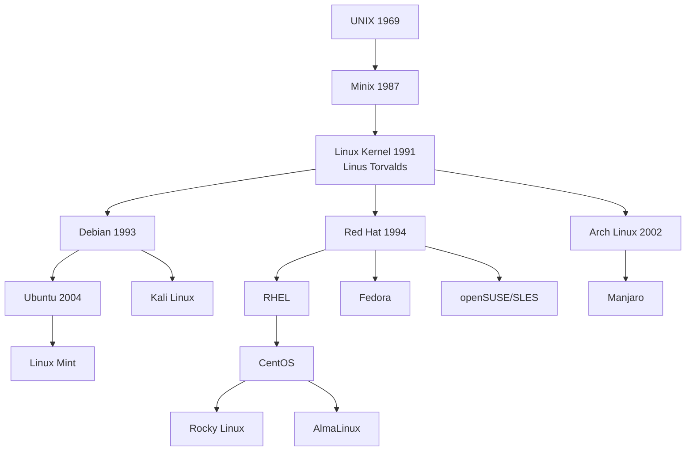

### 0.3 学习时长预估

| 阶段 | 内容 | 学习时长 | 产出 |
|---|---|---|---|
| 入门 | 第 1-5 章 | 1-2 周 | 能用命令行完成日常操作 |
| 进阶 | 第 6-10 章 | 2-4 周 | 能写 Shell 脚本、管用户进程 |
| 高级 | 第 11-15 章 | 4-6 周 | 能排查网络/磁盘/日志问题 |
| 专家 | 第 16-19 章 | 持续 | 能做性能调优与自动化运维 |

> 💡 **小贴士**：学习 Linux 不要只看不练。每个命令至少敲 3 遍，每个脚本自己改一遍。

---

## 第 1 章 Linux 是什么

### 1.1 历史时间线

```
1969  Ken Thompson 与 Dennis Ritchie 在贝尔实验室开发 UNIX
1983  Richard Stallman 发起 GNU 计划
1987  Andrew Tanenbaum 发布 Minix（教学用）
1991  Linus Torvalds 在 Helsinki 大学发布 Linux 0.01
1992  Linux 采用 GPL 许可证
1993  Debian 项目启动
1994  Red Hat 公司成立
1996  Tux（企鹅）成为 Linux 吉祥物
2004  Ubuntu 首发
2011  systemd 进入主流发行版
2020  CentOS 8 被红帽宣布停止维护，Rocky/Alma 崛起
2024+ Linux 内核 6.x，主导云、移动、嵌入式市场
```

### 1.2 内核 vs 发行版

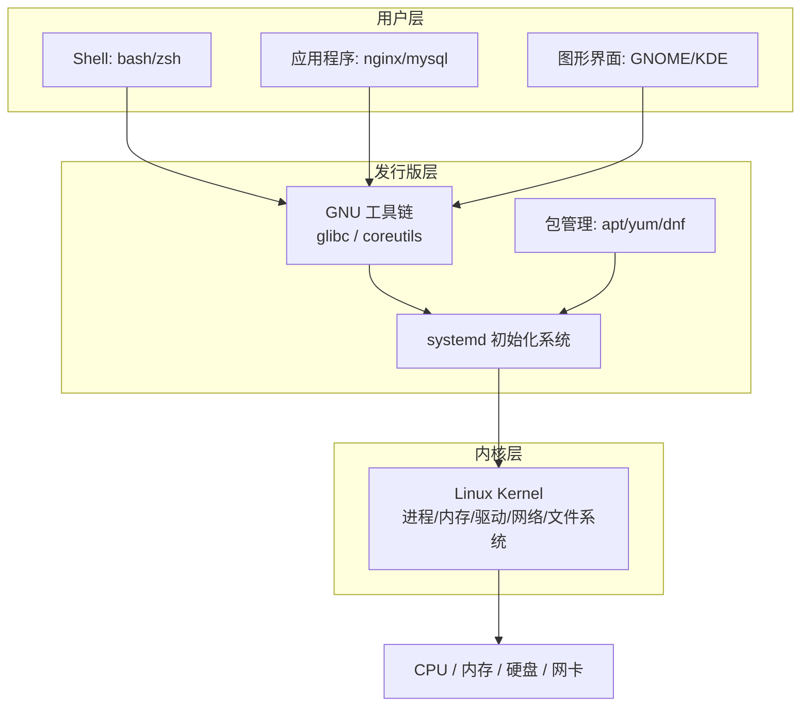

📌 **重点**：你日常说的"Linux"其实是"GNU/Linux 发行版"，内核只是其中的核。

### 1.3 主流发行版对比

| 发行版 | 包管理 | 默认 Shell | 适合场景 | 生产占比 |
|---|---|---|---|---|
| **Ubuntu Server** | apt / dpkg | bash | 开发、云、AI 训练 | 高 |
| **Debian** | apt / dpkg | bash | 稳定服务器 | 中 |
| **CentOS 7**（已 EOL） | yum / rpm | bash | 旧企业系统 | 下降 |
| **Rocky Linux / AlmaLinux** | dnf / rpm | bash | 替代 CentOS | 上升 |
| **RHEL** | dnf / rpm | bash | 商业付费支持 | 中 |
| **openSUSE** | zypper / rpm | bash | 欧洲企业 | 低 |
| **Arch / Manjaro** | pacman | bash | 极客桌面 | 极低（服务器） |
| **Alpine** | apk | ash | 容器镜像 | 高（容器） |

### 1.4 我应该选哪个？

- 初学者 → **Ubuntu 22.04 LTS**（资料最多）
- 企业生产替代 CentOS → **Rocky Linux 9**
- 容器基础镜像 → **Alpine 3.x**
- 学习内核 → **Arch Linux** 或源码编译

---

## 第 2 章 环境搭建

### 2.1 方案选择矩阵

| 方案 | 优点 | 缺点 | 推荐场景 |
|---|---|---|---|
| **WSL2** | 启动快、与 Windows 互通 | 网络/systemd 不完美 | Windows 开发者日常 |
| **VirtualBox** | 免费、跨平台 | 性能一般 | 学习练习 |
| **VMware Workstation** | 性能好 | 收费 | 企业培训 |
| **云服务器**（阿里云/腾讯云） | 真实环境、随用随开 | 按量付费 | 进阶练习、上线前调优 |
| **物理双系统** | 性能最佳 | 折腾、风险 | 桌面 Linux 爱好者 |

### 2.2 WSL2 安装（Windows 10/11）

```bash
# PowerShell 管理员
wsl --install -d Ubuntu-22.04          # 一键安装 Ubuntu
wsl --list --verbose                    # 查看已安装的发行版
wsl --set-default Ubuntu-22.04          # 设为默认
wsl --shutdown                          # 关闭所有 WSL（释放内存）
```

进入 WSL 后第一件事：

```bash
sudo apt update && sudo apt upgrade -y  # 更新软件源与包
sudo apt install -y vim curl wget git net-tools htop tmux
```

### 2.3 VirtualBox 安装 Ubuntu Server

```
1) 下载 VirtualBox：https://www.virtualbox.org
2) 下载 Ubuntu Server 22.04 ISO
3) 新建虚拟机：4GB 内存 / 2 CPU / 30GB 硬盘 / 桥接网络
4) 挂载 ISO，启动，按提示安装
5) 安装时勾选 "OpenSSH server"
```

### 2.4 SSH 远程登录

```bash
# 在本机生成密钥对（一次性）
ssh-keygen -t ed25519 -C "you@example.com"

# 把公钥拷到服务器
ssh-copy-id user@192.168.1.10

# 之后就可以免密登录
ssh user@192.168.1.10

# 指定端口和身份文件
ssh -p 2222 -i ~/.ssh/id_ed25519 user@host

# 端口转发（本地 8080 → 远程 80）
ssh -L 8080:localhost:80 user@host
```

⚠️ **踩坑**：`Permission denied (publickey)` 99% 是公钥没拷对、或服务器 `~/.ssh` 权限不是 700、`authorized_keys` 不是 600。

```bash
# 一键修复权限
chmod 700 ~/.ssh
chmod 600 ~/.ssh/authorized_keys
```

### 2.5 第一次登录后必做清单

```bash
# 1) 改主机名
sudo hostnamectl set-hostname my-server

# 2) 改时区
sudo timedatectl set-timezone Asia/Shanghai

# 3) 关闭无用服务（按需）
sudo systemctl disable --now snapd cups

# 4) 新建一个非 root 用户
sudo adduser ops
sudo usermod -aG sudo ops

# 5) 禁用 root SSH 登录（提升安全）
sudo sed -i 's/^#\?PermitRootLogin.*/PermitRootLogin no/' /etc/ssh/sshd_config
sudo systemctl restart ssh
```

---

## 第 3 章 文件系统结构（FHS）

### 3.1 FHS 目录树

> FHS = Filesystem Hierarchy Standard（文件系统层次标准）

```
/
├── bin/         → /usr/bin    基础用户命令（ls cp mv）
├── sbin/        → /usr/sbin   超级用户命令（fdisk iptables）
├── boot/                       内核、initramfs、grub 配置
│   ├── vmlinuz-*               内核镜像
│   └── grub/grub.cfg           引导菜单
├── dev/                        设备文件（一切皆文件）
│   ├── sda, sda1, sda2         硬盘与分区
│   ├── null, zero, random      特殊设备
│   └── pts/                    伪终端
├── etc/                        ★全局配置（最常改的目录）
│   ├── passwd, shadow, group   用户/密码/组
│   ├── hostname, hosts         主机名、本地 DNS
│   ├── fstab                   开机挂载表
│   ├── resolv.conf             DNS 服务器
│   ├── ssh/sshd_config         SSH 配置
│   ├── systemd/                systemd 单元
│   ├── nginx/, mysql/          各服务配置
│   └── cron.d/, crontab        定时任务
├── home/                       普通用户家目录
│   └── alice/, bob/
├── root/                       root 用户家目录（不在 /home！）
├── lib/         → /usr/lib    共享库
├── lib64/       → /usr/lib64  64 位共享库
├── media/                      可移动介质自动挂载点（U 盘）
├── mnt/                        临时手动挂载点
├── opt/                        第三方/商业软件（如 /opt/oracle）
├── proc/                       ★虚拟文件系统：进程/内核信息
│   ├── 1/, 2/, ...             每个进程一个目录
│   ├── cpuinfo, meminfo        CPU、内存信息
│   └── sys/                    内核参数
├── sys/                        ★虚拟文件系统：硬件与驱动
├── run/                        运行时数据（pid 文件、socket）
├── srv/                        服务数据（如 /srv/www）
├── tmp/                        临时文件（重启清空）
├── usr/                        ★用户级程序（不是 user，是 UNIX System Resources）
│   ├── bin/, sbin/             命令
│   ├── lib/                    库
│   ├── local/                  本地编译安装（/usr/local/nginx）
│   ├── share/                  共享只读数据（man、doc）
│   └── include/                C/C++ 头文件
└── var/                        ★可变数据
    ├── log/                    日志
    ├── lib/                    应用状态数据（mysql、docker）
    ├── cache/                  缓存
    ├── spool/                  邮件、打印队列
    └── www/                    Web 服务器默认根目录
```

### 3.2 必须背的 5 个目录

| 目录 | 一句话记忆 |
|---|---|
| `/etc` | 改配置就来这（"etcetera"） |
| `/var/log` | 看日志就来这（"variable"） |
| `/proc` | 查进程/内核运行时来这（虚拟） |
| `/usr/local` | 自己编译装的软件放这 |
| `/home/$USER` | 个人文件放这 |

### 3.3 /proc 与 /sys 实战

```bash
# CPU 信息
cat /proc/cpuinfo | grep "model name" | head -1

# 内存信息
cat /proc/meminfo | head -5

# 当前内核版本
cat /proc/version

# 进程 PID=1 的命令行
cat /proc/1/cmdline | tr '\0' ' '

# 修改内核参数（临时）
echo 1 > /proc/sys/net/ipv4/ip_forward

# 永久修改 → 写 /etc/sysctl.conf
```

💡 **小贴士**：`/proc` 里的"文件"大多是即时生成的，体积显示为 0 但能读出内容。

---

## 第 4 章 基础命令大全（50+）

### 4.1 导航与查看

#### `pwd` — 当前路径

```bash
pwd                    # /home/alice
pwd -P                 # 显示物理路径（解析软链接）
```

#### `cd` — 切换目录

```bash
cd /etc                # 绝对路径
cd ../..               # 上两级
cd ~                   # 回家
cd -                   # 回到上次的目录
cd                     # 等同于 cd ~
```

#### `ls` — 列目录

```bash
ls                     # 简单列
ls -l                  # 长格式（权限、大小、时间）
ls -la                 # 包含隐藏文件
ls -lh                 # 人类可读的大小（KB/MB）
ls -lt                 # 按修改时间排序
ls -lS                 # 按大小排序
ls -lR /etc            # 递归
ls -li                 # 显示 inode
ls --color=auto        # 彩色（多数发行版默认开）
```

输出解读：

```
-rw-r--r-- 1 alice users 1024 May 26 10:30 hello.txt
│└─┬─┘└┬┘  │ └─┬─┘ └─┬─┘ └─┬┘   └────┬────┘ └───┬───┘
│ │  │   │  │   所有者   组   大小   修改时间   文件名
│ │  │   │  硬链接数
│ │  │   其他人权限
│ │  组权限
│ 所有者权限
文件类型（- 普通  d 目录  l 链接  c 字符  b 块）
```

#### `tree` — 树形显示

```bash
sudo apt install tree
tree -L 2 /etc         # 只显示 2 层
tree -d                # 只显示目录
tree -a                # 显示隐藏
tree --filelimit 50    # 超过 50 个文件折叠
```

### 4.2 文件操作

| 命令 | 作用 | 高频用法 |
|---|---|---|
| `touch` | 创建空文件 / 改时间戳 | `touch a.txt b.txt` |
| `mkdir` | 建目录 | `mkdir -p a/b/c` 递归 |
| `cp` | 复制 | `cp -rv src/ dst/` |
| `mv` | 移动/重命名 | `mv old new` |
| `rm` | 删除 | `rm -rf dir`（危险） |
| `ln` | 链接 | `ln -s target link` 软链 |
| `stat` | 详细元信息 | `stat file` |
| `file` | 查文件类型 | `file *.bin` |

```bash
# 拷贝并保留权限、时间、链接
cp -a src/ dst/

# 移动并备份已存在文件
mv -b a.txt /tmp/

# 删除以 - 开头的文件
rm -- -file.txt

# 创建软链接（指向 /opt/app 的 1.0 版本）
ln -s /opt/app/1.0 /opt/app/current
```

⚠️ **踩坑**：`rm -rf /` 会清空整盘。一定别在 root 下手抖。建议加 alias：

```bash
alias rm='rm -i'       # 删除前确认（个人习惯）
```

🎯 **实战**：清理 7 天前的日志

```bash
find /var/log -name "*.log" -mtime +7 -delete
```

### 4.3 查看文件内容

```bash
cat file.txt           # 全部输出
cat -n file.txt        # 带行号
tac file.txt           # 反向输出（倒着读）

less file.txt          # 分页查看（推荐，大文件首选）
                       # 上下翻：j/k  翻页：space/b  搜索：/word  退出：q
more file.txt          # 旧式分页（不能往回翻）

head -n 20 file.txt    # 前 20 行
tail -n 20 file.txt    # 后 20 行
tail -f /var/log/syslog # 实时追加（看日志神器）
tail -F file           # 文件被 rotate 也能跟

nl file.txt            # 给非空行加行号
wc -l file.txt         # 统计行数
wc -lwc file.txt       # 行/词/字节数

od -c file.bin         # 八进制 dump
xxd file.bin           # 十六进制 dump
hexdump -C file.bin    # 同上，带 ASCII
```

### 4.4 查找文件

#### `find` — 万能查找

```bash
find /etc -name "*.conf"            # 按名（支持通配）
find / -iname "readme*"             # 忽略大小写
find . -type f                      # 只找文件 (d=目录, l=链接)
find . -size +100M                  # 大于 100MB
find . -mtime -7                    # 7 天内修改过
find . -mmin -60                    # 60 分钟内修改
find . -user alice                  # 属主是 alice
find . -perm 644                    # 精确权限
find . -empty                       # 空文件/空目录

# 找到后执行
find . -name "*.tmp" -delete
find . -name "*.log" -exec gzip {} \;
find . -name "*.sh" -exec chmod +x {} +    # + 比 \; 更快（批量）

# 配合 xargs
find . -name "*.bak" | xargs rm
find . -name "*.bak" -print0 | xargs -0 rm   # 处理文件名含空格
```

#### `locate` — 数据库快查

```bash
sudo updatedb                       # 刷新数据库
locate nginx.conf                   # 闪电级查找
```

#### `which` / `whereis` / `type`

```bash
which python3            # 命令的执行路径
whereis python3          # 命令 + 源码 + man 路径
type ls                  # 是别名/内置/外部命令？
```

### 4.5 管道与重定向

```bash
cmd1 | cmd2              # 把 cmd1 stdout 接 cmd2 stdin
cmd > file               # stdout 重定向（覆盖）
cmd >> file              # stdout 追加
cmd 2> err.log           # stderr 重定向
cmd > out 2>&1           # 都进 out
cmd &> out               # 同上（bash 简写）
cmd < input.txt          # stdin 来自文件
cmd <<< "hello"          # here string
cmd <<EOF                # here doc
line1
line2
EOF
```

文件描述符：

```
0 = stdin    1 = stdout    2 = stderr
```

🎯 **实战**：抓 nginx 错误日志中的 5xx

```bash
grep " 5[0-9][0-9] " /var/log/nginx/access.log | awk '{print $1}' | sort -u
```

### 4.6 压缩与归档

| 工具 | 后缀 | 打包 | 解包 |
|---|---|---|---|
| tar | .tar | `tar -cvf x.tar dir/` | `tar -xvf x.tar` |
| gzip | .gz | `gzip f` | `gunzip f.gz` |
| bzip2 | .bz2 | `bzip2 f` | `bunzip2 f.bz2` |
| xz | .xz | `xz f` | `unxz f.xz` |
| zstd | .zst | `zstd f` | `unzstd f.zst` |
| zip | .zip | `zip -r x.zip dir/` | `unzip x.zip` |

```bash
# tar 组合参数记忆：CXVF（打开/解开 + verbose + file）
tar -czvf web.tar.gz /var/www       # c=create  z=gzip
tar -cjvf web.tar.bz2 /var/www      # j=bzip2
tar -cJvf web.tar.xz  /var/www      # J=xz
tar -xzvf web.tar.gz -C /tmp        # 解到 /tmp
tar -tzvf web.tar.gz                # 只看内容不解
```

### 4.7 其他高频命令

```bash
echo "hello"                       # 输出
printf "%-10s %5d\n" name 42       # 格式化输出
date                                # 当前时间
date "+%Y-%m-%d %H:%M:%S"           # 自定义格式
date -d "yesterday" +%F             # 昨天日期

uname -a                            # 内核 + 主机信息
hostname                            # 主机名
uptime                              # 开机时间 + 负载
whoami                              # 当前用户
id                                  # uid/gid/groups
w                                   # 谁在登录、在干嘛
last -n 10                          # 最近登录记录
history | tail -30                  # 历史命令

clear                               # 清屏 (Ctrl+L)
reset                               # 终端乱码时复位
exit                                # 退出 shell

man ls                              # 查手册
man -k network                      # 关键字搜索
info coreutils                      # GNU info 手册
tldr ls                             # 现代简化版手册（需安装）
```

### 4.8 命令速查表

| 类别 | 命令 |
|---|---|
| 导航 | `pwd cd ls tree` |
| 文件 | `touch mkdir cp mv rm ln stat file` |
| 查看 | `cat tac less more head tail nl wc` |
| 查找 | `find locate which whereis type` |
| 管道 | `\| > >> < 2> &> tee` |
| 压缩 | `tar gzip bzip2 xz zstd zip` |
| 信息 | `date uname hostname uptime id w last` |
| 帮助 | `man info tldr --help` |

---

## 第 5 章 Vim 入门到精通

### 5.1 模式状态机

```mermaid
stateDiagram-v2
    [*] --> Normal: 启动
    Normal --> Insert: i / a / o
    Insert --> Normal: Esc
    Normal --> Visual: v / V / Ctrl+v
    Visual --> Normal: Esc
    Normal --> Command: :
    Command --> Normal: Enter / Esc
    Normal --> Replace: R
    Replace --> Normal: Esc
```

| 模式 | 用途 | 进入键 | 退出键 |
|---|---|---|---|
| Normal | 默认，按键是命令 | Esc | - |
| Insert | 输入文本 | i a o I A O | Esc |
| Visual | 选择文本 | v V Ctrl+v | Esc |
| Command | 执行 ex 命令 | : | Enter |
| Replace | 覆盖输入 | R | Esc |

### 5.2 必背快捷键

#### 移动

```
h j k l       ← ↓ ↑ →
w / b         下一个/上一个单词
0 / $         行首/行尾
^             行首非空字符
gg / G        文件首/尾
nG            跳到第 n 行
Ctrl+f / b    下/上翻页
Ctrl+d / u    下/上半页
H / M / L     屏幕顶/中/底
%             匹配的括号
*             找当前单词
fx / Fx       行内找下/上一个 x
```

#### 编辑

```
i / a         插入到光标前/后
I / A         插入到行首/行尾
o / O         下方/上方新开一行
x             删除光标处字符
dd            删除一整行（剪切）
yy            复制一整行
p / P         粘贴到下/上
u             撤销
Ctrl+r        重做
.             重复上次操作
r x           替换当前字符为 x
cc            删整行并进入插入模式
ciw           删整词并进入插入模式
ci"           删除双引号内内容
```

#### 搜索替换

```
/word         向下搜
?word         向上搜
n / N         下/上一个匹配
:s/old/new/   当前行第一个
:s/old/new/g  当前行全部
:%s/old/new/g 全文全部
:%s/old/new/gc 全文带确认
```

#### 文件与窗口

```
:w            保存
:q            退出
:wq / ZZ      保存并退出
:q!           不保存退出
:e file       打开新文件
:vsp file     垂直分屏
:sp file      水平分屏
Ctrl+w w      切换窗口
Ctrl+w q      关闭窗口
```

### 5.3 .vimrc 推荐配置

```vim
" ~/.vimrc
set nocompatible          " 不兼容 vi
syntax on                 " 语法高亮
filetype plugin indent on

set number                " 行号
set relativenumber        " 相对行号
set cursorline            " 高亮当前行
set showmatch             " 括号匹配
set incsearch             " 增量搜索
set hlsearch              " 高亮搜索结果
set ignorecase smartcase  " 智能大小写

set tabstop=4             " tab 显示宽度
set shiftwidth=4          " 自动缩进宽度
set expandtab             " tab 转空格
set autoindent
set smartindent

set encoding=utf-8
set fileencoding=utf-8

set mouse=a               " 鼠标支持
set clipboard=unnamedplus " 共享系统剪贴板

" 快捷键
let mapleader=","
nnoremap <leader>w :w<CR>
nnoremap <leader>q :q<CR>
```

### 5.4 实战练习

🎯 **任务**：把文件中所有 `localhost` 替换成 `127.0.0.1`，并去掉所有空行。

```vim
:%s/localhost/127.0.0.1/g
:g/^$/d
:wq
```

---

## 第 6 章 文本三剑客 grep / sed / awk

### 6.1 grep — 查找

```bash
grep "error" app.log                # 基本查找
grep -i "ERROR" app.log             # 忽略大小写
grep -n "error" app.log             # 显示行号
grep -v "debug" app.log             # 反向（不匹配）
grep -c "error" app.log             # 只统计数量
grep -r "TODO" .                    # 递归
grep -R --include="*.py" "def" .    # 仅 .py
grep -A 3 -B 2 "error" app.log      # 显示前 2 后 3 行
grep -E "err(or|no)" app.log        # 扩展正则
grep -P "\d{3}-\d{4}" app.log       # Perl 兼容正则
grep -o "[0-9]\+\.[0-9]\+\.[0-9]\+\.[0-9]\+" app.log  # 只输出匹配部分（找 IP）
grep -l "main" *.go                 # 只显示文件名
zgrep "error" app.log.gz            # 直接搜压缩包
```

#### 正则速查

| 元字符 | 含义 |
|---|---|
| `.` | 任意 1 字符 |
| `*` | 前面字符 0 或多次 |
| `+` | 1 或多次（ERE） |
| `?` | 0 或 1 次 |
| `^` | 行首 |
| `$` | 行尾 |
| `[abc]` | a/b/c 之一 |
| `[^abc]` | 不是 a/b/c |
| `\d` | 数字（PCRE） |
| `\s` | 空白 |
| `\b` | 单词边界 |
| `(a\|b)` | a 或 b |
| `{m,n}` | 重复 m 到 n 次 |

### 6.2 sed — 流编辑

```bash
sed 's/old/new/' f           # 每行第一个替换
sed 's/old/new/g' f          # 全部替换
sed -i 's/old/new/g' f       # 直接改文件（危险，建议先 -i.bak）
sed -i.bak 's/old/new/g' f   # 改文件并备份

sed '3d' f                    # 删除第 3 行
sed '2,5d' f                  # 删除 2-5 行
sed '/error/d' f              # 删除含 error 的行
sed -n '10,20p' f             # 只打印 10-20 行
sed '$a 结束' f               # 末尾添加行
sed '1i 标题' f               # 行首插入

# 多条命令
sed -e 's/a/A/g' -e 's/b/B/g' f
sed 's/a/A/g; s/b/B/g' f
```

🎯 **实战**：把 ini 文件里所有 `debug=true` 改成 `debug=false`，并备份。

```bash
sed -i.bak -E 's/^(debug\s*=\s*)true/\1false/' /etc/app.ini
```

### 6.3 awk — 列处理利器

#### 基本结构

```
awk 'BEGIN{初始化} pattern {action} END{收尾}' file
```

#### 内置变量

| 变量 | 含义 |
|---|---|
| `$0` | 整行 |
| `$1 $2 ...` | 第 N 列 |
| `NF` | 列数 |
| `NR` | 当前行号 |
| `FS` | 字段分隔符（默认空白） |
| `OFS` | 输出字段分隔符 |
| `RS` | 记录分隔符 |

```bash
awk '{print $1, $3}' f               # 打印第 1、3 列
awk -F: '{print $1}' /etc/passwd     # 用 : 分隔
awk 'NR>1 {sum+=$2} END{print sum}' data.txt  # 跳过表头求和
awk '$3 > 100 {print $0}' f          # 第 3 列大于 100 的行
awk '/error/ {print NR, $0}' f       # 含 error 的行带行号
awk 'BEGIN{FS=","; OFS="\t"} {print $1, $2}' f  # csv → tsv
```

🎯 **实战**：分析 nginx 访问日志，统计 Top 10 IP

```bash
awk '{print $1}' access.log | sort | uniq -c | sort -rn | head -10
```

🎯 **实战**：按 HTTP 状态码统计

```bash
awk '{print $9}' access.log | sort | uniq -c | sort -rn
```

🎯 **实战**：每分钟请求数

```bash
awk '{print substr($4, 2, 17)}' access.log | uniq -c
```

### 6.4 三剑客组合拳

```bash
# 找出最近 1 小时内出现的 ERROR 唯一前 20 条
grep "ERROR" app.log | tail -1000 \
  | awk '{$1=""; $2=""; print}' \
  | sort | uniq -c | sort -rn | head -20
```

---

## 第 7 章 用户、组与权限

### 7.1 用户与组的概念

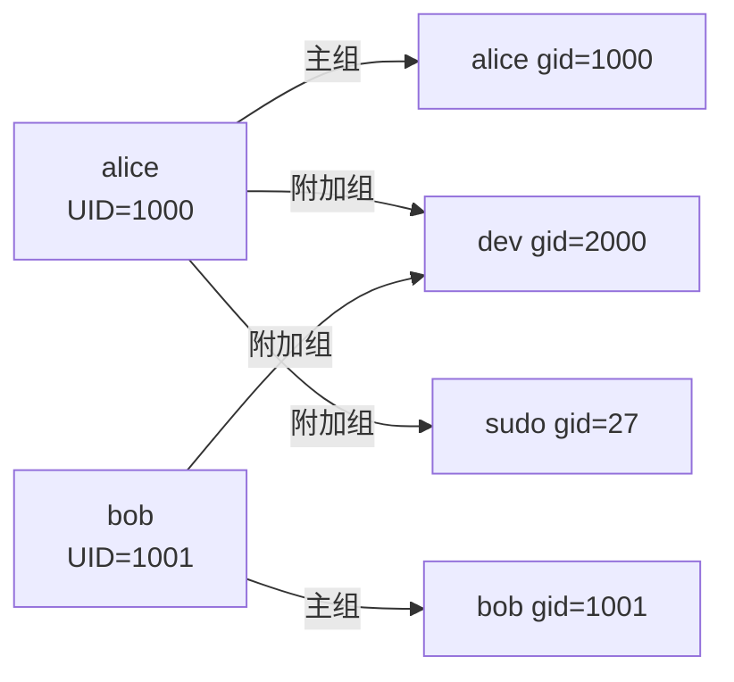

| 类型 | UID 范围（Ubuntu） |
|---|---|
| root | 0 |
| 系统用户 | 1-999 |
| 普通用户 | 1000+ |
| nobody | 65534 |

### 7.2 关键文件

```bash
/etc/passwd     # 用户列表（公开）
/etc/shadow     # 加密密码（root 可读）
/etc/group      # 组列表
/etc/gshadow    # 组密码
/etc/sudoers    # sudo 权限（用 visudo 编辑）
```

`/etc/passwd` 一行解读：

```
alice:x:1000:1000:Alice Wang,,,:/home/alice:/bin/bash
 │    │  │    │      │             │           │
 用户 密码占位 UID GID 描述        家目录    默认 shell
```

`/etc/shadow` 一行解读：

```
alice:$6$xxx$yyy:19500:0:99999:7:::
 用户  加密密码  上次改密天数 最小天数 最大天数 警告天数 过期天数 失效日 保留
```

### 7.3 用户管理命令

```bash
sudo useradd -m -s /bin/bash alice    # 添加用户（-m 建家目录）
sudo adduser alice                     # Debian 系交互式（推荐）
sudo passwd alice                      # 设置密码
sudo userdel -r alice                  # 删除用户及家目录
sudo usermod -aG sudo alice            # 加入 sudo 组（必须 -aG）
sudo usermod -L alice                  # 锁定账户
sudo usermod -U alice                  # 解锁
sudo chsh -s /bin/zsh alice            # 改默认 shell

sudo groupadd dev                      # 建组
sudo groupdel dev                      # 删组
sudo groupmod -n newname oldname       # 改组名
```

⚠️ **踩坑**：`usermod -G dev alice` **会覆盖**附加组！务必加 `-a`：

```bash
sudo usermod -aG dev,docker alice      # 追加到 dev 和 docker 组
```

### 7.4 权限位详解

```
-rwxr-xr-- 1 alice dev 1024 May 26 10:30 script.sh
 ┬──┬──┬──┬
 │  │  │  └─ 其他人 (o): r--
 │  │  └──── 组 (g):     r-x
 │  └─────── 所有者 (u): rwx
 └────────── 文件类型
```

| 权限 | 文件 | 目录 |
|---|---|---|
| r (4) | 读内容 | 列目录 (ls) |
| w (2) | 改内容 | 创建/删除文件 |
| x (1) | 执行 | 进入目录 (cd) |

⚠️ **关键概念**：目录的 x 权限是"进入"，不是"执行"。没有 x 就 cd 不进去。

### 7.5 chmod 改权限

```bash
chmod 755 script.sh           # 数字法：rwxr-xr-x
chmod 644 file.txt            # rw-r--r--
chmod u+x,g-w,o= file         # 符号法
chmod -R 755 dir/             # 递归
chmod a+r file                # all (ugo) 都加 r
```

数字记忆：

```
r=4  w=2  x=1
rwx = 7   r-x = 5   r-- = 4   --- = 0
```

### 7.6 chown 改属主

```bash
sudo chown alice file              # 改属主
sudo chown alice:dev file          # 改属主和组
sudo chown :dev file               # 只改组
sudo chown -R alice:alice /home/alice
```

### 7.7 特殊权限位

| 位 | 数字 | 作用 | 示例 |
|---|---|---|---|
| SUID | 4000 | 执行时以属主权限运行 | `/usr/bin/passwd` |
| SGID | 2000 | 执行时以属组权限；目录新文件继承组 | 协作目录 |
| Sticky | 1000 | 目录中只有属主能删自己的文件 | `/tmp` |

```bash
chmod 4755 /usr/bin/mytool    # 加 SUID（显示 -rwsr-xr-x）
chmod 2755 /shared            # 加 SGID
chmod 1777 /tmp               # 加 Sticky（显示 drwxrwxrwt）
```

### 7.8 umask 默认权限

```bash
umask                          # 当前 umask（如 0022）
umask 0027                     # 设为更严格

# 计算：文件 = 666 - umask, 目录 = 777 - umask
# umask 022 → 文件 644，目录 755
```

### 7.9 sudo 与 sudoers

```bash
sudo cmd                       # 用 root 跑
sudo -u bob cmd                # 用 bob 跑
sudo -i                        # 切到 root shell
sudo -l                        # 看自己有哪些 sudo 权限
sudo visudo                    # 安全地编辑 /etc/sudoers
```

sudoers 示例：

```
# 用户  主机=（变身为)NOPASSWD: 命令
alice   ALL=(ALL)    NOPASSWD: /usr/bin/systemctl restart nginx
%dev    ALL=(ALL)    ALL       # dev 组所有命令
```

### 7.10 ACL（更细粒度权限）

```bash
sudo apt install acl

setfacl -m u:bob:rwx file      # 给 bob 单独加权
setfacl -m g:dev:r-x dir       # 给 dev 组加权
getfacl file                   # 查看 ACL
setfacl -x u:bob file          # 删除 bob 的 ACL
setfacl -b file                # 清空所有 ACL
```

---

## 第 8 章 进程管理与 systemd

### 8.1 进程基本概念

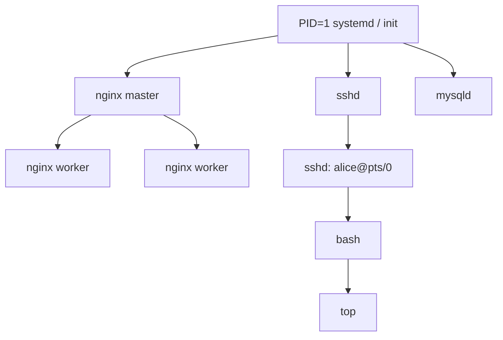

每个进程有：

- **PID**：进程 ID
- **PPID**：父进程 ID
- **UID/GID**：以谁的身份运行
- **状态**：R(running) S(sleep) D(uninterruptible) Z(zombie) T(stopped)

### 8.2 ps — 进程快照

```bash
ps                       # 当前终端的进程
ps -ef                   # 所有进程（System V 风格）
ps aux                   # 所有进程（BSD 风格，最常用）
ps -ef | grep nginx
ps aux --sort=-%cpu | head    # 按 CPU 倒序
ps aux --sort=-%mem | head    # 按内存倒序
ps -eLf                  # 显示线程
pstree -p                # 树状显示
```

输出字段：

```
USER  PID %CPU %MEM    VSZ   RSS TTY STAT START TIME COMMAND
```

- `VSZ`：虚拟内存（KB）
- `RSS`：实际占用物理内存（KB）

### 8.3 top / htop — 实时监控

```bash
top                      # 实时
# 交互按键：
#   P 按 CPU 排序
#   M 按内存排序
#   k 杀进程
#   1 显示每个 CPU
#   q 退出

htop                     # 彩色升级版（推荐）
# F2 配置, F3 搜索, F4 过滤, F9 杀, F10 退出
```

top 头部：

```
load average: 0.50, 0.65, 0.70       # 1/5/15 分钟负载
%Cpu(s): us=用户  sy=系统  id=空闲  wa=IO等待  st=被偷
MiB Mem: total free used buff/cache
MiB Swap: total free used available
```

📌 **重点**：负载值的合理范围 ≈ CPU 核数。8 核机器持续负载 > 8 才算高。

### 8.4 kill 信号

```bash
kill PID                 # 默认发 TERM(15) 优雅退出
kill -9 PID              # 强制 KILL（不能被捕获，慎用）
kill -HUP PID            # 1 号信号，常用于重载配置
killall nginx            # 按名字
pkill -f "python app.py" # 模糊匹配
```

#### 信号速查表

| 数值 | 名称 | 默认动作 | 备注 |
|---|---|---|---|
| 1 | SIGHUP | 终止 | 终端挂起；很多服务用作 reload |
| 2 | SIGINT | 终止 | Ctrl+C |
| 3 | SIGQUIT | 终止+core | Ctrl+\ |
| 9 | SIGKILL | 终止 | 不可捕获 |
| 15 | SIGTERM | 终止 | 优雅退出，默认 |
| 18 | SIGCONT | 继续 | 唤醒已停止进程 |
| 19 | SIGSTOP | 停止 | 不可捕获 |
| 20 | SIGTSTP | 停止 | Ctrl+Z |

### 8.5 jobs / 前后台

```bash
sleep 100 &              # 后台运行
jobs                     # 查看作业
fg %1                    # 把作业 1 调回前台
bg %1                    # 后台继续
Ctrl+Z                   # 挂起当前前台
disown -h %1             # 脱离 shell（关 shell 后仍存活）
nohup cmd > out.log 2>&1 &   # 标准的后台运行
```

### 8.6 systemd 单元

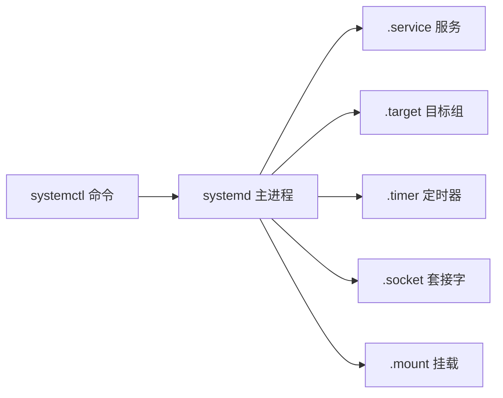

#### 常用命令

```bash
sudo systemctl status nginx          # 查状态
sudo systemctl start nginx           # 启动
sudo systemctl stop nginx            # 停止
sudo systemctl restart nginx         # 重启
sudo systemctl reload nginx          # 重载配置（不重启）
sudo systemctl enable nginx          # 开机自启
sudo systemctl disable nginx         # 关开机自启
sudo systemctl enable --now nginx    # 启用并立即启动
sudo systemctl is-active nginx       # 仅判断
sudo systemctl is-enabled nginx
sudo systemctl daemon-reload         # 改了 unit 后必须执行

systemctl list-units --type=service              # 列服务
systemctl list-units --state=failed              # 失败的服务
systemctl list-unit-files | grep enabled         # 自启列表
```

#### 写一个自己的 service

```ini
# /etc/systemd/system/myapp.service
[Unit]
Description=My Python App
After=network.target
Wants=network-online.target

[Service]
Type=simple
User=appuser
Group=appuser
WorkingDirectory=/opt/myapp
ExecStart=/usr/bin/python3 /opt/myapp/server.py
ExecReload=/bin/kill -HUP $MAINPID
Restart=on-failure
RestartSec=5s
StandardOutput=append:/var/log/myapp/out.log
StandardError=append:/var/log/myapp/err.log
Environment="ENV=prod" "PORT=8080"
LimitNOFILE=65535

[Install]
WantedBy=multi-user.target
```

启用：

```bash
sudo systemctl daemon-reload
sudo systemctl enable --now myapp
journalctl -u myapp -f
```

### 8.7 cron 定时任务

```bash
crontab -e               # 编辑当前用户的 crontab
crontab -l               # 查看
sudo crontab -u root -e  # 编辑 root 的

# 格式：分 时 日 月 周  命令
#       0-59 0-23 1-31 1-12 0-7（0/7 都是周日）
```

示例：

```cron
# 每天 03:00 备份
0 3 * * *  /usr/local/bin/backup.sh >> /var/log/backup.log 2>&1

# 每 5 分钟
*/5 * * * * /opt/check.sh

# 工作日 9 点
0 9 * * 1-5 /opt/report.sh

# 每月 1 日 0 点
0 0 1 * * /opt/monthly.sh
```

> 💡 **小贴士**：cron 默认 PATH 极简，最好在脚本里 `export PATH=/usr/local/bin:/usr/bin:/bin` 或全写绝对路径。

### 8.8 systemd timer（cron 的现代替代）

```ini
# /etc/systemd/system/backup.service
[Unit]
Description=Backup
[Service]
Type=oneshot
ExecStart=/usr/local/bin/backup.sh

# /etc/systemd/system/backup.timer
[Unit]
Description=Daily Backup
[Timer]
OnCalendar=*-*-* 03:00:00
Persistent=true
[Install]
WantedBy=timers.target
```

```bash
sudo systemctl enable --now backup.timer
systemctl list-timers
```

---

## 第 9 章 软件包管理

### 9.1 apt（Debian / Ubuntu）

```bash
sudo apt update                     # 更新软件源元数据
sudo apt upgrade                    # 升级所有包
sudo apt full-upgrade               # 升级且允许卸载
sudo apt install nginx              # 安装
sudo apt install nginx=1.18*        # 指定版本
sudo apt remove nginx               # 卸载（保留配置）
sudo apt purge nginx                # 卸载并删配置
sudo apt autoremove                 # 清理孤儿依赖
sudo apt search nginx               # 搜索
apt show nginx                       # 详情
apt list --installed                 # 已安装列表
sudo apt-mark hold nginx             # 锁定不升级
dpkg -l                              # 已安装包（dpkg 层）
dpkg -L nginx                        # 列出包安装的文件
dpkg -S /usr/sbin/nginx              # 反查文件属于哪个包
sudo dpkg -i pkg.deb                 # 装本地 deb
```

源配置：`/etc/apt/sources.list` 与 `/etc/apt/sources.list.d/*.list`

### 9.2 yum / dnf（RHEL / CentOS / Rocky）

```bash
sudo dnf install nginx
sudo dnf remove nginx
sudo dnf update
sudo dnf search nginx
dnf info nginx
sudo dnf history                     # 操作历史
sudo dnf history undo 5              # 回滚第 5 次操作
sudo dnf clean all
rpm -qa                              # 列出所有
rpm -ql nginx                        # 列文件
rpm -qf /usr/sbin/nginx              # 反查
sudo rpm -ivh pkg.rpm                # 装本地
sudo dnf repolist
```

### 9.3 源码编译三板斧

```bash
./configure --prefix=/usr/local/myapp   # 探测环境，生成 Makefile
make -j$(nproc)                         # 并行编译
sudo make install                        # 安装
```

更现代的：

```bash
cmake -S . -B build -DCMAKE_INSTALL_PREFIX=/usr/local
cmake --build build -j
sudo cmake --install build
```

> ⚠️ **踩坑**：源码安装的软件 **包管理器不知道**，升级和卸载要靠自己 `make uninstall` 或 checkinstall。

### 9.4 通用包管理对照

| 操作 | apt | dnf/yum | pacman | apk | zypper |
|---|---|---|---|---|---|
| 安装 | `apt install` | `dnf install` | `pacman -S` | `apk add` | `zypper in` |
| 卸载 | `apt remove` | `dnf remove` | `pacman -R` | `apk del` | `zypper rm` |
| 更新元数据 | `apt update` | `dnf check-update` | `pacman -Sy` | `apk update` | `zypper ref` |
| 升级所有 | `apt upgrade` | `dnf upgrade` | `pacman -Su` | `apk upgrade` | `zypper up` |
| 搜索 | `apt search` | `dnf search` | `pacman -Ss` | `apk search` | `zypper se` |
| 列文件 | `dpkg -L` | `rpm -ql` | `pacman -Ql` | `apk info -L` | `rpm -ql` |

### 9.5 snap / flatpak / AppImage

```bash
sudo snap install code --classic
flatpak install flathub org.gimp.GIMP
chmod +x app.AppImage && ./app.AppImage
```

---

## 第 10 章 Shell 脚本从入门到生产

### 10.1 第一个脚本

```bash
#!/usr/bin/env bash
# hello.sh - 我的第一个脚本
echo "Hello, $(whoami)! Today is $(date '+%F')."
```

```bash
chmod +x hello.sh
./hello.sh
```

📌 **shebang 解读**：
- `#!/bin/bash` — 写死路径
- `#!/usr/bin/env bash` — 通过 PATH 找 bash（推荐，可移植性好）

### 10.2 变量

```bash
name="alice"            # 注意 = 两边不要空格！
echo "$name"            # 引用
echo "${name}_log"      # 拼接

readonly PI=3.14        # 只读

# 命令替换
today=$(date +%F)
files=`ls`              # 旧写法，少用

# 默认值
echo "${var:-default}"  # var 未定义时用 default
echo "${var:=default}"  # 同上，并赋值
echo "${var:?error}"    # 未定义则报错退出

# 字符串操作
str="hello world"
echo ${#str}            # 长度 11
echo ${str:0:5}         # 切片 hello
echo ${str/world/linux} # 替换 hello linux
echo ${str^^}           # 转大写 HELLO WORLD
echo ${str,,}           # 转小写
```

#### 特殊变量

| 变量 | 含义 |
|---|---|
| `$0` | 脚本名 |
| `$1`..`$9` | 位置参数 |
| `${10}` | 第 10 个 |
| `$#` | 参数个数 |
| `$@` | 所有参数（数组） |
| `$*` | 所有参数（单串） |
| `$?` | 上条命令退出码 |
| `$$` | 当前 PID |
| `$!` | 最近后台进程 PID |
| `$_` | 上条命令最后一个参数 |

### 10.3 条件判断

```bash
# if 结构
if [[ "$x" -gt 10 ]]; then
    echo big
elif [[ "$x" -eq 10 ]]; then
    echo equal
else
    echo small
fi

# 单行
[[ -f /etc/passwd ]] && echo exist
[[ -z "$var" ]] || echo "var is set"
```

#### test 操作符

```
数字：-eq -ne -lt -le -gt -ge
字符串：= != -z(空) -n(非空)
文件：
  -e 存在  -f 普通文件  -d 目录  -L 软链
  -r 可读  -w 可写  -x 可执行
  -s 非空  -nt 新于  -ot 旧于
逻辑：&& || !
```

⚠️ **踩坑**：用 `[[ ]]` 不用 `[ ]`；`[[ ]]` 支持 `&&`、`||`、`=~` 正则，更安全。

```bash
# 正则匹配
if [[ "$ip" =~ ^[0-9]+\.[0-9]+\.[0-9]+\.[0-9]+$ ]]; then
    echo "looks like IP"
fi
```

### 10.4 循环

```bash
# for
for i in 1 2 3 4 5; do
    echo $i
done

for i in {1..10}; do echo $i; done
for ((i=0; i<10; i++)); do echo $i; done

for f in /etc/*.conf; do
    echo "$f"
done

# while
i=0
while (( i < 5 )); do
    echo $i
    ((i++))
done

# 读文件每行
while IFS= read -r line; do
    echo ">$line<"
done < file.txt

# until（直到条件为真）
until ping -c1 host >/dev/null 2>&1; do
    sleep 1
done
```

#### 跳出

```bash
break        # 跳出循环
continue     # 进入下一轮
break 2      # 跳出两层
```

### 10.5 case 分支

```bash
case "$1" in
    start)
        echo "starting..."
        ;;
    stop)
        echo "stopping..."
        ;;
    restart|reload)
        echo "restarting..."
        ;;
    *)
        echo "Usage: $0 {start|stop|restart}"
        exit 1
        ;;
esac
```

### 10.6 函数

```bash
greet() {
    local name="$1"            # local 限定局部
    local age="${2:-unknown}"
    echo "Hello $name, age=$age"
    return 0                   # 0=成功
}

greet alice 18
result=$(greet bob 25)         # 捕获输出
```

### 10.7 数组

```bash
arr=(a b c d)
echo "${arr[0]}"               # a
echo "${arr[@]}"               # 所有元素
echo "${#arr[@]}"              # 长度
arr+=(e f)                     # 追加
for x in "${arr[@]}"; do echo $x; done

# 关联数组（bash 4+）
declare -A map
map[name]=alice
map[age]=18
echo "${map[name]}"
for k in "${!map[@]}"; do
    echo "$k = ${map[$k]}"
done
```

### 10.8 信号陷阱 trap

```bash
cleanup() {
    echo "cleaning up..."
    rm -f /tmp/lock.$$
}
trap cleanup EXIT              # 退出时
trap "echo Ctrl+C; exit" INT   # Ctrl+C
trap "" HUP                    # 忽略 SIGHUP
```

### 10.9 调试

```bash
bash -x script.sh              # 打印每条命令
bash -n script.sh              # 只检查语法
set -x                         # 脚本内开调试
set +x                         # 关
set -e                         # 出错立即退出
set -u                         # 用未定义变量报错
set -o pipefail                # 管道任一失败就失败
set -euo pipefail              # ★生产脚本三件套
```

### 10.10 ShellCheck 静态检查

```bash
sudo apt install shellcheck
shellcheck script.sh
```

### 10.11 生产脚本模板

```bash
#!/usr/bin/env bash
# =============================================================
# 名称：deploy.sh
# 作用：发布应用到生产服务器
# 用法：./deploy.sh <env> <version>
# 作者：ops@example.com
# =============================================================
set -euo pipefail
IFS=$'\n\t'

# ---------- 常量 ----------
SCRIPT_DIR="$(cd "$(dirname "${BASH_SOURCE[0]}")" && pwd)"
LOG_FILE="/var/log/deploy.log"
LOCK_FILE="/tmp/deploy.lock"

# ---------- 日志 ----------
log() {
    local level="$1"; shift
    printf '[%s] [%s] %s\n' "$(date '+%F %T')" "$level" "$*" | tee -a "$LOG_FILE"
}
info()  { log INFO  "$@"; }
warn()  { log WARN  "$@"; }
error() { log ERROR "$@" >&2; }

# ---------- 工具 ----------
usage() {
    cat <<EOF
Usage: $0 <env> <version>
  env       prod | staging
  version   v1.2.3
EOF
    exit 1
}

require_root() {
    [[ "$(id -u)" -eq 0 ]] || { error "must run as root"; exit 1; }
}

cleanup() {
    rm -f "$LOCK_FILE"
    info "exited"
}

# ---------- 主流程 ----------
main() {
    [[ $# -lt 2 ]] && usage
    local env="$1" version="$2"

    [[ -e "$LOCK_FILE" ]] && { error "another deploy is running"; exit 1; }
    touch "$LOCK_FILE"
    trap cleanup EXIT

    info "deploy $version → $env"
    # 下载、备份、停服务、替换、启动、健康检查...
    info "done"
}

main "$@"
```

🎯 **实战**：日志轮转脚本

```bash
#!/usr/bin/env bash
set -euo pipefail
LOG_DIR=/var/log/myapp
KEEP_DAYS=7

find "$LOG_DIR" -name "*.log" -mtime +0 -exec gzip {} \;
find "$LOG_DIR" -name "*.log.gz" -mtime +"$KEEP_DAYS" -delete
echo "[$(date)] rotate done"
```

---

## 第 11 章 网络管理

### 11.1 网络命令对照（旧 vs 新）

| 旧（net-tools） | 新（iproute2） |
|---|---|
| `ifconfig` | `ip addr` |
| `route` | `ip route` |
| `arp` | `ip neigh` |
| `netstat` | `ss` |
| `iptunnel` | `ip tunnel` |

> 📌 旧工具在新版发行版可能默认未安装。学新的就好。

### 11.2 ip 命令

```bash
ip addr                                  # 看所有 IP
ip -4 addr show eth0                     # 只看 IPv4
ip link set eth0 up                      # 启用网卡
ip link set eth0 down                    # 禁用
ip addr add 192.168.1.50/24 dev eth0     # 临时加 IP
ip addr del 192.168.1.50/24 dev eth0
ip route                                 # 路由表
ip route add default via 192.168.1.1
ip route get 8.8.8.8                     # 测某地址走哪
ip neigh                                 # ARP 表
```

### 11.3 ss / netstat

```bash
ss -tulnp                  # TCP+UDP+监听+不解析+进程  ★高频
ss -tan                    # 所有 TCP
ss -s                      # 摘要统计
ss -t state established
ss -tn dport = :443

netstat -tulnp             # 等同 ss
netstat -anp | grep :80
```

字段解读：

```
LISTEN       服务在监听
ESTABLISHED  已建连接
TIME-WAIT    连接关闭后的等待
CLOSE-WAIT   对端已关，本地未关（应用 bug 征兆）
```

### 11.4 dig / nslookup / host

```bash
dig example.com                    # A 记录
dig example.com MX                 # 邮件记录
dig +short example.com
dig @8.8.8.8 example.com           # 指定 DNS
dig -x 8.8.8.8                     # 反查
nslookup example.com
host example.com
```

### 11.5 ping / mtr / traceroute

```bash
ping -c 4 8.8.8.8                  # 4 个包后停
ping -i 0.2 host                   # 间隔 0.2s
ping -s 1400 host                  # 包大小 1400

traceroute -n example.com          # 跟踪路由
mtr example.com                    # ping + traceroute 合体（神器）
```

### 11.6 curl / wget

```bash
curl https://api.example.com/v1     # GET
curl -i URL                          # 带 header
curl -I URL                          # 仅 header
curl -X POST -d 'a=1&b=2' URL
curl -H "Authorization: Bearer xxx" URL
curl -F "file=@local.png" URL        # 上传
curl -o out.json URL                 # 保存
curl -L URL                          # 跟随重定向
curl -k URL                          # 跳过 HTTPS 验证（不安全）
curl -v URL                          # 详细
curl -w "%{http_code} %{time_total}\n" -o /dev/null -s URL  # 监控

wget URL                              # 下载
wget -c URL                           # 断点续传
wget -r -np URL                       # 递归不上爬
```

### 11.7 tcpdump 抓包

```bash
sudo tcpdump -i any -nn port 80
sudo tcpdump -i eth0 host 8.8.8.8
sudo tcpdump -i eth0 'tcp port 443 and host example.com'
sudo tcpdump -w cap.pcap -i eth0 port 80    # 存盘后 Wireshark 看
sudo tcpdump -r cap.pcap
sudo tcpdump -A -s 0 port 80                 # 显示数据
```

### 11.8 防火墙

#### iptables（传统）

```bash
sudo iptables -L -n -v                  # 看规则
sudo iptables -A INPUT -p tcp --dport 22 -j ACCEPT
sudo iptables -A INPUT -s 1.2.3.4 -j DROP
sudo iptables -P INPUT DROP             # 默认策略
sudo iptables-save > /etc/iptables.rules
sudo iptables-restore < /etc/iptables.rules
```

#### nftables（替代）

```bash
sudo nft list ruleset
sudo nft add rule inet filter input tcp dport 22 accept
```

#### firewalld（CentOS/RHEL 默认）

```bash
sudo firewall-cmd --list-all
sudo firewall-cmd --permanent --add-port=8080/tcp
sudo firewall-cmd --permanent --add-service=http
sudo firewall-cmd --reload
```

#### ufw（Ubuntu 友好版）

```bash
sudo ufw status
sudo ufw enable
sudo ufw allow 22/tcp
sudo ufw allow from 192.168.1.0/24
sudo ufw deny 23
sudo ufw delete allow 22
```

### 11.9 网络命名空间

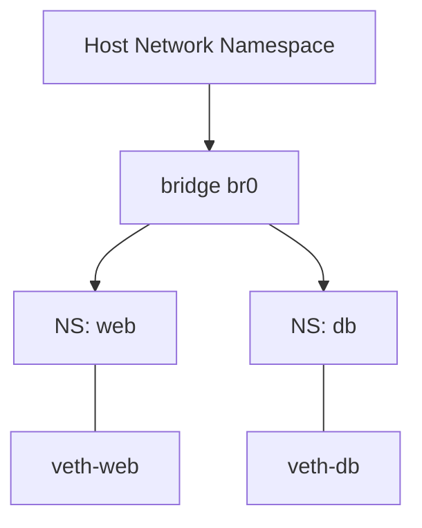

```bash
sudo ip netns add web                  # 建命名空间
sudo ip netns list
sudo ip netns exec web ip addr         # 在命名空间内执行
sudo ip netns delete web
```

容器和虚拟网络的底层就是 netns + veth + bridge。

### 11.10 NetworkManager / netplan

Ubuntu 18+ 默认 netplan：

```yaml
# /etc/netplan/00-installer.yaml
network:
  version: 2
  ethernets:
    eth0:
      dhcp4: false
      addresses: [192.168.1.50/24]
      routes:
        - to: default
          via: 192.168.1.1
      nameservers:
        addresses: [8.8.8.8, 114.114.114.114]
```

```bash
sudo netplan apply
sudo netplan try
```

---

## 第 12 章 磁盘、分区、LVM 与文件系统

### 12.1 块设备层级图

```
物理磁盘 (sda)
    └── 分区 (sda1, sda2)
           └── (可选 RAID / LVM)
                   └── 文件系统 (ext4 / xfs / btrfs)
                           └── 挂载点 (/, /home)
```

### 12.2 lsblk / fdisk / parted

```bash
lsblk                              # 树形看块设备 ★最常用
lsblk -f                           # 带文件系统
blkid                              # UUID
df -h                              # 已挂载使用率
df -i                              # inode 使用率
du -sh /var/*                      # 目录占用
du -sh /var/* 2>/dev/null | sort -h

sudo fdisk -l                      # 分区列表
sudo fdisk /dev/sdb                # 交互分区（MBR<2TB）
sudo parted /dev/sdb               # GPT 大盘
sudo parted -s /dev/sdb mklabel gpt mkpart primary ext4 0% 100%
```

### 12.3 创建文件系统

```bash
sudo mkfs.ext4 /dev/sdb1
sudo mkfs.xfs  /dev/sdb1
sudo mkfs.btrfs /dev/sdb1
sudo mkfs.vfat /dev/sdb1           # U 盘常用
sudo mkswap   /dev/sdb2 && sudo swapon /dev/sdb2
```

### 12.4 挂载

```bash
sudo mount /dev/sdb1 /mnt/data
sudo umount /mnt/data
mount                               # 看已挂载
findmnt                             # 树形（更清晰）

# 持久挂载 → /etc/fstab
# UUID=xxxx  /mnt/data  ext4  defaults,noatime  0  2
sudo blkid /dev/sdb1                # 拿 UUID
sudo mount -a                       # 测试 fstab 是否正确
```

⚠️ **踩坑**：fstab 写错 → 重启进不去系统。务必 `mount -a` 先验证。

### 12.5 LVM 逻辑卷

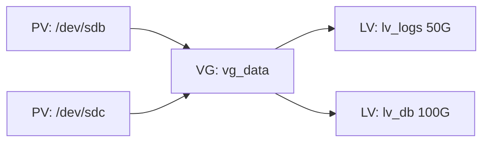

```bash
# 创建 PV
sudo pvcreate /dev/sdb /dev/sdc
sudo pvs / pvdisplay

# 创建 VG
sudo vgcreate vg_data /dev/sdb /dev/sdc
sudo vgs / vgdisplay

# 创建 LV
sudo lvcreate -L 50G -n lv_logs vg_data
sudo lvs / lvdisplay

# 格式化与挂载
sudo mkfs.ext4 /dev/vg_data/lv_logs
sudo mount /dev/vg_data/lv_logs /var/log/app

# 扩容（ext4 在线扩）
sudo lvextend -L +20G /dev/vg_data/lv_logs
sudo resize2fs /dev/vg_data/lv_logs

# xfs 用 xfs_growfs
sudo xfs_growfs /mount/point
```

### 12.6 RAID 速览

| 级别 | 最少盘 | 容量 | 容错 | 性能 |
|---|---|---|---|---|
| RAID 0 | 2 | N | 无 | 读写最快 |
| RAID 1 | 2 | N/2 | 1 块 | 读快 |
| RAID 5 | 3 | N-1 | 1 块 | 读快写中 |
| RAID 6 | 4 | N-2 | 2 块 | 写较慢 |
| RAID 10 | 4 | N/2 | 多块 | 综合最好 |

```bash
sudo apt install mdadm
sudo mdadm --create /dev/md0 --level=1 --raid-devices=2 /dev/sdb /dev/sdc
cat /proc/mdstat
```

### 12.7 ext4 vs xfs 对比

| 特性 | ext4 | xfs |
|---|---|---|
| 稳定性 | 极高 | 高 |
| 单文件大小 | 16TB | 8EB |
| 在线扩容 | 是 | 是 |
| 在线缩容 | 是 | **否** |
| 适合 | 通用 | 大文件、数据库 |

🎯 **生产建议**：根分区 ext4，数据盘视用途选 xfs（大日志/大文件）或 ext4。

---

## 第 13 章 性能监控与火焰图

### 13.1 性能分析的 USE 方法

> **U**tilization（使用率）+ **S**aturation（饱和度）+ **E**rrors（错误）

| 资源 | 使用率 | 饱和度 | 错误 |
|---|---|---|---|
| CPU | top %us+%sy | load avg, runq | / |
| 内存 | used / total | swap-in/out | OOM kill |
| 磁盘 | %util | await, queue | I/O err |
| 网络 | rx/tx Mbps | drop, retrans | err pkt |

### 13.2 vmstat / iostat / sar

```bash
vmstat 1 5                # 每秒采样 1 次共 5 次
#   r b   swpd free buff cache  si so bi bo  in cs us sy id wa st
# r 运行队列、b 阻塞队列；si/so swap；wa IO 等待

iostat -xz 1              # 详细 IO
#   %util > 80% 持续 → 磁盘瓶颈
#   await 高 → 单 IO 慢

sar -u 1 5                # CPU
sar -r 1 5                # 内存
sar -n DEV 1 5            # 网络
sar -d -p 1 5             # 磁盘
```

### 13.3 free / mpstat / pidstat

```bash
free -h                    # 内存
#               total   used   free  shared  buff/cache  available
# Mem:          16Gi    4Gi    8Gi   200Mi   4Gi         11Gi
# Swap:         2Gi     0B     2Gi

mpstat -P ALL 1            # 每个 CPU 核
pidstat -u 1               # 每个进程 CPU
pidstat -r 1               # 每个进程内存
pidstat -d 1               # 每个进程 IO
```

📌 **重点**：`available` 才是真正能用的内存。Linux 把空闲内存当 cache 用，free 小不代表内存不够。

### 13.4 perf — Linux 性能利器

```bash
sudo apt install linux-tools-common linux-tools-$(uname -r)
sudo perf top                              # 实时函数耗时
sudo perf stat -p PID sleep 5              # 进程 5s 内的统计
sudo perf record -F 99 -p PID -g -- sleep 30
sudo perf report                            # 交互查看
sudo perf script | flamegraph.pl > fg.svg   # 火焰图
```

### 13.5 火焰图

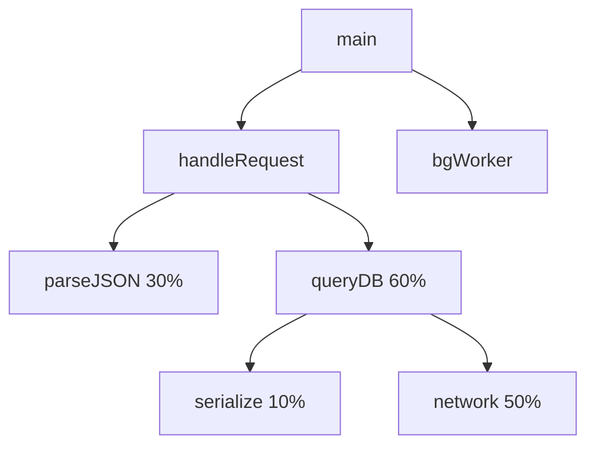

> 横轴 = 占比时间，纵轴 = 调用栈。**横条越宽 = 越值得优化**。

工具链：[Brendan Gregg 的 FlameGraph](https://github.com/brendangregg/FlameGraph)

### 13.6 eBPF / bpftrace

```bash
sudo apt install bpftrace
# 谁在打开文件
sudo bpftrace -e 'tracepoint:syscalls:sys_enter_openat { printf("%s %s\n", comm, str(args->filename)); }'

# TCP 建连
sudo bpftrace -e 'kprobe:tcp_connect { printf("%s -> connect\n", comm); }'
```

### 13.7 综合排查模板（CPU 高）

```bash
# 1) 看负载
uptime
# 2) 看哪个进程 CPU 高
top -o %CPU
# 3) 看是用户态还是内核态
mpstat -P ALL 1 3
# 4) 看是哪个线程
top -H -p PID
pidstat -t -p PID 1
# 5) 看在跑什么栈
sudo perf top -p PID
# 或采样 + 火焰图
```

---

## 第 14 章 日志管理

### 14.1 systemd 时代：journalctl

```bash
journalctl                                # 全部日志
journalctl -u nginx                       # 某服务
journalctl -u nginx -f                    # 实时
journalctl -u nginx --since "1 hour ago"
journalctl --since "2026-05-26 09:00"
journalctl -p err                         # 仅 ERR 及以上
journalctl _PID=1234                      # 按进程
journalctl -k                             # 内核
journalctl -b                             # 本次启动
journalctl -b -1                          # 上次启动
journalctl --disk-usage                   # 占用
sudo journalctl --vacuum-time=7d          # 只留 7 天
sudo journalctl --vacuum-size=500M
```

日志级别：

```
0 emerg  1 alert  2 crit   3 err
4 warn   5 notice 6 info   7 debug
```

### 14.2 /var/log 经典文件

| 文件 | 内容 |
|---|---|
| `/var/log/syslog`（Debian） | 系统综合 |
| `/var/log/messages`（RHEL） | 系统综合 |
| `/var/log/auth.log` / `secure` | 登录、sudo |
| `/var/log/kern.log` | 内核 |
| `/var/log/dmesg` | 启动期内核（dmesg 命令） |
| `/var/log/nginx/access.log` | nginx 访问 |
| `/var/log/mysql/error.log` | mysql |
| `/var/log/cron.log` | cron |

### 14.3 rsyslog 配置

```
# /etc/rsyslog.d/50-app.conf
local0.*    /var/log/myapp.log
& stop                  # 不再让别的规则处理

# 远程传送
*.* @logserver:514      # UDP
*.* @@logserver:514     # TCP
```

```bash
sudo systemctl restart rsyslog
logger -p local0.info "test message"
```

### 14.4 logrotate

```
# /etc/logrotate.d/myapp
/var/log/myapp/*.log {
    daily
    rotate 14
    compress
    delaycompress
    missingok
    notifempty
    create 0640 appuser appuser
    sharedscripts
    postrotate
        systemctl reload myapp >/dev/null 2>&1 || true
    endscript
}
```

```bash
sudo logrotate -d /etc/logrotate.d/myapp     # dry-run
sudo logrotate -f /etc/logrotate.d/myapp     # 强制立即
```

### 14.5 ELK / Loki 简介


中小规模推荐 **Loki + Grafana**；大规模 **ELK**。

---

## 第 15 章 SSH 与远程操作

### 15.1 SSH 原理图

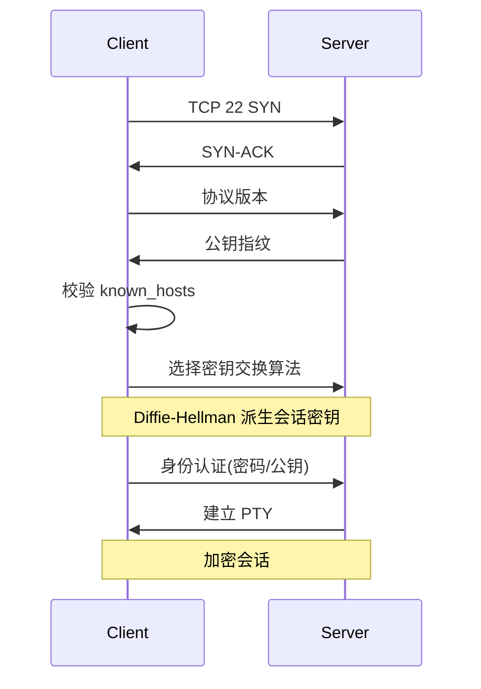

### 15.2 公钥认证完整流程

```bash
# 客户端：生成密钥
ssh-keygen -t ed25519 -C "alice@laptop"
# 生成 ~/.ssh/id_ed25519 (私钥)
#      ~/.ssh/id_ed25519.pub (公钥)

# 拷贝公钥到服务器
ssh-copy-id alice@server
# 或手动追加
cat ~/.ssh/id_ed25519.pub | ssh alice@server 'mkdir -p ~/.ssh && cat >> ~/.ssh/authorized_keys && chmod 700 ~/.ssh && chmod 600 ~/.ssh/authorized_keys'

# 登录
ssh alice@server
```

### 15.3 ~/.ssh/config 客户端配置

```
# ~/.ssh/config
Host gw
    HostName 203.0.113.10
    User ops
    Port 22022
    IdentityFile ~/.ssh/id_ed25519_gw

Host db
    HostName 10.0.0.5
    User dbadmin
    ProxyJump gw                # 通过 gw 跳板

Host *.aliyun
    User root
    StrictHostKeyChecking accept-new
```

之后：

```bash
ssh gw          # 直接连
ssh db          # 自动跳板
scp file db:/tmp/
```

### 15.4 sshd_config 服务端安全配置

```
# /etc/ssh/sshd_config
Port 22022                          # 改默认端口
PermitRootLogin no                  # 禁止 root
PasswordAuthentication no           # 关密码登录
PubkeyAuthentication yes
AllowUsers alice bob                # 白名单
MaxAuthTries 3
ClientAliveInterval 60
ClientAliveCountMax 3
```

```bash
sudo sshd -t                        # 测试语法
sudo systemctl reload sshd
```

### 15.5 SCP / SFTP / rsync

```bash
scp file alice@server:/tmp/
scp -r dir/ alice@server:/tmp/
scp alice@server:/tmp/file ./

sftp alice@server
> put file
> get file
> ls
> bye

# rsync — 增量同步 ★强烈推荐
rsync -avz --progress src/ alice@server:/dst/
rsync -avz --delete src/ host:/dst/   # 镜像（dst 多余的会删）
rsync -avz -e "ssh -p 22022" src/ host:/dst/
```

| 工具 | 速度 | 增量 | 删除同步 | 进度条 |
|---|---|---|---|---|
| scp | 中 | 否 | 否 | 否 |
| rsync | 快 | ✅ | ✅ | ✅ |

### 15.6 tmux —— 会话保持神器

```bash
tmux                               # 新会话
tmux new -s work                   # 命名
tmux ls                            # 列会话
tmux a -t work                     # 接入
tmux kill-session -t work

# 会话内快捷键（默认前缀 Ctrl+b）
# Ctrl+b "    水平分屏
# Ctrl+b %    垂直分屏
# Ctrl+b o    切换面板
# Ctrl+b c    新窗口
# Ctrl+b n/p  下/上窗口
# Ctrl+b d    detach（断开但保留）
# Ctrl+b [    复制模式（vi 风格滚屏）
```

### 15.7 screen（老牌）

```bash
screen -S work
# Ctrl+a d  detach
screen -ls
screen -r work
```

---

## 第 16 章 内核参数与调优

### 16.1 sysctl

```bash
sysctl -a                           # 所有参数（成千上万）
sysctl net.ipv4.ip_forward
sudo sysctl -w net.ipv4.ip_forward=1   # 临时
# 永久：写 /etc/sysctl.conf 或 /etc/sysctl.d/*.conf
sudo sysctl -p                      # 重载
```

### 16.2 生产常调参数

```bash
# /etc/sysctl.d/99-tuning.conf

# ---------- 文件句柄 ----------
fs.file-max = 2097152

# ---------- 网络队列 ----------
net.core.somaxconn = 65535
net.core.netdev_max_backlog = 16384
net.ipv4.tcp_max_syn_backlog = 8192

# ---------- TIME_WAIT 优化 ----------
net.ipv4.tcp_tw_reuse = 1
net.ipv4.tcp_fin_timeout = 15

# ---------- keepalive ----------
net.ipv4.tcp_keepalive_time = 600
net.ipv4.tcp_keepalive_intvl = 30
net.ipv4.tcp_keepalive_probes = 3

# ---------- 缓冲区 ----------
net.core.rmem_max = 16777216
net.core.wmem_max = 16777216
net.ipv4.tcp_rmem = 4096 87380 16777216
net.ipv4.tcp_wmem = 4096 65536 16777216

# ---------- 端口范围 ----------
net.ipv4.ip_local_port_range = 1024 65535

# ---------- 路由 / 转发 ----------
net.ipv4.ip_forward = 1

# ---------- 安全 ----------
net.ipv4.tcp_syncookies = 1
net.ipv4.conf.all.rp_filter = 1
net.ipv4.icmp_echo_ignore_broadcasts = 1

# ---------- 内存 ----------
vm.swappiness = 10
vm.overcommit_memory = 1
vm.max_map_count = 262144
```

### 16.3 ulimit / limits.conf

```bash
ulimit -a                          # 看当前限制
ulimit -n 65535                    # 临时改文件句柄

# 永久：/etc/security/limits.conf
# *  soft  nofile  65535
# *  hard  nofile  65535
# *  soft  nproc   65535
# *  hard  nproc   65535
```

systemd 服务里：

```ini
[Service]
LimitNOFILE=65535
LimitNPROC=65535
```

### 16.4 透明大页 / NUMA / Swap

```bash
# 数据库通常关闭 THP
echo never > /sys/kernel/mm/transparent_hugepage/enabled

# 关闭/调小 swap
sudo swapoff -a
# 永久：注释 /etc/fstab 的 swap 行；vm.swappiness=1

# NUMA
numactl --hardware
numastat
```

### 16.5 OOM Killer

```bash
# 看最近 OOM
dmesg -T | grep -i "killed process"
journalctl -k | grep -i oom

# 让某进程不被杀
echo -1000 > /proc/$PID/oom_score_adj
```

---

## 第 17 章 容器（Namespace / Cgroup / Docker）

### 17.1 容器原理：两条腿

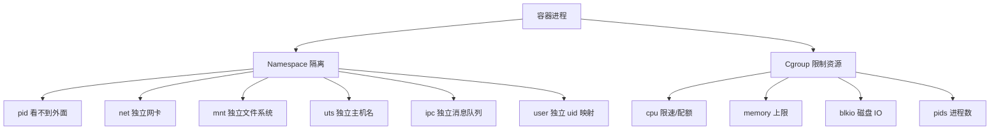

### 17.2 namespace 实操

```bash
sudo unshare --pid --fork --mount-proc bash
# 进入新 PID namespace
ps -ef                  # 只能看见自己

sudo unshare --net bash
# 新网卡命名空间
ip link
```

### 17.3 cgroup v2 实操

```bash
mount | grep cgroup     # 看版本
cd /sys/fs/cgroup
mkdir mygroup
echo 50000 100000 > mygroup/cpu.max     # 限 50% CPU
echo 100M > mygroup/memory.max
echo $$ > mygroup/cgroup.procs          # 把当前 shell 放入
```

### 17.4 Docker 速成

```bash
# 安装
curl -fsSL https://get.docker.com | sh
sudo usermod -aG docker $USER

# 镜像
docker pull nginx:1.25
docker images
docker rmi nginx:1.25

# 容器
docker run -d --name web -p 8080:80 nginx
docker ps
docker ps -a
docker logs -f web
docker exec -it web bash
docker stop web
docker rm web
docker restart web

# 资源限制
docker run -d --cpus=0.5 --memory=256m --name limited nginx

# 卷
docker run -v /host/data:/data nginx
docker volume create mydata
docker run -v mydata:/data nginx

# 网络
docker network create mynet
docker run --network mynet ...
```

### 17.5 Dockerfile 最佳实践

```dockerfile
# 多阶段构建
FROM golang:1.22 AS builder
WORKDIR /src
COPY go.mod go.sum ./
RUN go mod download
COPY . .
RUN CGO_ENABLED=0 go build -o /out/app ./cmd/server

FROM alpine:3.20
RUN apk add --no-cache ca-certificates tzdata && \
    addgroup -S app && adduser -S app -G app
USER app
COPY --from=builder /out/app /app
EXPOSE 8080
HEALTHCHECK --interval=30s --timeout=3s CMD wget -q -O- http://localhost:8080/health || exit 1
ENTRYPOINT ["/app"]
```

### 17.6 docker compose

```yaml
# docker-compose.yml
version: "3.9"
services:
  web:
    image: nginx:1.25
    ports: ["80:80"]
    volumes: ["./html:/usr/share/nginx/html"]
    restart: unless-stopped
  db:
    image: mysql:8
    environment:
      MYSQL_ROOT_PASSWORD: secret
    volumes: ["db_data:/var/lib/mysql"]
volumes:
  db_data:
```

```bash
docker compose up -d
docker compose logs -f
docker compose down
```

### 17.7 Podman（无 daemon、rootless）

```bash
sudo apt install podman
podman run -d --name web -p 8080:80 nginx
# 命令几乎与 docker 一致，可 alias docker=podman
```

---

## 第 18 章 自动化运维（Ansible + Shell 模板）

### 18.1 为什么需要自动化

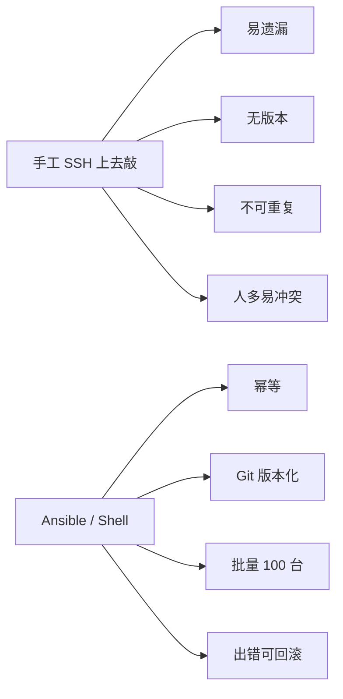

### 18.2 Ansible 入门

```bash
sudo apt install ansible
ansible --version
```

#### inventory

```ini
# /etc/ansible/hosts 或 ./hosts
[web]
web1 ansible_host=10.0.0.11
web2 ansible_host=10.0.0.12

[db]
db1 ansible_host=10.0.0.21

[all:vars]
ansible_user=ops
ansible_ssh_private_key_file=~/.ssh/id_ed25519
```

#### ad-hoc 命令

```bash
ansible all -m ping
ansible web -m shell -a "uptime"
ansible web -m apt -a "name=nginx state=present" -b   # -b = become(sudo)
ansible web -m copy -a "src=app.conf dest=/etc/app.conf owner=root mode=0644" -b
ansible web -m service -a "name=nginx state=restarted" -b
```

#### playbook

```yaml
# deploy.yml
- name: Deploy Web
  hosts: web
  become: true
  vars:
    app_version: "1.2.3"
  tasks:
    - name: Install nginx
      apt:
        name: nginx
        state: present
        update_cache: true

    - name: Render config
      template:
        src: nginx.conf.j2
        dest: /etc/nginx/nginx.conf
        backup: true
      notify: reload nginx

    - name: Ensure service running
      service:
        name: nginx
        state: started
        enabled: true

  handlers:
    - name: reload nginx
      service:
        name: nginx
        state: reloaded
```

```bash
ansible-playbook -i hosts deploy.yml
ansible-playbook -i hosts deploy.yml --check       # dry-run
ansible-playbook -i hosts deploy.yml --diff
ansible-playbook -i hosts deploy.yml --limit web1
ansible-playbook -i hosts deploy.yml --tags config
```

### 18.3 Role 结构

```
roles/
  nginx/
    tasks/main.yml
    handlers/main.yml
    templates/nginx.conf.j2
    files/...
    vars/main.yml
    defaults/main.yml
    meta/main.yml
```

### 18.4 一键初始化服务器脚本

```bash
#!/usr/bin/env bash
# init-server.sh — Ubuntu 22.04 服务器初始化
set -euo pipefail

log() { printf '[%s] %s\n' "$(date '+%T')" "$*"; }

log "1. update"
apt update -y && apt upgrade -y

log "2. base packages"
apt install -y vim curl wget git htop tmux net-tools \
    build-essential unzip jq tree ncdu

log "3. timezone"
timedatectl set-timezone Asia/Shanghai

log "4. hostname"
hostnamectl set-hostname "${1:-server-01}"

log "5. user ops"
id ops &>/dev/null || {
    useradd -m -s /bin/bash ops
    echo "ops:$(openssl rand -base64 16)" | chpasswd
    usermod -aG sudo ops
}

log "6. ssh hardening"
sed -i 's/^#\?PermitRootLogin.*/PermitRootLogin no/' /etc/ssh/sshd_config
sed -i 's/^#\?PasswordAuthentication.*/PasswordAuthentication no/' /etc/ssh/sshd_config
systemctl reload sshd

log "7. firewall"
apt install -y ufw
ufw default deny incoming
ufw default allow outgoing
ufw allow 22/tcp
ufw --force enable

log "8. sysctl"
cat >> /etc/sysctl.d/99-tuning.conf <<EOF
fs.file-max = 2097152
net.core.somaxconn = 65535
net.ipv4.tcp_tw_reuse = 1
vm.swappiness = 10
EOF
sysctl -p /etc/sysctl.d/99-tuning.conf

log "9. limits"
cat >> /etc/security/limits.conf <<EOF
* soft nofile 65535
* hard nofile 65535
EOF

log "DONE. Reboot recommended."
```

---

## 第 19 章 安全加固

### 19.1 三道防线

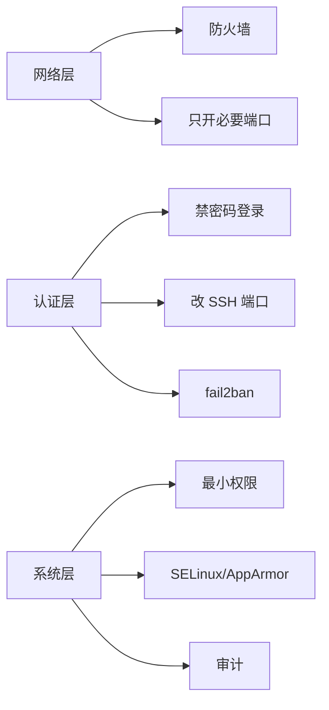

### 19.2 fail2ban

```bash
sudo apt install fail2ban

# /etc/fail2ban/jail.local
[DEFAULT]
bantime  = 1h
findtime = 10m
maxretry = 5

[sshd]
enabled = true
port    = ssh

sudo systemctl enable --now fail2ban
sudo fail2ban-client status sshd
sudo fail2ban-client set sshd unbanip 1.2.3.4
```

### 19.3 SELinux 简介（RHEL 系）

```bash
getenforce                       # Enforcing / Permissive / Disabled
sudo setenforce 0                # 临时关
# 永久：/etc/selinux/config

ls -Z /var/www/html              # 看上下文
sudo chcon -t httpd_sys_content_t /var/www/html/index.html
sudo restorecon -Rv /var/www
sudo audit2why < /var/log/audit/audit.log | less
```

### 19.4 AppArmor（Ubuntu 默认）

```bash
sudo aa-status
sudo aa-enforce /etc/apparmor.d/usr.sbin.nginx
sudo aa-complain /etc/apparmor.d/usr.sbin.nginx
```

### 19.5 漏洞扫描

```bash
# 系统更新（最有效的修补）
sudo unattended-upgrades --dry-run
sudo apt install unattended-upgrades
sudo dpkg-reconfigure -plow unattended-upgrades

# 端口扫描自查
nmap -sT -p- localhost
ss -tulnp

# Lynis 系统安全审计
sudo apt install lynis
sudo lynis audit system
```

### 19.6 安全检查清单

- [ ] 禁 root 直接 SSH
- [ ] 关密码登录，只用密钥
- [ ] SSH 改非 22 端口（防扫描噪音）
- [ ] 防火墙默认 deny incoming
- [ ] 装 fail2ban
- [ ] 自动安全更新打开
- [ ] /etc /var/log 定时备份
- [ ] sudo 收敛到最小命令集
- [ ] 关闭未使用服务（snap、cups、avahi）
- [ ] 监控告警（CPU、内存、磁盘、登录失败）
- [ ] 日志远程归档（防被擦）
- [ ] 定期 lynis 审计

---

## 附录 A：命令速查大表

### A.1 文件与目录

| 命令 | 一句话 |
|---|---|
| `ls -lah` | 长格式 + 隐藏 + 人类大小 |
| `cd -` | 回到上次目录 |
| `pwd -P` | 物理路径 |
| `mkdir -p a/b/c` | 递归建目录 |
| `cp -a` | 完整保留属性 |
| `rm -rf` | 递归强删（小心！） |
| `ln -s` | 软链接 |
| `stat` | 详细元信息 |
| `file` | 文件类型 |

### A.2 查看与查找

| 命令 | 一句话 |
|---|---|
| `less` | 大文件分页 |
| `tail -F` | 跟踪日志（含 rotate） |
| `find . -name X` | 找文件 |
| `find . -mtime -7` | 7 天内修改 |
| `xargs -P 4` | 并发执行 |
| `grep -rn X dir` | 递归带行号 |
| `wc -l` | 行数 |

### A.3 进程

| 命令 | 一句话 |
|---|---|
| `ps aux` | 全部进程 |
| `pstree -p` | 进程树 |
| `top` / `htop` | 实时 |
| `kill -9 PID` | 强杀 |
| `pkill -f X` | 模糊杀 |
| `nohup ... &` | 后台运行 |
| `systemctl status X` | 服务状态 |
| `journalctl -u X -f` | 服务日志 |

### A.4 网络

| 命令 | 一句话 |
|---|---|
| `ip addr` | 看 IP |
| `ip route` | 看路由 |
| `ss -tulnp` | 看监听 + 进程 |
| `dig X` | DNS 解析 |
| `mtr X` | 路由质量 |
| `tcpdump -i any port 80` | 抓包 |
| `curl -I X` | HTTP 头 |
| `nc -zv host port` | 测端口 |

### A.5 磁盘

| 命令 | 一句话 |
|---|---|
| `lsblk -f` | 块设备 + 文件系统 |
| `df -h` | 已挂载使用率 |
| `du -sh *` | 当前目录占用 |
| `mount -a` | 测 fstab |
| `iostat -xz 1` | IO 实时 |
| `ncdu /var` | 交互式磁盘占用浏览 |

### A.6 系统信息

| 命令 | 一句话 |
|---|---|
| `uname -a` | 内核与平台 |
| `lsb_release -a` | 发行版 |
| `uptime` | 负载 |
| `free -h` | 内存 |
| `vmstat 1` | 综合 |
| `dmesg -T \| tail` | 内核最新事件 |

### A.7 文本处理

| 命令 | 一句话 |
|---|---|
| `grep -E pat f` | 扩展正则 |
| `sed -i 's/a/b/g'` | 直接改文件 |
| `awk '{print $2}'` | 取第 2 列 |
| `sort -u` | 排序去重 |
| `uniq -c` | 去重计数 |
| `cut -d: -f1` | 按分隔取列 |
| `tr a-z A-Z` | 字符转换 |
| `paste a b` | 横向拼接 |

---

## 附录 B：生产事故案例集

### B.1 案例：磁盘 100% 但 du 找不到文件

**现象**：`df -h` 显示 / 100%，但 `du -sh /*` 加起来才 60%。

**根因**：有进程持有已删除文件的 fd，磁盘没真正释放。

**排查**：

```bash
sudo lsof | grep deleted | sort -k7 -rn | head
```

**修复**：重启对应进程，或 `> /proc/PID/fd/N`。

---

### B.2 案例：Too many open files

**现象**：服务报 `accept: too many open files`。

**根因**：进程 fd 数超过 ulimit。

**排查**：

```bash
cat /proc/$PID/limits | grep "open files"
ls /proc/$PID/fd | wc -l
```

**修复**：

```ini
# /etc/security/limits.conf
nginx soft nofile 65535
nginx hard nofile 65535
# 或 systemd unit
LimitNOFILE=65535
```

---

### B.3 案例：CPU 持续 100% 但找不到进程

**现象**：top 显示 sy 很高，但没有具体高 CPU 进程。

**根因**：可能是中断、ksoftirqd、内核态。

**排查**：

```bash
mpstat -P ALL 1
cat /proc/interrupts
sudo perf top
```

---

### B.4 案例：服务器无法 SSH，被 fail2ban 自封

**现象**：自己运维偶尔输错密码，IP 被自家 fail2ban 封了。

**排查与解决**：

```bash
# 走串口 / VNC 上去
sudo fail2ban-client status sshd
sudo fail2ban-client set sshd unbanip 1.2.3.4
# 把自己 IP 加白名单
# /etc/fail2ban/jail.local
ignoreip = 127.0.0.1/8 1.2.3.0/24
```

---

### B.5 案例：定时任务不执行

**现象**：手动跑脚本 OK，cron 死活不执行。

**根因 1**：cron 的 PATH 极简，找不到命令。

**根因 2**：脚本依赖相对路径、当前目录。

**根因 3**：脚本没有执行权限或 shebang 错。

**修复**：

```cron
SHELL=/bin/bash
PATH=/usr/local/sbin:/usr/local/bin:/usr/sbin:/usr/bin:/sbin:/bin
0 3 * * * cd /opt/app && /opt/app/run.sh >> /var/log/run.log 2>&1
```

---

### B.6 案例：内存够但 fork 失败

**现象**：`fork: Cannot allocate memory`。

**根因**：`vm.overcommit_memory=2` 时计算保守；或 `pids cgroup` 限制。

**排查**：

```bash
sysctl vm.overcommit_memory
cat /proc/sys/kernel/pid_max
ps -eLf | wc -l
```

---

### B.7 案例：rm -rf 误删

**预防**：

- 危险操作前 `pwd`、`ls` 确认
- 长目录用变量并 `echo` 预览：`echo rm -rf "$dir"/*`
- 用 `trash-cli` 代替 `rm`
- 重要服务器禁 root，用 sudo 留审计
- 定期备份 + 异地（核心防线）

**误删后**：立即停机，挂载到另一台，用 `extundelete` / `testdisk` 尝试恢复。

---

## 附录 C：推荐学习资源

### C.1 入门书

- **《鸟哥的 Linux 私房菜（基础学习篇）》** —— 中文区最经典入门书
- **《Linux 命令行与 shell 脚本编程大全》** Richard Blum
- **《The Linux Command Line》** William Shotts（免费 PDF）

### C.2 进阶书

- **《UNIX 环境高级编程（APUE）》** W. Richard Stevens —— 系统调用圣经
- **《深入理解 Linux 内核》** Daniel P. Bovet
- **《性能之巅》** Brendan Gregg —— 性能调优必读

### C.3 在线资源

- TLDR pages：https://tldr.sh/
- ExplainShell：https://explainshell.com/
- Linux Documentation Project：https://tldp.org/
- Brendan Gregg 的博客：https://www.brendangregg.com/
- Arch Wiki（即使不用 Arch 也是宝库）：https://wiki.archlinux.org/

### C.4 练习平台

- Linux Journey：https://linuxjourney.com/
- OverTheWire Bandit（命令行闯关）：https://overthewire.org/wargames/bandit/
- 自己装 3 台虚拟机搭主从复制 + 负载均衡

### C.5 一周练习路径

| 日 | 内容 |
|---|---|
| 周一 | 装虚拟机 + SSH 配置 + 基础命令 |
| 周二 | Vim + 文本三剑客 |
| 周三 | 用户权限 + 进程 systemd |
| 周四 | 写一个监控磁盘的 Shell 脚本 + cron |
| 周五 | 网络 / 防火墙 / SSH 加固 |
| 周六 | Docker 跑 nginx + mysql |
| 周日 | Ansible playbook 部署一个 web 站 |

---

## 结语

> "学习 Linux 没有捷径，唯一的路是把手放到键盘上敲下去。"

🎯 **下一步**：把这份文档放在手边，遇到一个真实问题就翻到对应章节。每解决一个问题，给自己加一条"踩坑笔记"，三个月后你会拥有自己的"私房菜"。

祝你成为团队里那个"命令行像呼吸一样自然"的人。

---

*文档版本：v1.0  •  适用于 Ubuntu 22.04 / Rocky 9 / Debian 12*
