# 06 · iOS 开发完全指南

> 面向零基础 / 从其他端转 iOS 的工程师。读完并跟着练完，你可以独立开发并上架一个 App Store 应用。
>
> 文档篇幅较长，建议配合 Xcode 边读边练。所有代码均经过 Xcode 15 / Swift 5.9+ / iOS 17 SDK 验证。

---

## 目录

- [第 0 章 iOS 学习路线图](#第-0-章-ios-学习路线图)
- [第 1 章 准备工作](#第-1-章-准备工作)
- [第 2 章 Swift 语言基础](#第-2-章-swift-语言基础)
- [第 3 章 Swift 进阶](#第-3-章-swift-进阶)
- [第 4 章 Xcode IDE 详解](#第-4-章-xcode-ide-详解)
- [第 5 章 UIKit 入门](#第-5-章-uikit-入门)
- [第 6 章 SwiftUI 入门](#第-6-章-swiftui-入门)
- [第 7 章 SwiftUI 进阶](#第-7-章-swiftui-进阶)
- [第 8 章 屏幕适配与多端体验](#第-8-章-屏幕适配与多端体验)
- [第 9 章 数据持久化](#第-9-章-数据持久化)
- [第 10 章 网络](#第-10-章-网络)
- [第 11 章 并发](#第-11-章-并发)
- [第 12 章 系统能力](#第-12-章-系统能力)
- [第 13 章 架构模式](#第-13-章-架构模式)
- [第 14 章 测试](#第-14-章-测试)
- [第 15 章 性能优化](#第-15-章-性能优化)
- [第 16 章 包管理与模块化](#第-16-章-包管理与模块化)
- [第 17 章 上架 App Store](#第-17-章-上架-app-store)
- [第 18 章 CI/CD](#第-18-章-cicd)
- [第 19 章 跨端选型](#第-19-章-跨端选型)
- [第 20 章 实战：从 0 到 1 做一个待办 App](#第-20-章-实战从-0-到-1-做一个待办-app)
- [附录](#附录)

---

## 第 0 章 iOS 学习路线图

### 0.1 学习路径思维导图

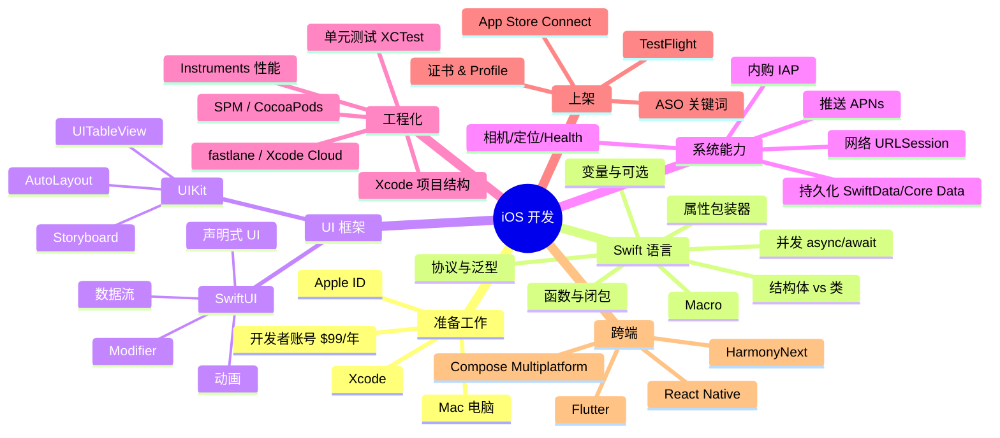

### 0.2 Apple 生态全景

| 平台 | 系统 | 设备 | 主要框架 |
|------|------|------|----------|
| iPhone | iOS | iPhone | UIKit / SwiftUI |
| iPad | iPadOS | iPad | UIKit / SwiftUI / PencilKit |
| Mac | macOS | MacBook / iMac | AppKit / SwiftUI / Catalyst |
| Apple Watch | watchOS | Watch | SwiftUI / WatchKit |
| Apple TV | tvOS | Apple TV | UIKit / SwiftUI / TVUIKit |
| Vision Pro | visionOS | Vision Pro | SwiftUI / RealityKit |
| CarPlay | iOS | 车机 | CarPlay framework |

> 💡 **核心优势**：一次掌握 Swift + SwiftUI，可以同时开发 6 个平台的应用，这是 Apple "Write once, run everywhere with native UI" 的战略。

### 0.3 推荐学习节奏

| 周次 | 目标 | 产出 |
|------|------|------|
| 第 1 周 | 环境搭建 + Swift 基础 | 跑通 Hello World |
| 第 2 周 | SwiftUI 入门 | 一个静态页面 App |
| 第 3 周 | 网络 + JSON 解析 | 天气 App |
| 第 4 周 | SwiftData 持久化 | 待办 App |
| 第 5 周 | 架构 + 多页面 | 多 Tab 应用 |
| 第 6 周 | 真机调试 + TestFlight | Beta 版本 |
| 第 7~8 周 | 完善 + 上架 | 正式上线 |

🎯 **8 周目标**：完成首款上架 App。

---

## 第 1 章 准备工作

### 1.1 硬件要求

iOS 开发**必须** Mac 电脑（macOS 系统）。可选项：

| 方案 | 优点 | 缺点 |
|------|------|------|
| MacBook Air M2/M3 | 便携、续航好、性价比高 | 屏幕小 |
| MacBook Pro 14/16 | 性能强、屏幕好 | 贵 |
| Mac mini M2 | 便宜（4499 起） | 需自配显示器 |
| iMac M3 | 一体机美观 | 不便携 |
| 黑苹果 / 虚拟机 | 便宜 | 不稳定，不能真机调试 |

> ⚠️ Windows + 虚拟机 macOS 可以运行 Xcode，但**无法真机调试**也**无法上架**，仅适合体验。

**最低配置建议**：16GB 内存 + 512GB SSD，Xcode 模拟器与编译非常吃资源。

### 1.2 安装 Xcode

**方式一（推荐）**：Mac App Store 搜索 `Xcode` → 安装（约 15GB）。

**方式二（开发者直接下载）**：https://developer.apple.com/download/applications/

```bash
# 验证安装
xcode-select -p
# /Applications/Xcode.app/Contents/Developer

# 接受许可
sudo xcodebuild -license accept

# 安装命令行工具
xcode-select --install
```

### 1.3 Apple ID 与开发者账号

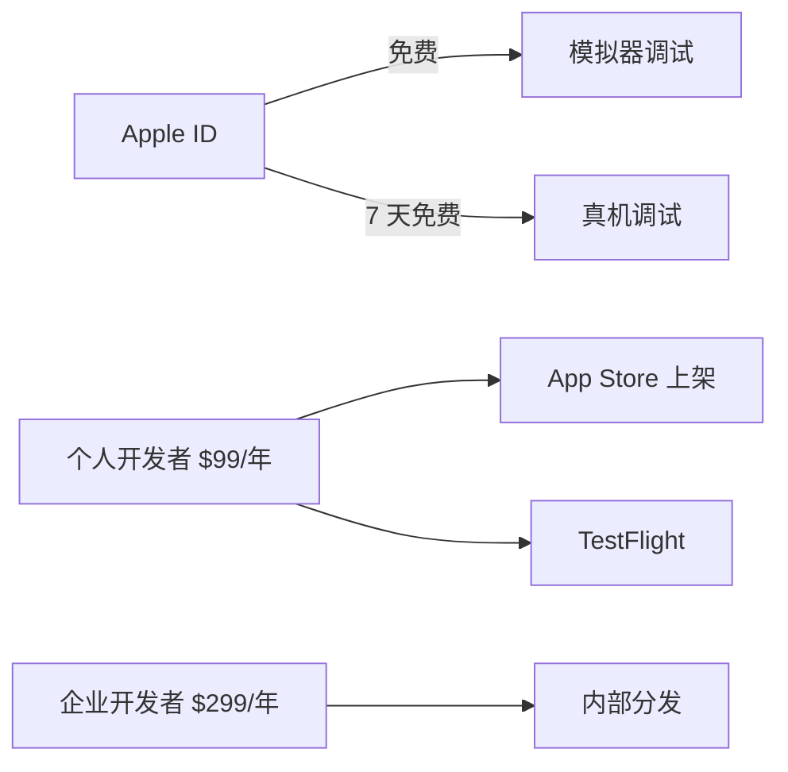

**注册步骤**：

1. 访问 https://appleid.apple.com/ 注册 Apple ID
2. 访问 https://developer.apple.com/ 加入开发者计划（$99/年，支持支付宝/银联）
3. 在 Xcode `Settings → Accounts` 登录

> 📌 个人开发者账号 14 天审核期，名字会出现在 App Store；公司账号需要邓白氏码（DUNS）。

### 1.4 模拟器使用

```
Xcode → Window → Devices and Simulators (⇧⌘2)
  └── Simulators 标签 → + 添加新模拟器
```

常用快捷键（运行模拟器时）：

| 操作 | 快捷键 |
|------|--------|
| Home 键 | ⇧⌘H |
| 锁屏 | ⌘L |
| 旋转 | ⌘← / ⌘→ |
| 摇晃手机 | ⌃⌘Z |
| 截图 | ⌘S |
| 录屏 | ⌘R |
| 切换深色模式 | ⇧⌘A |

### 1.5 真机调试

1. **iPhone 开启开发者模式**：`设置 → 隐私与安全性 → 开发者模式` 打开
2. **数据线连接 Mac**：信任此电脑
3. **Xcode 选择设备**：顶部 Scheme 选项卡选择真机
4. **签名**：`项目 → Signing & Capabilities → Team` 选择你的 Apple ID
5. **运行**：⌘R

> ⚠️ 免费账号每 7 天需要重新签名，付费账号 1 年。

### 1.6 第一个 Hello World

`File → New → Project → iOS → App → Next`

| 字段 | 填写 |
|------|------|
| Product Name | HelloWorld |
| Team | 你的 Apple ID |
| Organization Identifier | com.yourname |
| Interface | SwiftUI |
| Language | Swift |

```swift
// ContentView.swift
import SwiftUI

struct ContentView: View {
    var body: some View {
        VStack {
            Image(systemName: "globe")
                .imageScale(.large)
                .foregroundStyle(.tint)
            Text("Hello, iOS!")
                .font(.title)
        }
        .padding()
    }
}

#Preview {
    ContentView()
}
```

按 ⌘R 运行。看到 "Hello, iOS!" 即成功。

### 实战练习

1. 安装 Xcode 并创建 HelloWorld 项目，运行在模拟器
2. 用数据线连接 iPhone 真机调试运行
3. 修改文字为你的名字 + 当前日期

---

## 第 2 章 Swift 语言基础

Swift 是 Apple 2014 年推出的现代语言，类型安全、内存安全、性能接近 C++。本章假设你有任意编程语言基础。

### 2.1 变量、常量与类型推断

```swift
// var 变量，let 常量（推荐优先用 let）
var age = 18          // 类型推断为 Int
let name = "Alice"    // 类型推断为 String

// 显式类型标注
var height: Double = 1.75
let pi: Double = 3.14159

// 字符串插值
print("\(name) is \(age) years old")

// 多行字符串
let poem = """
  床前明月光，
  疑是地上霜。
  """
```

### 2.2 基本类型

| 类型 | 说明 | 示例 |
|------|------|------|
| `Int` | 整数（平台相关 32/64 位） | `let n = 100` |
| `Double` | 64 位浮点 | `let d = 3.14` |
| `Float` | 32 位浮点 | `let f: Float = 1.5` |
| `Bool` | 布尔 | `let b = true` |
| `String` | 字符串 | `let s = "hi"` |
| `Character` | 单字符 | `let c: Character = "A"` |
| `Array` | 数组 | `[1, 2, 3]` |
| `Dictionary` | 字典 | `["k": 1]` |
| `Set` | 集合 | `Set([1, 2])` |
| `Tuple` | 元组 | `(1, "a")` |

### 2.3 Optional 可选类型（核心特性）

Swift 用 `?` 表示「可能为 nil」，强制开发者处理空值，避免空指针崩溃。

```swift
var nickname: String? = nil        // 可选字符串，初值 nil
nickname = "Bob"

// 1. 强制解包（确定不为 nil 才能用，否则崩溃）
let upper = nickname!.uppercased()  // ⚠️ 危险

// 2. 可选绑定 if let
if let nick = nickname {
    print("Hi, \(nick)")
}

// 3. guard let（提前返回）
func greet(_ name: String?) {
    guard let name else { return }   // Swift 5.7+ 简写
    print("Hello, \(name)")
}

// 4. 空合并 ??
let display = nickname ?? "Anonymous"

// 5. 可选链 ?.
let count = nickname?.count   // 若 nil，count 也是 nil
```

> 💡 **黄金法则**：避免 `!` 强制解包，优先 `if let` / `guard let` / `??`。

### 2.4 控制流

```swift
// if
let score = 85
if score >= 90 { print("A") }
else if score >= 80 { print("B") }
else { print("C") }

// for-in
for i in 0..<5 { print(i) }        // 0,1,2,3,4
for i in 0...5 { print(i) }        // 0,1,2,3,4,5
for (idx, val) in ["a","b","c"].enumerated() {
    print(idx, val)
}

// while / repeat-while
var n = 10
while n > 0 { n -= 1 }

// switch（强大的模式匹配）
let point = (1, 1)
switch point {
case (0, 0): print("原点")
case (_, 0): print("X 轴")
case (0, _): print("Y 轴")
case (let x, let y) where x == y: print("对角线")
case (1...5, 1...5): print("第一象限")
default: print("其他")
}
```

### 2.5 函数与闭包

```swift
// 函数
func add(_ a: Int, _ b: Int) -> Int { a + b }   // 单表达式可省 return

// 外部参数名
func greet(person name: String, from city: String) -> String {
    "Hi \(name) from \(city)"
}
greet(person: "Tom", from: "Beijing")

// 默认值与可变参数
func sum(_ numbers: Int..., scale: Int = 1) -> Int {
    numbers.reduce(0, +) * scale
}
sum(1, 2, 3)             // 6
sum(1, 2, 3, scale: 10)  // 60

// 闭包（匿名函数）
let nums = [3, 1, 4, 1, 5]
let sorted = nums.sorted { $0 < $1 }   // 简写
let doubled = nums.map { $0 * 2 }
let evens = nums.filter { $0.isMultiple(of: 2) }

// 尾随闭包
UIView.animate(withDuration: 0.3) {
    // 动画代码
}
```

### 2.6 结构体 vs 类（值类型 vs 引用类型）

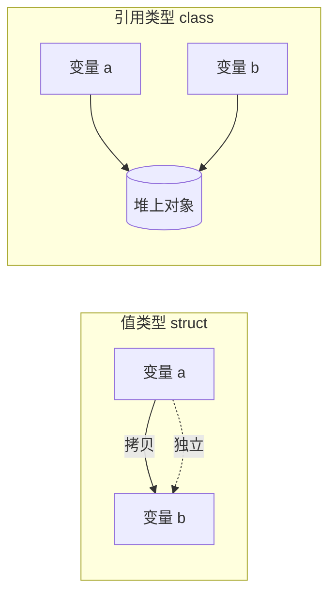

```swift
// 结构体（值类型，赋值即拷贝）
struct Point {
    var x: Double
    var y: Double
}
var p1 = Point(x: 0, y: 0)
var p2 = p1          // 拷贝
p2.x = 10
print(p1.x, p2.x)    // 0  10

// 类（引用类型，赋值是引用）
class Person {
    var name: String
    init(name: String) { self.name = name }
}
let a = Person(name: "Alice")
let b = a            // 同一个对象
b.name = "Bob"
print(a.name)        // Bob
```

| 对比 | struct | class |
|------|--------|-------|
| 类型 | 值类型 | 引用类型 |
| 拷贝 | 深拷贝 | 引用拷贝 |
| 继承 | 不支持 | 支持 |
| 析构 deinit | 不支持 | 支持 |
| 默认构造 | 自动生成 | 需手写 |
| 内存 | 栈/内联 | 堆 |
| 多线程 | 天然安全 | 需要同步 |

> 🎯 **Swift 哲学**：默认用 struct，需要继承或共享状态才用 class。SwiftUI 大量使用 struct View。

### 2.7 枚举

```swift
enum Direction {
    case north, south, east, west
}

// 关联值
enum NetworkResult {
    case success(data: Data)
    case failure(error: Error)
    case loading
}

let result = NetworkResult.success(data: Data())
switch result {
case .success(let data): print("got \(data.count) bytes")
case .failure(let err): print(err)
case .loading: print("...")
}

// 原始值
enum HTTPStatus: Int {
    case ok = 200
    case notFound = 404
    case serverError = 500
}
HTTPStatus(rawValue: 404)   // .notFound
```

### 2.8 协议

```swift
protocol Animal {
    var name: String { get }
    func sound() -> String
}

// 协议扩展提供默认实现
extension Animal {
    func describe() -> String { "\(name) says \(sound())" }
}

struct Dog: Animal {
    let name: String
    func sound() -> String { "Woof" }
}

print(Dog(name: "Rex").describe())  // Rex says Woof
```

### 2.9 泛型

```swift
// 泛型函数
func swap<T>(_ a: inout T, _ b: inout T) {
    let temp = a; a = b; b = temp
}

// 泛型类型
struct Stack<Element> {
    private var items: [Element] = []
    mutating func push(_ item: Element) { items.append(item) }
    mutating func pop() -> Element? { items.popLast() }
}

var s = Stack<Int>()
s.push(1); s.push(2)
s.pop()   // 2

// 类型约束
func max<T: Comparable>(_ a: T, _ b: T) -> T {
    a > b ? a : b
}
```

### 2.10 属性包装器（Property Wrapper）

```swift
@propertyWrapper
struct Clamped<T: Comparable> {
    var value: T
    let range: ClosedRange<T>
    var wrappedValue: T {
        get { value }
        set { value = min(max(newValue, range.lowerBound), range.upperBound) }
    }
    init(wrappedValue: T, _ range: ClosedRange<T>) {
        self.range = range
        self.value = min(max(wrappedValue, range.lowerBound), range.upperBound)
    }
}

struct Player {
    @Clamped(0...100) var hp: Int = 100
}

var p = Player()
p.hp = 200     // 自动 clamp 到 100
p.hp = -10     // 自动 clamp 到 0
```

> 💡 SwiftUI 的 `@State`、`@Binding`、`@StateObject` 都是属性包装器。

### 实战练习

1. 写一个函数 `func averageGrade(scores: [Int?]) -> Double?`，处理 nil
2. 用 enum + 关联值实现一个 `Result<Success, Failure>` 类型
3. 用泛型实现一个 `Queue<T>` 队列

---

## 第 3 章 Swift 进阶

### 3.1 async / await

```swift
// 老式回调
URLSession.shared.dataTask(with: url) { data, response, error in
    // 嵌套地狱
}.resume()

// async/await
func fetchUser(id: Int) async throws -> User {
    let (data, _) = try await URLSession.shared.data(from: url)
    return try JSONDecoder().decode(User.self, from: data)
}

// 调用
Task {
    do {
        let user = try await fetchUser(id: 1)
        print(user)
    } catch {
        print(error)
    }
}

// 并发执行
async let user = fetchUser(id: 1)
async let posts = fetchPosts()
let (u, p) = try await (user, posts)
```

### 3.2 Actor（并发安全）

```swift
actor Counter {
    private var value = 0
    func increment() { value += 1 }
    func get() -> Int { value }
}

let c = Counter()
Task {
    await c.increment()          // 必须 await
    print(await c.get())
}
```

> 🎯 Actor 自动序列化方法调用，避免数据竞争。Swift 6 严格并发检查时尤为重要。

### 3.3 Result Builder（结果构造器）

SwiftUI 的 `body` 用了 `@ViewBuilder`：

```swift
@resultBuilder
struct StringBuilder {
    static func buildBlock(_ parts: String...) -> String {
        parts.joined(separator: "\n")
    }
}

@StringBuilder func poem() -> String {
    "床前明月光"
    "疑是地上霜"
    "举头望明月"
    "低头思故乡"
}
```

### 3.4 Macro（宏，Swift 5.9+）

```swift
// Apple 自带：#Preview, #expect, @Observable
@Observable
class UserStore {
    var name = ""
    var age = 0
}
// 编译期自动生成观察代码，性能优于 ObservableObject + @Published
```

### 3.5 Codable（JSON 与对象互转）

```swift
struct User: Codable {
    let id: Int
    let name: String
    let email: String?

    // 自定义 key
    enum CodingKeys: String, CodingKey {
        case id
        case name = "user_name"
        case email
    }
}

// 解码
let json = #"{"id":1,"user_name":"Alice","email":null}"#.data(using: .utf8)!
let user = try JSONDecoder().decode(User.self, from: json)

// 编码
let data = try JSONEncoder().encode(user)

// 日期、Snake Case
let decoder = JSONDecoder()
decoder.keyDecodingStrategy = .convertFromSnakeCase
decoder.dateDecodingStrategy = .iso8601
```

### 3.6 错误处理

```swift
enum AppError: Error {
    case networkFailed
    case invalidInput(String)
    case notFound
}

func loadConfig() throws -> Config {
    throw AppError.notFound
}

// try / try? / try!
do {
    let cfg = try loadConfig()
} catch AppError.notFound {
    print("not found")
} catch {
    print("other error: \(error)")
}

let cfgOpt = try? loadConfig()     // 失败为 nil
let cfgForce = try! loadConfig()   // 失败崩溃（仅测试/确定不会失败时用）
```

### 3.7 扩展（Extension）

```swift
extension String {
    var isEmail: Bool {
        contains("@") && contains(".")
    }
}

extension Int {
    func times(_ block: () -> Void) {
        for _ in 0..<self { block() }
    }
}

"a@b.com".isEmail    // true
3.times { print("Hi") }
```

### 3.8 协议关联类型与 some / any

```swift
protocol Container {
    associatedtype Item
    var count: Int { get }
    func item(at i: Int) -> Item
}

// some 不透明类型（编译期确定具体类型）
func makeContainer() -> some Container { ... }

// any 存在类型（运行时多态）
let list: [any Container] = [c1, c2]
```

### 实战练习

1. 用 async/await 重写一段回调代码
2. 设计一个 `@MainActor` 的 ViewModel
3. 用 Codable 解析一个有嵌套结构的 JSON

---

## 第 4 章 Xcode IDE 详解

### 4.1 项目结构

```
MyApp/
├── MyApp.xcodeproj           # 项目文件（不要手动编辑）
├── MyApp/
│   ├── MyAppApp.swift        # 程序入口 @main
│   ├── ContentView.swift     # 主界面
│   ├── Assets.xcassets       # 图片资源
│   ├── Preview Content/      # 预览资源
│   └── Info.plist            # 配置（Xcode 15 起多自动管理）
├── MyAppTests/               # 单元测试
└── MyAppUITests/             # UI 测试
```

### 4.2 Xcode 界面

```
┌─────────────────────────────────────────────────────┐
│ Toolbar: Scheme | Device | ▶ Run | ⏹ Stop          │
├──────┬─────────────────────────────────┬────────────┤
│      │                                 │            │
│ Nav  │       Editor                    │ Inspector  │
│ ator │       (code / SB / preview)     │            │
│      │                                 │            │
├──────┴─────────────────────────────────┴────────────┤
│ Debug Area: 控制台 / 变量 / lldb                    │
└─────────────────────────────────────────────────────┘
```

常用快捷键：

| 操作 | 快捷键 |
|------|--------|
| 运行 | ⌘R |
| 停止 | ⌘. |
| 编译 | ⌘B |
| 清理 | ⇧⌘K |
| 测试 | ⌘U |
| 文件搜索 | ⇧⌘O |
| 全局搜索 | ⇧⌘F |
| 跳转定义 | ⌃⌘↓ |
| 重命名 | ⌃⌘E |
| 显示/隐藏 Navigator | ⌘0 |
| 显示/隐藏 Inspector | ⌥⌘0 |
| 显示/隐藏 Debug Area | ⇧⌘Y |
| 注释 | ⌘/ |
| 格式化 | ⌃I |

### 4.3 Asset Catalog

`项目 → Assets.xcassets`，拖入图片，提供 1x / 2x / 3x 三套：

| 设备 | 倍数 |
|------|------|
| iPhone Plus / Pro Max | 3x |
| iPhone 标准 / Pro | 3x (新机) / 2x (旧机) |
| iPad | 2x |

代码使用：

```swift
Image("logo")               // SwiftUI
UIImage(named: "logo")      // UIKit
Color("Brand")              // 自定义颜色（支持深浅色）
```

### 4.4 Build Settings 关键项

| 设置 | 说明 |
|------|------|
| Bundle Identifier | App 唯一 ID，如 `com.yourname.todo` |
| Deployment Target | 最低支持 iOS 版本（建议 iOS 15+） |
| Swift Language Version | 通常 Swift 5 |
| Code Signing Identity | 签名身份 |
| Other Swift Flags | 自定义编译标志 `-D DEBUG` |

### 4.5 断点调试

1. **行断点**：行号点击
2. **条件断点**：右键断点 → Edit → Condition `i > 10`
3. **符号断点**：所有 `viewDidLoad` 都断
4. **异常断点**：Crash 时自动停
5. **lldb 命令**：
   ```
   po user.name        # 打印对象
   p age               # 打印基本类型
   expr age = 100      # 修改值
   bt                  # 调用栈
   ```

### 4.6 Instruments（性能工具）

`Xcode → Open Developer Tool → Instruments`，或 ⌘I

| 工具 | 用途 |
|------|------|
| Time Profiler | CPU 性能、卡顿 |
| Allocations | 内存分配 |
| Leaks | 内存泄漏 |
| Network | 网络请求 |
| Core Animation | UI 帧率 |
| Energy Log | 耗电 |
| App Launch | 启动时间 |

### 实战练习

1. 在项目中加入一张图片资源，分别在 SwiftUI 和 UIKit 显示
2. 用条件断点找出循环第 50 次的状态
3. 用 Instruments Time Profiler 分析一段慢代码

---

## 第 5 章 UIKit 入门

UIKit 是 iOS 2008 年至今的 UI 框架，命令式风格，**仍是大量旧代码与系统级 API 的基础**。新项目推荐 SwiftUI，但你应该看得懂 UIKit。

### 5.1 UIViewController 生命周期

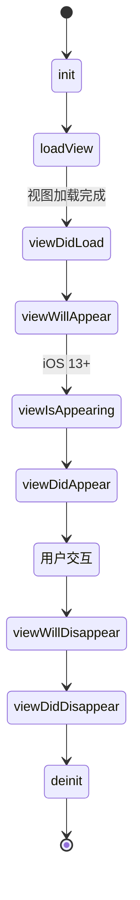

```swift
class MyViewController: UIViewController {
    override func viewDidLoad() {
        super.viewDidLoad()
        view.backgroundColor = .systemBackground
        print("View 加载完成（只调用一次）")
    }
    override func viewWillAppear(_ animated: Bool) {
        super.viewWillAppear(animated)
        print("视图即将出现")
    }
    override func viewDidAppear(_ animated: Bool) {
        super.viewDidAppear(animated)
        print("视图已出现，可以开始动画/网络请求")
    }
}
```

### 5.2 UIView 与 Auto Layout

```swift
let label = UILabel()
label.text = "Hello"
label.translatesAutoresizingMaskIntoConstraints = false  // 关键！
view.addSubview(label)

NSLayoutConstraint.activate([
    label.centerXAnchor.constraint(equalTo: view.centerXAnchor),
    label.centerYAnchor.constraint(equalTo: view.centerYAnchor),
    label.leadingAnchor.constraint(greaterThanOrEqualTo: view.leadingAnchor, constant: 16),
])
```

可视化布局工具：**SnapKit**（链式 DSL）

```swift
label.snp.makeConstraints { make in
    make.center.equalToSuperview()
    make.leading.greaterThanOrEqualToSuperview().offset(16)
}
```

### 5.3 UITableView 列表

```swift
class ListVC: UIViewController, UITableViewDataSource, UITableViewDelegate {
    let tableView = UITableView()
    let items = ["苹果", "香蕉", "橙子"]

    override func viewDidLoad() {
        super.viewDidLoad()
        view.addSubview(tableView)
        tableView.frame = view.bounds
        tableView.dataSource = self
        tableView.delegate = self
        tableView.register(UITableViewCell.self, forCellReuseIdentifier: "cell")
    }

    func tableView(_ t: UITableView, numberOfRowsInSection s: Int) -> Int { items.count }

    func tableView(_ t: UITableView, cellForRowAt i: IndexPath) -> UITableViewCell {
        let cell = t.dequeueReusableCell(withIdentifier: "cell", for: i)
        var cfg = cell.defaultContentConfiguration()
        cfg.text = items[i.row]
        cell.contentConfiguration = cfg
        return cell
    }

    func tableView(_ t: UITableView, didSelectRowAt i: IndexPath) {
        print("点击了 \(items[i.row])")
        t.deselectRow(at: i, animated: true)
    }
}
```

> ⚠️ Cell 重用机制是性能核心，必须 `dequeueReusableCell`。

### 5.4 UICollectionView（更灵活的列表/网格）

```swift
let layout = UICollectionViewCompositionalLayout.list(using: .init(appearance: .insetGrouped))
let collection = UICollectionView(frame: .zero, collectionViewLayout: layout)
```

iOS 13+ 推荐 **Compositional Layout + Diffable DataSource**，可实现复杂瀑布流。

### 5.5 导航与跳转

```swift
// Push（导航栈）
let next = DetailVC()
navigationController?.pushViewController(next, animated: true)

// Present（模态弹出）
present(next, animated: true)

// Pop / Dismiss
navigationController?.popViewController(animated: true)
dismiss(animated: true)
```

### 实战练习

1. 用 UIKit 实现一个 3 个 cell 的 TableView，点击跳转详情页

---

## 第 6 章 SwiftUI 入门

SwiftUI 是 2019 年推出的**声明式** UI 框架，写法极简、跨平台、自动响应数据变化。**新项目首选**。

### 6.1 第一个 SwiftUI View

```swift
struct ContentView: View {
    var body: some View {
        Text("Hello, SwiftUI")
            .font(.title)
            .foregroundStyle(.blue)
            .padding()
            .background(.yellow)
            .cornerRadius(8)
    }
}
```

**核心概念**：`View` 协议、`body` 返回 `some View`、Modifier 链式调用、每个 Modifier 返回新的 View。

### 6.2 布局容器

```swift
// 垂直、水平、层叠
VStack(spacing: 10) {
    Text("第一行")
    Text("第二行")
}

HStack {
    Image(systemName: "star.fill")
    Text("收藏")
}

ZStack {
    Color.blue
    Text("覆盖在蓝色上")
        .foregroundStyle(.white)
}

// Spacer 与 Divider
HStack {
    Text("左")
    Spacer()
    Text("右")
}

// Grid（iOS 16+）
Grid {
    GridRow { Text("1"); Text("2") }
    GridRow { Text("3"); Text("4") }
}
```

### 6.3 数据流图

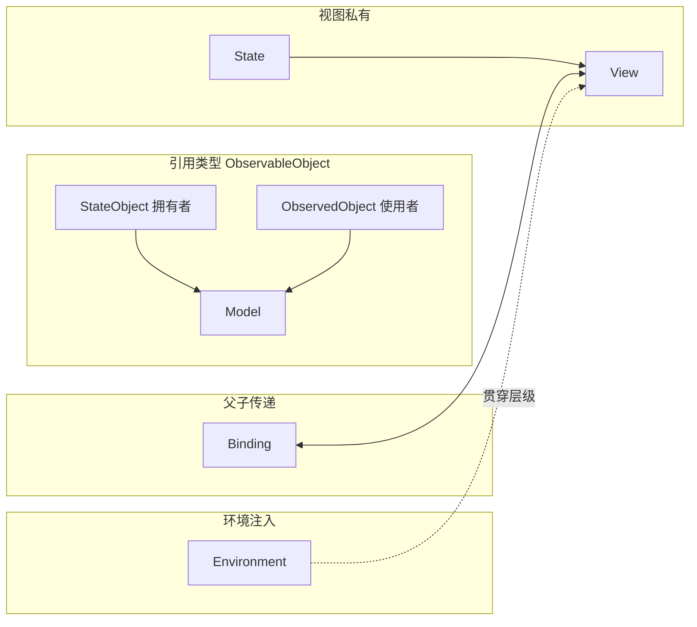

| 包装器 | 用途 | 谁拥有数据 |
|--------|------|------------|
| `@State` | View 内部状态（值类型小数据） | View 自己 |
| `@Binding` | 父传子的双向绑定 | 父 View |
| `@StateObject` | View 拥有一个引用类型对象 | View 创建并持有 |
| `@ObservedObject` | View 使用外部传入对象 | 外部传入 |
| `@EnvironmentObject` | 跨多层注入 | 祖先注入 |
| `@Environment(\.dismiss)` | 系统环境值 | 系统 |
| `@AppStorage("key")` | UserDefaults 绑定 | UserDefaults |
| `@SceneStorage` | 场景恢复 | 系统 |
| `@Bindable`（iOS 17） | 配合 @Observable | 系统 |

### 6.4 State 与 Binding

```swift
struct CounterView: View {
    @State private var count = 0   // 私有可变状态

    var body: some View {
        VStack {
            Text("\(count)")
                .font(.largeTitle)
            Button("+1") { count += 1 }
            Stepper("数量", value: $count, in: 0...100)
            ChildView(count: $count)  // 用 $ 传 Binding
        }
    }
}

struct ChildView: View {
    @Binding var count: Int      // 双向绑定
    var body: some View {
        Button("子视图 +10") { count += 10 }
    }
}
```

### 6.5 @Observable（iOS 17+，推荐）

```swift
@Observable
class TodoStore {
    var items: [String] = []
    func add(_ s: String) { items.append(s) }
}

struct TodoView: View {
    @State private var store = TodoStore()   // iOS 17 用 @State 持有

    var body: some View {
        VStack {
            ForEach(store.items, id: \.self) { Text($0) }
            Button("加一个") { store.add("Item \(store.items.count)") }
        }
    }
}
```

iOS 16 及更早，仍用 `ObservableObject + @Published + @StateObject`：

```swift
class TodoStore: ObservableObject {
    @Published var items: [String] = []
}
@StateObject private var store = TodoStore()
```

### 6.6 常用组件速查

```swift
// 文本
Text("hi").font(.headline).bold()

// 图片
Image(systemName: "heart.fill").foregroundStyle(.red)
Image("logo").resizable().scaledToFit()

// 按钮
Button("点我") { print("clicked") }
Button { action() } label: { Image(systemName: "star") }

// 输入
TextField("用户名", text: $username)
SecureField("密码", text: $password)
TextEditor(text: $longText)

// 选择
Toggle("开关", isOn: $isOn)
Slider(value: $value, in: 0...100)
Picker("性别", selection: $gender) {
    Text("男").tag(0)
    Text("女").tag(1)
}
DatePicker("生日", selection: $date)

// 列表
List(items, id: \.self) { item in
    Text(item)
}

// 滚动
ScrollView { ... }
ScrollView(.horizontal) { HStack { ... } }
```

### 6.7 SwiftUI Preview

```swift
#Preview("浅色") {
    ContentView()
}

#Preview("深色") {
    ContentView()
        .preferredColorScheme(.dark)
}

#Preview("中文") {
    ContentView()
        .environment(\.locale, Locale(identifier: "zh-Hans"))
}
```

> 💡 Canvas 区域（⌥⌘↩ 显示）实时预览，无需运行模拟器。

### 实战练习

1. 实现一个 BMI 计算器：输入身高体重，显示 BMI
2. 用 @Observable 写一个购物车模型，三个页面共享数据

---

## 第 7 章 SwiftUI 进阶

### 7.1 NavigationStack（iOS 16+）

```swift
NavigationStack {
    List(users) { user in
        NavigationLink(user.name, value: user)
    }
    .navigationTitle("用户列表")
    .navigationDestination(for: User.self) { user in
        UserDetailView(user: user)
    }
}
```

**程序化导航**（栈状态）：

```swift
@State private var path = NavigationPath()

NavigationStack(path: $path) {
    Button("跳转 3 层") {
        path.append(1)
        path.append(2)
        path.append(3)
    }
    .navigationDestination(for: Int.self) { num in
        Text("第 \(num) 层")
    }
}
```

### 7.2 Sheet、Alert、ConfirmationDialog

```swift
@State private var showSheet = false
@State private var showAlert = false

Button("显示") { showSheet = true }
    .sheet(isPresented: $showSheet) {
        DetailView()
            .presentationDetents([.medium, .large])    // iOS 16+ 半屏
    }
    .alert("确认删除？", isPresented: $showAlert) {
        Button("取消", role: .cancel) {}
        Button("删除", role: .destructive) { delete() }
    } message: {
        Text("此操作不可恢复")
    }
```

### 7.3 动画

```swift
@State private var isExpanded = false

VStack {
    Image(systemName: "star")
        .scaleEffect(isExpanded ? 2 : 1)
        .rotationEffect(.degrees(isExpanded ? 180 : 0))
        .animation(.spring(duration: 0.5), value: isExpanded)
    Button("切换") { isExpanded.toggle() }
}

// 显式动画
withAnimation(.easeInOut(duration: 0.3)) {
    show = true
}

// matchedGeometryEffect（共享元素动画）
@Namespace var ns
if isExpanded {
    BigCard().matchedGeometryEffect(id: "card", in: ns)
} else {
    SmallCard().matchedGeometryEffect(id: "card", in: ns)
}
```

### 7.4 自定义 ViewModifier

```swift
struct CardStyle: ViewModifier {
    func body(content: Content) -> some View {
        content
            .padding()
            .background(.background)
            .cornerRadius(12)
            .shadow(radius: 4)
    }
}

extension View {
    func cardStyle() -> some View { modifier(CardStyle()) }
}

Text("hi").cardStyle()
```

### 7.5 PreferenceKey（子视图向父视图传值）

```swift
struct HeightKey: PreferenceKey {
    static var defaultValue: CGFloat = 0
    static func reduce(value: inout CGFloat, nextValue: () -> CGFloat) {
        value = max(value, nextValue())
    }
}

ChildView()
    .background(GeometryReader { geo in
        Color.clear.preference(key: HeightKey.self, value: geo.size.height)
    })
    .onPreferenceChange(HeightKey.self) { height in
        print("子视图高度 \(height)")
    }
```

### 7.6 GeometryReader

```swift
GeometryReader { geo in
    Rectangle()
        .fill(.blue)
        .frame(width: geo.size.width / 2, height: geo.size.height / 2)
}
```

> ⚠️ GeometryReader 会撑满父空间，慎用在 List 内。

### 7.7 ViewBuilder 自定义容器

```swift
struct CardContainer<Content: View>: View {
    @ViewBuilder let content: Content
    var body: some View {
        VStack { content }.cardStyle()
    }
}

CardContainer {
    Text("标题")
    Text("正文")
}
```

### 实战练习

1. 三屏导航：列表 → 详情 → 编辑，编辑后返回刷新
2. 实现一个可折叠的 CardView，带动画

---

## 第 8 章 屏幕适配与多端体验

### 8.1 设备尺寸表（pt 点）

| 设备 | 屏幕尺寸 | 安全区 |
|------|---------|--------|
| iPhone SE 3 | 375 × 667 | 顶部 20，底部 0 |
| iPhone 15 | 393 × 852 | 顶部 59，底部 34 |
| iPhone 15 Pro Max | 430 × 932 | 顶部 59，底部 34 |
| iPad mini | 744 × 1133 | 顶部 24，底部 20 |
| iPad Pro 12.9 | 1024 × 1366 | 顶部 24，底部 20 |

### 8.2 Size Class

| 维度 | Compact | Regular |
|------|---------|---------|
| 宽 | iPhone 竖屏 / iPad 分屏窄 | iPhone Pro Max 横屏 / iPad |
| 高 | iPhone 横屏 | 几乎所有竖屏 |

```swift
@Environment(\.horizontalSizeClass) var hSize

var body: some View {
    if hSize == .compact {
        VStack { ... }
    } else {
        HStack { ... }
    }
}
```

### 8.3 Safe Area

```swift
ZStack {
    Color.red.ignoresSafeArea()    // 红色铺满全屏
    Text("内容").padding()         // 内容在安全区
}
```

### 8.4 暗黑模式

```swift
// 自定义颜色支持
// Assets.xcassets → Colors → New Color Set → Appearances: Any, Dark
Color("Background")

// 强制
.preferredColorScheme(.dark)

// 检测
@Environment(\.colorScheme) var scheme
```

### 8.5 Dynamic Type（动态字体）

```swift
Text("可放大字体")
    .font(.body)                      // 跟随系统
    .dynamicTypeSize(.large ... .xxLarge)  // 限制范围
```

### 8.6 本地化 i18n

1. `项目 → Info → Localizations → +` 添加语言
2. `File → New → File → Strings File` 命名 `Localizable.strings`
3. 内容：
   ```
   "hello" = "你好";
   "welcome %@" = "欢迎 %@";
   ```
4. 代码：
   ```swift
   Text("hello")                                    // SwiftUI 自动本地化
   Text("welcome \(name)")                          // 插值
   String(localized: "hello")                       // 显式
   ```

### 实战练习

1. 一个页面同时适配 iPhone（VStack）和 iPad（HStack）
2. 添加中英双语，加上语言切换按钮

---

## 第 9 章 数据持久化

### 9.1 选型决策树

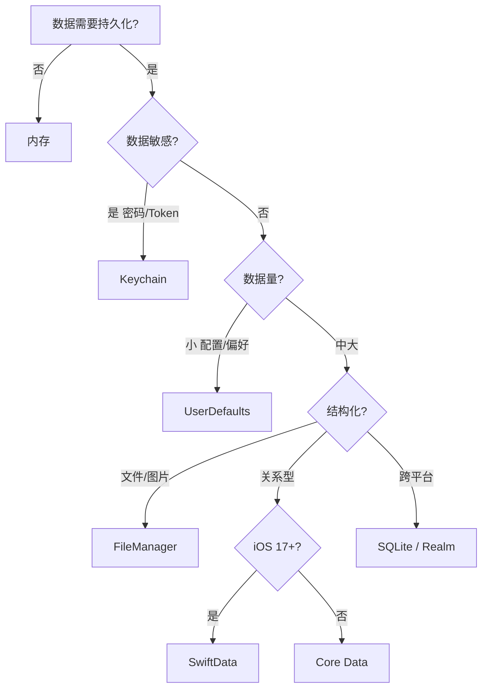

### 9.2 UserDefaults

```swift
// 写
UserDefaults.standard.set("Alice", forKey: "username")
UserDefaults.standard.set(true, forKey: "isLoggedIn")

// 读
let name = UserDefaults.standard.string(forKey: "username")
let logged = UserDefaults.standard.bool(forKey: "isLoggedIn")

// SwiftUI 绑定
@AppStorage("username") var username: String = ""
@AppStorage("isLoggedIn") var isLoggedIn: Bool = false
```

> ⚠️ 仅适合 < 1MB 的少量配置，不要存大对象。

### 9.3 Keychain（敏感数据）

```swift
import Security

func saveToken(_ token: String) {
    let data = token.data(using: .utf8)!
    let query: [String: Any] = [
        kSecClass as String: kSecClassGenericPassword,
        kSecAttrAccount as String: "auth_token",
        kSecValueData as String: data
    ]
    SecItemDelete(query as CFDictionary)
    SecItemAdd(query as CFDictionary, nil)
}
```

推荐第三方库：[`KeychainAccess`](https://github.com/kishikawakatsumi/KeychainAccess)

```swift
let keychain = Keychain(service: "com.app.auth")
keychain["token"] = "xxx"
let token = keychain["token"]
```

### 9.4 文件系统

```swift
let docsURL = FileManager.default.urls(for: .documentDirectory, in: .userDomainMask)[0]
let fileURL = docsURL.appendingPathComponent("note.txt")

try "Hello".write(to: fileURL, atomically: true, encoding: .utf8)
let text = try String(contentsOf: fileURL)
```

| 目录 | 备份 | 用途 |
|------|------|------|
| Documents | iCloud 备份 | 用户文件 |
| Library/Caches | 不备份 | 缓存（系统可能清理） |
| Library/Application Support | 备份 | App 私有数据 |
| tmp | 不备份 | 临时 |

### 9.5 Core Data 数据模型

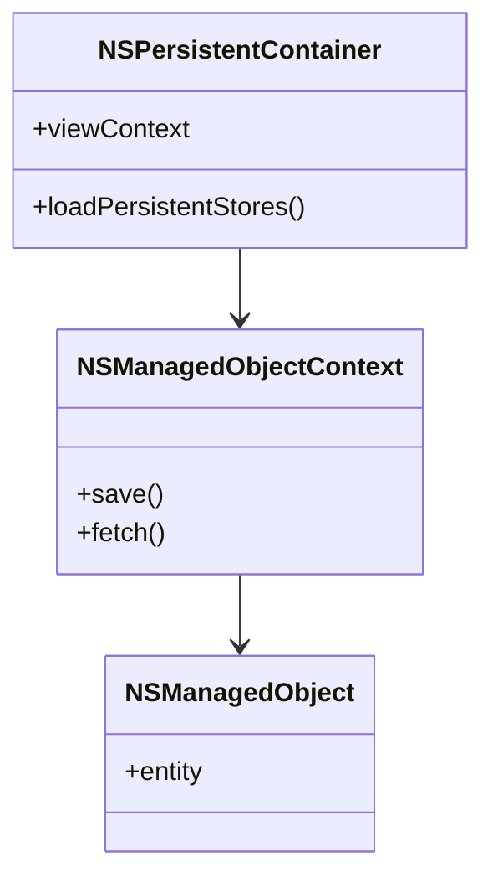

新建项目时勾选 `Use Core Data`。

```swift
// AppDelegate / App
let container = NSPersistentContainer(name: "MyApp")
container.loadPersistentStores { _, error in ... }

// SwiftUI 注入
WindowGroup {
    ContentView()
        .environment(\.managedObjectContext, container.viewContext)
}

// 查询
@FetchRequest(sortDescriptors: [SortDescriptor(\.createdAt, order: .reverse)])
var items: FetchedResults<Item>

// 新增
let item = Item(context: viewContext)
item.title = "新条目"
try? viewContext.save()
```

### 9.6 SwiftData（iOS 17+，强力推荐）

```swift
import SwiftData

@Model
class Note {
    var title: String
    var content: String
    var createdAt: Date
    init(title: String, content: String) {
        self.title = title
        self.content = content
        self.createdAt = .now
    }
}

// App 入口注入
@main
struct MyApp: App {
    var body: some Scene {
        WindowGroup { ContentView() }
            .modelContainer(for: Note.self)
    }
}

// 使用
struct ContentView: View {
    @Environment(\.modelContext) var ctx
    @Query(sort: \Note.createdAt, order: .reverse) var notes: [Note]

    var body: some View {
        List(notes) { note in Text(note.title) }
        Button("新增") {
            ctx.insert(Note(title: "新笔记", content: ""))
        }
    }
}
```

> 🎯 SwiftData 是 SwiftUI 时代的最佳选择，API 极简，底层仍是 Core Data。

### 9.7 Realm（跨端数据库）

```swift
import RealmSwift

class Dog: Object {
    @Persisted var name: String
    @Persisted var age: Int
}

let realm = try Realm()
try realm.write {
    realm.add(Dog(value: ["name": "Rex", "age": 3]))
}
let dogs = realm.objects(Dog.self).where { $0.age > 2 }
```

### 9.8 SQLite（GRDB 库）

适合对 SQL 熟悉、跨端共用数据库。略。

### 实战练习

1. 用 SwiftData 实现一个笔记本：新增、删除、搜索
2. 把用户登录 Token 存到 Keychain，启动时自动登录

---

## 第 10 章 网络

### 10.1 URLSession 基础

```swift
let url = URL(string: "https://api.example.com/users/1")!
let (data, response) = try await URLSession.shared.data(from: url)
let user = try JSONDecoder().decode(User.self, from: data)
```

### 10.2 POST + JSON Body

```swift
var req = URLRequest(url: URL(string: "https://api.example.com/login")!)
req.httpMethod = "POST"
req.setValue("application/json", forHTTPHeaderField: "Content-Type")
req.setValue("Bearer \(token)", forHTTPHeaderField: "Authorization")

let body = ["username": "alice", "password": "123"]
req.httpBody = try JSONEncoder().encode(body)

let (data, resp) = try await URLSession.shared.data(for: req)
guard let httpResp = resp as? HTTPURLResponse, httpResp.statusCode == 200 else {
    throw NetworkError.badStatus
}
```

### 10.3 封装网络层

```swift
struct API {
    static let base = URL(string: "https://api.example.com")!

    static func get<T: Decodable>(_ path: String) async throws -> T {
        let url = base.appendingPathComponent(path)
        let (data, _) = try await URLSession.shared.data(from: url)
        return try JSONDecoder().decode(T.self, from: data)
    }
}

// 调用
let users: [User] = try await API.get("/users")
```

### 10.4 Alamofire（流行第三方）

```swift
AF.request("https://api.example.com/users")
    .responseDecodable(of: [User].self) { resp in
        switch resp.result {
        case .success(let users): print(users)
        case .failure(let err): print(err)
        }
    }
```

### 10.5 上传 / 下载

```swift
// 下载到文件
let (location, _) = try await URLSession.shared.download(from: url)
try FileManager.default.moveItem(at: location, to: destURL)

// 上传 multipart
var req = URLRequest(url: uploadURL)
req.httpMethod = "POST"
let (data, _) = try await URLSession.shared.upload(for: req, from: imageData)
```

### 10.6 断点续传

```swift
// 后台 session
let config = URLSessionConfiguration.background(withIdentifier: "com.app.download")
let session = URLSession(configuration: config, delegate: self, delegateQueue: nil)

// 暂停时保存 resumeData
task.cancel { resumeData in
    UserDefaults.standard.set(resumeData, forKey: "resume")
}

// 恢复
if let data = UserDefaults.standard.data(forKey: "resume") {
    let task = session.downloadTask(withResumeData: data)
    task.resume()
}
```

### 10.7 WebSocket

```swift
let task = URLSession.shared.webSocketTask(with: URL(string: "wss://echo.websocket.org")!)
task.resume()

// 发送
try await task.send(.string("hello"))

// 接收（循环）
func listen() async throws {
    while true {
        let msg = try await task.receive()
        switch msg {
        case .string(let s): print(s)
        case .data(let d): print(d)
        @unknown default: break
        }
    }
}
```

### 10.8 网络监测

```swift
import Network
let monitor = NWPathMonitor()
monitor.pathUpdateHandler = { path in
    print(path.status == .satisfied ? "在线" : "离线")
    print("是否 WiFi: \(path.usesInterfaceType(.wifi))")
}
monitor.start(queue: .global())
```

### 10.9 App Transport Security（ATS）

`Info.plist` 默认禁止 HTTP，必须用 HTTPS。如需调试 HTTP：

```xml
<key>NSAppTransportSecurity</key>
<dict>
  <key>NSAllowsArbitraryLoads</key>
  <true/>
</dict>
```

> ⚠️ 上架前应改回 HTTPS，否则审核会问。

### 实战练习

1. 用 async/await + URLSession 拉取 https://jsonplaceholder.typicode.com/users 并显示
2. 实现一个图片下载缓存（NSCache + 文件双层）

---

## 第 11 章 并发

### 11.1 GCD（老牌、仍在用）

```swift
DispatchQueue.global(qos: .userInitiated).async {
    // 后台
    let data = heavyWork()
    DispatchQueue.main.async {
        // 主线程更新 UI
        self.label.text = data
    }
}

// 延时
DispatchQueue.main.asyncAfter(deadline: .now() + 1.5) { ... }

// 串行队列
let queue = DispatchQueue(label: "com.app.serial")
queue.async { ... }

// 并发屏障（读写锁）
let q = DispatchQueue(label: "rw", attributes: .concurrent)
q.async { read() }
q.async(flags: .barrier) { write() }   // 写时独占
```

### 11.2 OperationQueue

```swift
let queue = OperationQueue()
queue.maxConcurrentOperationCount = 3

let op1 = BlockOperation { print("1") }
let op2 = BlockOperation { print("2") }
op2.addDependency(op1)   // op1 完才执行 op2
queue.addOperations([op1, op2], waitUntilFinished: false)
```

### 11.3 Swift Concurrency

```swift
// Task
Task {
    await doSomething()
}

// Task.detached（脱离继承上下文）
Task.detached(priority: .background) { ... }

// TaskGroup（并发批量）
try await withThrowingTaskGroup(of: User.self) { group in
    for id in ids {
        group.addTask { try await fetchUser(id: id) }
    }
    for try await user in group {
        print(user)
    }
}

// 取消
let task = Task { try await longWork() }
task.cancel()

func longWork() async throws {
    for _ in 0..<1000 {
        try Task.checkCancellation()    // 检查点
        // ...
    }
}
```

### 11.4 Actor 与 MainActor

```swift
@MainActor
class ViewModel: ObservableObject {
    @Published var items: [Item] = []

    func load() async {
        let result = try? await API.get("/items")
        // 此处自动在主线程
        items = result ?? []
    }
}

// 标注单个方法
class Foo {
    @MainActor func updateUI() { ... }
}
```

### 11.5 AsyncSequence

```swift
for try await line in url.lines {
    print(line)
}

// 自定义
struct Counter: AsyncSequence {
    typealias Element = Int
    let max: Int

    struct AsyncIterator: AsyncIteratorProtocol {
        var current = 0
        let max: Int
        mutating func next() async -> Int? {
            guard current < max else { return nil }
            try? await Task.sleep(for: .seconds(1))
            current += 1
            return current
        }
    }
    func makeAsyncIterator() -> AsyncIterator { .init(max: max) }
}

for await n in Counter(max: 5) { print(n) }
```

### 11.6 Sendable 与并发安全

```swift
struct User: Sendable {
    let id: Int
    let name: String
}

// class 想 Sendable 必须 final + 不可变 / 内部同步
final class SafeCounter: @unchecked Sendable {
    private let lock = NSLock()
    private var _value = 0
    var value: Int {
        lock.withLock { _value }
    }
}
```

### 实战练习

1. 用 TaskGroup 并发下载 10 张图片，全部完成后显示
2. 用 actor 实现一个线程安全的图片缓存

---

## 第 12 章 系统能力

### 12.1 权限申请通用规则

每个权限要在 `Info.plist` 添加用法说明：

| 权限 | Key |
|------|-----|
| 相机 | NSCameraUsageDescription |
| 相册 | NSPhotoLibraryUsageDescription |
| 麦克风 | NSMicrophoneUsageDescription |
| 定位 | NSLocationWhenInUseUsageDescription |
| 通讯录 | NSContactsUsageDescription |
| 通知 | （代码请求） |

### 12.2 相机与相册

```swift
import PhotosUI

struct PhotoPicker: View {
    @State private var pickerItem: PhotosPickerItem?
    @State private var image: Image?

    var body: some View {
        VStack {
            PhotosPicker("选择照片", selection: $pickerItem, matching: .images)
            image?.resizable().scaledToFit()
        }
        .onChange(of: pickerItem) { _, new in
            Task {
                if let data = try? await new?.loadTransferable(type: Data.self),
                   let ui = UIImage(data: data) {
                    image = Image(uiImage: ui)
                }
            }
        }
    }
}
```

### 12.3 定位 CoreLocation

```swift
import CoreLocation

class LocationManager: NSObject, ObservableObject, CLLocationManagerDelegate {
    private let manager = CLLocationManager()
    @Published var location: CLLocation?

    override init() {
        super.init()
        manager.delegate = self
        manager.requestWhenInUseAuthorization()
        manager.startUpdatingLocation()
    }

    func locationManager(_ m: CLLocationManager, didUpdateLocations locs: [CLLocation]) {
        location = locs.last
    }
}
```

### 12.4 推送 APNs 流程图

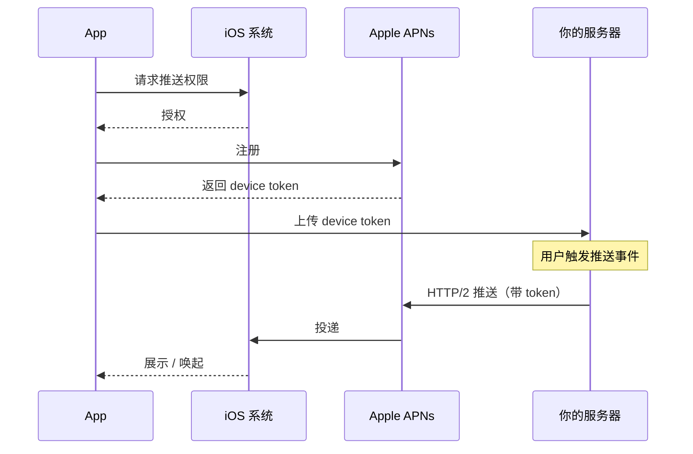

```swift
// 1. 注册
UNUserNotificationCenter.current()
    .requestAuthorization(options: [.alert, .badge, .sound]) { granted, _ in
        DispatchQueue.main.async {
            UIApplication.shared.registerForRemoteNotifications()
        }
    }

// 2. AppDelegate 拿到 token
func application(_ app: UIApplication,
                 didRegisterForRemoteNotificationsWithDeviceToken data: Data) {
    let token = data.map { String(format: "%02x", $0) }.joined()
    print("APNs Token: \(token)")
    // 上传到服务器
}
```

服务器端用 `apns2`（Node）/ `houston`（Ruby）/ 直接 HTTP/2 调用 `api.push.apple.com`。

### 12.5 Sign in with Apple

```swift
import AuthenticationServices

SignInWithAppleButton(.signIn) { req in
    req.requestedScopes = [.fullName, .email]
} onCompletion: { result in
    switch result {
    case .success(let auth):
        if let cred = auth.credential as? ASAuthorizationAppleIDCredential {
            print(cred.user, cred.email ?? "")
            // 把 identityToken 发给服务器验签
        }
    case .failure(let err): print(err)
    }
}
.frame(height: 44)
```

> ⚠️ 若 App 提供其他第三方登录（微信/Google），**必须**同时提供 Sign in with Apple，否则会被拒。

### 12.6 IAP 内购（StoreKit 2）

```swift
import StoreKit

// 加载商品
let products = try await Product.products(for: ["com.app.pro_monthly"])
let pro = products.first!

// 购买
let result = try await pro.purchase()
switch result {
case .success(.verified(let txn)):
    // 解锁内容
    await txn.finish()
case .success(.unverified): break
case .userCancelled: break
case .pending: break
@unknown default: break
}

// 监听后续交易
for await update in Transaction.updates {
    if case .verified(let txn) = update {
        await txn.finish()
    }
}
```

> 📌 **App 内涉及虚拟商品（会员/金币）必须用 IAP**，否则苹果抽 30% + 拒审。实体商品/服务用 Apple Pay 或第三方支付。

### 12.7 HealthKit、HomeKit、ARKit

简略：

- **HealthKit**：`HKHealthStore` 读写健康数据，需在 Capabilities 添加。
- **HomeKit**：智能家居控制。
- **ARKit**：增强现实，配合 RealityKit。
- **WidgetKit**：桌面小组件。
- **App Clips**：轻应用。

### 实战练习

1. 实现一个权限申请页：相机、定位、通知
2. 集成 Sign in with Apple，把 token 打印出来

---

## 第 13 章 架构模式

### 13.1 四种模式对比图

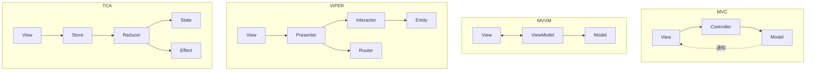

| 模式 | 学习曲线 | 适用 | 代表 |
|------|---------|------|------|
| MVC | 低 | 简单 App / 苹果默认 | UIKit |
| MVVM | 中 | 中大型 / 数据驱动 | SwiftUI |
| VIPER | 高 | 大团队 / 严格分层 | 银行级 App |
| TCA | 中高 | 状态复杂 / 可测试性强 | Composable Architecture |
| Clean Architecture | 高 | 长生命周期项目 | 通用 |

### 13.2 MVVM 实战

```swift
// Model
struct Article: Identifiable, Codable {
    let id: Int
    let title: String
}

// ViewModel
@MainActor
@Observable
class ArticleListVM {
    var articles: [Article] = []
    var isLoading = false
    var error: String?

    func load() async {
        isLoading = true; defer { isLoading = false }
        do {
            articles = try await API.get("/articles")
        } catch {
            self.error = error.localizedDescription
        }
    }
}

// View
struct ArticleListView: View {
    @State private var vm = ArticleListVM()

    var body: some View {
        List(vm.articles) { Text($0.title) }
            .overlay { if vm.isLoading { ProgressView() } }
            .task { await vm.load() }
    }
}
```

### 13.3 Coordinator 模式（路由）

```swift
@Observable
class AppCoordinator {
    var path = NavigationPath()
    var sheet: Route?

    enum Route: Hashable { case detail(Int), settings }

    func push(_ r: Route) { path.append(r) }
    func present(_ r: Route) { sheet = r }
    func pop() { path.removeLast() }
}

// 注入
@main
struct MyApp: App {
    @State private var coordinator = AppCoordinator()
    var body: some Scene {
        WindowGroup {
            RootView()
                .environment(coordinator)
        }
    }
}
```

### 13.4 依赖注入

```swift
// 协议
protocol UserService {
    func login(_ name: String, _ pwd: String) async throws -> User
}

class RealUserService: UserService { ... }
class MockUserService: UserService { ... }  // 测试用

// Environment 注入
private struct UserServiceKey: EnvironmentKey {
    static let defaultValue: UserService = RealUserService()
}
extension EnvironmentValues {
    var userService: UserService {
        get { self[UserServiceKey.self] }
        set { self[UserServiceKey.self] = newValue }
    }
}

// 使用
@Environment(\.userService) var userService
```

### 13.5 TCA 简介

```swift
import ComposableArchitecture

@Reducer
struct Counter {
    @ObservableState
    struct State { var count = 0 }
    enum Action { case increment, decrement }
    var body: some ReducerOf<Self> {
        Reduce { state, action in
            switch action {
            case .increment: state.count += 1; return .none
            case .decrement: state.count -= 1; return .none
            }
        }
    }
}

struct CounterView: View {
    let store: StoreOf<Counter>
    var body: some View {
        VStack {
            Text("\(store.count)")
            Button("+") { store.send(.increment) }
        }
    }
}
```

### 实战练习

1. 用 MVVM 重构第 6 章的 BMI 计算器
2. 用 Coordinator 实现一个 3 屏导航

---

## 第 14 章 测试

### 14.1 XCTest 单元测试

```swift
import XCTest
@testable import MyApp

final class CalculatorTests: XCTestCase {
    func testAdd() {
        XCTAssertEqual(Calculator.add(2, 3), 5)
    }

    func testDivideByZero() {
        XCTAssertThrowsError(try Calculator.divide(1, by: 0))
    }

    // 异步
    func testFetch() async throws {
        let user = try await API.fetchUser(id: 1)
        XCTAssertEqual(user.id, 1)
    }
}
```

运行：⌘U。

### 14.2 Swift Testing（Xcode 16+，新框架）

```swift
import Testing

@Test func add() {
    #expect(Calculator.add(2, 3) == 5)
}

@Test("除零应抛错")
func divideZero() throws {
    #expect(throws: ArithmeticError.divideByZero) {
        try Calculator.divide(1, by: 0)
    }
}

@Test(arguments: [(1, 1, 2), (2, 3, 5), (-1, 1, 0)])
func parametric(a: Int, b: Int, sum: Int) {
    #expect(Calculator.add(a, b) == sum)
}
```

### 14.3 UI 测试

```swift
final class LoginUITests: XCTestCase {
    func testLogin() {
        let app = XCUIApplication()
        app.launch()
        app.textFields["username"].tap()
        app.textFields["username"].typeText("alice")
        app.secureTextFields["password"].typeText("123")
        app.buttons["登录"].tap()
        XCTAssertTrue(app.staticTexts["欢迎 alice"].waitForExistence(timeout: 3))
    }
}
```

### 14.4 Snapshot 测试

第三方库 `pointfreeco/swift-snapshot-testing`：

```swift
assertSnapshot(of: view, as: .image)
// 第一次生成基线图片，之后对比，UI 改动一目了然
```

### 14.5 Mock 与 DI

```swift
class MockAPI: APIProtocol {
    var stubbedUser: User?
    func fetchUser(id: Int) async throws -> User {
        if let u = stubbedUser { return u }
        throw NSError(domain: "", code: 0)
    }
}

func testVM() async {
    let mock = MockAPI()
    mock.stubbedUser = User(id: 1, name: "Test")
    let vm = UserVM(api: mock)
    await vm.load()
    XCTAssertEqual(vm.user?.name, "Test")
}
```

### 14.6 测试覆盖率

`Edit Scheme → Test → Options → Code Coverage` 勾选。运行 ⌘U 后，Xcode → Report Navigator → Coverage 标签查看每行命中情况。

> 🎯 业务核心目标 70%+；UI 层 30%+ 已经不错。

### 实战练习

1. 给 BMI 计算函数写单元测试，覆盖边界
2. 给登录页写 UI 测试

---

## 第 15 章 性能优化

### 15.1 启动时间

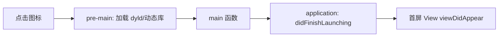

**优化点**：

| 阶段 | 优化手段 |
|------|---------|
| pre-main | 减少动态库（用 SPM 静态库），删除无用 framework |
| main | didFinishLaunching 内不要做重活 |
| 首屏 | 异步加载非关键数据；图片占位 |

测量：Edit Scheme → Run → Arguments → 添加 `DYLD_PRINT_STATISTICS = 1`，控制台看耗时；或 Instruments → App Launch。

### 15.2 内存泄漏

最常见：**闭包循环引用**。

```swift
class VC: UIViewController {
    var manager = NetworkManager()

    func load() {
        manager.fetch { result in     // ❌ self 被强引用
            self.update(result)
        }
        manager.fetch { [weak self] result in   // ✅
            self?.update(result)
        }
    }
}
```

工具：Instruments → Leaks / Allocations；Xcode → Debug Memory Graph（⌘+左侧三层方块图标）。

### 15.3 卡顿（主线程阻塞）

```swift
// ❌
override func viewDidLoad() {
    let data = heavyComputeOnMainThread()
}

// ✅
override func viewDidLoad() {
    Task.detached(priority: .userInitiated) {
        let data = await heavyCompute()
        await MainActor.run { self.update(data) }
    }
}
```

Instruments → Time Profiler 找耗时函数。

### 15.4 列表优化

```swift
// SwiftUI 大列表
List(items) { Row(item: $0) }
    .listStyle(.plain)
    .id(items.count)   // ❌ 避免，会重建整个 List

// 用 LazyVStack 而非 VStack
ScrollView { LazyVStack { ForEach(items) { ... } } }

// UIKit
// 用 dequeueReusableCell，避免在 cellForRowAt 做重计算
// 用 estimatedRowHeight + automaticDimension
// 异步图片用 SDWebImage / Kingfisher
```

### 15.5 图片优化

| 场景 | 推荐 |
|------|------|
| 静态图标 | SF Symbols（矢量、免费） |
| Asset 图片 | 使用 1x/2x/3x，HEIC 格式更小 |
| 网络图片 | Kingfisher / SDWebImage（缓存+下采样） |
| 大图列表 | 下采样到目标尺寸再显示 |

```swift
// 下采样
import ImageIO
func downsample(url: URL, to size: CGSize, scale: CGFloat) -> UIImage? {
    let src = CGImageSourceCreateWithURL(url as CFURL, nil)!
    let max = max(size.width, size.height) * scale
    let opts: [CFString: Any] = [
        kCGImageSourceCreateThumbnailFromImageAlways: true,
        kCGImageSourceShouldCacheImmediately: true,
        kCGImageSourceCreateThumbnailWithTransform: true,
        kCGImageSourceThumbnailMaxPixelSize: max
    ]
    guard let cg = CGImageSourceCreateThumbnailAtIndex(src, 0, opts as CFDictionary) else { return nil }
    return UIImage(cgImage: cg)
}
```

### 15.6 包体积优化

| 手段 | 节省 |
|------|------|
| App Thinning（自动） | 20-40% |
| 删除未用资源（fui 工具） | 视情况 |
| 压缩图片（ImageOptim） | 30-50% |
| 删除架构（仅 arm64） | 较少（旧机已不支持） |
| Asset 改用 SF Symbols | 视情况 |
| 启用 Bitcode（已废弃） | - |

### 实战练习

1. 用 Instruments Leaks 检测一个故意循环引用的代码
2. 给一个 1000 行的 List 加上 LazyVStack 与下采样图片

---

## 第 16 章 包管理与模块化

### 16.1 三种包管理器对比

| 工具 | 命令 | 配置文件 | 现状 |
|------|------|---------|------|
| **SPM（Swift Package Manager）** | Xcode 集成 | `Package.swift` | 官方，首选 |
| CocoaPods | `pod install` | `Podfile` | 老牌，仍在用 |
| Carthage | `carthage update` | `Cartfile` | 已少用 |

### 16.2 Swift Package Manager

**添加远程包**：
`File → Add Package Dependencies` → 输入仓库 URL，如 `https://github.com/Alamofire/Alamofire`

**创建本地 Package**：
`File → New → Package`，会生成：

```
MyPackage/
├── Package.swift
├── Sources/MyPackage/
│   └── MyPackage.swift
└── Tests/MyPackageTests/
```

```swift
// Package.swift
// swift-tools-version:5.9
import PackageDescription

let package = Package(
    name: "MyPackage",
    platforms: [.iOS(.v15)],
    products: [
        .library(name: "MyPackage", targets: ["MyPackage"]),
    ],
    dependencies: [
        .package(url: "https://github.com/Alamofire/Alamofire", from: "5.8.0"),
    ],
    targets: [
        .target(name: "MyPackage", dependencies: ["Alamofire"]),
        .testTarget(name: "MyPackageTests", dependencies: ["MyPackage"]),
    ]
)
```

### 16.3 CocoaPods

```bash
sudo gem install cocoapods
cd MyApp
pod init
```

编辑 `Podfile`：

```ruby
platform :ios, '15.0'
target 'MyApp' do
  use_frameworks!
  pod 'Alamofire', '~> 5.8'
  pod 'Kingfisher', '~> 7.0'
end
```

```bash
pod install
open MyApp.xcworkspace   # 注意是 workspace 不是 xcodeproj
```

### 16.4 XCFramework

将二进制库打包，跨架构（arm64 / x86_64 / arm64-simulator）合一：

```bash
xcodebuild archive -scheme MyLib -destination "generic/platform=iOS" \
  -archivePath "build/ios.xcarchive" SKIP_INSTALL=NO

xcodebuild archive -scheme MyLib -destination "generic/platform=iOS Simulator" \
  -archivePath "build/iossim.xcarchive" SKIP_INSTALL=NO

xcodebuild -create-xcframework \
  -framework build/ios.xcarchive/Products/Library/Frameworks/MyLib.framework \
  -framework build/iossim.xcarchive/Products/Library/Frameworks/MyLib.framework \
  -output MyLib.xcframework
```

### 16.5 模块化工程结构

```
MyApp/
├── App/                 主工程，只做组装
├── Features/
│   ├── Login/           本地 SPM 包
│   ├── Home/
│   └── Profile/
├── Core/
│   ├── Network/
│   ├── Storage/
│   └── DesignSystem/    UI 基础组件
└── ThirdParty/
```

优点：编译快、职责清、易测试、可被其他 App 复用。

### 实战练习

1. 用 SPM 引入 Kingfisher 显示网络图片
2. 创建本地 Package `DesignSystem`，把通用按钮、颜色放进去

---

## 第 17 章 上架 App Store

### 17.1 上架全流程图

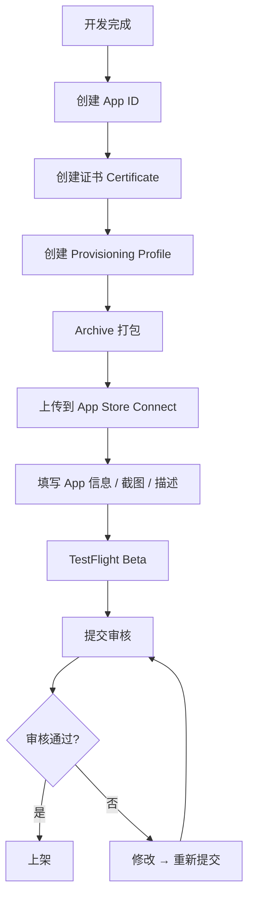

### 17.2 证书与 Profile

| 名称 | 作用 | 在哪儿配 |
|------|------|---------|
| **App ID** | App 唯一标识 com.xxx.yyy | developer.apple.com |
| **Certificate** | 开发者身份证书（.cer） | 钥匙串 + developer.apple.com |
| **Provisioning Profile** | 把 App ID + 证书 + 设备绑定 | Xcode 自动 / 手动下载 |
| **Push Cert / Key** | 推送专用（推荐 .p8 Key） | developer.apple.com → Keys |

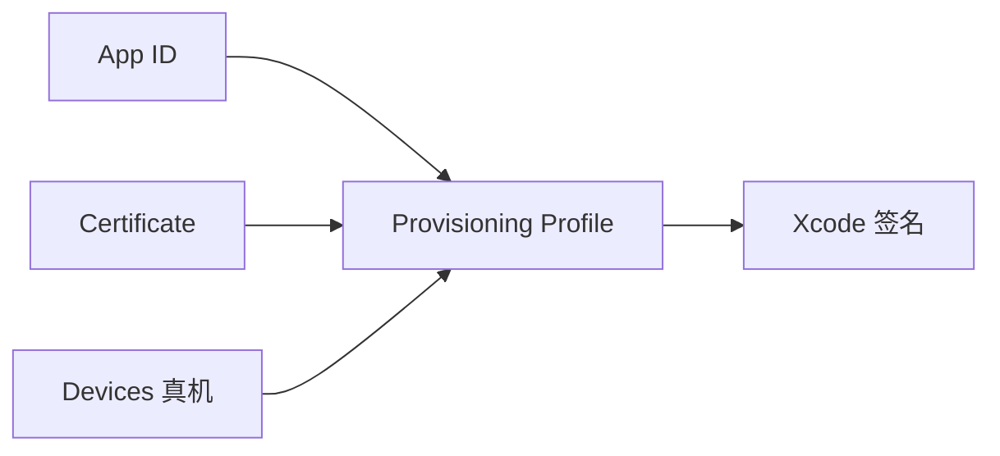

**Xcode 自动签名**：勾选 `Automatically manage signing`，让 Xcode 自动处理证书与 Profile，90% 场景够用。

### 17.3 Archive 打包

1. Scheme 选 `Any iOS Device (arm64)`，**不要选模拟器**
2. `Product → Archive`（耗时 1-5 分钟）
3. Organizer 弹出 → `Distribute App` → `App Store Connect` → `Upload`
4. 等待 Apple 处理（约 10-30 分钟），完成后会出现在 App Store Connect

### 17.4 App Store Connect 设置

https://appstoreconnect.apple.com/

**必填项**：

| 项 | 说明 |
|----|------|
| App 名称 | 30 字符内，中英文都要 |
| 副标题 | 30 字符，SEO 重要 |
| 描述 | 4000 字符内 |
| 关键词 | 100 字符，逗号分隔 |
| 类别 | 主+次类别 |
| 截图 | 6.7" / 6.5" / 5.5" / iPad 12.9"，至少 1 个尺寸 |
| 隐私政策 URL | 必须 |
| 联系方式 | 邮箱、电话 |
| 年龄分级 | 问卷生成 |
| 隐私数据声明 | 收集了哪些数据 |
| 加密合规 | 用了 HTTPS 即勾"使用了加密" |

### 17.5 截图尺寸

| 设备 | 尺寸（像素） |
|------|------------|
| iPhone 6.7" Pro Max | 1290 × 2796 |
| iPhone 6.5" | 1242 × 2688 |
| iPhone 5.5" | 1242 × 2208（旧，可选） |
| iPad 12.9" | 2048 × 2732 |

> 💡 用 [Fastlane Snapshot](https://docs.fastlane.tools/actions/snapshot/) 或 [Screenshot Studio](https://screenshots.pro/) 批量生成漂亮截图。

### 17.6 TestFlight

1. App Store Connect → TestFlight 标签
2. 选构建版本 → 提供测试信息 → 添加测试员（最多 10000 外部测试员）
3. 测试员收到邮件，下载 TestFlight App，输入邀请码

> 📌 内部测试（同账号下成员）即时可用；外部测试需要 Beta 审核（约 24 小时）。

### 17.7 提交审核

App Store Connect → 你的 App → 1.0 版本 → 选择构建版本 → 填齐所有信息 → 提交审核。

**审核时间**：通常 1-3 天，节假日延长。

### 17.8 常见拒绝原因（Top 10）

| # | 原因 | 解决 |
|---|------|------|
| 1 | Guideline 2.1 - 信息不全 | 提供完整账号/隐私 URL/截图 |
| 2 | Guideline 4.3 - 抄袭 | 不要做马甲包 |
| 3 | Guideline 5.1.1 - 隐私 | 隐私政策 + Info.plist 用法说明 |
| 4 | Guideline 2.3.10 - 提到 Android | 描述/截图不能提竞品平台 |
| 5 | Guideline 3.1.1 - 虚拟商品没走 IAP | 改用 IAP |
| 6 | Crash | 充分测试，配置 Crashlytics |
| 7 | Guideline 4.0 - 抄袭设计 | 原创 UI |
| 8 | Guideline 2.5.1 - 私有 API | 不要用 `_xxx` 私有方法 |
| 9 | Sign in with Apple 缺失 | 加上 |
| 10 | 元数据 / 截图与功能不符 | 务必一致 |

> ⚠️ 被拒后可在 Resolution Center 回复申诉，态度诚恳 + 提供证据，通常一次回复就过。

### 17.9 ASO 关键词策略

1. **App 名称**（权重最高）：嵌入 1-2 个核心关键词
2. **副标题**（次高）：30 字内放精准词
3. **关键词域**（100 字符）：长尾词、竞品词
4. **截图文案**：含关键词，吸引点击
5. **每周观察 App Store Connect → App Analytics**：搜索词来源
6. **工具**：[Sensor Tower](https://sensortower.com/) / [App Annie / data.ai](https://data.ai/) / [七麦数据](https://www.qimai.cn/)

### 实战练习

1. 完成所有上架前的资料准备清单
2. 把一个 Demo App 提交 TestFlight，邀请朋友测试

---

## 第 18 章 CI/CD

### 18.1 fastlane

```bash
brew install fastlane
cd MyApp && fastlane init
```

`fastlane/Fastfile`：

```ruby
default_platform(:ios)

platform :ios do
  desc "上传到 TestFlight"
  lane :beta do
    increment_build_number
    build_app(scheme: "MyApp")
    upload_to_testflight
    slack(message: "新版上传 TestFlight 成功")
  end

  desc "上架 App Store"
  lane :release do
    build_app(scheme: "MyApp")
    upload_to_app_store(submit_for_review: true, automatic_release: true)
  end
end
```

执行：

```bash
fastlane beta
fastlane release
```

### 18.2 Xcode Cloud

Apple 官方 CI（每月 25 小时免费）：

1. Xcode → Product → Xcode Cloud → Create Workflow
2. 选择仓库 → 设置触发条件（push / PR）
3. 配置 Actions：Build / Test / Archive / TestFlight 发布
4. 在 App Store Connect 查看构建结果

### 18.3 GitHub Actions for iOS

`.github/workflows/ios.yml`：

```yaml
name: iOS CI
on: [push, pull_request]
jobs:
  build:
    runs-on: macos-14
    steps:
      - uses: actions/checkout@v4
      - name: Select Xcode
        run: sudo xcode-select -s /Applications/Xcode_15.4.app
      - name: Build & Test
        run: |
          xcodebuild -scheme MyApp \
            -destination 'platform=iOS Simulator,name=iPhone 15' \
            clean test
      - name: Upload to TestFlight
        if: github.ref == 'refs/heads/main'
        env:
          APPLE_API_KEY: ${{ secrets.APPLE_API_KEY }}
        run: fastlane beta
```

### 18.4 签名管理 fastlane match

把证书和 Profile 加密存到 Git 私库，团队成员一键拉取：

```bash
fastlane match init
fastlane match development
fastlane match appstore
```

### 实战练习

1. 在本地用 fastlane 跑一遍 build_app
2. 配置 GitHub Actions 自动跑测试

---

## 第 19 章 跨端选型

### 19.1 主流方案对比

| 方案 | 语言 | 渲染 | 性能 | 上手 | 多端 | 生态 | 用户 |
|------|------|------|------|------|------|------|------|
| **SwiftUI** | Swift | 原生 | 极高 | 中 | iOS/iPadOS/macOS/watchOS/tvOS/visionOS | 官方 | Apple 全家桶最佳 |
| **Flutter** | Dart | Skia 自绘 | 高 | 中 | iOS/Android/Web/Desktop | 一流 | 闲鱼、字节、阿里 |
| **React Native** | JS/TS | 桥接原生 | 中高 | 低（前端友好） | iOS/Android/Web | 一流 | Meta、Shopify、京东 |
| **Compose Multiplatform** | Kotlin | Skia | 高 | 中 | Android/iOS/Desktop | 成长中 | JetBrains |
| **KMP（Kotlin Multiplatform）** | Kotlin | UI 各端原生 | 高 | 中 | 共享逻辑层 | 成长 | Netflix、McDonald's |
| **HarmonyNext（鸿蒙）** | ArkTS | 原生 | 高 | 中 | HarmonyOS | 国内增长快 | 华为生态 |
| **uni-app / Taro** | Vue/React | 多端编译 | 中 | 低 | 微信小程序+H5+原生 | 国内强 | DCloud、京东 |

### 19.2 选型决策矩阵

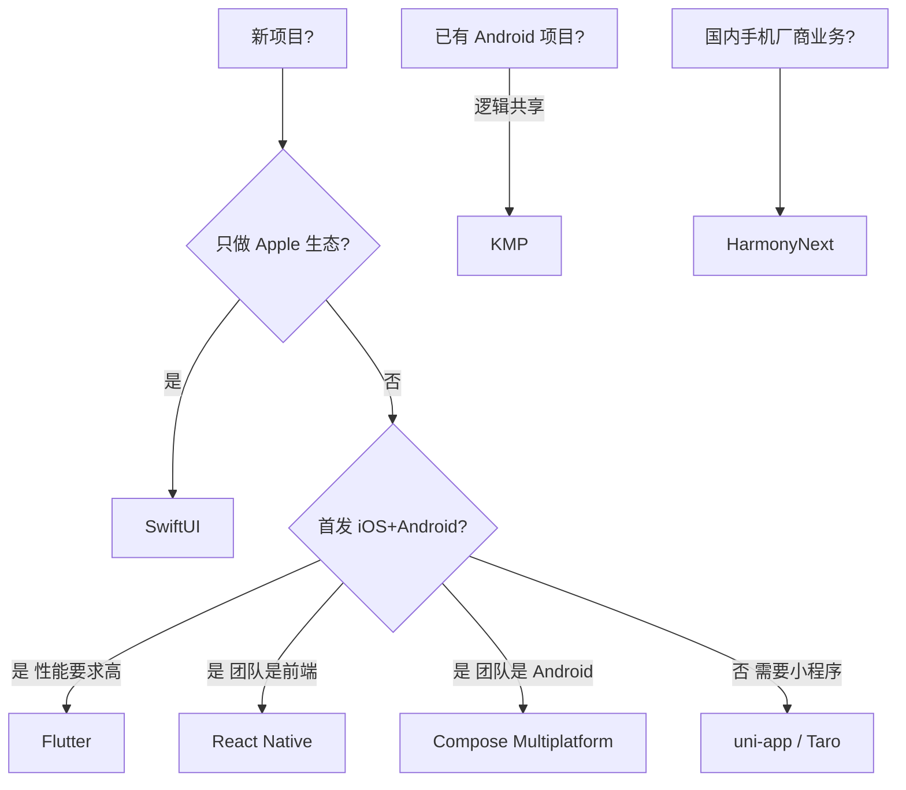

### 19.3 SwiftUI 与 Flutter 代码量对比

```swift
// SwiftUI
struct CounterView: View {
    @State var count = 0
    var body: some View {
        VStack {
            Text("\(count)")
            Button("+") { count += 1 }
        }
    }
}
```

```dart
// Flutter
class CounterView extends StatefulWidget {
  @override _CounterState createState() => _CounterState();
}
class _CounterState extends State<CounterView> {
  int count = 0;
  @override Widget build(BuildContext context) {
    return Column(children: [
      Text('$count'),
      ElevatedButton(onPressed: () => setState(() => count++), child: Text('+')),
    ]);
  }
}
```

### 19.4 跨端建议

- **创业团队、iOS 优先**：SwiftUI（最快出活）
- **追求 iOS + Android 一致体验**：Flutter
- **团队是前端、需要 Web**：React Native
- **金融/银行/医疗**：原生（合规风险低）
- **国内多端（小程序+H5+原生）**：Taro / uni-app
- **鸿蒙业务**：HarmonyNext

### 实战练习

1. 同一个 BMI 计算器，分别用 SwiftUI 和 Flutter 实现，对比代码量

---

## 第 20 章 实战：从 0 到 1 做一个待办 App

### 20.1 需求

- 增删改查 Todo
- 本地持久化（SwiftData）
- 完成/未完成切换
- 标签分类
- 推送提醒
- 暗黑模式

### 20.2 项目搭建

`File → New → Project → iOS App`，Interface 选 SwiftUI，Storage 选 SwiftData。

### 20.3 数据模型

```swift
import SwiftData
import Foundation

@Model
final class Todo {
    var title: String
    var detail: String
    var isDone: Bool
    var dueDate: Date?
    var tag: String
    var createdAt: Date

    init(title: String, detail: String = "",
         isDone: Bool = false, dueDate: Date? = nil,
         tag: String = "默认") {
        self.title = title
        self.detail = detail
        self.isDone = isDone
        self.dueDate = dueDate
        self.tag = tag
        self.createdAt = .now
    }
}
```

### 20.4 App 入口

```swift
import SwiftUI
import SwiftData

@main
struct TodoApp: App {
    var body: some Scene {
        WindowGroup {
            RootView()
        }
        .modelContainer(for: Todo.self)
    }
}
```

### 20.5 列表页

```swift
struct RootView: View {
    @Environment(\.modelContext) private var ctx
    @Query(sort: \Todo.createdAt, order: .reverse) private var todos: [Todo]
    @State private var showAdd = false
    @State private var searchText = ""

    var filtered: [Todo] {
        searchText.isEmpty ? todos
            : todos.filter { $0.title.localizedCaseInsensitiveContains(searchText) }
    }

    var body: some View {
        NavigationStack {
            List {
                ForEach(filtered) { todo in
                    NavigationLink(value: todo) {
                        TodoRow(todo: todo)
                    }
                }
                .onDelete(perform: delete)
            }
            .searchable(text: $searchText, prompt: "搜索")
            .navigationTitle("待办")
            .toolbar {
                ToolbarItem(placement: .topBarTrailing) {
                    Button { showAdd = true } label: { Image(systemName: "plus") }
                }
            }
            .sheet(isPresented: $showAdd) { AddTodoView() }
            .navigationDestination(for: Todo.self) { EditTodoView(todo: $0) }
        }
    }

    func delete(at offsets: IndexSet) {
        for i in offsets { ctx.delete(filtered[i]) }
    }
}

struct TodoRow: View {
    @Bindable var todo: Todo
    var body: some View {
        HStack {
            Button {
                todo.isDone.toggle()
            } label: {
                Image(systemName: todo.isDone ? "checkmark.circle.fill" : "circle")
                    .foregroundStyle(todo.isDone ? .green : .secondary)
            }
            .buttonStyle(.plain)

            VStack(alignment: .leading) {
                Text(todo.title)
                    .strikethrough(todo.isDone)
                if let due = todo.dueDate {
                    Text(due, style: .date).font(.caption).foregroundStyle(.secondary)
                }
            }
            Spacer()
            Text(todo.tag).font(.caption2)
                .padding(.horizontal, 6).padding(.vertical, 2)
                .background(.blue.opacity(0.2)).cornerRadius(4)
        }
    }
}
```

### 20.6 新增页

```swift
struct AddTodoView: View {
    @Environment(\.modelContext) var ctx
    @Environment(\.dismiss) var dismiss
    @State private var title = ""
    @State private var detail = ""
    @State private var tag = "默认"
    @State private var hasDue = false
    @State private var due = Date()

    var body: some View {
        NavigationStack {
            Form {
                Section("基本") {
                    TextField("标题", text: $title)
                    TextField("详情", text: $detail, axis: .vertical).lineLimit(3...6)
                    Picker("分类", selection: $tag) {
                        ForEach(["默认", "工作", "生活", "学习"], id: \.self) { Text($0) }
                    }
                }
                Section("提醒") {
                    Toggle("启用提醒", isOn: $hasDue)
                    if hasDue {
                        DatePicker("时间", selection: $due)
                    }
                }
            }
            .navigationTitle("新增待办")
            .toolbar {
                ToolbarItem(placement: .topBarLeading) {
                    Button("取消") { dismiss() }
                }
                ToolbarItem(placement: .topBarTrailing) {
                    Button("保存", action: save).disabled(title.isEmpty)
                }
            }
        }
    }

    func save() {
        let t = Todo(title: title, detail: detail,
                     dueDate: hasDue ? due : nil, tag: tag)
        ctx.insert(t)
        if hasDue { scheduleNotification(for: t) }
        dismiss()
    }
}
```

### 20.7 编辑页

```swift
struct EditTodoView: View {
    @Bindable var todo: Todo
    @Environment(\.dismiss) var dismiss

    var body: some View {
        Form {
            TextField("标题", text: $todo.title)
            TextField("详情", text: $todo.detail, axis: .vertical)
            Toggle("已完成", isOn: $todo.isDone)
        }
        .navigationTitle("编辑")
    }
}
```

### 20.8 本地通知

```swift
import UserNotifications

func scheduleNotification(for todo: Todo) {
    guard let due = todo.dueDate else { return }
    UNUserNotificationCenter.current()
        .requestAuthorization(options: [.alert, .sound]) { granted, _ in
            guard granted else { return }
            let content = UNMutableNotificationContent()
            content.title = todo.title
            content.body = todo.detail
            content.sound = .default

            let comps = Calendar.current.dateComponents(
                [.year, .month, .day, .hour, .minute], from: due
            )
            let trigger = UNCalendarNotificationTrigger(dateMatching: comps, repeats: false)
            let req = UNNotificationRequest(
                identifier: UUID().uuidString,
                content: content, trigger: trigger
            )
            UNUserNotificationCenter.current().add(req)
        }
}
```

### 20.9 ASCII UI 草图

```
┌──────────────────────────────┐
│  ←   待办          + 新增    │  ← NavigationBar
├──────────────────────────────┤
│  🔍 搜索...                  │  ← Searchable
├──────────────────────────────┤
│  ○ 写文档        [工作]      │
│      2026-05-26              │
├──────────────────────────────┤
│  ● 买菜          [生活]   ✓  │  ← 已完成（划线）
├──────────────────────────────┤
│  ○ 学 SwiftUI    [学习]      │
└──────────────────────────────┘
```

### 20.10 上架前清单

- [ ] App Icon 1024×1024（无圆角、无透明）
- [ ] LaunchScreen.storyboard
- [ ] Info.plist 添加 NSUserNotificationsUsageDescription（如使用）
- [ ] 隐私政策网页（GitHub Pages 免费托管）
- [ ] 截图 6.7" 至少 3 张
- [ ] App Store Connect 描述、关键词
- [ ] Bundle ID 与 Provisioning Profile 匹配
- [ ] Archive → Upload → TestFlight 验证
- [ ] 提交审核

恭喜！跟着做完，你已经拥有一款可上架的 iOS App。

---

## 附录

### A.1 常用第三方库

| 类别 | 库 | 链接 |
|------|----|------|
| 网络 | Alamofire | https://github.com/Alamofire/Alamofire |
| 图片 | Kingfisher | https://github.com/onevcat/Kingfisher |
| 图片 | SDWebImage | https://github.com/SDWebImage/SDWebImage |
| 数据库 | GRDB | https://github.com/groue/GRDB.swift |
| 数据库 | Realm | https://github.com/realm/realm-swift |
| 布局（UIKit） | SnapKit | https://github.com/SnapKit/SnapKit |
| 架构 | TCA | https://github.com/pointfreeco/swift-composable-architecture |
| 依赖注入 | Swinject | https://github.com/Swinject/Swinject |
| 二维码 | EFQRCode | https://github.com/EFPrefix/EFQRCode |
| 日志 | CocoaLumberjack | https://github.com/CocoaLumberjack/CocoaLumberjack |
| 崩溃 | Sentry / Firebase Crashlytics | - |
| 埋点 | Firebase Analytics / Amplitude | - |
| 推送 | Firebase Cloud Messaging | - |
| Keychain | KeychainAccess | https://github.com/kishikawakatsumi/KeychainAccess |

### A.2 WWDC 必看视频清单

| 年份 | 视频 | 主题 |
|------|------|------|
| WWDC25 | Platforms State of the Union | 当年路线图 |
| WWDC23 | Meet SwiftData | SwiftData 全面介绍 |
| WWDC23 | Discover Observation | @Observable 详解 |
| WWDC22 | The SwiftUI cookbook for navigation | NavigationStack |
| WWDC21 | Meet async/await in Swift | Swift Concurrency |
| WWDC21 | Protect mutable state with Swift actors | Actor |
| WWDC20 | Build SwiftUI views for any device | 自适应布局 |
| WWDC19 | Introducing SwiftUI | 历史源头 |

### A.3 推荐书籍

| 书名 | 适合 |
|------|------|
| 《Hacking with Swift》Paul Hudson | 零基础，免费在线 hackingwithswift.com |
| 《Swift Programming Language》 | 官方文档，必读 |
| 《Thinking in SwiftUI》objc.io | SwiftUI 进阶 |
| 《Advanced Swift》objc.io | Swift 高级特性 |
| 《App Architecture》objc.io | 架构模式 |
| 《iOS Programming: The Big Nerd Ranch Guide》 | UIKit 系统全面 |
| 《Pro Swift》Paul Hudson | Swift 实战技巧 |

### A.4 学习社区

- [Hacking with Swift](https://www.hackingwithswift.com/) - 大量免费教程
- [Swift by Sundell](https://www.swiftbysundell.com/) - John Sundell 周更
- [objc.io](https://www.objc.io/) - 高质量书籍 + 视频
- [Point-Free](https://www.pointfree.co/) - 函数式 + TCA
- [SwiftUI Lab](https://swiftui-lab.com/) - SwiftUI 黑魔法
- [WWDC by Sundell](https://wwdcbysundell.com/) - WWDC 解读
- 中文：[戴铭的开发小册子](https://github.com/ming1016/SwiftPamphletApp)
- 中文：[Onevcat 喵神博客](https://onevcat.com/)

### A.5 速查表

**Swift 常用语法**：

```swift
// 类型转换
let n = Int("100") ?? 0
let s = String(123)

// 数组操作
[1,2,3].map { $0 * 2 }            // [2,4,6]
[1,2,3].filter { $0 > 1 }         // [2,3]
[1,2,3].reduce(0, +)              // 6
[1,2,3].sorted(by: >)             // [3,2,1]
[1,2,3].compactMap { $0 > 1 ? $0 : nil }  // [2,3]
[[1,2],[3,4]].flatMap { $0 }      // [1,2,3,4]

// 字典遍历
for (k, v) in dict { print(k, v) }

// 日期
Date()                            // 当前
Date().formatted(date: .abbreviated, time: .shortened)
ISO8601DateFormatter().string(from: Date())
```

**SwiftUI 常用 Modifier**：

```swift
.font(.title)
.foregroundStyle(.red)
.background(.blue)
.frame(width: 100, height: 50)
.padding(.horizontal, 16)
.cornerRadius(8)
.shadow(radius: 4)
.opacity(0.5)
.disabled(true)
.onAppear { ... }
.onChange(of: value) { _, new in ... }
.task { await loadData() }
.refreshable { await refresh() }
.alert(...)
.sheet(isPresented: $show) { ... }
.confirmationDialog(...)
.toolbar { ... }
.navigationTitle("标题")
.navigationBarTitleDisplayMode(.inline)
.tint(.blue)
.preferredColorScheme(.dark)
.environment(\.locale, ...)
.animation(.spring, value: state)
.transition(.slide)
```

### A.6 命令速查

```bash
# Xcode 命令
xcodebuild -list                                      # 列出 scheme
xcodebuild -showsdks                                  # 列出 SDK
xcodebuild clean build -scheme MyApp                  # 编译
xcrun simctl list                                     # 模拟器列表
xcrun simctl boot "iPhone 15 Pro"                     # 启动模拟器
xcrun simctl install booted MyApp.app                 # 安装到模拟器

# 证书
security find-identity -v -p codesigning              # 查看证书
codesign -dvvv MyApp.app                              # 验证签名

# Provisioning
ls ~/Library/MobileDevice/Provisioning\ Profiles      # 查看本地 Profile

# fastlane
fastlane lanes                                        # 列出可用 lane
fastlane match nuke distribution                      # 清理证书

# 模拟器调试
xcrun simctl push booted bundleID payload.json        # 模拟推送
xcrun simctl openurl booted "myapp://path"            # 模拟深链
```

---

## 写在最后

iOS 开发的核心心法：

1. **拥抱 SwiftUI**：新项目不再用 UIKit 做主框架
2. **拥抱并发**：用 async/await 和 Actor，告别回调地狱
3. **拥抱声明式**：状态驱动 UI，不要手动操作视图
4. **保持简单**：先做能跑的，再优化
5. **看 WWDC**：每年 6 月的发布会是最好的学习材料

🎯 **8 周从入门到上架，是完全可行的**。本文档配合 Xcode 边读边练，遇到不懂的地方查 Apple Developer Documentation（https://developer.apple.com/documentation/），那是最权威的资料。

祝你早日上架第一款 App，在 App Store 看到自己的图标！

— Happy coding on Apple platforms 🍎

