# 手机游戏开发完全指南

> 面向：有编程基础但没做过游戏的开发者
> 目标：独立或带小团队完成一款商业手游，上架 iOS / Android 双端
> 风格：理论 + 引擎实操 + 完整 Demo，Unity C# 为主线，Cocos Creator TypeScript / Unreal C++ 作补充

---

## 目录

- [第 0 章 手游开发全景图](#第-0-章-手游开发全景图)
- [第 1 章 游戏开发概览](#第-1-章-游戏开发概览)
- [第 2 章 引擎选型](#第-2-章-引擎选型)
- [第 3 章 数学与物理基础](#第-3-章-数学与物理基础)
- [第 4 章 Unity 入门](#第-4-章-unity-入门)
- [第 5 章 C# 游戏脚本](#第-5-章-c-游戏脚本)
- [第 6 章 2D 游戏开发](#第-6-章-2d-游戏开发)
- [第 7 章 3D 游戏开发](#第-7-章-3d-游戏开发)
- [第 8 章 动画系统](#第-8-章-动画系统)
- [第 9 章 UI 系统](#第-9-章-ui-系统)
- [第 10 章 音效系统](#第-10-章-音效系统)
- [第 11 章 Shader 入门](#第-11-章-shader-入门)
- [第 12 章 性能优化](#第-12-章-性能优化)
- [第 13 章 资源管理与热更新](#第-13-章-资源管理与热更新)
- [第 14 章 网络同步](#第-14-章-网络同步)
- [第 15 章 服务器架构](#第-15-章-服务器架构)
- [第 16 章 游戏品类实战](#第-16-章-游戏品类实战)
- [第 17 章 Unreal 与 Cocos Creator 补充](#第-17-章-unreal-与-cocos-creator-补充)
- [第 18 章 商业化](#第-18-章-商业化)
- [第 19 章 上架发行](#第-19-章-上架发行)
- [第 20 章 运营与数据](#第-20-章-运营与数据)
- [第 21 章 实战 Demo：Flappy Bird](#第-21-章-实战-demoflappy-bird)
- [第 22 章 AIGC 与游戏](#第-22-章-aigc-与游戏)
- [附录](#附录)

---

## 第 0 章 手游开发全景图

📌 在写第一行代码前，先建立一个完整的认知地图。手游开发不是"会 Unity 就够了"，它是 **引擎 + 数学 + 美术 + 网络 + 服务器 + 商业化 + 发行** 的复合工程。

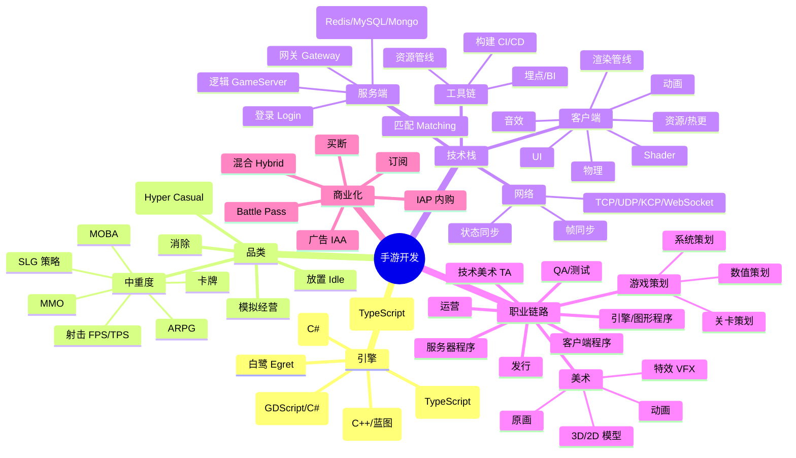

🎯 **建议的学习路线（按周计）**：

| 阶段 | 周数 | 目标 |
|------|------|------|
| 基础 | 1-2 | C# 语法、Unity 编辑器、GameObject/Component |
| 2D 入门 | 3-4 | Sprite、Tilemap、2D 物理，仿写 Flappy Bird |
| 3D 入门 | 5-7 | Mesh、Material、相机、控制器，做一个 FPS Demo |
| 系统化 | 8-12 | UI 框架、热更、动画状态机、音效、Shader |
| 网络 | 13-15 | Socket / KCP、帧同步、匹配房间 |
| 工程化 | 16-20 | 性能优化、资源管线、CI/CD、上架 |

---

## 第 1 章 游戏开发概览

### 1.1 游戏与普通程序的根本区别

普通 Web/桌面程序是 **事件驱动**：用户点了按钮，函数才跑。

游戏是 **帧驱动**：哪怕你什么都不做，引擎也以 60 帧/秒（或 30、120）持续刷新整个世界。

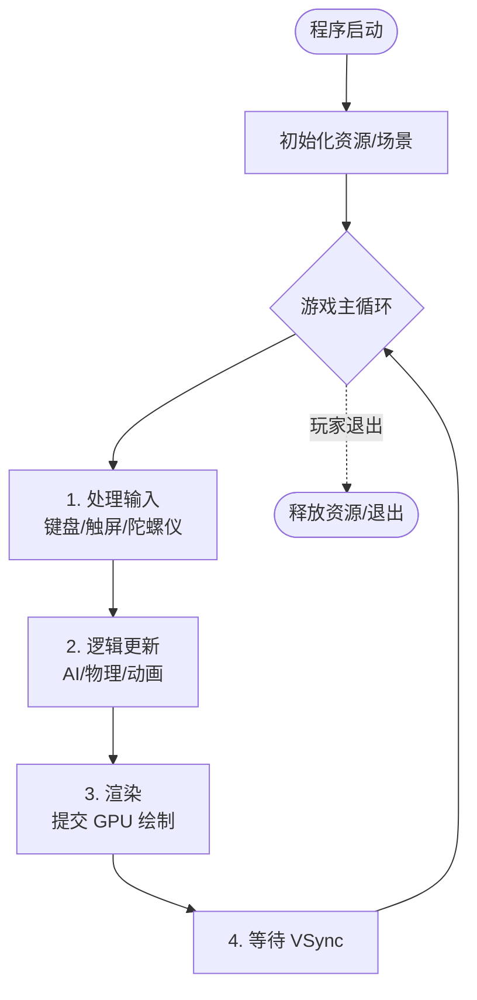

### 1.2 帧率（FPS）与 Delta Time

- **FPS（Frames Per Second）**：每秒刷新多少帧。手游常见 30 / 60 / 120。
- **帧时长**：60 帧 ≈ 16.67ms，30 帧 ≈ 33.33ms。
- ⚠️ **不要把"每帧速度"写死**，因为不同设备帧率不同。要用 `Time.deltaTime` 把"每帧"转换成"每秒"。

```csharp
// ❌ 错：低端机 30 帧时，物体走得只有一半快
transform.position += Vector3.right * 0.1f;

// ✅ 对：用 deltaTime，无论什么帧率，每秒都走 5 米
transform.position += Vector3.right * 5f * Time.deltaTime;
```

### 1.3 坐标系

| 坐标系 | 描述 | 典型用途 |
|--------|------|----------|
| 世界坐标 World | 整个场景的全局坐标 | 角色在地图上的位置 |
| 局部坐标 Local | 相对父节点 | 武器挂在手上 |
| 屏幕坐标 Screen | 像素坐标，左下 (0,0) | UI 点击检测 |
| 视口坐标 Viewport | 0-1 归一化 | 适配不同分辨率 |
| UV 坐标 | 贴图 0-1 | 纹理采样 |

Unity 默认 **左手系 Y 向上**，Unreal **左手系 Z 向上**，OpenGL **右手系 Y 向上**。迁移项目时要小心。

### 1.4 向量基础

```
2D 向量：v = (x, y)
3D 向量：v = (x, y, z)

加法：(1,2) + (3,4) = (4,6)        ——平移
减法：B - A 得到从 A 指向 B 的向量
点乘：a·b = |a||b|cosθ              ——判断夹角/朝向
叉乘：a×b 得到垂直向量              ——判断左右、求法线
模长：|v| = √(x²+y²+z²)             ——距离
归一化：v / |v|                     ——只要方向不要长度
```

💡 几个经典应用：

```csharp
// 角色朝向目标
Vector3 dir = (target.position - transform.position).normalized;
transform.forward = dir;

// 判断目标在我前面还是后面
float dot = Vector3.Dot(transform.forward, dir);
if (dot > 0) Debug.Log("在前面");

// 判断目标在我左边还是右边
float cross = Vector3.Cross(transform.forward, dir).y;
if (cross > 0) Debug.Log("在右边");
```

---

## 第 2 章 引擎选型

### 2.1 五大引擎横向对比

| 维度 | Unity | Unreal 5 | Cocos Creator | Godot | Laya |
|------|-------|----------|---------------|-------|------|
| 主语言 | C# | C++ / Blueprint | TypeScript | GDScript / C# | TypeScript |
| 适合品类 | 全品类，2D/3D 均强 | 3D 大作、高画质 | 2D / H5 / 小游戏 | 独立游戏 2D/3D | H5 / 小游戏 |
| 学习曲线 | 中 | 陡 | 平缓 | 平缓 | 平缓 |
| 包体（空工程） | ~25MB | ~150MB | ~5MB | ~30MB | ~3MB |
| 性能（移动端） | 优 | 良（高端机优） | 良 | 良 | 良 |
| 渲染管线 | URP / HDRP / Built-in | Nanite + Lumen | 自研 | 自研 | 自研 |
| 商业授权 | 免费起，年收入超 20w 美元收费 | 5% 流水分成（超 100w 后） | 免费 / 商业版 | MIT 完全免费 | 免费 / 付费版 |
| 微信小游戏 | 支持（需 WX-WASM） | 不支持 | 原生支持 | 实验性 | 原生支持 |
| 国内招聘需求 | 极高 | 中 | 高（小游戏/休闲） | 低 | 中 |
| 代表作 | 原神、王者荣耀、明日方舟 | 黑神话悟空、堡垒之夜 | 开心消消乐、羊了个羊 | Brotato、Dome Keeper | 弹壳特攻队 H5 |

🎯 **选型决策树**：

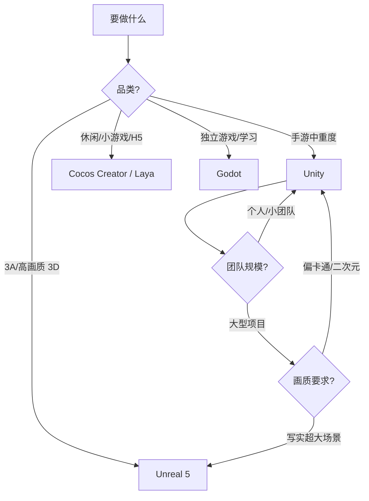

### 2.2 各引擎一句话定位

- **Unity**：手游的工业标准，C# 友好、生态最大、招聘最多。新手首选。
- **Unreal**：画质天花板，但 C++ 门槛高，包体大，移动端低端机吃力。
- **Cocos Creator**：国产之光，2D / 小游戏 / H5 / 微信生态王者。
- **Godot**：开源、轻量、独立游戏圈火热，3.x/4.x 性能差距大。
- **Laya / Egret**：纯 H5 / 小游戏方向，包体极小。

---

## 第 3 章 数学与物理基础

### 3.1 矩阵与变换

3D 中所有的"位移 + 旋转 + 缩放"都可以用 **4×4 矩阵** 表示。Unity 里你不需要手算矩阵，但要理解：

```
final_position = TRS * local_position
TRS = Translation × Rotation × Scale
```

⚠️ 矩阵乘法不满足交换律，**先缩放再旋转再平移** 和 **先平移再旋转** 结果完全不同。

### 3.2 四元数（Quaternion）

为什么不用欧拉角（Vector3 旋转）？**万向锁（Gimbal Lock）**：当俯仰角 ±90° 时会丢一个自由度。

```csharp
// 欧拉角转四元数
Quaternion q = Quaternion.Euler(0, 90, 0);

// 平滑旋转：Slerp（球面线性插值）
transform.rotation = Quaternion.Slerp(transform.rotation, targetRot, Time.deltaTime * 5f);

// 看向目标
transform.rotation = Quaternion.LookRotation(target.position - transform.position);
```

### 3.3 碰撞检测算法

#### 3.3.1 AABB（轴对齐包围盒）

最简单：两个矩形在每个轴上是否重叠。

```
盒A: minA(x,y) ~ maxA(x,y)
盒B: minB(x,y) ~ maxB(x,y)

相交条件：
  maxA.x >= minB.x && minA.x <= maxB.x
  && maxA.y >= minB.y && minA.y <= maxB.y
```

ASCII 图：

```
       ┌─────────┐
       │   B     │
   ┌───┼─────┐   │
   │   │ 重叠│   │
   │ A └─────┼───┘
   └─────────┘
```

#### 3.3.2 OBB（有向包围盒）

物体旋转后，AABB 会变得过大。OBB 跟着物体旋转。

#### 3.3.3 SAT（分离轴定理）

**任意凸多边形相交检测**：如果存在一条轴，使两个多边形投影不重叠，则不相交。

```
    投影到轴X：
    A: [────]
    B:        [────]    ← 存在间隙，不相交
```

#### 3.3.4 GJK 算法

3D 凸体相交检测，PhysX、Bullet 都基于它。原理：Minkowski 差是否包含原点。

### 3.4 物理引擎

| 引擎 | 用途 | 集成方 |
|------|------|--------|
| Box2D | 2D 物理 | Cocos / Unity 2D |
| Chipmunk | 2D 物理，轻量 | Cocos2d-x |
| PhysX | 3D 物理，NVIDIA | Unity / Unreal |
| Havok | 3D 物理，商业级 | Unreal（可选） |
| Bullet | 开源 3D 物理 | Blender / 多种引擎 |

### 3.5 物理基础公式

```
牛顿第二定律：F = m × a
速度：v = v0 + a × t
位置：p = p0 + v × t + 0.5 × a × t²
弹性碰撞：v1' = (m1-m2)/(m1+m2) × v1 + 2m2/(m1+m2) × v2
```

💡 移动端要慎用物理引擎模拟弹性碰撞，性能开销大且容易飘逸。SLG / 卡牌建议自己写运动学。

---

## 第 4 章 Unity 入门

### 4.1 Editor 五大窗口

```
┌──────────────────────────────────────────────────────┐
│ 顶部菜单 File/Edit/Assets/GameObject/Component/...    │
├──────────┬────────────────────────┬──────────────────┤
│          │                        │                  │
│ Hierarchy│      Scene / Game      │   Inspector      │
│ 场景节点  │      场景预览/运行预览   │   组件属性面板   │
│          │                        │                  │
├──────────┼────────────────────────┴──────────────────┤
│          │                                           │
│ Project  │              Console                      │
│ 资源浏览  │              日志/警告/错误               │
│          │                                           │
└──────────┴───────────────────────────────────────────┘
```

### 4.2 GameObject / Component 模型

Unity 的核心设计：**一切皆 GameObject，能力靠 Component 拼装**。

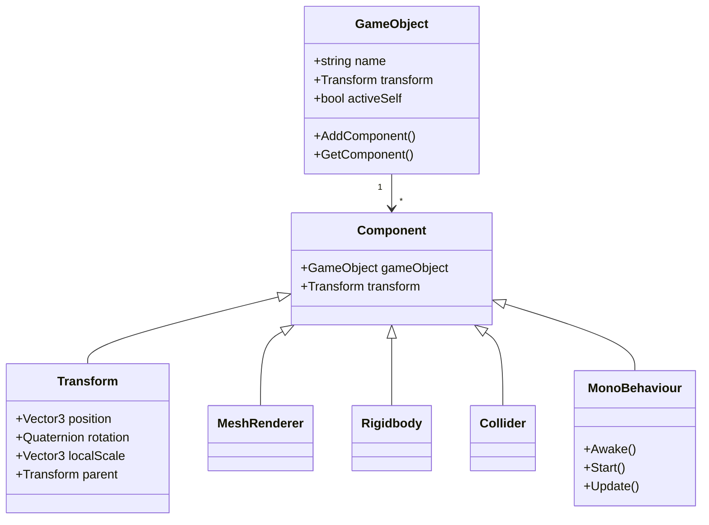

💡 **典型例子**：一个会走、有血条、能开火的"敌人 GameObject"上挂着：
- Transform（必有）
- MeshRenderer + MeshFilter（看得见）
- Collider（能被打到）
- Rigidbody（受物理影响）
- EnemyAI（自定义脚本：AI 逻辑）
- HealthBar（自定义脚本：血条）
- Gun（自定义脚本：开火）

### 4.3 Prefab（预制体）

Prefab 是"GameObject 的模板"。一个怪改模板，所有实例自动更新。

```csharp
// 实例化 Prefab
public GameObject enemyPrefab;
GameObject enemy = Instantiate(enemyPrefab, spawnPos, Quaternion.identity);

// Variant：基于父 Prefab 的变体（精英怪、Boss）
```

### 4.4 MonoBehaviour 生命周期

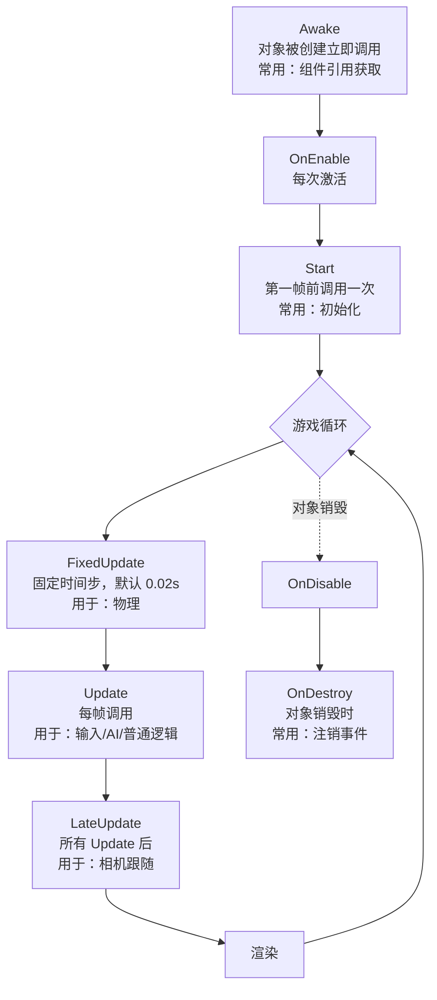

代码示例：

```csharp
using UnityEngine;

public class LifecycleDemo : MonoBehaviour
{
    private Rigidbody rb;

    // 1. 最早执行，组件还没都准备好，但 GetComponent 可用
    void Awake()
    {
        rb = GetComponent<Rigidbody>();      // 缓存组件
    }

    // 2. 比 Awake 晚，比 Update 早。可以用 Awake 中获取的引用
    void Start()
    {
        rb.AddForce(Vector3.up * 500f);      // 初始冲量
    }

    // 3. 物理用 FixedUpdate
    void FixedUpdate()
    {
        // 力相关的操作必须在这里
        rb.AddForce(Vector3.right * 10f, ForceMode.Force);
    }

    // 4. 输入/逻辑用 Update
    void Update()
    {
        if (Input.GetKeyDown(KeyCode.Space))
        {
            Debug.Log("跳跃");
        }
    }

    // 5. 相机跟随用 LateUpdate（保证角色先移动完）
    void LateUpdate()
    {
        // Camera.main.transform.position = transform.position + offset;
    }

    void OnDestroy()
    {
        // 注销事件、释放资源
    }
}
```

---

## 第 5 章 C# 游戏脚本

### 5.1 必备语法回顾

```csharp
// 类、字段、属性
public class Hero
{
    public string Name { get; set; }
    public int HP { get; private set; } = 100;

    public void TakeDamage(int dmg)
    {
        HP -= dmg;
        if (HP <= 0) Die();
    }

    private void Die() => Debug.Log($"{Name} died");
}

// 泛型
List<Hero> heroes = new List<Hero>();
Dictionary<int, Hero> heroMap = new Dictionary<int, Hero>();

// LINQ（移动端慎用，会 GC）
var aliveHeroes = heroes.Where(h => h.HP > 0).ToList();
```

### 5.2 协程 Coroutine

Unity 最常用的"伪异步"机制。用 `IEnumerator` + `yield return` 实现。

```csharp
using System.Collections;
using UnityEngine;

public class CoroutineDemo : MonoBehaviour
{
    void Start()
    {
        StartCoroutine(FadeOut());                  // 启动
        StartCoroutine(SpawnEnemyEvery(2f));
    }

    // 3 秒内淡出
    IEnumerator FadeOut()
    {
        var renderer = GetComponent<SpriteRenderer>();
        float t = 0f;
        while (t < 3f)
        {
            t += Time.deltaTime;
            Color c = renderer.color;
            c.a = 1f - t / 3f;
            renderer.color = c;
            yield return null;                      // 等下一帧
        }
    }

    // 每 N 秒生成一个怪
    IEnumerator SpawnEnemyEvery(float interval)
    {
        while (true)
        {
            yield return new WaitForSeconds(interval);
            // Instantiate(enemyPrefab);
            Debug.Log("生成怪物");
        }
    }
}
```

常见 yield：
- `yield return null;` 等下一帧
- `yield return new WaitForSeconds(2f);` 等 2 秒
- `yield return new WaitForEndOfFrame();` 帧末（截图常用）
- `yield return new WaitUntil(() => ready);` 条件等待

⚠️ 协程依附于 GameObject，对象被禁用/销毁协程会停。要全局协程用 `Task` / `UniTask`。

### 5.3 事件与委托

```csharp
// 1. C# 原生 event
public static event Action<int> OnScoreChanged;
OnScoreChanged?.Invoke(100);

// 2. UnityEvent（可在 Inspector 拖拽配置）
public UnityEngine.Events.UnityEvent onDie;

// 3. 推荐：自己的事件中心 EventBus
public static class EventBus
{
    static Dictionary<string, Action<object>> _map = new();

    public static void On(string evt, Action<object> cb)
    {
        if (!_map.ContainsKey(evt)) _map[evt] = null;
        _map[evt] += cb;
    }

    public static void Emit(string evt, object data = null)
    {
        if (_map.TryGetValue(evt, out var cb)) cb?.Invoke(data);
    }

    public static void Off(string evt, Action<object> cb)
    {
        if (_map.ContainsKey(evt)) _map[evt] -= cb;
    }
}

// 用法
EventBus.On("HeroDie", data => Debug.Log("英雄死了"));
EventBus.Emit("HeroDie");
```

### 5.4 Unity 常用 API

| API | 用途 |
|-----|------|
| `Time.deltaTime` | 上一帧间隔 |
| `Time.time` | 游戏启动以来的总秒数 |
| `Time.timeScale` | 时间缩放，0 = 暂停 |
| `Input.GetKey/GetKeyDown` | 键盘输入 |
| `Input.GetMouseButton` | 鼠标 |
| `Input.touches` | 触屏 |
| `Physics.Raycast` | 3D 射线 |
| `Physics2D.OverlapCircle` | 2D 圆形检测 |
| `Resources.Load` | 加载 Resources 目录资源（不推荐手游用） |
| `Instantiate / Destroy` | 实例化/销毁 |
| `DontDestroyOnLoad` | 跨场景保留 |

---

## 第 6 章 2D 游戏开发

### 6.1 Sprite 与 SpriteRenderer

Sprite 是一张 2D 图片。`Texture Type` 必须设为 `Sprite (2D and UI)`，导入后才能用。

```csharp
public class SpriteController : MonoBehaviour
{
    public Sprite[] frames;          // 多帧图
    SpriteRenderer sr;
    int idx = 0;

    void Start() => sr = GetComponent<SpriteRenderer>();

    void Update()
    {
        // 每秒切 8 帧
        idx = (int)(Time.time * 8) % frames.Length;
        sr.sprite = frames[idx];
    }
}
```

### 6.2 Tilemap 瓦片地图

横版 / 俯视视角地图用 Tilemap 拼。优点：DrawCall 少，编辑方便。

ASCII 关卡草图（俯视）：

```
##########
#........#
#..@.....#       @ 玩家  $ 宝箱  E 敌人  # 墙
#......E.#
#...$....#
##########
```

### 6.3 2D 物理

2D 物理用 `Rigidbody2D` + `Collider2D`（Box / Circle / Polygon / Capsule）。

```csharp
public class PlayerMove2D : MonoBehaviour
{
    public float speed = 5f;
    public float jumpForce = 10f;
    Rigidbody2D rb;
    bool grounded;

    void Awake() => rb = GetComponent<Rigidbody2D>();

    void Update()
    {
        // 水平移动
        float h = Input.GetAxisRaw("Horizontal");
        rb.velocity = new Vector2(h * speed, rb.velocity.y);

        // 跳跃
        if (grounded && Input.GetKeyDown(KeyCode.Space))
        {
            rb.velocity = new Vector2(rb.velocity.x, jumpForce);
            grounded = false;
        }
    }

    void OnCollisionEnter2D(Collision2D col)
    {
        if (col.gameObject.CompareTag("Ground")) grounded = true;
    }
}
```

### 6.4 骨骼动画：Spine / DragonBones

帧动画（一张张图）适合简单角色，但贴图占用大。**骨骼动画**通过驱动骨骼变形单张贴图，包体小、变化多。

| 工具 | 价格 | 引擎支持 |
|------|------|----------|
| Spine | 商业付费（299/699/2200 美元） | Unity / Cocos / 自定义 |
| DragonBones | 免费开源 | Cocos / Unity / Egret |
| Live2D | 免费 + Pro 付费 | 二次元立绘必备 |

```csharp
// Spine for Unity
using Spine.Unity;
public class HeroSpine : MonoBehaviour
{
    public SkeletonAnimation skel;
    void PlayAttack() => skel.AnimationState.SetAnimation(0, "attack", false);
    void PlayIdle()   => skel.AnimationState.SetAnimation(0, "idle", true);
}
```

### 6.5 三种 2D 品类范式

**横版跑酷 / 平台跳跃**：重力 + 跳跃 + 滑墙 + 摄像机平滑跟随
**俯视 RPG**：八方向移动 + 网格寻路 + 视野
**塔防**：路径预定义 + 怪沿路径走 + 塔检测范围内最近敌人开火

---

## 第 7 章 3D 游戏开发

### 7.1 Mesh、Material、Shader 的关系

```
Mesh（几何形状）   ────┐
                       ├──→ MeshRenderer 渲染 ──→ 屏幕
Material（材质）   ────┤
  └─ Shader（着色器逻辑）
  └─ Texture（贴图）
  └─ 参数（颜色/金属度/粗糙度）
```

### 7.2 PBR（基于物理的渲染）

现代 3D 游戏标配。核心贴图：
- **Albedo**：基础色
- **Normal**：法线，模拟凹凸
- **Metallic**：金属度（0 非金属，1 金属）
- **Roughness / Smoothness**：粗糙度
- **AO**：环境光遮蔽
- **Emission**：自发光

### 7.3 光照

| 光源 | 用途 |
|------|------|
| Directional Light | 太阳光，平行光 |
| Point Light | 灯泡，点光源 |
| Spot Light | 手电筒，聚光灯 |
| Area Light | 面光源（仅烘焙） |

**实时光照** 性能差但灵活，**烘焙光照（Baked GI）** 性能好但场景固定。手游典型方案：主角受实时光照 + 静态场景用 Lightmap 烘焙。

### 7.4 相机

```csharp
public class ThirdPersonCamera : MonoBehaviour
{
    public Transform target;
    public float distance = 5f;
    public float height = 2f;
    public float smooth = 5f;

    void LateUpdate()
    {
        // 计算理想位置
        Vector3 desired = target.position - target.forward * distance + Vector3.up * height;
        // 平滑插值
        transform.position = Vector3.Lerp(transform.position, desired, Time.deltaTime * smooth);
        transform.LookAt(target.position + Vector3.up * 1.5f);
    }
}
```

### 7.5 第一/第三人称控制器

第一人称：相机贴在角色头部，鼠标控制视角。
第三人称：相机围绕角色旋转，常配合 Cinemachine。

```csharp
public class FPSController : MonoBehaviour
{
    public float walkSpeed = 5f;
    public float mouseSens = 2f;
    CharacterController cc;
    Camera cam;
    float pitch;
    Vector3 velocity;

    void Awake()
    {
        cc = GetComponent<CharacterController>();
        cam = GetComponentInChildren<Camera>();
        Cursor.lockState = CursorLockMode.Locked;
    }

    void Update()
    {
        // 视角旋转
        float mx = Input.GetAxis("Mouse X") * mouseSens;
        float my = Input.GetAxis("Mouse Y") * mouseSens;
        transform.Rotate(0, mx, 0);
        pitch = Mathf.Clamp(pitch - my, -85f, 85f);
        cam.transform.localEulerAngles = new Vector3(pitch, 0, 0);

        // 移动
        float h = Input.GetAxis("Horizontal");
        float v = Input.GetAxis("Vertical");
        Vector3 move = (transform.right * h + transform.forward * v) * walkSpeed;
        velocity.x = move.x;
        velocity.z = move.z;

        // 重力
        if (cc.isGrounded) velocity.y = -1f;
        else velocity.y += -9.8f * Time.deltaTime;

        cc.Move(velocity * Time.deltaTime);
    }
}
```

---

## 第 8 章 动画系统

### 8.1 Animation Clip 与 Animator

- **Animation Clip**：一段动画数据（idle.anim、run.anim、attack.anim）
- **Animator Controller**：状态机，管理 Clip 之间的切换
- **Avatar**：人形骨骼映射（人形通用动画用）

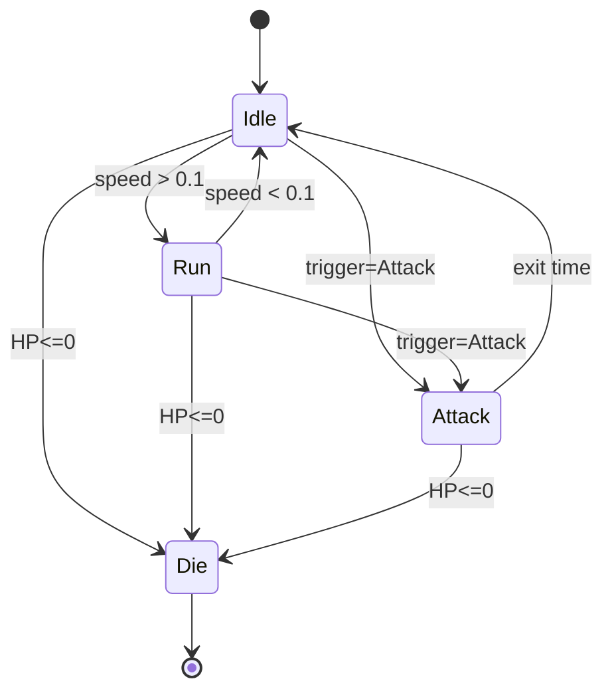

代码控制 Animator：

```csharp
public class HeroAnim : MonoBehaviour
{
    Animator anim;
    void Awake() => anim = GetComponent<Animator>();

    public void SetMove(float speed) => anim.SetFloat("Speed", speed);
    public void DoAttack()            => anim.SetTrigger("Attack");
    public void Die()                 => anim.SetBool("IsDead", true);
}
```

### 8.2 Animation Rigging 与 IK

IK（Inverse Kinematics 反向动力学）：给定手脚末端位置，反推骨骼旋转。
应用：脚步贴地、手抓物体、瞄准跟随准星。

```csharp
// 简单的脚步 IK
void OnAnimatorIK(int layerIndex)
{
    anim.SetIKPositionWeight(AvatarIKGoal.LeftFoot, 1f);
    RaycastHit hit;
    Vector3 footPos = anim.GetIKPosition(AvatarIKGoal.LeftFoot);
    if (Physics.Raycast(footPos + Vector3.up, Vector3.down, out hit, 2f))
    {
        anim.SetIKPosition(AvatarIKGoal.LeftFoot, hit.point);
    }
}
```

### 8.3 Timeline 与 Cinemachine

Timeline：剧情、过场、技能 combo 的时间线编辑器。
Cinemachine：智能相机系统，提供 VirtualCamera、跟随、构图。

---

## 第 9 章 UI 系统

### 9.1 UGUI 三件套

- **Canvas**：UI 根容器
- **EventSystem**：处理点击/触屏
- **Graphic Raycaster**：射线检测谁被点

### 9.2 Canvas 三种模式

| 模式 | 用途 |
|------|------|
| Screen Space - Overlay | 2D UI，永远盖在屏幕上 |
| Screen Space - Camera | 3D 元素可遮挡 UI |
| World Space | UI 在 3D 世界里（VR、血条） |

### 9.3 多分辨率自适应

`Canvas Scaler` 设置：
- **UI Scale Mode**: Scale With Screen Size
- **Reference Resolution**: 1920×1080（设计稿）
- **Match**: 0.5（宽高都管） / 0（按宽） / 1（按高）

⚠️ 手游通常按 **宽度适配（Match=0）**，因为竖屏机型高度差异大。

### 9.4 自研 UI 框架（MVC + 栈式管理）

```csharp
// 基类
public abstract class UIPanel : MonoBehaviour
{
    public virtual void OnShow(object data) {}
    public virtual void OnHide() {}
}

// 管理器
public class UIManager : MonoBehaviour
{
    static UIManager _inst;
    public static UIManager Inst => _inst;

    Stack<UIPanel> stack = new();
    Dictionary<string, GameObject> prefabs = new();
    public Transform root;

    void Awake() { _inst = this; DontDestroyOnLoad(gameObject); }

    public void Push(string panelName, object data = null)
    {
        if (!prefabs.TryGetValue(panelName, out var prefab))
        {
            prefab = Resources.Load<GameObject>($"UI/{panelName}");
            prefabs[panelName] = prefab;
        }
        var go = Instantiate(prefab, root);
        var panel = go.GetComponent<UIPanel>();
        if (stack.Count > 0) stack.Peek().OnHide();
        stack.Push(panel);
        panel.OnShow(data);
    }

    public void Pop()
    {
        if (stack.Count == 0) return;
        var top = stack.Pop();
        top.OnHide();
        Destroy(top.gameObject);
        if (stack.Count > 0) stack.Peek().OnShow(null);
    }
}

// 使用
public class MainMenuPanel : UIPanel
{
    public override void OnShow(object data) => gameObject.SetActive(true);
    public override void OnHide() => gameObject.SetActive(false);
    public void OnClickStart() => UIManager.Inst.Push("BattlePanel");
}
```

### 9.5 UI 动效 DOTween

DOTween 是 Unity 最流行的补间动画库。

```csharp
using DG.Tweening;

// 透明度
canvasGroup.DOFade(0, 0.3f);

// 位置
transform.DOMove(target, 0.5f).SetEase(Ease.OutBack);

// 缩放 + 回调
transform.DOScale(Vector3.zero, 0.2f).OnComplete(() => Destroy(gameObject));

// 序列
Sequence seq = DOTween.Sequence();
seq.Append(img.DOFade(1, 0.3f))
   .Append(transform.DOScale(1.2f, 0.2f))
   .Append(transform.DOScale(1f, 0.1f));
```

---

## 第 10 章 音效系统

### 10.1 AudioSource 与 AudioMixer

- **AudioClip**：音频文件
- **AudioSource**：发声组件
- **AudioListener**：耳朵（通常在主相机）
- **AudioMixer**：混音器，分组（BGM / SFX / Voice）+ 总线控制

```csharp
public class AudioManager : MonoBehaviour
{
    public static AudioManager Inst { get; private set; }
    public AudioSource bgmSource;
    public AudioSource sfxSource;
    Dictionary<string, AudioClip> sfxCache = new();

    void Awake() { Inst = this; DontDestroyOnLoad(gameObject); }

    public void PlayBGM(string name)
    {
        var clip = Resources.Load<AudioClip>($"Audio/BGM/{name}");
        bgmSource.clip = clip;
        bgmSource.loop = true;
        bgmSource.Play();
    }

    public void PlaySFX(string name)
    {
        if (!sfxCache.TryGetValue(name, out var clip))
        {
            clip = Resources.Load<AudioClip>($"Audio/SFX/{name}");
            sfxCache[name] = clip;
        }
        sfxSource.PlayOneShot(clip);
    }
}
```

### 10.2 FMOD / Wwise

商业大项目用专业中间件：
- **FMOD Studio**：参数化音效、自适应音乐
- **Wwise**：暴雪、育碧标配，免费 + 商业授权

中小手游用 Unity 自带 AudioMixer 完全够。

### 10.3 移动端音频注意

- iOS 静音键控制：默认遵守静音，但游戏 BGM 通常希望忽略
- 安卓延迟：用 OpenSL ES 减少延迟
- 包体：压缩格式 Vorbis（背景音乐）/ ADPCM（短音效）

---

## 第 11 章 Shader 入门

### 11.1 渲染管线

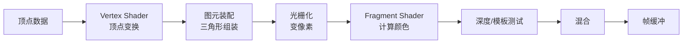

### 11.2 Unity 三大管线

| 管线 | 定位 | 移动端 |
|------|------|--------|
| Built-in | 老管线，2024 后维护 | 兼容性最好 |
| URP | 通用，性能好 | **手游首选** |
| HDRP | 高清，PC/主机 | 不适合 |

### 11.3 第一个 ShaderLab（URP）

一个简单的纯色 Shader：

```hlsl
Shader "Custom/SolidColor"
{
    Properties
    {
        _Color ("Color", Color) = (1,1,1,1)
    }
    SubShader
    {
        Tags { "RenderType"="Opaque" "RenderPipeline"="UniversalPipeline" }
        Pass
        {
            HLSLPROGRAM
            #pragma vertex vert
            #pragma fragment frag
            #include "Packages/com.unity.render-pipelines.universal/ShaderLibrary/Core.hlsl"

            float4 _Color;

            struct Attributes { float4 posOS : POSITION; };
            struct Varyings   { float4 posCS : SV_POSITION; };

            Varyings vert(Attributes IN)
            {
                Varyings OUT;
                OUT.posCS = TransformObjectToHClip(IN.posOS.xyz);
                return OUT;
            }

            half4 frag(Varyings IN) : SV_Target
            {
                return _Color;
            }
            ENDHLSL
        }
    }
}
```

### 11.4 Shader Graph

URP / HDRP 提供的 **可视化 Shader 编辑器**，无需写代码：拖节点连线即可做溶解、水面、火焰、菲涅尔等。新人强推。

### 11.5 经典效果思路

| 效果 | 原理 |
|------|------|
| 描边 | 沿法线膨胀一圈反面 |
| 溶解 | 噪声贴图 + step 阈值丢弃像素 |
| 水面 | 法线贴图扰动 + 反射 + 折射 |
| 菲涅尔 | 边缘光：1 - dot(N, V) |
| 卡通 | 阶梯化漫反射 + 描边 |

### 11.6 描边 Shader 片段

```hlsl
// 第一个 Pass：背面膨胀
Pass
{
    Cull Front
    HLSLPROGRAM
    float _OutlineWidth;
    float4 _OutlineColor;

    Varyings vert(Attributes IN)
    {
        Varyings OUT;
        float3 normalOS = IN.normalOS * _OutlineWidth;
        OUT.posCS = TransformObjectToHClip(IN.posOS.xyz + normalOS);
        return OUT;
    }
    half4 frag() : SV_Target { return _OutlineColor; }
    ENDHLSL
}
// 第二个 Pass：正常渲染
```

---

## 第 12 章 性能优化

### 12.1 性能指标

| 指标 | 目标 |
|------|------|
| FPS | 30 / 60 稳定 |
| Draw Call | 移动端 < 200，中重度 < 500 |
| Triangle | 单帧 < 100w |
| 内存 | iPhone 8 < 1.5GB，安卓中端 < 1GB |
| 启动时间 | < 5s |
| 包体 | 100MB 以内（超出需分包） |
| 发热 | 连续 30 分钟，机身 < 42°C |

### 12.2 Profiler 使用

`Window > Analysis > Profiler`，关注：
- **CPU Usage**：脚本耗时（Update / FixedUpdate / Render）
- **GPU**：渲染瓶颈
- **Memory**：纹理 / Mesh / Script Object
- **Rendering**：DrawCall、Tris、SetPass

🎯 真机调试：用 USB 连接，Build & Run + Development Build + Autoconnect Profiler。

### 12.3 DrawCall 优化

降低 DrawCall 三大法宝：
1. **静态批合并 Static Batching**：场景里不动的物体勾 Static
2. **动态批合并 Dynamic Batching**：小 Mesh 自动合
3. **SRP Batcher（URP 默认开）**：相同 Shader Variant 的物体合一次

UI 优化：
- 同一图集（Sprite Atlas）的图片才能合批
- 隐藏 UI 用 `gameObject.SetActive(false)` 而不是 `CanvasGroup.alpha=0`（后者还在算）

### 12.4 贴图压缩

| 平台 | 格式 |
|------|------|
| iOS | ASTC（推荐） / PVRTC（老设备） |
| Android | ASTC（推荐） / ETC2 |
| 通用 | RGBA32（高质量，大） |

设置：贴图分辨率必须是 2 的幂；UI 图集尽量 1024×1024 或 2048×2048。

### 12.5 对象池（Object Pool）

子弹、特效、敌人这类高频生成销毁的对象，必须用对象池避免 GC。

```csharp
public class ObjectPool<T> where T : Component
{
    Queue<T> pool = new();
    T prefab;
    Transform root;

    public ObjectPool(T prefab, int preload = 10)
    {
        this.prefab = prefab;
        root = new GameObject($"Pool_{typeof(T).Name}").transform;
        for (int i = 0; i < preload; i++)
        {
            var inst = Object.Instantiate(prefab, root);
            inst.gameObject.SetActive(false);
            pool.Enqueue(inst);
        }
    }

    public T Get()
    {
        if (pool.Count == 0)
        {
            var inst = Object.Instantiate(prefab, root);
            return inst;
        }
        var t = pool.Dequeue();
        t.gameObject.SetActive(true);
        return t;
    }

    public void Release(T t)
    {
        t.gameObject.SetActive(false);
        t.transform.SetParent(root);
        pool.Enqueue(t);
    }
}

// 使用
var bulletPool = new ObjectPool<Bullet>(bulletPrefab, 30);
var b = bulletPool.Get();
// ... 用完后
bulletPool.Release(b);
```

### 12.6 LOD（Level of Detail）

远处用低模，近处用高模。给一个 GameObject 加 `LODGroup`，分别设置三档：LOD0（高）、LOD1（中）、LOD2（低）。

### 12.7 GC 优化（最常见手游卡顿原因）

```csharp
// ❌ 每帧 new 字符串
void Update() => text.text = "Score: " + score;

// ✅ 字符串拼接缓存
StringBuilder sb = new();
void Update()
{
    sb.Clear();
    sb.Append("Score: ").Append(score);
    text.text = sb.ToString();
}

// ❌ 每帧 new List
foreach (var e in FindObjectsOfType<Enemy>()) { ... }

// ✅ 用对象池或缓存集合
List<Enemy> _cache = new();
void Update()
{
    _cache.Clear();
    EnemyManager.GetAlive(_cache);
}

// ❌ foreach 在某些版本会产生 GC（Mono）
// ✅ for(int i=0;...) 或确认 IL2CPP 已优化
```

### 12.8 移动端发热处理

- 限帧到 30 / 60，避免 200+ 的"假性能"
- 长时间挂机降到 15 帧（菜单界面）
- 关闭后台音效、暂停动画
- 避免实时阴影 + 实时反射同开

---

## 第 13 章 资源管理与热更新

### 13.1 三种资源加载方式

| 方式 | 优点 | 缺点 |
|------|------|------|
| Resources | 简单 | 全部打进包，无法热更 |
| AssetBundle | 灵活、可热更 | API 古老、依赖手动管理 |
| Addressables | 现代、自动依赖、远程 | 学习曲线陡 |

### 13.2 Addressables 加载流程

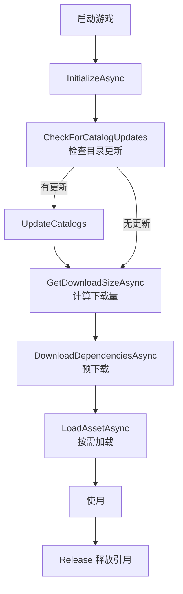

```csharp
using UnityEngine.AddressableAssets;
using UnityEngine.ResourceManagement.AsyncOperations;

public class AddrLoader : MonoBehaviour
{
    async void Start()
    {
        // 1. 初始化
        await Addressables.InitializeAsync().Task;

        // 2. 检查更新
        var catalogs = await Addressables.CheckForCatalogUpdates().Task;
        if (catalogs.Count > 0)
            await Addressables.UpdateCatalogs(catalogs).Task;

        // 3. 计算需要下载多少
        long size = await Addressables.GetDownloadSizeAsync("hero_warrior").Task;
        Debug.Log($"需下载 {size / 1024f / 1024f:F2} MB");

        // 4. 预下载
        await Addressables.DownloadDependenciesAsync("hero_warrior").Task;

        // 5. 加载资源
        var handle = Addressables.InstantiateAsync("hero_warrior");
        var go = await handle.Task;

        // 6. 用完释放
        Addressables.ReleaseInstance(go);
    }
}
```

### 13.3 代码热更：HybridCLR / xLua

iOS 禁止下发原生代码（IL）。常见方案：

| 方案 | 原理 | 优势 | 限制 |
|------|------|------|------|
| ILRuntime | 解释执行 IL | 用 C# 写 | 性能差 |
| xLua | Lua 脚本 + 桥接 | 稳定、腾讯背书 | 双语言开发 |
| HybridCLR | 真 C# 热更，AOT + Interpreter 混合 | 性能近原生、纯 C# | 较新、稳定性提升中 |
| Puerts | TypeScript 热更 | 前端友好 | 需要桥接 |

💡 新项目首推 **HybridCLR**：可以全 C# 开发，热更 DLL 直接下发。

### 13.4 版本管理策略

```
v1.0.0 主版本：必须强制更新（大版本）
v1.0.X 资源版本：静默更新
v1.0.0.123 代码版本：热更新 DLL

flow：
  启动 → 比对本地版本 vs 服务器版本 →
    主版本不一致 → 弹"前往应用商店更新"
    资源/代码不一致 → 静默下载 → 重启生效
```

---

## 第 14 章 网络同步

### 14.1 帧同步 vs 状态同步

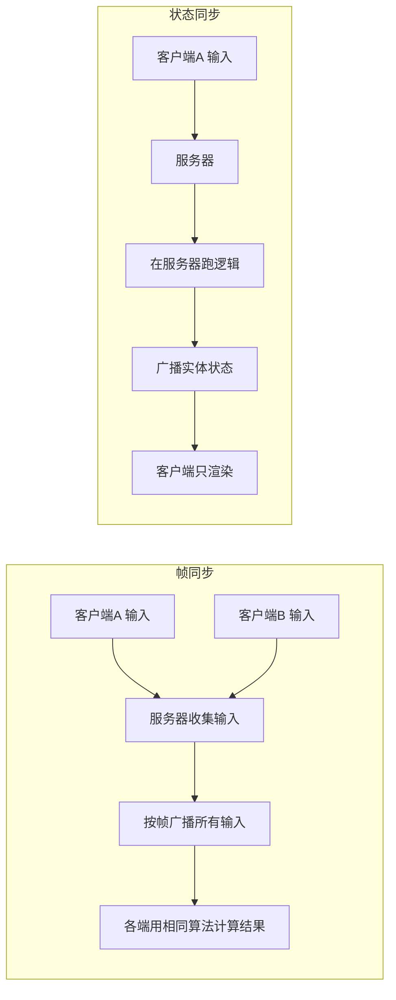

| 维度 | 帧同步 | 状态同步 |
|------|--------|----------|
| 服务器负担 | 极小（只转发输入） | 大（跑全逻辑） |
| 客户端负担 | 大（跑完整逻辑） | 小 |
| 流量 | 极小（只发输入） | 大（发状态） |
| 一致性要求 | 浮点必须确定、随机种子统一 | 无要求 |
| 防外挂 | 弱（内存可见） | 强（结果在服务端） |
| 重连 / 录像 | 易（重放输入） | 难 |
| 典型品类 | MOBA / RTS / 格斗 | MMO / FPS / SLG |
| 代表作 | 王者荣耀、LOL | 魔兽世界、PUBG |

⚠️ 帧同步死亡陷阱：**float 在不同 CPU/JIT 上可能不一致**。要么用定点数（FixedPoint），要么禁用 IL2CPP 优化。

### 14.2 协议：TCP / UDP / KCP / WebSocket

| 协议 | 特点 | 用途 |
|------|------|------|
| TCP | 可靠、有序、慢 | 登录、聊天、商城 |
| UDP | 不可靠、快 | 音视频 |
| KCP | UDP 上加可靠层，比 TCP 快 30%-40% | 实时对战 |
| WebSocket | 基于 TCP、浏览器友好 | 小游戏、H5 |
| QUIC | UDP + 加密 + 多路复用 | 新一代 |

### 14.3 延迟补偿与回滚

**客户端预测（Prediction）**：本地输入立即出效果，等服务器结果回来对比。
**服务器纠正（Reconciliation）**：服务器结果不一致就回滚到该帧重算。
**他玩家插值（Interpolation）**：他人位置在最近两次收到的状态间插值，平滑显示。

```csharp
// 客户端预测伪代码
void Update()
{
    var input = ReadInput();
    SendToServer(input, currentFrame);
    inputHistory[currentFrame] = input;

    // 本地立即应用
    state = Simulate(state, input);
    currentFrame++;
}

// 收到服务端结果
void OnServerSnapshot(int frame, State serverState)
{
    if (Vector3.Distance(serverState.pos, predictedPosAt[frame]) > 0.1f)
    {
        // 回滚 + 重新模拟到当前帧
        state = serverState;
        for (int f = frame + 1; f < currentFrame; f++)
            state = Simulate(state, inputHistory[f]);
    }
}
```

### 14.4 丢包与心跳

- 心跳包：3-5 秒一次小包，检测连接
- 重传：KCP 自带，自己写 UDP 要做 seq + ack
- 断线重连：服务端保留会话 30-60 秒，客户端用 token 续

---

## 第 15 章 服务器架构

### 15.1 经典分层架构

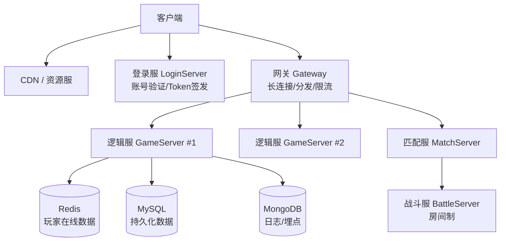

### 15.2 数据库分工

| 数据库 | 用途 | 例子 |
|--------|------|------|
| Redis | 内存缓存、排行榜、会话 | 在线状态、好友列表、Zset 排行 |
| MySQL | 强一致、事务 | 充值订单、装备背包 |
| MongoDB | 文档型、灵活 | 日志、配置、邮件 |
| TiDB / 分库分表 | 海量数据 | MMO 角色表 |

### 15.3 常用服务端框架

| 框架 | 语言 | 适合 |
|------|------|------|
| Skynet | C + Lua | 全品类，云风出品，国内非常流行 |
| Pomelo | Node.js | H5 / 小游戏 |
| KBEngine | C++ + Python | MMO |
| Photon | C# | 实时对战、Unity 友好 |
| Mirror / FishNet | C# | Unity 内嵌服务器 |
| Colyseus | Node.js + TS | 房间制对战 |
| Nakama | Go | BaaS，开箱即用 |

### 15.4 房间服模型（适合 MOBA / 棋牌）

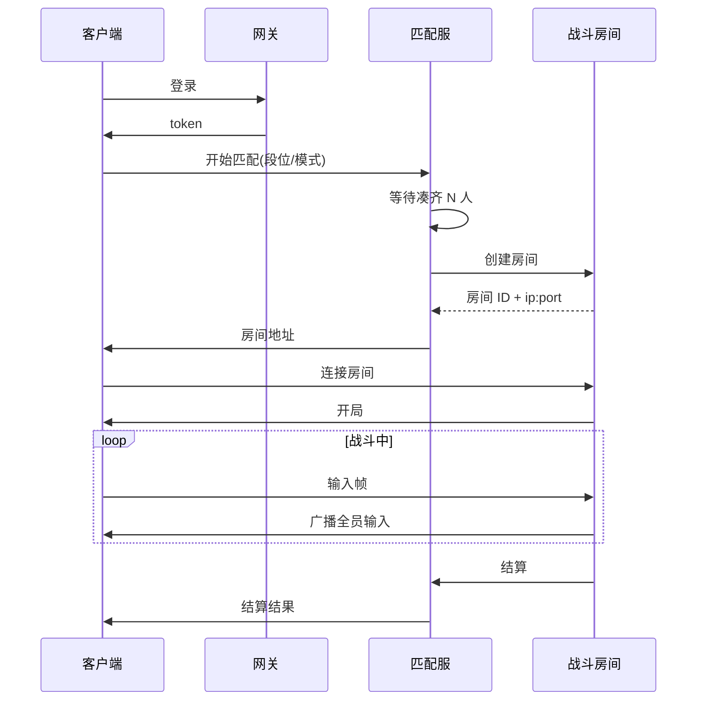

### 15.5 全服模型（适合 MMO / SLG）

所有玩家在一个大世界。AOI（Area of Interest）算法：只给玩家发送视野内对象的状态，常用九宫格或十字链表。

---

## 第 16 章 游戏品类实战

### 16.1 五大主流品类对比

| 品类 | 代表作 | 核心循环 | 客户端难点 | 服务器难点 | 商业模式 |
|------|--------|----------|-------------|--------------|----------|
| 休闲 Casual | Flappy Bird、地铁跑酷 | 简单操作 + 长成绩追求 | 流畅手感 | 几乎无 | 广告为主 |
| SLG | COK、率土之滨 | 资源 → 建设 → 战斗 | 大世界、联盟战 | 跨服、AOI、数据量大 | 内购付费墙 |
| 卡牌 | 阴阳师、明日方舟 | 抽卡 → 养成 → 推图 | 抽卡概率合规、动画 | 卡池配置、防作弊 | 抽卡为主 |
| MMO | 梦幻西游、原神 | 探索 → 战斗 → 社交 | 海量内容 | AOI、副本、聊天系统 | 内购+月卡 |
| MOBA | 王者荣耀、LOL | 5v5 对战 | 帧同步精度 | 帧同步、匹配 | 皮肤为主 |

### 16.2 SLG 关键系统

- **建造系统**：网格地图 + 建筑等级 + 升级时间
- **资源系统**：木/铁/粮/金，产出公式 = 等级 × 基础 × 加成
- **联盟系统**：群聊、捐献、互助
- **行军系统**：地图坐标 + 行军时间 + 战报回放
- **赛季机制**：N 个月清服重开，老玩家继承

### 16.3 卡牌关键系统

- **抽卡池**：UP / 常驻 / 限定，保底机制
- **概率合规**：中国法规要求展示概率（≥0.6% / 0.6% 模糊）
- **养成线**：升级 / 升星 / 突破 / 装备 / 觉醒
- **关卡推图**：地图节点 + 体力 + 关卡奖励
- **PVP**：异步战斗 / 实时竞技场

### 16.4 MMO 关键系统

- **任务系统**：主线 / 支线 / 日常 / 周常 / 成就，数据驱动
- **副本系统**：场景实例化、Boss AI、组队匹配
- **背包系统**：道具堆叠、装备品质、强化打孔
- **聊天系统**：世界 / 私聊 / 联盟 / 跨服，敏感词过滤
- **社交系统**：好友、组队、师徒、结婚

### 16.5 MOBA 关键系统

- 帧同步精度（定点数）
- 技能系统：可视化技能编辑器
- 阴影系统：战争迷雾
- 录像回放：保存全帧输入

---

## 第 17 章 Unreal 与 Cocos Creator 补充

### 17.1 Unreal 5 速览

**优势**：
- **Nanite**：自动几何 LOD，可以直接用电影级几何
- **Lumen**：实时全局光照
- **MetaHuman**：超写实角色
- **Niagara**：粒子系统
- **Chaos**：物理与破坏

**蓝图 vs C++**：
- 蓝图：可视化节点，策划友好，性能比 C++ 慢 3-10 倍
- C++：性能强，需重启编辑器编译
- 实战：核心系统用 C++（如战斗、网络），UI / 配置流程用蓝图

```cpp
// Unreal C++ Actor 示例
#include "GameFramework/Actor.h"
#include "MyActor.generated.h"

UCLASS()
class MYGAME_API AMyActor : public AActor
{
    GENERATED_BODY()
public:
    AMyActor();

    UPROPERTY(EditAnywhere, BlueprintReadWrite)
    float Health = 100.f;

    UFUNCTION(BlueprintCallable)
    void TakeDamage(float Dmg);

protected:
    virtual void BeginPlay() override;
    virtual void Tick(float DeltaTime) override;
};
```

蓝图节选（伪表达）：

```
[Event BeginPlay] → [Set Health = 100] → [Print "Spawned"]
[Event Tick] → [Add Actor Local Offset (1,0,0) * DeltaTime * 100]
```

⚠️ Unreal 移动端：包体大，至少 200MB+，低端机难跑。手游主力还是 Unity。

### 17.2 Cocos Creator（TypeScript 工作流）

国产引擎之光，小游戏 / H5 / 2D 王者。

```typescript
// Cocos Creator 3.x 组件
import { _decorator, Component, Node, Vec3, input, Input, KeyCode } from 'cc';
const { ccclass, property } = _decorator;

@ccclass('PlayerMove')
export class PlayerMove extends Component {
    @property
    speed: number = 200;

    private moveDir: Vec3 = new Vec3();

    onLoad() {
        input.on(Input.EventType.KEY_DOWN, this.onKeyDown, this);
        input.on(Input.EventType.KEY_UP, this.onKeyUp, this);
    }

    onKeyDown(e: any) {
        if (e.keyCode === KeyCode.ARROW_RIGHT) this.moveDir.x = 1;
        if (e.keyCode === KeyCode.ARROW_LEFT)  this.moveDir.x = -1;
    }

    onKeyUp() { this.moveDir.set(0, 0, 0); }

    update(dt: number) {
        const pos = this.node.position;
        this.node.setPosition(
            pos.x + this.moveDir.x * this.speed * dt,
            pos.y,
            pos.z
        );
    }
}
```

**Cocos vs Unity 2D**：
- Cocos 2D 性能更好，包体更小
- Cocos 小游戏构建一键发布
- Unity 3D 能力强，资源生态大
- 中小休闲手游 → Cocos
- 中重度 2D（卡牌、塔防）→ 看团队，两者皆可

---

## 第 18 章 商业化

### 18.1 商业模式矩阵

| 模式 | 描述 | 典型品类 | ARPU |
|------|------|----------|------|
| IAP 内购 | 一次性购买道具 | 卡牌、MMO | $5-50 |
| IAA 广告 | 看广告获取奖励 | 休闲 | $0.5-3 |
| Hybrid | 内购+广告 | 中重度+轻量 | $2-20 |
| 买断 | 一次付费 | 主机/Steam | $9.9-29.9 |
| 订阅 | 月卡 / 季卡 | MMO | $5/月起 |
| Battle Pass | 赛季通行证 | 竞技 | $5-10/赛季 |

### 18.2 IAP 接入

**iOS**：StoreKit + App Store Connect 配置商品 ID
**Android**：Google Play Billing
**国内安卓**：各家渠道 SDK（应用宝、华为、小米、OPPO、vivo）

Unity 推荐用 **Unity IAP** 统一封装：

```csharp
using UnityEngine.Purchasing;

public class IAPManager : MonoBehaviour, IStoreListener
{
    IStoreController controller;

    void Start()
    {
        var builder = ConfigurationBuilder.Instance(StandardPurchasingModule.Instance());
        builder.AddProduct("gem_pack_60", ProductType.Consumable);
        builder.AddProduct("monthly_card", ProductType.Subscription);
        UnityPurchasing.Initialize(this, builder);
    }

    public void Buy(string id) => controller.InitiatePurchase(id);

    public PurchaseProcessingResult ProcessPurchase(PurchaseEventArgs e)
    {
        // 通知服务器发货（必须服务端校验！）
        ServerAPI.VerifyReceipt(e.purchasedProduct.receipt);
        return PurchaseProcessingResult.Complete;
    }
    // 其他接口实现略
}
```

⚠️ **绝不能只在客户端发货**。必须把收据传服务器，向苹果/谷歌验签后再发，否则越狱手机一键白嫖。

### 18.3 广告 SDK

| SDK | 区域 | 类型 |
|------|------|------|
| AdMob | 海外 | 谷歌，老牌 |
| Unity Ads | 全球 | Unity 自家，集成方便 |
| AppLovin MAX | 海外 | 聚合多家 |
| ironSource | 海外 | 聚合 + 中介 |
| 穿山甲（Pangle） | 国内 | 字节，国内最大 |
| 优量汇 | 国内 | 腾讯 |
| Sigmob | 国内 | 视频广告 |
| TopOn | 全球 | 聚合 |

广告类型：
- **Banner**：横幅
- **Interstitial**：插屏（全屏，关卡间）
- **Rewarded Video**：激励视频（看 30 秒得奖励）
- **Native**：原生融入 UI

🎯 休闲游戏广告设计原则：
- 失败后弹激励视频 = "复活一次"
- 主菜单显示 "看广告得双倍金币"
- 每关结束插屏不超 1/3 概率

### 18.4 抽卡概率合规

中国《网络游戏管理办法》要求：
- 公示所有道具产出概率
- 不得诱导未成年人消费
- 单次抽卡保底（10 连必出 4 星等）

抽卡核心算法：

```csharp
public class GachaSystem
{
    public class Item { public int Id; public string Quality; public float Rate; }

    List<Item> pool;
    int pityCount = 0;             // 抽卡保底计数

    public Item Draw()
    {
        pityCount++;

        // 90 抽必出 5 星（原神模型）
        if (pityCount >= 90) { pityCount = 0; return GetByQuality("SSR"); }

        // 概率累加随机
        float r = Random.value;
        float acc = 0f;
        foreach (var it in pool)
        {
            acc += it.Rate;
            if (r <= acc)
            {
                if (it.Quality == "SSR") pityCount = 0;
                return it;
            }
        }
        return pool[0];
    }

    Item GetByQuality(string q) => pool.Find(x => x.Quality == q);
}
```

---

## 第 19 章 上架发行

### 19.1 双端上架对比

| 平台 | 审核时长 | 难度 | 费用 |
|------|----------|------|------|
| iOS App Store | 1-3 天 | 严，规则细 | $99/年 |
| Google Play | 几小时到几天 | 中 | $25 一次性 |
| 华为应用市场 | 1-3 天 | 中 | 免费 |
| TapTap | 较快 | 内容审核较宽松 | 免费 |
| 应用宝 | 1-3 天 | 中 | 免费 |

### 19.2 iOS 上架步骤

1. 注册苹果开发者账号（个人 / 公司，公司需邓白氏号）
2. App Store Connect 创建 App
3. 配置 Bundle ID、证书、Profile
4. 准备素材：图标、截图（多尺寸）、隐私政策、年龄分级
5. Xcode Archive → 上传
6. TestFlight 内测
7. 提交审核 → 发布

⚠️ 常见拒审：
- 隐私政策不完整
- 引导用户去外部支付
- 包含未上线功能截图
- 闪退（必先在 iPhone 8 / iOS 13 真机过一遍）

### 19.3 Google Play 上架

1. Play Console 注册（$25 一次性）
2. 创建应用
3. 上传 AAB（Android App Bundle，非 APK）
4. 内容分级、目标受众、隐私政策
5. 内测 → 公测 → 生产

### 19.4 国内安卓多渠道分发

国内必须接 **多家渠道 SDK**（登录、支付、推送）。常见方案：

| 工具 | 作用 |
|------|------|
| 易接 / U8SDK | 一次接入，多渠道打包 |
| YSDK（腾讯） | 微信/QQ 登录 + 支付 |
| 自研中间层 | 大厂常用 |

**渠道分包**：一个母包 + 多个渠道参数，自动化打 30+ 个渠道包。

### 19.5 版号与备案

中国大陆游戏发行必备：
- **版号**：广电总局审批，2024 起平均 3-12 个月
- **软著**：1-2 个月，便宜
- **ICP**：网游必备
- **文网文**：经营性游戏

⚠️ 没版号 = 不能内购。可以做"测试服 + 海外先上 + 国内等版号"策略。

### 19.6 防沉迷与实名

未成年人保护必须实现：
- 实名认证（接公安部接口或第三方）
- 未成年只能 20:00-21:00 玩，单日 1 小时
- 充值限制
- 人脸识别（部分大厂主动接）

---

## 第 20 章 运营与数据

### 20.1 核心指标

```
DAU = 日活
MAU = 月活
留存：
  次日留存 = 第二天回来的新增 / 新增
  7日留存
  30日留存
付费：
  付费率 = 付费用户 / 活跃用户
  ARPU = 总收入 / 活跃用户
  ARPPU = 总收入 / 付费用户
  LTV = 一个用户生命周期总价值
CPI = 单次安装成本（买量）
ROI = LTV / CPI，> 1 才赚钱
```

### 20.2 埋点系统

每个关键节点都要埋点：开始游戏、过关、失败、付费、退出、看广告。

```csharp
public static class Tracker
{
    public static void Track(string evt, Dictionary<string, object> props = null)
    {
        props ??= new();
        props["timestamp"] = DateTime.UtcNow.Ticks;
        props["device_id"] = SystemInfo.deviceUniqueIdentifier;
        props["version"]   = Application.version;
        // 发送到 BI 或第三方
        HttpPost("https://bi.yourgame.com/track", JsonUtility.ToJson(props));
    }
}

// 调用
Tracker.Track("level_start", new() { ["level"] = 12 });
Tracker.Track("level_fail",  new() { ["level"] = 12, ["reason"] = "no_hp" });
Tracker.Track("iap_pay",     new() { ["product"] = "gem_60", ["price"] = 6 });
```

第三方分析平台：
- **海外**：Firebase、AppsFlyer、Adjust
- **国内**：神策、TalkingData、热云

### 20.3 A/B 测试

把新功能 / 数值发给 50% 玩家，对比留存付费。常用工具：Firebase Remote Config、自研开关。

```csharp
// 远程开关
var newGachaRate = RemoteConfig.GetFloat("gacha_5star_rate", 0.006f);
```

### 20.4 活动配置化

把活动写死在代码里 = 每次更新都要发版。正确做法：**活动配置化**，服务端下发 JSON。

```json
{
  "activity_id": "spring_2026",
  "start_time": "2026-02-01T00:00:00Z",
  "end_time": "2026-02-15T23:59:59Z",
  "tasks": [
    { "type": "login", "days": 7, "reward": { "gem": 600 } },
    { "type": "kill_boss", "count": 50, "reward": { "card_id": 10086 } }
  ],
  "ui": "ActivityPanel_Spring"
}
```

### 20.5 热更新策略

资源热更：每周二、周四更新（避开周末高峰）。
代码热更：紧急 bug 修复，HybridCLR 下发 DLL。
配置热更：随时（数值微调、活动开关）。

---

## 第 21 章 实战 Demo：Flappy Bird

下面我们用 Unity 从零做一个完整的 Flappy Bird。

### 21.1 工程结构

```
Assets/
├── Art/
│   ├── bird.png            (3 帧)
│   ├── pipe_top.png
│   ├── pipe_bottom.png
│   └── bg.png
├── Audio/
│   ├── flap.wav
│   ├── hit.wav
│   └── score.wav
├── Prefabs/
│   ├── Bird.prefab
│   ├── PipePair.prefab
├── Scenes/
│   └── Main.unity
├── Scripts/
│   ├── GameManager.cs
│   ├── Bird.cs
│   ├── PipeSpawner.cs
│   ├── Pipe.cs
│   ├── UIController.cs
│   └── AudioManager.cs
└── Resources/
```

### 21.2 游戏循环

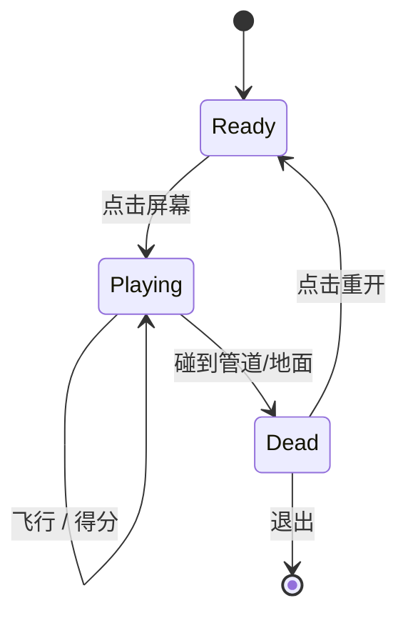

### 21.3 Bird.cs（小鸟主角）

```csharp
using UnityEngine;

public class Bird : MonoBehaviour
{
    [Header("参数")]
    public float flapForce = 8f;          // 拍打力度
    public float maxRotation = 30f;       // 最大向上角度
    public float minRotation = -90f;      // 俯冲角度
    public float rotateSpeed = 5f;

    Rigidbody2D rb;
    Animator anim;
    bool dead = false;

    void Awake()
    {
        rb = GetComponent<Rigidbody2D>();
        anim = GetComponent<Animator>();
        rb.bodyType = RigidbodyType2D.Kinematic;   // 准备阶段不受重力
    }

    public void StartFly()
    {
        rb.bodyType = RigidbodyType2D.Dynamic;
    }

    void Update()
    {
        if (dead) return;
        if (GameManager.Inst.State != GameState.Playing) return;

        // 点击 / 空格 → 拍打
        if (Input.GetMouseButtonDown(0) || Input.GetKeyDown(KeyCode.Space))
        {
            Flap();
        }

        // 根据 Y 速度旋转
        float t = Mathf.InverseLerp(-10f, flapForce, rb.velocity.y);
        float angle = Mathf.Lerp(minRotation, maxRotation, t);
        transform.rotation = Quaternion.Lerp(
            transform.rotation, Quaternion.Euler(0, 0, angle),
            Time.deltaTime * rotateSpeed);
    }

    void Flap()
    {
        rb.velocity = new Vector2(0, flapForce);
        AudioManager.Inst.PlaySFX("flap");
    }

    void OnCollisionEnter2D(Collision2D col)
    {
        if (dead) return;
        dead = true;
        AudioManager.Inst.PlaySFX("hit");
        GameManager.Inst.GameOver();
    }
}
```

### 21.4 Pipe.cs / PipeSpawner.cs（管道）

```csharp
// 单根管道：往左移，离开屏幕回收
public class Pipe : MonoBehaviour
{
    public float speed = 3f;
    bool scored = false;

    void Update()
    {
        if (GameManager.Inst.State != GameState.Playing) return;
        transform.Translate(Vector3.left * speed * Time.deltaTime);

        // 通过小鸟 → 加分
        if (!scored && transform.position.x < -1f)   // 小鸟 X = -1
        {
            scored = true;
            GameManager.Inst.AddScore();
        }

        if (transform.position.x < -10f) Destroy(gameObject);
    }
}

// 管道生成器：每 1.5 秒生成一对，缺口 Y 随机
public class PipeSpawner : MonoBehaviour
{
    public GameObject pipePairPrefab;
    public float interval = 1.5f;
    public float gapY = 3f;            // 上下缺口大小
    float timer;

    void Update()
    {
        if (GameManager.Inst.State != GameState.Playing) return;
        timer += Time.deltaTime;
        if (timer >= interval)
        {
            timer = 0;
            float y = Random.Range(-1.5f, 1.5f);
            Instantiate(pipePairPrefab, new Vector3(6f, y, 0), Quaternion.identity);
        }
    }
}
```

### 21.5 GameManager.cs（全局状态）

```csharp
using UnityEngine;

public enum GameState { Ready, Playing, GameOver }

public class GameManager : MonoBehaviour
{
    public static GameManager Inst { get; private set; }
    public GameState State { get; private set; } = GameState.Ready;

    public Bird bird;
    public UIController ui;

    public int Score { get; private set; }
    public int Best { get; private set; }

    void Awake()
    {
        Inst = this;
        Best = PlayerPrefs.GetInt("best", 0);
    }

    void Start() => ui.ShowReady(Best);

    void Update()
    {
        if (State == GameState.Ready && Input.GetMouseButtonDown(0))
            StartGame();
        else if (State == GameState.GameOver && Input.GetMouseButtonDown(0))
            UnityEngine.SceneManagement.SceneManager.LoadScene(0);
    }

    void StartGame()
    {
        State = GameState.Playing;
        Score = 0;
        bird.StartFly();
        ui.ShowPlaying(0);
        AudioManager.Inst.PlayBGM("bgm");
    }

    public void AddScore()
    {
        Score++;
        AudioManager.Inst.PlaySFX("score");
        ui.UpdateScore(Score);
    }

    public void GameOver()
    {
        State = GameState.GameOver;
        if (Score > Best)
        {
            Best = Score;
            PlayerPrefs.SetInt("best", Best);
        }
        ui.ShowGameOver(Score, Best);
    }
}
```

### 21.6 UIController.cs

```csharp
using UnityEngine;
using UnityEngine.UI;
using TMPro;

public class UIController : MonoBehaviour
{
    public GameObject readyPanel;
    public GameObject gameOverPanel;
    public TMP_Text scoreText;
    public TMP_Text finalScoreText;
    public TMP_Text bestText;

    public void ShowReady(int best)
    {
        readyPanel.SetActive(true);
        gameOverPanel.SetActive(false);
        scoreText.text = "";
    }

    public void ShowPlaying(int score)
    {
        readyPanel.SetActive(false);
        gameOverPanel.SetActive(false);
        UpdateScore(score);
    }

    public void UpdateScore(int score) => scoreText.text = score.ToString();

    public void ShowGameOver(int score, int best)
    {
        gameOverPanel.SetActive(true);
        finalScoreText.text = $"得分 {score}";
        bestText.text = $"最高 {best}";
    }
}
```

### 21.7 AudioManager.cs

参见第 10 章，直接复用。

### 21.8 后续打包到手机

1. `File > Build Settings`，添加 Main 场景
2. 切换平台 → Android / iOS
3. Player Settings：
   - 包名 `com.yourcompany.flappy`
   - 公司名、产品名、图标
   - Orientation：Portrait
   - Min API Level：23+
4. Build APK / Xcode Project
5. 真机调试

### 21.9 扩展方向

- 加金币系统 + 看广告复活
- 多角色皮肤（每飞 100 分解锁）
- 排行榜（Firebase 或自建）
- 道具：无敌 / 慢速 / 双倍分

---

## 第 22 章 AIGC 与游戏

📌 2024-2026 是 AIGC 对游戏开发产生根本性影响的三年。

### 22.1 应用方向地图

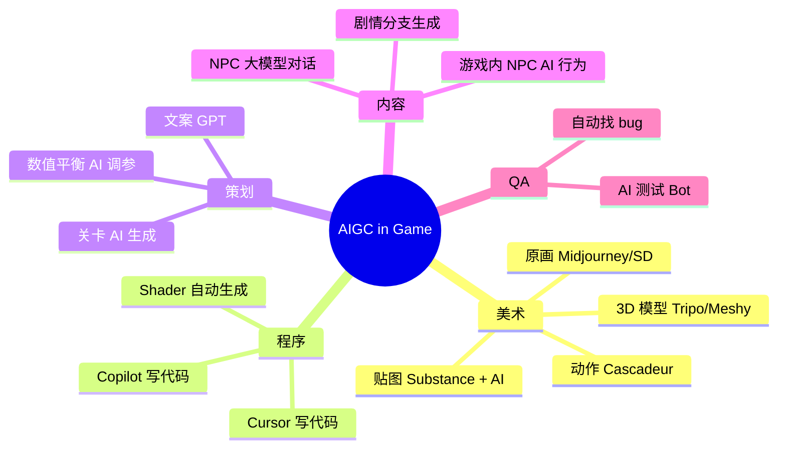

### 22.2 NPC 大模型对话

经典 RPG 的 NPC 只能说固定台词。接入 LLM 后，NPC 可以即时回答任何问题。

⚠️ 三大挑战：
1. **延迟**：API 1-3 秒，影响沉浸感 → 用本地小模型 or 异步预生成
2. **成本**：每个 NPC 一次对话 几分到几毛 → 缓存高频问答 + 距离过滤
3. **可控性**：模型可能输出敏感词 / 跑题 → System Prompt 限制 + 关键词过滤

```csharp
// 接入 Claude / OpenAI 的 NPC
public class LLMNpc : MonoBehaviour
{
    public string npcName = "村长";
    public string personality = "你是中世纪小村庄的村长，60 岁，唠叨，喜欢讲过去的故事，回答必须用古风中文，不超过 80 字。";

    public async Task<string> Talk(string playerText)
    {
        var messages = new List<object>
        {
            new { role = "system", content = personality },
            new { role = "user", content = playerText }
        };
        var resp = await HttpClient.PostJson("https://api.anthropic.com/v1/messages",
            new { model = "claude-haiku-4", messages });
        return resp["content"][0]["text"].ToString();
    }
}
```

### 22.3 Stable Diffusion 出美术资源

工作流：
1. **概念图**：Midjourney 出 4 张概念
2. **细化**：选一张去 SD + ControlNet 控制构图
3. **风格统一**：训练 LoRA（项目专属风格）
4. **修整**：Photoshop / Krita 手动修
5. **切图入引擎**

🎯 现实项目中，AI 不是替代美术，而是 **让一个美术能产出 5-10 个美术的产能**。

### 22.4 AI 生成关卡

**PCG（Procedural Content Generation）** 早就有了，AIGC 让它更智能：
- 用 LLM 生成地下城布局 JSON
- 用 SD 生成 Tilemap 贴图
- 用 RL 训练关卡难度调整器

```python
# 简化示例：让 LLM 生成关卡 JSON
prompt = """
你是关卡设计师，生成一个 10×10 地下城网格，
. = 地面, # = 墙, $ = 宝箱, E = 敌人, > = 出口, < = 入口
要求：入口在左上，出口在右下，至少 2 个宝箱、3 个敌人、有迂回路径。
仅输出网格，不要解释。
"""
```

### 22.5 AI 测试 Bot

强化学习训练 AI 玩自己的游戏，自动找：
- 卡墙、穿模
- 平衡性问题（某角色胜率过高）
- 崩溃路径

代表：Unity ML-Agents、Modl.ai

---

## 附录

### A. 美术 / 音效资源站

| 站点 | 内容 | 商用 |
|------|------|------|
| itch.io | 独立游戏资源 | 看每个资源 |
| OpenGameArt.org | 免费素材 | 多数 CC0 |
| Kenney.nl | 极简风资源 | 全 CC0 |
| Mixamo | 角色动画 | 免费 |
| Sketchfab | 3D 模型 | 看授权 |
| Freesound | 音效 | 多数 CC |
| Bensound | 背景音乐 | 署名免费 |
| Unity Asset Store | 付费/免费 | 看每个 |
| Cocos Store | Cocos 资源 | 看每个 |
| 爱给网 | 国内综合 | 看每个 |

### B. 推荐书 / 课程

| 书籍 | 内容 |
|------|------|
| 《游戏编程模式》Robert Nystrom | 必读，状态机/对象池/组件等 |
| 《Game Engine Architecture》Jason Gregory | 引擎架构圣经 |
| 《Real-Time Rendering》 | 渲染圣经 |
| 《Unity Shader 入门精要》冯乐乐 | Unity Shader 中文最佳 |
| 《游戏感》Steve Swink | 手感设计 |
| 《通关！游戏设计之道》Scott Rogers | 设计入门 |
| 《有限与无限的游戏》 | 哲学层 |

### C. 社区

- 国内：Unity 中文社区、椰岛社区（Cocos）、indienova、机核
- 海外：GameDev.net、r/gamedev、Unity Forum、80lv
- 大厂博客：腾讯 GAD、网易雷火、米哈游技术中台

### D. 工具清单

| 类型 | 工具 |
|------|------|
| 代码 | Rider / VS / VS Code + Unity 插件 |
| 版本控制 | Git + Git LFS（大资源） |
| 项目管理 | Jira / Notion / 飞书 |
| 美术 | Photoshop / Aseprite（像素） / Spine / Blender |
| 音频 | FL Studio / Audition / Audacity |
| 文档 | Notion / 飞书 / Confluence |
| 配置表 | Excel + Luban / GameConfig |
| CI/CD | Jenkins / UnityCloudBuild / GitHub Actions |
| BI | 神策 / Firebase / Mixpanel |

### E. 常见坑预警

| 坑 | 解决 |
|----|------|
| 协程被 SetActive(false) 中断 | 用 MonoBehaviour 单例驻留 / UniTask |
| iOS IL2CPP 与 Mono 行为差异 | 真机 Development Build 测试 |
| 浮点同步不一致 | 帧同步用定点数 |
| UI 适配安卓刘海屏 | Safe Area + Notch 处理 |
| 字符串拼接 GC | StringBuilder / 池 |
| AssetBundle 引用计数错 | 改用 Addressables |
| Shader 在低端机渲染异常 | Shader 变体过多 → Strip / 多版本 |
| 服务端浮点精度 | 服务器用整数（金币 ×100 = 分） |
| 上架被拒：诱导外部支付 | 移除任何非苹果支付的入口 |
| 版号没下来 | 海外先上 + 国内测试服免费玩 |

---

## 结语

手游开发是一个 **长链路、强工程、跨学科** 的领域。引擎和代码只占 30%，剩下 70% 是：
- 美术质量与风格
- 数值与策划
- 服务端稳定性
- 商业化设计
- 上架运营

🎯 给新人三条建议：
1. **先做完一个完整的小游戏**（哪怕 Flappy Bird 这种），从 0 到上架。流程跑通比技术细节更重要。
2. **加入一个团队 / 项目**，单兵作战很难突破到商业级。
3. **持续关注引擎更新 + 行业动态**，2024-2026 AIGC 重塑了整个开发流程。

愿你早日做出心目中的那款游戏。

> 文档约 2200 行，覆盖手游开发主流知识体系。代码以 Unity C# 为主、Cocos TS / Unreal C++ 作补充，所有示例皆可直接套用到项目中。
